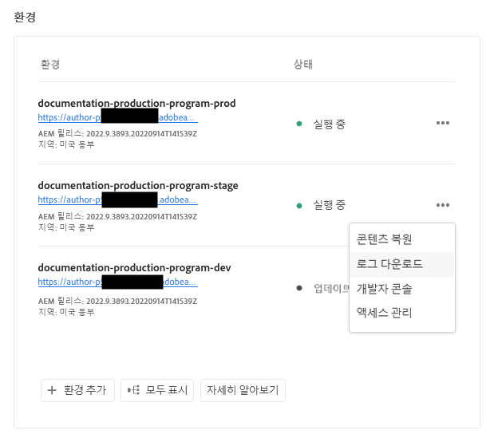
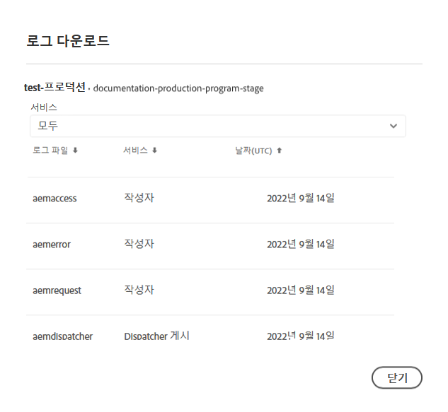
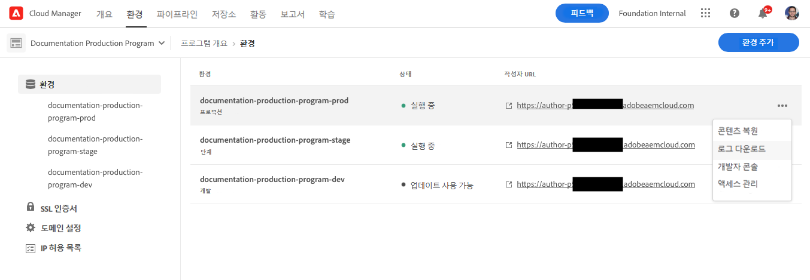

# 로그 액세스 및 관리 {#manage-logs}

AEM as a Cloud Service에서 개발 프로세스를 지원하기 위해 로그에 액세스하고 관리하는 방법을 알아봅니다.

**개요** 페이지 또는 환경 세부 정보 페이지에서 **환경** 카드를 사용하여 선택한 환경에 대해 사용 가능한 로그 파일 목록에 액세스할 수 있습니다.

## 로그 다운로드 {#download-logs}

로그를 다운로드하려면 다음 작업을 수행하십시오.

1. [my.cloudmanager.adobe.com](https://my.cloudmanager.adobe.com/)에서 Cloud Manager에 로그인한 다음 적절한 조직과 프로그램을 선택합니다.

1. **개요** 페이지에서 **환경** 카드로 이동합니다.

1. 줄임표 메뉴에서 **로그 다운로드**&#x200B;를 선택합니다.

   

1. **로그 다운로드** 대화 상자의 드롭다운 메뉴에서 적절한 **서비스**&#x200B;를 선택합니다.

   

1. 서비스를 선택한 후 검색하려는 로그 옆에 있는 다운로드 아이콘을 클릭합니다.

**환경** 페이지에서 로그에 액세스할 수도 있습니다.



## API를 통한 로그 {#logs-through-api}

UI를 통해 로그를 다운로드하는 것 외에도 API 및 명령줄 인터페이스를 통해 로그를 사용할 수 있습니다.

특정 환경에 대한 로그 파일을 다운로드하는 명령은 다음과 유사합니다.

```shell
$ aio cloudmanager:download-logs --programId 5 1884 author aemerror
```

명령줄 인터페이스를 사용하여 로그를 추적할 수도 있습니다.

```shell
$ aio cloudmanager:tail-log --programId 5 1884 author aemerror
```

다음 명령을 사용하여 환경 ID(이 예에서는 1884)와 사용 가능한 서비스나 로그 이름 옵션을 가져올 수 있습니다.

```shell
$ aio cloudmanager:list-environments
Environment Id Name                     Type  Description                          
1884           FoundationInternal_dev   dev   Foundation Internal Dev environment  
1884           FoundationInternal_stage stage Foundation Internal STAGE environment
1884           FoundationInternal_prod  prod  Foundation Internal Prod environment
 
 
$ aio cloudmanager:list-available-log-options 1884
Environment Id Service    Name         
1884           author     aemerror     
1884           author     aemrequest   
1884           author     aemaccess    
1884           publish    aemerror     
1884           publish    aemrequest   
1884           publish    aemaccess    
1884           dispatcher httpderror   
1884           dispatcher aemdispatcher
1884           dispatcher httpdaccess
```

### 추가 리소스 {#resources}

Cloud Manager API 및 Adobe I/O CLI에 대한 자세한 내용은 다음 추가 리소스를 참조하십시오.

* [Cloud Manager API 설명서](https://developer.adobe.com/experience-cloud/cloud-manager/)
* [Adobe I/O CLI](https://github.com/adobe/aio-cli-plugin-cloudmanager)

AEM의 로그 파일에 대한 자세한 내용은 다음 추가 리소스를 as a Cloud Service으로 참조하십시오.

* [Cloud 5 AEM 로그 파일](https://experienceleague.adobe.com/docs/experience-manager-learn/cloud-service/expert-resources/cloud-5/cloud5-aem-log-files.html)
* [로그를 사용하여 AEM as a Cloud Service 디버깅](https://experienceleague.adobe.com/docs/experience-manager-learn/cloud-service/debugging/debugging-aem-as-a-cloud-service/logs.html)
