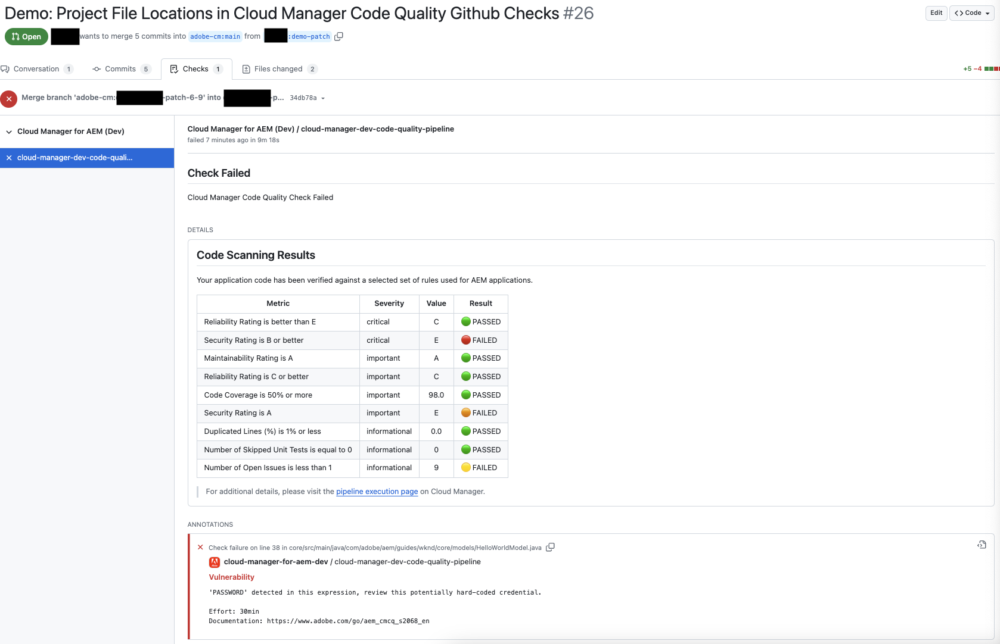

# GitHub 확인 주석 {#github-annotations}

GitHub가 개인 저장소에 대한 주석 PR을 확인하여 유용한 피드백을 제공하는 방법을 알아봅니다.

## 개요 {#overview}

을 사용하는 경우 [개인 저장소](private-repositories.md) cloud Manager 프로그램의 경우, 모든 가져오기 요청에 대해 GitHub에서 확인이 자동으로 실행됩니다. 이러한 파일에는 코드의 모든 문제를 가능한 한 빨리 이해하는 데 도움이 되는 유용한 정보가 포함되어 있습니다.

[코드 품질](/help/implementing/cloud-manager/code-quality-testing.md) 다음에 의해 감지된 문제 [SonarQube](/help/implementing/cloud-manager/custom-code-quality-rules.md) 명확하게 나열됩니다.

문제가 있는 정확한 코드 줄이 제공되고 이를 클릭하여 관련 코드를 표시할 수 있습니다. 이러한 주석은 가져오기 요청에서 변경된 주석뿐만 아니라 모든 코드 문제에 대해 제공됩니다.

주석이 있는 모든 줄은 **변경된 파일** GitHub 끌어오기 요청의 탭입니다. 끌어오기 요청에서 변경되지 않은 파일에 대한 주석은 해당 섹션에 표시됩니다.

## 코드 품질 파이프라인 {#code-quality-pipelines}

다음 [코드 품질](/help/implementing/cloud-manager/code-quality-testing.md) 결과는 Cloud Manager가 하단의 를 통해 자동으로 트리거하는 파이프라인에서도 표시됩니다. **확인** 탭. 에서 액세스할 수도 있습니다. **세부 사항** 가져오기 요청 확인.

문제를 CSV 형식으로 시각화할 수도 있습니다. 다음 방법으로 검색할 수 있습니다 [cloud Manager에서 파이프라인 실행에 대한 세부 사항 보기](/help/implementing/cloud-manager/configuring-pipelines/managing-pipelines.md#view-details)
