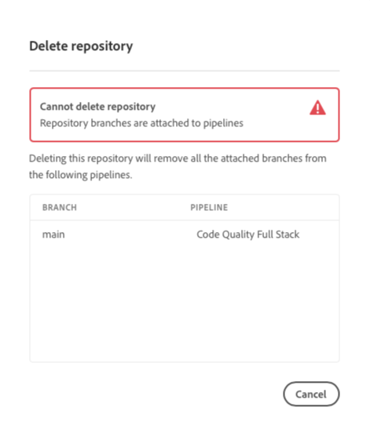

# Cloud Manager에서 저장소 관리 {#managing-repos}

Cloud Manager에서 git 저장소를 생성, 확인 및 삭제하는 방법을 알아봅니다.

## 개요 {#overview}

저장소는 Git을 사용하여 프로젝트의 코드를 저장하고 관리하는 데 사용됩니다. Cloud Manager에서 생성하는 모든 프로그램에는 Adobe 관리 저장소가 있습니다.

Adobe 관리 저장소를 추가하고 비공개 저장소를 추가하도록 선택할 수 있습니다. 프로그램과 관련된 모든 저장소는 **저장소** 창에서 볼 수 있습니다.

Cloud Manager에서 만들어진 저장소는 파이프라인을 추가하거나 편집할 때도 선택할 수 있습니다. 자세한 내용은 [CI-CD 파이프라인](/help/implementing/cloud-manager/configuring-pipelines/introduction-ci-cd-pipelines.md)을 참조하십시오.

지정된 파이프라인에 대해 단일 주 저장소 또는 분기가 있습니다. [git 하위 모듈 지원](git-submodules.md)을 통해 빌드 시 여러 보조 분기를 포함할 수 있습니다.

## 저장소 창 {#repositories-window}

1. [my.cloudmanager.adobe.com](https://my.cloudmanager.adobe.com/)에서 Cloud Manager에 로그인한 다음 적절한 조직과 프로그램을 선택합니다.

1. **프로그램 개요** 페이지에서 **저장소** 탭을 선택하고 **저장소** 페이지로 전환합니다.

1. **저장소** 창에는 프로그램과 관련된 모든 저장소가 표시됩니다.

   

**저장소** 창에는 저장소에 대한 다음의 세부 정보가 있습니다.

* 저장소 유형
   * **Adobe**&#x200B;는 Adobe 관리 저장소를 나타냅니다.
   * **GitHub** 사용자가 관리하는 개인 GitHub 저장소를 나타냅니다.
* 만들어 질 때
* 저장소와 연결된 파이프라인

창에서 저장소를 선택하고 줄임표 버튼을 클릭하여 선택한 저장소에 대해 작업을 수행할 수 있습니다.

* **[분기 점검 및 프로젝트 만들기](#check-branches)**(Adobe 저장소에만 사용 가능)
* **[저장소 URL 복사](#copy-url)**
* **[보기 및 업데이트](#view-update)**
* **[삭제](#delete)**

## 저장소 추가 {#adding-repositories}

**저장소 창**&#x200B;에서 **저장소 추가** 버튼을 탭하거나 클릭하여 **저장소 추가** 마법사를 시작합니다.

Cloud Manager는 Adobe에서 관리하는 저장소(**Adobe 저장소**)와 사용자 관리 저장소(**비공개 저장소**)를 모두 지원합니다. 필수 필드는 추가하기 위해 선택한 저장소 유형에 따라 다릅니다. 자세한 내용은 다음 문서를 참조하십시오.

* [Cloud Manager에서 Adobe 저장소 추가](adobe-repositories.md)
* [Cloud Manager에서 비공개 저장소 추가](private-repositories.md)

>[!NOTE]
>
>* 저장소를 추가하려면 사용자에게 **배포 관리자** 또는 **비즈니스 소유자** 역할이 있어야 합니다.
>* 특정 회사 또는 IMS 조직의 모든 프로그램에서 300개의 저장소로 제한됩니다.

## 저장소 정보 확인 {#repo-info}

**저장소** 창에서 저장소를 볼 때 도구 모음에서 **저장소 정보 액세스** 버튼을 탭하거나 클릭하여 Adobe 관리 저장소에 액세스하는 방법에 대한 세부 정보를 프로그래밍 방식으로 볼 수 있습니다.

**저장소 정보** 창이 열리고 세부 정보가 나타납니다. 저장소 정보 액세스에 대한 자세한 내용은 [저장소 정보 액세스](accessing-repos.md) 문서를 참조하십시오.

## 분기 점검 및 프로젝트 만들기 {#check-branches}

다음 **분기 확인 / 프로젝트 만들기** 작업은 저장소의 상태에 따라 두 가지 기능을 수행합니다.

* 저장소가 새로 만들어지면 작업은 다음에 준하여 샘플 프로젝트를 만듭니다. [AEM project archetype.](https://experienceleague.adobe.com/en/docs/experience-manager-core-components/using/developing/archetype/overview)
* 저장소에서 이미 샘플 프로젝트를 만든 경우, 저장소 및 해당 분기의 상태를 확인하고 샘플 프로젝트가 이미 있는지 다시 보고합니다.

## 저장소 URL 복사 {#copy-url}

**저장소 URL 복사** 액션은 **저장소** 창에서 선택한 저장소의 URL을 다른 곳에 사용하기 위해 클립보드에 복사합니다.

## 보기 및 업데이트 {#view-update}

**보기 및 업데이트** 액션은 **저장소 업데이트** 대화 상자를 엽니다. 이를 사용하여 **이름** 및 **저장소 URL 미리보기**&#x200B;를 확인하고 저장소에 대한 **설명**&#x200B;을 업데이트할 수 있습니다.

## 삭제 {#delete}

**삭제** 액션은 프로젝트에서 저장소를 제거합니다. 파이프라인과 연결된 저장소는 삭제할 수 없습니다.

저장소를 삭제하면 다음 결과가 발생합니다.

* 나중에 새 저장소를 만들 때 삭제된 저장소 이름을 사용할 수 없습니다.
   * 이 경우 `Repository name should be unique within organization.` 오류 메시지가 표시됩니다.
* 삭제된 저장소를 Cloud Manager에서 사용하거나 파이프라인에 연결할 수 없습니다.
