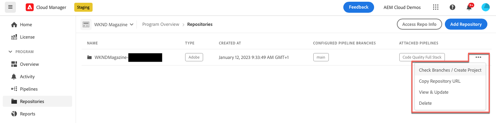

# Cloud Manager에서 저장소 관리 {#managing-repos}

Cloud Manager에서 git 저장소를 보고, 추가하고, 삭제하는 방법을 알아봅니다.

## Cloud Manager의 저장소 정보 {#overview}

Cloud Manager의 저장소는 Git을 사용하여 프로젝트의 코드를 저장하고 관리하는 데 사용됩니다. 추가하는 모든 *program*&#x200B;에 대해 Adobe 관리 저장소가 자동으로 만들어집니다.

또한 Adobe 관리 저장소를 더 많이 생성하거나 자신의 개인 저장소를 추가할 수 있습니다. 프로그램에 연결된 모든 저장소는 **저장소** 페이지에서 볼 수 있습니다.

Cloud Manager 내에서 만든 저장소는 파이프라인을 추가하거나 편집할 때도 선택할 수 있습니다. 파이프라인 구성에 대한 자세한 내용은 [CI-CD 파이프라인](/help/implementing/cloud-manager/configuring-pipelines/introduction-ci-cd-pipelines.md)을 참조하십시오.

각 파이프라인은 기본 저장소 또는 분기에 연결됩니다. 그러나 [Git 하위 모듈 지원](git-submodules.md)을 통해 빌드 프로세스 중에 여러 보조 분기를 포함할 수 있습니다.

## 저장소 페이지 보기 {#repositories-window}

**저장소** 페이지에서 선택한 저장소에 대한 세부 정보를 볼 수 있습니다. 이 정보에는 사용 중인 저장소 유형이 포함됩니다. 저장소가 **Adobe**(으)로 표시된 경우 Adobe 관리 저장소임을 나타냅니다. 레이블이 **GitHub**(으)로 지정된 경우 관리하는 개인 GitHub 리포지토리를 참조합니다. 또한 페이지는 저장소 생성 시기 및 이와 연관된 파이프라인 등의 세부 정보를 제공합니다.

선택한 리포지토리에서 작업을 수행하려면 리포지토리를 클릭하고 을 사용하여 드롭다운 메뉴를 열 수 있습니다. Adobe 관리 저장소의 경우 **[분기 확인/프로젝트 만들기](#check-branches)**&#x200B;를 수행할 수 있습니다.

*저장소 페이지의 드롭다운 메뉴*

드롭다운 메뉴에서 사용할 수 있는 다른 작업으로는 **[저장소 URL 복사](#copy-url)**, **[보기 및 업데이트](#view-update)**, 저장소 **[삭제](#delete)**&#x200B;가 있습니다.

**저장소 페이지를 보려면:**

1. [my.cloudmanager.adobe.com](https://my.cloudmanager.adobe.com/)에서 Cloud Manager에 로그인한 다음 적절한 조직과 프로그램을 선택합니다.

1. **프로그램 개요** 페이지의 사이드 메뉴에서  **저장소**&#x200B;를 클릭합니다.

1. **저장소** 페이지에는 선택한 프로그램과 연결된 모든 저장소가 표시됩니다.

   
   *Cloud Manager의 저장소 페이지*

## 저장소 추가 {#adding-repositories}

저장소를 추가하려면 사용자에게 **배포 관리자** 또는 **비즈니스 소유자** 역할이 있어야 합니다.

**저장소** 페이지의 오른쪽 상단 모서리에서 **저장소 추가**&#x200B;를 클릭합니다

*저장소 추가 대화 상자*

Cloud Manager에서는 Adobe 관리 저장소(**Adobe 저장소**)와 자체 관리 저장소(**개인 저장소**)의 두 가지 저장소 유형을 지원합니다. 설정에 필요한 필드는 추가하려는 저장소 유형에 따라 다릅니다. 자세한 내용은 다음을 참조하십시오.

* [Cloud Manager에서 Adobe 저장소 추가](adobe-repositories.md)
* [Cloud Manager에서 비공개 저장소 추가](private-repositories.md)

특정 회사 또는 IMS 조직의 모든 프로그램에서 300개의 저장소로 제한됩니다.

## 저장소 정보에 액세스 {#repo-info}

**저장소** 창에서 저장소를 볼 때 도구 모음에서 **저장소 정보 액세스** 버튼을 클릭하여 Adobe 관리 저장소에 액세스하는 방법에 대한 세부 정보를 프로그래밍 방식으로 볼 수 있습니다.

**저장소 정보** 창이 열리고 세부 정보가 나타납니다. 저장소 정보 액세스에 대한 자세한 내용은 [저장소 정보 액세스](/help/implementing/cloud-manager/managing-code/accessing-repos.md)를 참조하십시오.

## 분기 점검 및 프로젝트 만들기 {#check-branches}

**AEM Cloud Manager**&#x200B;에서 **분기 확인/프로젝트 만들기** 작업은 저장소의 현재 상태에 따라 두 가지 용도로 사용됩니다.

* 저장소를 새로 만드는 경우 이 작업은 [AEM project archetype](https://experienceleague.adobe.com/ko/docs/experience-manager-core-components/using/developing/archetype/overview)을(를) 사용하여 샘플 프로젝트를 생성합니다.
* 샘플 프로젝트가 저장소에 이미 만들어져 있는 경우 작업은 저장소 및 해당 분기의 상태를 확인하여 샘플 프로젝트가 이미 존재하는지 여부에 대한 피드백을 제공합니다.

  

## 저장소 URL 복사 {#copy-url}

**저장소 URL 복사** 작업은 **저장소** 페이지에서 선택한 저장소의 URL을 다른 곳에서 사용할 클립보드에 복사합니다.

## 저장소 보기 및 업데이트 {#view-update}

**보기 및 업데이트** 작업을 수행하면 저장소의 **이름** 및 **저장소 URL 미리 보기**&#x200B;를 볼 수 있는 **저장소 업데이트** 대화 상자가 열립니다. 또한 저장소의 **설명**&#x200B;을 업데이트할 수 있습니다.

## 저장소 삭제 {#delete}

**삭제** 액션은 프로젝트에서 저장소를 제거합니다. 파이프라인과 연결된 저장소는 삭제할 수 없습니다.

저장소를 삭제하면 나중에 생성되는 모든 새 저장소에서는 해당 이름을 사용할 수 없게 됩니다. 삭제된 리포지토리와 동일한 이름을 사용하여 리포지토리를 추가하려고 하면 다음과 같은 오류 메시지가 표시됩니다.

`Repository name should be unique within organization.`

또한 삭제된 저장소는 Cloud Manager에서 더 이상 사용할 수 없으며 파이프라인에 연결할 수 없습니다.

