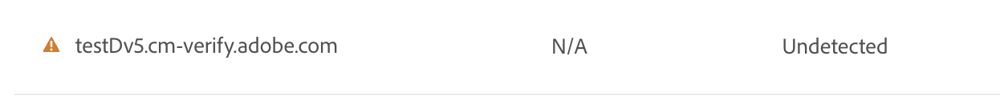

# DV(Domain Validated) 인증서 {#domain-validated-certificates}

Cloud Manager에서 DV(도메인 유효성 검사) 인증서를 관리하는 방법을 알아봅니다.

>[!NOTE]
>
>이 기능은 [얼리 어답터 프로그램](/help/implementing/cloud-manager/release-notes/current.md#early-adoption)에만 사용할 수 있습니다.

## 소개 {#introduction}

Cloud Manager을 사용하면 셀프서비스로 DV(도메인 유효성 검사) SSL 인증서를 생성하고 관리할 수 있습니다. 이를 통해 온라인 비즈니스를 위한 안전한 웹 사이트를 만들 수 있는 가장 빠르고 쉽고 비용 효율적인 솔루션을 제공합니다.

[프로덕션 및 샌드박스 프로그램 모두에서 도메인 유효성 검사 인증서를 사용할 수 있습니다.](/help/implementing/cloud-manager/getting-access-to-aem-in-cloud/program-types.md)

## 사용자 정의 도메인 추가 {#adding-domain}

DV(도메인 유효성 검사) 인증서를 추가하려면 먼저 사용자 정의 도메인을 구성해야 합니다. 이 프로세스는 [사용자 정의 도메인 이름 소개 문서에 설명된 것과 거의 동일합니다.](/help/implementing/cloud-manager/custom-domain-names/introduction.md) 그러나 이 기능은 약간 확장되었습니다.

1. 도메인을 확인할 때 도메인에 Adobe 관리 인증서 또는 자체 관리 인증서를 사용하도록 선택할 수 있습니다. 나중에 DV 인증서를 추가하려면 **Adobe 관리 인증서**&#x200B;를 선택하십시오.

   

1. Adobe 관리 인증서를 사용하려면 **도메인 확인** 대화 상자에 설명된 대로 CNAME 레코드를 DNS에 추가해야 합니다.

   

1. 도메인이 만들어지면 도메인 목록에서 줄임표 버튼을 탭하거나 클릭하고 **확인**&#x200B;을 선택하여 도메인을 확인합니다.

   

## DV 인증서 추가 {#adding}

도메인을 올바르게 구성한 후 DV 인증서를 추가하려면 SSL 인증서 창에서 **SSL 인증서 추가** 단추를 탭하거나 클릭합니다.

1. **Adobe 관리(DV)** 옵션을 선택합니다.
1. **도메인 선택** 드롭다운에서 도메인 이름을 지정하십시오.
1. **저장**&#x200B;을 탭하거나 클릭합니다.

인증서가 성공적으로 추가되면 보류 중인 상태가 **SSL 인증서** 창의 해당 이름에 노란색 경고 기호로 표시됩니다.

인증서를 성공적으로 발급하면 **SSL 인증서** 창에서 인증서의 이름에 녹색 확인 표시가 나타납니다.

SSL 인증서 및 SSL 인증서 창에 대한 자세한 내용은 [SSL 인증서 추가](add-ssl-certificate.md) 문서를 참조하십시오.

## CDN 구성 추가 {#add-cdn}

Fastly CDN을 사용하여 SSL로 도메인을 구성하려면 이 단계를 완료해야 합니다.

Cloud Manager을 사용하여 CDN 구성을 추가하려면 다음 단계를 따르십시오.

1. [my.cloudmanager.adobe.com](https://my.cloudmanager.adobe.com/)에서 Cloud Manager에 로그인한 다음 적절한 조직을 선택합니다.

1. **CDN 구성** 탭을 선택하고 도구 모음에서 **추가**&#x200B;를 클릭하거나 탭합니다.

1. **CDN 구성** 대화 상자에서 필요한 정보를 제공합니다.

   * **원본**&#x200B;을 선택하세요. 다음과 같은 작업을 수행할 수 있습니다.
      * Cloud Service 환경
      * Edge Delivery Services 사이트
   * CDN 유형을 선택합니다.
   * 도메인을 선택합니다.
   * SSL 인증서를 선택합니다.
      * Adobe 관리 CDN에만 필요합니다.

   

>
>
>Adobe 관리 CDN의 경우 DV 인증서를 사용할 때 ACME 인증이 있는 사이트만 허용됩니다.
