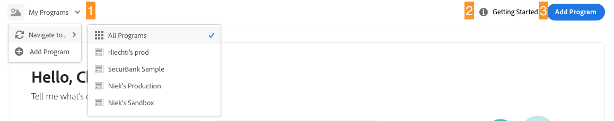
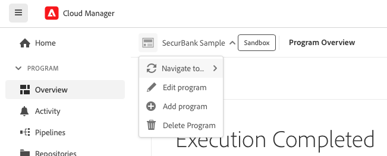

# Cloud Manger UI 탐색 {#navigation}

Cloud Manager UI를 구성하는 방법과 프로그램 및 환경을 관리하기 위해 이동하는 방법을 알아봅니다.

Cloud Manage UI는 주로 다음 두 가지 그래픽 인터페이스로 구성됩니다.

* [내 프로그램 콘솔](#my-programs) 모든 프로그램을 보고 관리할 수 있습니다.
* [프로그램 개요 창](#program-overview) 개별 프로그램의 세부 정보를 확인하고 관리할 수 있습니다.

>[!TIP]
>
>다음 항목도 확인하십시오. [온보딩 설명서 여정](/help/journey-onboarding/overview.md) AEM Cloud Manager를 사용하여 as a Cloud Service으로 시작하고 실행하는 방법에 대한 전체 개요입니다.

## 내 프로그램 콘솔 {#my-programs}

에서 Cloud Manager에 로그인할 때 [my.cloudmanager.adobe.com](https://my.cloudmanager.adobe.com/) 적절한 조직을 선택하면 다음 위치에 도달합니다. **내 프로그램** 콘솔.

내 프로그램 콘솔에서는 선택한 조직에서 액세스할 수 있는 모든 프로그램에 대한 개요를 제공합니다. 여러 부분으로 구성되어 있습니다.

1. [도구 모음](#toolbars-my-programs-toolbars) 조직 선택, 경고 및 계정 설정용
1. [통계 및 콜 투 액션](#statistics) 최근 활동에 대한 개요를 살펴보려면
1. [프로그램 및 라이선스](#programs-license) 현재 라이선스 상태를 이해하고 프로그램을 관리합니다.
1. [빠른 링크](#quick-links) 관련 리소스에 쉽게 액세스

>[!TIP]
>
>문서를 참조하십시오. [프로그램 및 프로그램 유형](/help/implementing/cloud-manager/getting-access-to-aem-in-cloud/program-types.md) 프로그램에 대한 자세한 내용.

### 도구 모음 {#my-programs-toolbars}

두 개의 도구 모음이 위에 있습니다.

#### Cloud Manager 헤더 {#cloud-manager-header}

첫 번째는 Cloud Manager를 탐색할 때 영구적인 Cloud Manager 헤더입니다. Cloud Manager 프로그램 전체에 적용되는 설정 및 정보에 액세스할 수 있는 앵커입니다.

1. Cloud Manager 버튼은 Cloud Manager의 어디에 있든 Cloud Manager의 내 프로그램 콘솔로 돌아갑니다.
1. 피드백 버튼을 탭하거나 클릭하여 Cloud Manager에 대한 Adobe에 피드백을 제공합니다.
1. 조직 선택기는 현재 로그인한 조직을 표시합니다(이 예에서는 Foundation Internal). Adobe ID가 여러 조직과 연결된 경우 탭하거나 클릭하여 다른 조직으로 전환합니다.
1. 솔루션 전환기를 탭하거나 클릭하면 다른 Experience Cloud 솔루션으로 빠르게 이동할 수 있습니다.
1. 도움말 아이콘은 학습 및 지원 리소스에 대한 바로 가기를 제공합니다.
1. 알림 아이콘에 현재 할당된 미완료 알림 수가 배지로 표시됩니다. [알림입니다.](/help/implementing/cloud-manager/notifications.md)
1. 사용자를 나타내는 아이콘을 선택하여 사용자 설정에 액세스합니다. 사용자 사진을 구성하지 않은 경우, 아이콘이 임의로 할당됩니다.

#### 프로그램 도구 모음 {#program-toolbar}

프로그램 도구 모음에서는 Cloud Manager 프로그램과 컨텍스트에 적합한 작업 간을 전환하는 링크를 제공합니다.

1. 프로그램 선택기가 드롭다운으로 열리고 다른 프로그램을 빠르게 선택하거나 새 프로그램을 만드는 등 상황에 맞는 작업을 수행할 수 있습니다
1. 시작 링크를 통해 다음에 액세스할 수 있습니다. [온보딩 설명서 여정](/help/journey-onboarding/overview.md) Cloud Manager를 시작하고 운영해 보십시오.
1. 작업 버튼은 새 프로그램 작성과 같은 상황에 맞는 작업을 제공합니다.

### 통계 {#statistics}

통계 섹션은 조직에 대한 집계 데이터를 제공합니다. 예를 들어, 프로그램을 성공적으로 설정한 경우 지난 90일 동안의 활동 통계가 다음을 포함하여 표시될 수 있습니다.

* 의 수 [배포](/help/implementing/cloud-manager/deploy-code.md)
* 의 수 [코드 품질 문제](/help/implementing/cloud-manager/code-quality-testing.md) 식별됨
* 빌드 수

또는 조직 설정을 막 시작하는 경우 다음 단계 또는 설명서 리소스에 대한 팁이 있을 수 있습니다.

### 프로그램 및 라이선스 {#programs-license}

내 프로그램 콘솔의 기본 콘텐츠는 프로그램 목록과 라이선스 상태입니다.

#### 프로그램 탭 {#programs}

다음 **프로그램** 탭에는 액세스 권한이 있는 각 프로그램을 나타내는 카드가 나열됩니다. 카드를 탭하거나 클릭하여 **프로그램 개요** 프로그램에 대한 자세한 내용은 프로그램의 페이지를 참조하십시오.

정렬 옵션을 사용하여 필요한 프로그램을 더 잘 찾을 수 있습니다.

* 정렬 기준
   * 생성일(기본값)
   * 프로그램 이름
   * 상태
* 오름차순(기본값) / 내림차순
* 격자 보기(기본값)
* 목록 보기

모든 프로그램은 카드(또는 표의 행)로 표시되며, 프로그램에 대한 개요와 조치를 취하는 빠른 링크를 제공합니다.

* 프로그램 이미지(구성된 경우)
* 프로그램 이름
* 서비스 유형: **Experience Manager 클라우드** AEM as a * Cloud Service 프로그램용 또는 [**Experience Manager** ams 프로그램용](https://experienceleague.adobe.com/en/docs/experience-manager-cloud-manager/content/introduction)
* [프로그램 유형](/help/implementing/cloud-manager/getting-access-to-aem-in-cloud/program-types.md): 샌드박스 또는 프로덕션
* 상태
* 구성된 솔루션
* 생성일

프로그램을 만들 때 선택한 옵션에 따라 프로덕션 프로그램에 배지를 지정하여 추가 기능을 표시할 수 있습니다.

* [HIPAA](/help/implementing/cloud-manager/getting-access-to-aem-in-cloud/creating-production-programs.md#security)

  

* [WAF-DDOS 보호](/help/implementing/cloud-manager/getting-access-to-aem-in-cloud/creating-production-programs.md#security)

  

* [99.99% SLA](/help/implementing/cloud-manager/getting-access-to-aem-in-cloud/creating-production-programs.md#sla)

  

또한 정보 아이콘을 사용하면 프로그램에 대한 추가 정보에 빠르게 액세스할 수 있습니다(목록 보기에서 유용함).

줄임표 아이콘을 사용하면 프로그램에서 수행할 수 있는 추가 작업에 액세스할 수 있습니다.

* 특정 페이지로 이동 [환경](/help/implementing/cloud-manager/manage-environments.md) / 프로그램
* 를 엽니다. [프로그램 개요](#program-overview)
* [프로그램 편집](/help/implementing/cloud-manager/getting-access-to-aem-in-cloud/editing-programs.md#editing)
* [샌드박스 프로그램 삭제](/help/implementing/cloud-manager/getting-access-to-aem-in-cloud/editing-programs.md#delete-sandbox-program)

>[!TIP]
>
>프로그램 및 프로그램 만들기 및 관리에 대한 자세한 내용은 다음 문서를 참조하십시오.
>
>* [프로그램 및 프로그램 유형](/help/implementing/cloud-manager/getting-access-to-aem-in-cloud/program-types.md)
>* [샌드박스 프로그램 만들기](/help/implementing/cloud-manager/getting-access-to-aem-in-cloud/creating-sandbox-programs.md)
>* [프로덕션 프로그램 만들기](/help/implementing/cloud-manager/getting-access-to-aem-in-cloud/creating-production-programs.md)

#### 라이선스 탭 {#license-tab}

다음 **라이선스** 탭에서는 [라이선스 대시보드.](/help/implementing/cloud-manager/license-dashboard.md)

### 빠른 링크 {#quick-links}

빠른 링크 섹션은 일반적으로 사용되는 관련 리소스에 대한 액세스를 제공합니다.

## 프로그램 개요 창 {#program-overview}

내 프로그램 콘솔에서 프로그램을 선택하면 프로그램 개요로 이동합니다.

프로그램 개요 는 Cloud Manager 프로그램의 모든 세부 정보에 대한 액세스 권한을 제공합니다. 내 프로그램 콘솔과 마찬가지로 여러 부분으로 구성됩니다.

1. [도구 모음](#program-overview-toolbar) 내 프로그램 콘솔로 빠르게 돌아가서 프로그램을 탐색합니다.
1. [탭](#program-tabs) 프로그램의 여러 측면 사이를 전환하다
1. A [클릭 유도 문안](#cta) 프로그램의 마지막 작업을 기반으로 함
1. An [환경 개요](#environments) / 프로그램
1. An [파이프라인 개요](#pipelines) / 프로그램
1. An [성능 개요](#performance) / 프로그램
1. 링크 대상 [유용한 리소스](#useful-resources)

### 도구 모음 {#program-overview-toolbar}

프로그램 개요의 도구 모음은 다음과 매우 유사합니다 [내 프로그램 콘솔.](#my-programs-toolbars) 차이점만 여기에 나와 있습니다.

#### Cloud Manager 헤더 {#cloud-manager-header-2}

Cloud Manager 헤더에는 프로그램 개요의 탐색 가능한 탭을 표시하기 위해 자동으로 열리는 햄버거 메뉴가 있습니다.

햄버거 메뉴 아이콘을 탭하거나 클릭하여 탭을 숨깁니다.

#### 프로그램 도구 모음 {#program-toolbar-2}

프로그램 도구 모음을 사용하면 다른 프로그램으로 빠르게 전환할 수 있지만 프로그램 추가 및 편집과 같은 상황에 맞는 작업에 액세스할 수도 있습니다.

또한 햄버거 메뉴를 사용하여 탭을 숨기도록 선택한 경우 도구 모음에는 항상 사용 중인 탭이 표시됩니다.

### 프로그램 탭 {#program-tabs}

각 프로그램에는 많은 옵션과 데이터가 연관되어 있습니다. 이러한 데이터는 탭으로 취합되어 프로그램을 더 쉽게 탐색할 수 있습니다. 탭에서는 다음에 액세스할 수 있습니다.

* 개요 - 현재 문서에 설명된 프로그램 개요
* [활동](/help/implementing/cloud-manager/configuring-pipelines/managing-pipelines.md#activity) - 프로그램의 파이프라인 실행 내역
* [파이프라인](/help/implementing/cloud-manager/configuring-pipelines/managing-pipelines.md#pipelines) - 프로그램에 대해 구성된 모든 파이프라인
* [저장소](/help/implementing/cloud-manager/managing-code/cloud-manager-repositories.md) - 프로그램에 대해 구성된 모든 저장소
* [보고서](/help/implementing/cloud-manager/sla-reporting.md) - SLA 데이터와 같은 지표
* [환경](/help/implementing/cloud-manager/manage-environments.md) - 프로그램에 대해 구성된 모든 환경
* [콘텐츠 세트](/help/implementing/developing/tools/content-copy.md) - 복사 목적으로 만들어진 콘텐츠 세트
* [콘텐츠 복사 활동](/help/implementing/developing/tools/content-copy.md) - 콘텐츠 복사 활동
* 학습 경로 - Cloud Manager에 대한 추가 학습 리소스

기본적으로 프로그램을 열면 **개요** 탭. 현재 탭이 강조 표시됩니다. 세부 정보를 표시하려면 다른 탭을 선택합니다.

에서 햄버거 메뉴를 사용합니다. [Cloud Manager 헤더](#cloud-manager-header-2) 탭을 숨깁니다.

### 클릭 유도 문안 {#cta}

콜 투 액션 섹션은 프로그램의 상태에 따라 유용한 정보를 제공합니다. 새 프로그램의 경우 다음 단계 및 Go-Live 날짜 알림 메시지가 제공될 수 있습니다. [프로그램을 만드는 동안 설정됩니다.](/help/implementing/cloud-manager/getting-access-to-aem-in-cloud/editing-programs.md)

라이브 프로그램의 경우, 세부 정보 및 새 배포 시작에 대한 링크가 포함된 마지막 배포의 상태입니다.

### 환경 카드 {#environments}

다음 **환경** 카드는 환경에 대한 개요와 빠른 작업에 대한 링크를 제공합니다.

**환경** 카드에는 세 가지 환경만 나열됩니다. 클릭 **모두 표시** 을 클릭하여 프로그램의 모든 환경을 확인합니다.

문서를 참조하십시오. [환경 관리](/help/implementing/cloud-manager/manage-environments.md) 환경 관리 방법에 대한 자세한 내용을 참조하십시오.

### 파이프라인 카드 {#pipelines}

다음 **파이프라인** 카드는 파이프라인에 대한 개요와 빠른 작업에 대한 링크를 제공합니다.

다음 **파이프라인** 카드에는 세 개의 파이프라인만 나열됩니다. 클릭 **모두 표시** 을 클릭하여 프로그램의 모든 파이프라인을 확인합니다.

문서를 참조하십시오. [파이프라인 관리](/help/implementing/cloud-manager/configuring-pipelines/managing-pipelines.md) 파이프라인 관리 방법에 대한 자세한 내용을 참조하십시오.

### 성능 카드 {#performance}

다음 **성능** 카드는 의 개요를 제공합니다. **[CDN 대시보드.](/help/implementing/cloud-manager/cdn-performance.md)**

### 유용한 리소스 {#useful-resources}

다음 **유용한 리소스** 이 섹션에서는 Cloud Manager에 대한 추가 학습 리소스에 대한 링크를 제공합니다.
