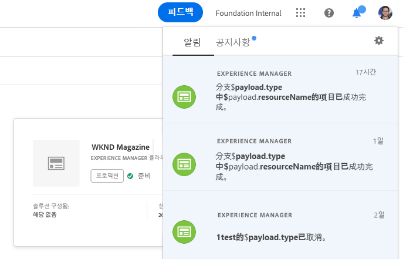

# 알림 이해 {#notifications}

[!UICONTROL Cloud ] Manager를 사용하면 프로덕션 배포를 시작할 때 프로덕션 파이프라인이 시작되고 완료(성공 또는 실패)되면 알림을 받을 수 있습니다. 이러한 알림은 Adobe [!UICONTROL Experience Cloud] 알림 시스템을 통해 전송됩니다.

>[!NOTE]
>
>승인 및 예약된 알림은 비즈니스 소유자, 프로그램 관리자 및 배포 관리자 역할의 사용자에게만 전송됩니다.

알림은 [!UICONTROL Cloud Manager] UI(사용자 인터페이스)의 사이드바 및 [!UICONTROL Experience Cloud]에 나타납니다.

아래 그림과 같이 헤더에서 벨 아이콘을 클릭하여 사이드바를 열고 알림을 확인합니다.

사이드바에 가장 최근 알림이 나열됩니다.

## 전자 메일 알림 {#email-notifications}

기본적으로 알림은 Adobe [!UICONTROL Experience Cloud] 솔루션 간 웹 사용자 인터페이스에서 사용할 수 있습니다. 개별 사용자는 즉시 또는 다이제스트할 때 이메일을 통해 이러한 알림을 전송하도록 선택할 수도 있습니다.

이렇게 하면 Adobe [!UICONTROL Experience Cloud]의 알림 환경 설정 화면으로 이동합니다.

사용자는 이메일 알림을 켜고(선택 사항) 이메일을 통해 수신하려는 알림 유형을 선택할 수 있습니다.

>[!NOTE]
>Adobe [!UICONTROL Experience Cloud]에서 소화하도록 설정할 수도 있습니다.
