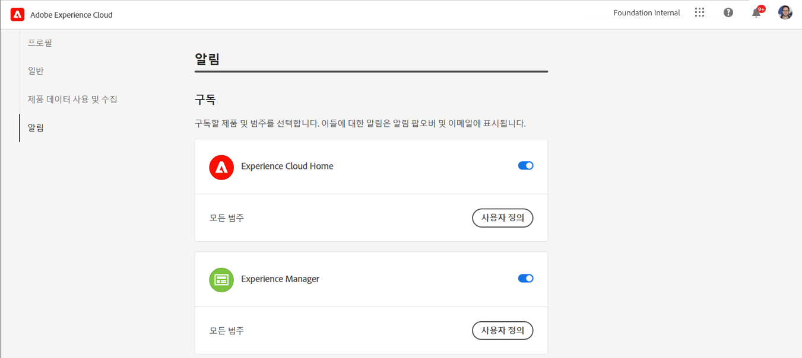
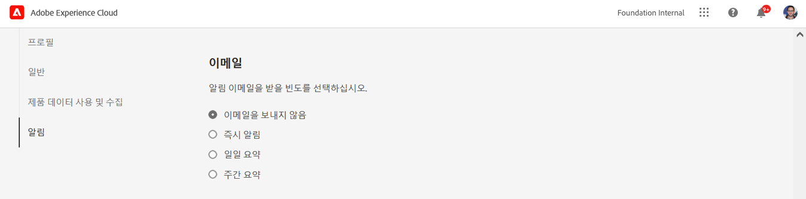

# 알림 {#notifications}

[!UICONTROL Cloud Manager] 프로덕션 배포 중에 프로덕션 파이프라인이 시작되고 완료되었을 때(성공 또는 실패) 사용자가 알림을 받을 수 있도록 해줍니다.

이러한 알림은 Adobe을 통해 전송됩니다 [!UICONTROL Experience Cloud] 역할을 가진 사용자에게 알림 시스템 **비즈니스 소유자**, **프로그램 관리자**, 및 **배포 관리자**.

알림이 [!UICONTROL Cloud Manager] UI 및 Adobe 전체 [!UICONTROL Experience Cloud].

새로운 알림이 있으면 벨 아이콘이 배지로 지정됩니다. 아이콘을 클릭하여 패널을 열어 알림을 확인합니다.

패널에는 최신 알림만 나열됩니다. 클릭 **모두 보기** 패널 하단에 있는 모든 알림을 확인하십시오.

## 이메일 알림 {#email-notifications}

기본적으로 Adobe 간 사용자 인터페이스에서 알림을 사용할 수 있습니다 [!UICONTROL Experience Cloud] 솔루션. 개별 사용자는 이러한 단계에 따라 이메일을 통해 이러한 알림을 전송하도록 선택할 수도 있습니다.

1. 벨 아이콘을 클릭하여 알림을 표시합니다.
1. 을(를) 클릭합니다. **환경 설정 편집** 알림 패널의 맨 위에 있는 아이콘(톱니바퀴와 같은 모양)입니다.
1. 열리는 창에서 **알림 을 참조하십시오** 을 클릭합니다.
   
1. 아래로 스크롤하여 **이메일** 제목.
   
1. 전자 메일을 받을 방법을 선택합니다.
   * 전자 메일 보내기 안 함(기본값)
   * 인스턴트 알림
   * 일별 다이제스트
   * 주간 다이제스트

선택한 항목은 저장 또는 적용 단추를 클릭하지 않아도 자동으로 저장됩니다.
