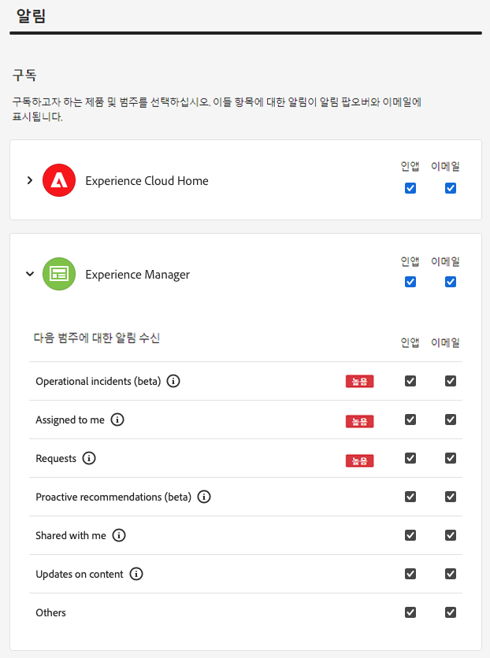

# 알림 {#notifications}

Cloud Manager가 중요한 이벤트를 알리는 방법에 대해 알아보십시오.

## Cloud Manager의 알림 {#cloud-manager-notifications}

[!UICONTROL Cloud Manager]를 사용하여 프로덕션 배포 시작 시 프로덕션 파이프라인이 시작되고 완료될 때 알림(성공 또는 실패)을 보냅니다.

이러한 알림은 [!UICONTROL Experience Cloud] 알림 시스템을 통해 **비즈니스 소유자**, **프로그램 관리자** 및 **배포 관리자** 역할을 가진 사용자에게 전송됩니다.

알림은 [!UICONTROL Cloud Manager] 내 사이드바와 Adobe [!UICONTROL Experience Cloud] 전체에 표시됩니다. 새 알림이 있을 때 헤더의 벨 아이콘에 배지가 표시됩니다.

사이드바를 열고 알림을 보려면 벨 아이콘을 클릭합니다. 사이드바의 **알림** 탭에는 배포 확인과 같은 최신 알림이 표시됩니다. 알림은 환경과 관련이 있습니다.

**공지** 탭에는 Adobe 제품 공지가 포함됩니다. 공지는 제품과 관련이 있습니다.

자세한 내용을 보려면 알림 또는 공지를 클릭합니다. 파이프라인 배포와 같은 활동에 연결된 알림은 파이프라인 실행 창과 같은 해당 활동의 세부 정보로 이동합니다.

받은 편지함의 모든 공지를 보려면 패널 하단의 **모두 보기** 옵션을 선택합니다.

읽지 않은 모든 알림을 읽은 것으로 표시하고 종 모양 아이콘 배지를 지우려면 패널 하단의 **모두 읽은 상태로 표시** 옵션을 선택합니다.

## 알림 구성 {#configuration}

알림 수신 방법과 수신 알림을 사용자 정의할 수 있습니다.

알림 사이드바 상단에 있는 기어 아이콘을 클릭합니다.

알림 구독과 알림을 받는 방법을 정의할 수 있는 **Experience Cloud 환경 설정** 창이 열립니다.

### 구독 {#subscriptions}

구독은 알림을 받을 제품과 알림을 정의합니다.

기본적으로 애플리케이션과 이메일 모두에서 모든 제품에 대한 모든 알림을 받게 됩니다. 제품 이름 옆에 있는 V자형 화살표를 클릭하면 자세한 옵션이 표시되고, 해당 제품에 대해 수신하는 알림의 유형을 정의할 수 있습니다. 또는 제품 수준에서 옵션을 선택하거나 선택 해제하여 제품에 대한 모든 옵션을 선택/선택 취소합니다.

### 우선 순위 {#priority}

우선 순위 경고는 **높음** 태그로 표시되며 경고로만 수신되도록 구성할 수 있습니다. **우선 순위** 섹션에서 우선 순위 알림에 적합한 범주를 정의할 수 있습니다.

드롭다운을 사용하여 우선 순위로 적합한 범주 목록에 추가합니다. 범주 이름 옆의 X를 클릭하여 제거합니다.

### 경고 {#alerts}

경고는 창의 오른쪽 상단에 몇 초 동안 표시됩니다. **경고** 섹션을 사용해 경고를 수신할 알림을 정의합니다.

경고 동작을 정의할 수 있습니다.

* **다음에 대한 경고 표시** - 경고를 트리거하는 알림 유형을 정의합니다.
* **경고를 해제할 때까지 표시** - 경고를 적극적으로 해제하지 않는 한 경고를 지속할지 여부를 제어합니다.
* **기간** - 경고를 화면에 유지하도록 선택하지 않은 경우 경고가 화면에 유지되어야 하는 시간을 정의합니다.

### 이메일 {#emails}

알림은 Adobe [!UICONTROL Experience Cloud] 솔루션의 웹 사용자 인터페이스에서 사용할 수 있습니다. 사용자는 이러한 알림이 **이메일** 섹션에서 이메일을 통해 전송되도록 선택할 수도 있습니다.

기본적으로 이메일은 전송되지 않습니다. 다음과 같이 이메일을 수신하도록 선택할 수 있습니다.

* 즉시
* 일별
* 주별

**즉시 알림**&#x200B;을 선택하면 모든 알림에 대해 이메일이 즉시 전송됩니다. **일별 요약** 및 **주별 요약**&#x200B;은 일별 요약과 주별 요약이 발송되는 시기와 날짜를 선택할 수 있습니다.