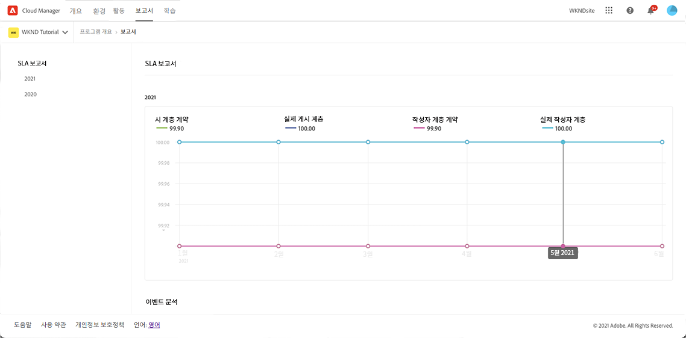
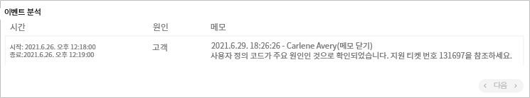

# SLA 보고 {#sla-reporting}

계약된 SLA(서비스 수준 계약)와 관련하여 프로덕션 AEM 환경의 성능을 확인하는 방법을 알아봅니다.

## 소개 {#introduction}

SLA 보고 데이터는 **보고서** 탭을 통해 모든 프로덕션 프로그램에 사용할 수 있습니다. 액세스하려면 다음 단계를 따르십시오.

1. [my.cloudmanager.adobe.com](https://my.cloudmanager.adobe.com/)에서 Cloud Manager에 로그인한 다음 적절한 조직을 선택합니다.

1. 다음에서 **[내 프로그램](/help/implementing/cloud-manager/getting-access-to-aem-in-cloud/editing-programs.md#my-programs)** 화면 프로그램 선택.

1. **개요** 페이지에서 **보고서** 탭으로 이동합니다.

1. SLA 데이터를 그래프로 보려면 원하는 연도를 클릭합니다.

데이터 포인트 위에 커서를 놓으면 해당 포인트에 대한 특정 값이 표시됩니다.

## SLA 지표 {#sla-metrics}

선택한 연도의 그래프에는 여러 데이터 세트가 포함됩니다.

* **게시 계층 약정** - 게시 계층에 대해 Adobe와의 약정에 정의된 SLA입니다.

* **게시 계층 실제** - Adobe 또는 Adobe 공급업체에 의해 발생한 프로덕션 게시 계층 팩토링 인시던트의 측정된 가동 시간입니다.

* **작성자 계층 약정**: 이는 작성자 계층에 대해 Adobe Managed Services와의 약정에 정의된 SLA입니다.

* **작성자 계층 실제** - Adobe 또는 Adobe 공급업체에 의해 발생한 프로덕션 작성자 계층 팩토링 인시던트의 측정된 가동 시간입니다.

## 이벤트 분석 {#event-analysis}

이 그래프 아래의 **이벤트 분석** 섹션은 선택된 해 동안 프로그램에 대해 발생한 일련의 인시던트를 보여 줍니다.

각 인시던트에는 시간 범위, 원인 및 댓글 집합이 있습니다.

## 새로 고침 간격 {#refresh}

SLA 보고를 통해 AEM 프로덕션 환경의 성능에 대한 통찰력을 얻을 수 있으며, 최신 상태이지만 즉각적인 상태는 아닙니다. SLA 보고서는 매월 생성되며 이전 달의 프로덕션으로 표시된 새 프로그램에 대해 생성됩니다. 인스턴트 아녜요 이러한 지연으로 인해 SLA 보고서를 검토할 때 다음 사항을 염두에 두십시오.

* 보고된 SLA는 해당 달 동안 SLA가 변경되었더라도 해당 달의 시작일에 있었던 SLA입니다.
* 프로그램이 존재하지 않아 월초에 SLA가 없는 경우 프로그램이 생성된 날짜에 있었던 SLA가 적용됩니다.

## 환경 미리보기 {#preview}

미리보기 환경은 콘텐츠 작성자가 게시하기 전에 콘텐츠의 최종 경험을 확인할 수 있는 도구입니다. 이러한 이유로 미리보기 환경은 고가용성으로 설계되지 않았으며 관련 SLA가 없습니다.
