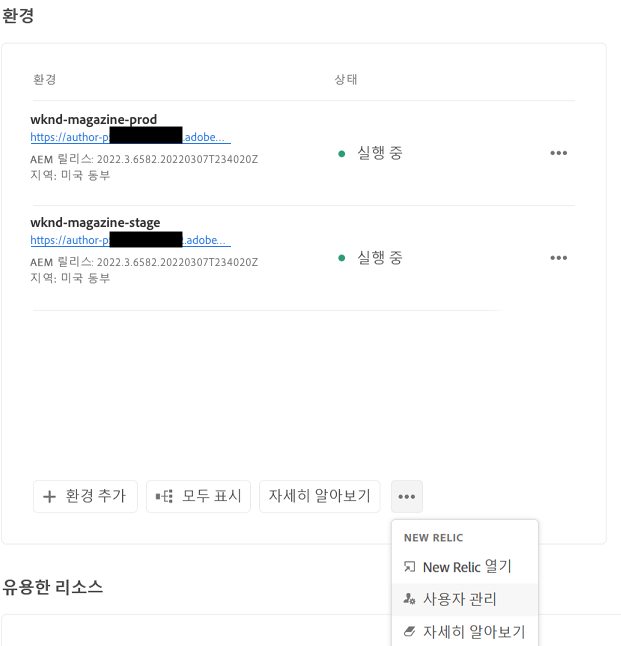
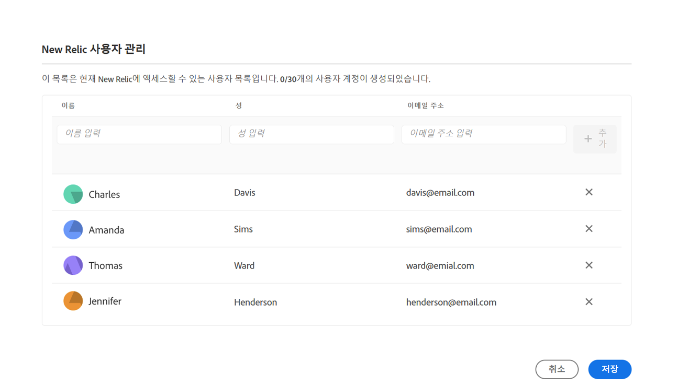
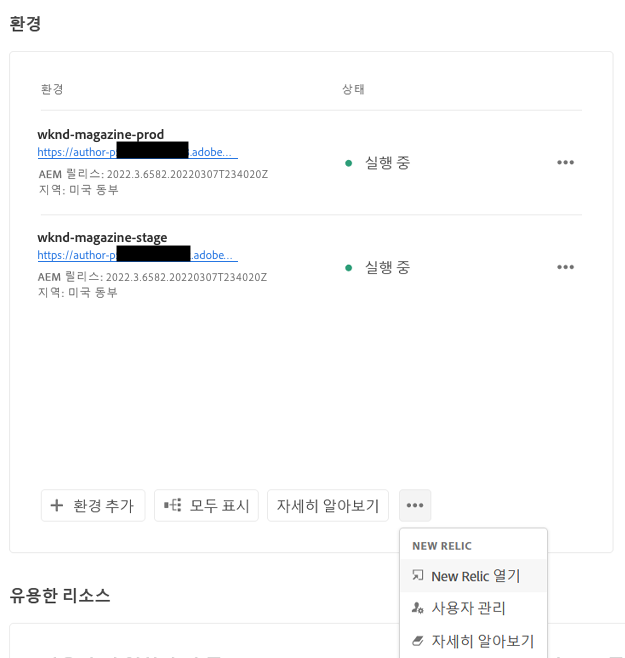

# New Relic One {#user-access}

AEM as a Cloud Service를 위한 New Relic One APM(Application Performance Monitoring) 서비스에 대한 정보와 액세스하는 방법에 대해 알아봅니다.

## 소개 {#introduction}

Adobe는 애플리케이션의 모니터링, 가용성 및 성능에 중점을 둡니다. AEM as a Cloud Service는 표준 제품의 일부로 사용자 정의 New Relic One 모니터링 제품군에 대한 액세스를 제공하여 팀이 AEM as a Cloud Service 시스템 및 환경 성능 지표에 대한 가시성을 최대한 확보할 수 있도록 지원합니다.

이 문서에서는 성능을 지원하고 AEM as a Cloud Service를 최대한 활용할 수 있도록 AEM as a Cloud Service 환경에서 활성화된 New Relic One APM(Application Performance Monitoring) 기능에 대한 액세스를 관리하는 방법을 설명합니다.

새 프로덕션 프로그램이 만들어지면 AEM as a Cloud Service 프로그램과 연결된 New Relic One 하위 계정이 자동으로 만들어집니다. [이 하위 계정을 활성화해야 합니다.](#activate-sub-account) 데이터 수집을 시작합니다.

## 기능 {#transaction-monitoring}

AEM as a Cloud Service용 New Relic One APM에는 많은 기능이 있습니다.

* 전용 New Relic One 계정에 직접 액세스

* 외부 종속성 및 데이터베이스를 포함하여 행 번호와 함께 정확한 메서드 호출을 표시하는 계측된 New Relic One APM 에이전트

* 인프라 수준 모니터링 및 애플리케이션(Adobe Experience Manager) 모니터링의 주요 지표를 결합하여 전체적인 성능 최적화

* New Relic Insights 지표 내에서 AEM as a Cloud Service JMX Mbeans 및 상태 확인을 직접 노출하여 애플리케이션 스택 성능 및 상태 지표에 대한 심층 검사 허용

## New Relic One 하위 계정 활성화 {#activate-sub-account}

새로 만든 프로그램의 경우 New Relic One 하위 계정이 생성됩니다. 그러나 데이터를 수집하려면 활성화해야 합니다. 이 작업은 자동으로 수행되지 않습니다. 하위 계정을 활성화하려면 다음 단계를 따르십시오.

>[!NOTE]
>
>의 사용자 **비즈니스 소유자** 또는 **배포 관리자** New Relic One 하위 계정을 관리하려면 역할이 로그인해야 합니다.

1. [my.cloudmanager.adobe.com](https://my.cloudmanager.adobe.com/)에서 Cloud Manager에 로그인한 다음 적절한 조직을 선택합니다.

1. New Relic One 사용자를 관리할 프로그램을 클릭합니다.

1. 의 맨 아래에서 **환경** 카드 개요 페이지에서 줄임표 버튼을 클릭하고 다음을 선택합니다. **New Relic 활성화**.

   

   * 프로그램의 **환경** 화면 상단에 있는 줄임표 버튼을 통해 **사용자 관리** 옵션에 액세스할 수도 있습니다.

1. [파이프라인 실행](/help/implementing/cloud-manager/configuring-pipelines/managing-pipelines.md#running-pipelines) 하위 계정 활성화를 완료하기 위해 동일한 환경을 성공적으로 완료합니다.

하위 계정이 비활성화되면 데이터 수집이 없습니다.

## New Relic One 사용자 관리 {#manage-users}

다음 단계에 따라 AEM as a Cloud Service 프로그램과 연결된 New Relic One 하위 계정의 사용자를 정의합니다.

>[!NOTE]
>
>New Relic One 사용자를 관리하려면 **비즈니스 소유자** 또는 **배포 관리자** 역할이 있는 사용자가 로그인해야 합니다.

1. [my.cloudmanager.adobe.com](https://my.cloudmanager.adobe.com/)에서 Cloud Manager에 로그인한 다음 적절한 조직을 선택합니다.

1. New Relic One 사용자를 관리할 프로그램을 클릭합니다.

1. 프로그램 개요 페이지의 **환경** 카드 하단에서 줄임표 버튼을 클릭하고 **사용자 관리**&#x200B;를 선택합니다.

   

   * 프로그램의 **환경** 화면 상단에 있는 줄임표 버튼을 통해 **사용자 관리** 옵션에 액세스할 수도 있습니다.

1. 다음에서 **New Relic 사용자 관리** 대화 상자에서 추가하려는 사용자의 이름과 성을 입력하고 **추가** 단추를 클릭합니다. 추가하려는 모든 사용자에 대해 이 단계를 반복합니다.

   

1. New Relic One 사용자를 제거하려면 해당 사용자를 나타내는 행의 오른쪽 끝에 있는 삭제 버튼을 클릭합니다.

1. **저장**&#x200B;을 클릭하여 사용자를 만듭니다.

사용자가 정의되면 New Relic은 사용자가 설정 프로세스를 완료하고 로그인할 수 있도록 액세스 권한을 부여한 각 사용자에게 확인 이메일을 보냅니다.

>[!NOTE]
>
>New Relic One 사용자를 관리하는 경우, 액세스 권한을 얻으려면 자신을 사용자로 추가해야 합니다. **비즈니스 소유자** 또는 **배포 관리자**&#x200B;가 되는 것만으로는 New Relic One에 액세스할 수 없습니다. 자신을 사용자로 만들어야 합니다.

## New Relic One 사용자 계정 활성화 {#activate-user-account}

미리보기 섹션 [New Relic One 사용자 관리](#manage-users)에 설명된 대로 New Relic One 사용자 계정이 만들어지면 New Relic에서 해당 사용자에게 제공된 주소로 확인 이메일을 보냅니다. 이러한 계정을 사용하려면 사용자가 먼저 암호를 재설정하여 New Relic으로 계정을 활성화해야 합니다.

다음 단계에 따라 계정을 New Relic 사용자로 활성화합니다.

1. New Relic에서 보낸 이메일에 있는 링크를 클릭합니다. 그러면 브라우저에서 New Relic 로그인 페이지가 열립니다.

1. New Relic 로그인 페이지에서 **암호를 잊어버렸습니까?**&#x200B;를 선택합니다.

   

1. 확인 이메일을 받은 이메일 주소를 입력하고 **내 재설정 링크 보내기**&#x200B;를 선택합니다.

   

1. New Relic에서 계정 확인을 위한 링크가 포함된 이메일을 보내드립니다.

New Relic에서 확인 이메일을 받지 못한 경우, [문제 해결 섹션](#troubshooting)을 참조하십시오.

## New Relic One 액세스 {#accessing-new-relic}

[New Relic 계정을 활성화하면](#activate-account) Cloud Manager를 통해 또는 직접 New Relic One에 액세스할 수 있습니다.

Cloud Manager를 통해 New Relic One에 액세스하려면 다음 작업을 수행하십시오.

1. [my.cloudmanager.adobe.com](https://my.cloudmanager.adobe.com/)에서 Cloud Manager에 로그인한 다음 적절한 조직을 선택합니다.

1. New Relic One에 액세스할 프로그램을 클릭합니다.

1. 프로그램 개요 페이지의 **환경** 카드 하단에서 줄임표 버튼을 클릭하고 **New Relic 열기**&#x200B;를 선택합니다.

   

   * 프로그램의 **환경** 화면 상단에 있는 줄임표 버튼을 통해 New Relic에 액세스할 수도 있습니다.

1. 새 브라우저 탭이 열리면 New Relic One에 로그인합니다.

New Relic One에 직접 액세스하려면 다음 작업을 수행하십시오.

1. New Relic 로그인 페이지([`https://login.newrelic.com/login`](https://login.newrelic.com/login))로 이동합니다.

1. New Relic One에 로그인합니다.

### 이메일 확인 {#verify-email}

New Relic One에 로그인하는 동안 이메일을 확인하라는 메시지가 표시되면 이메일이 여러 계정과 연결되어 있다는 의미입니다. 이를 통해 액세스할 계정을 선택할 수 있습니다.

이메일 주소를 확인하지 않는 경우, New Relic은 이메일 주소와 연결된 가장 최근에 만들어진 사용자 레코드로 로그인을 시도합니다. 로그인할 때마다 이메일을 확인하지 않으려면 로그인 화면에서 **내 정보 저장** 확인란을 클릭합니다.

도움이 더 필요하면 [AEM 지원 포털](https://helpx.adobe.com/kr/enterprise/using/support-for-experience-cloud.html)을 사용하여 지원 티켓을 여십시오.

## New Relic One 사용자 액세스 문제 해결 {#troubleshooting}

섹션에 설명된 대로 New Relic One 사용자로 추가된 경우 [New Relic One 사용자 관리](#manage-users) 및 은(는) 원본 계정 확인 이메일을 찾을 수 없습니다. 다음 단계를 따르십시오.

1. New Relic 로그인 페이지([`login.newrelic.com/login`](https://login.newrelic.com/login))로 이동합니다.

1. **암호를 잊어버렸습니까?**&#x200B;를 선택합니다.

   

1. 계정을 만드는 데 사용한 이메일 주소를 입력하고 **내 재설정 링크 보내기**&#x200B;를 선택합니다.

   

1. New Relic에서 계정 확인을 위한 링크가 포함된 이메일을 보내드립니다.

가입 절차를 완료했는데 이메일 또는 암호 오류 메시지로 인해 계정에 로그인할 수 없는 경우, [Admin Console](https://adminconsole.adobe.com/)을 사용하여 지원 티켓을 기록하십시오.

New Relic에서 이메일을 받지 못한 경우, 다음 작업을 수행하십시오.

* [스팸 필터](https://docs.newrelic.com/docs/accounts/accounts-billing/account-setup/create-your-new-relic-account/)를 확인합니다.
* 해당하는 경우 [이메일 허용 목록에 New Relic을 추가](https://docs.newrelic.com/docs/accounts/accounts/account-maintenance/account-email-settings/#email-whitelist)합니다.
* 두 제안 모두 도움이 되지 않는 경우, 지원 티켓에 대한 피드백을 제공해 주시면 Adobe 지원 팀에서 추가로 도움을 드리겠습니다.

## 제한 사항 {#limitations}

New Relic One에 사용자를 추가하는 경우 다음 제한이 적용됩니다.

* 최대 30명의 사용자를 추가할 수 있습니다. 최대 사용자 수에 도달한 경우, 새 사용자를 추가할 수 있도록 사용자를 제거하십시오.
* New Relic에 추가된 사용자는 **제한됨** 유형이 됩니다. [자세한 내용은 New Relic 설명서를 ](https://docs.newrelic.com/docs/accounts/original-accounts-billing/original-users-roles/users-roles-original-user-model/#:~:text=In%20general%2C%20Admins%20take%20responsibility,Restricted%20Users%20can%20use%20them.&amp;text=One%20or%20more%20individuals%20who,change)참조하십시오.
* AEM as a Cloud Service는 New Relic One APM 솔루션만 제공하며 경고, 로깅 또는 API 통합에 대한 지원은 제공하지 않습니다.

>[!NOTE]
>
>New Relic One 하위 계정에서 90일 이상 활동이 감지되지 않으면 APM 에이전트가 중지됩니다.
>
>의 동일한 단계를 따르십시오. [New Relic One 하위 계정 활성화](#activate-sub-account) 이 문서의 섹션을 통해 New Relic One 하위 계정을 다시 활성화할 수 있습니다.

as a Cloud Service 프로그램의 New Relic One AEM 제공에 대한 추가 도움말 또는 추가 지침을 보려면 [AEM 지원 포털.](https://helpx.adobe.com/enterprise/using/support-for-experience-cloud.html)

## New Relic One에 대해 자주 묻는 질문 {#faqs}

### Adobe가 New Relic One으로 모니터링하는 대상은 무엇입니까? {#adobe-monitor}

Adobe는 New Relic One의 Java 플러그인을 통해 AEM as a Cloud Service, 게시 및 미리보기(사용 가능한 경우) 서비스를 모니터링합니다. Adobe는 비프로덕션 및 프로덕션 AEM as a Cloud Service 환경 전반에서 사용자 정의 New Relic One APM 원격 분석 및 모니터링을 지원합니다.

New Relic One 계정은 Adobe에서 관리하는 주 계정에 연결되어 있으며 여러 애플리케이션에서 보고를 받습니다(AEM as a Cloud Service 환경당 3개).

* 환경당 작성자 서비스용 애플리케이션 1개
* 환경당 게시 서비스용 애플리케이션 1개 (Golden Publish 포함)
* 환경당 미리보기 서비스용 애플리케이션 1개

메모:

* 각 애플리케이션은 하나의 라이선스 키를 사용합니다.
* AEM as a Cloud Service 환경은 하나의 New Relic One 계정에만 보고합니다.
* New Relic One에 대한 전체 모니터링 지표 및 이벤트는 7일 동안 유지됩니다.

### Adobe는 New Relic One에서 경고 알림을 전송합니까? {#alerting-new-relic}

Adobe는 가시성 목적으로만 New Relic One 액세스를 제공하고 고객 경고나 내부 작업 경고에는 이를 활용하지 않습니다. 모든 인시던트에 대한 알림은 [사용자 알림 프로필](/help/journey-onboarding/notification-profiles.md)을 통해 전송됩니다.

### New Relic One Cloud Service 데이터에 접근할 수 있는 권한은 누구에게 있습니까? {#access-new-relic-cloud}

최대 30명의 팀원에게 전체 읽기 액세스 권한이 부여됩니다. 읽기 액세스에는 New Relic One 에이전트가 수집한 모든 APM 지표가 포함됩니다.

### 사용자 정의 SSO 구성이 지원됩니까? {#custom-sso}

Adobe에서 제공한 New Relic One 계정에 대해서는 사용자 정의 SSO 구성이 지원되지 않습니다.

### 이미 On-Premise New Relic 구독이 있는 경우 어떻게 해야 합니까? {#new-relic-subscription}

New Relic One은 New Relic의 새로운 관찰 가능성 플랫폼으로, 여기에서 Adobe 지원과 귀하의 팀이 지표와 이벤트를 모두 한 곳에서 관찰, 모니터링 및 볼 수 있습니다.

New Relic One은 액세스 권한이 있는 모든 계정을 검색하고 모든 서비스 및 호스트의 데이터를 하나의 보기에서 시각화할 수 있는 기능을 사용자에게 제공합니다.

Adobe 지원에서 서비스의 일부로 New Relic One 및 기타 사내 도구를 사용하여 AEM as a Cloud Service 애플리케이션을 모니터링하는 동안 귀하의 팀은 New Relic을 On-Premise 호스팅 서비스 및 인프라에 계속 사용할 수 있습니다. Adobe New Relic One 계정과 고객이 관리하는 New Relic 계정의 데이터를 시각화할 수 있습니다.

>[!NOTE]
>
>New Relic One 내에서 두 데이터 세트를 모두 보려면 사용자에게 올바른 권한이 있어야 하며 두 계정(Adobe New Relic One 및 고객 관리 New Relic 계정)에 대해 동일한 로그인 방법을 사용해야 합니다.

### New Relic One 계정의 APM 에이전트가 중단됩니다. 어떻게 되었습니까? {#deactivated}

활동이 90일 이상 감지되지 않으면 [APM 에이전트가 중단됩니다](#limitations). 의 동일한 단계를 따르십시오. [New Relic One 하위 계정 활성화](#activate-sub-account) 이 문서의 섹션을 통해 New Relic One 하위 계정을 다시 활성화할 수 있습니다.
