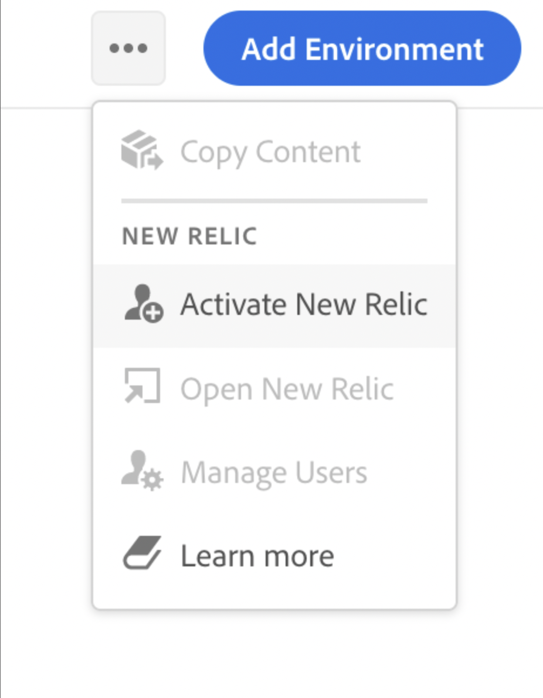
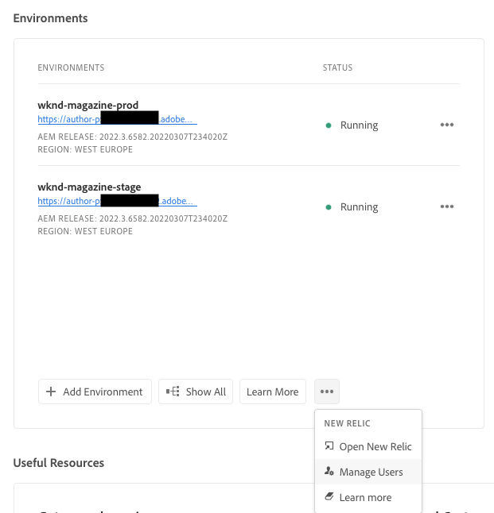
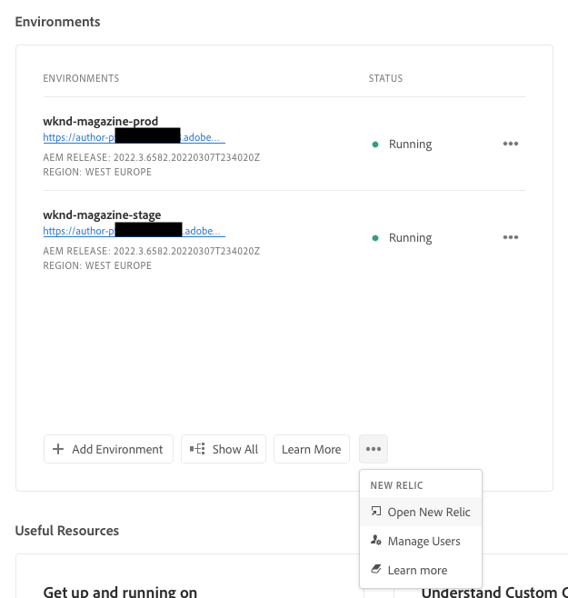

# New Relic One {#user-access}

AEM as a Cloud Service를 위한 New Relic One APM(Application Performance Monitoring) 서비스에 대한 정보와 액세스하는 방법에 대해 알아봅니다.

## New Relic One 정보 {#introduction}

Adobe는 애플리케이션의 모니터링, 가용성 및 성능에 중점을 둡니다. AEM as a Cloud Service에는 New Relic One 모니터링에 대한 액세스 권한이 포함되어 있으므로 표준 제품 서비스의 일부로 팀에게 시스템 및 환경 성능 지표를 포괄적으로 확인할 수 있습니다.

이 문서에서는 AEM as a Cloud Service 환경에서 New Relic One APM(Application Performance Monitoring) 기능에 대한 액세스를 관리하는 방법을 간략하게 설명합니다. 이러한 기능을 효과적으로 관리하면 최적의 성능을 지원하고 AEM as a Cloud Service의 이점을 극대화할 수 있습니다.

새 프로덕션 프로그램이 만들어지면 AEM as a Cloud Service 프로그램과 연결된 New Relic One 하위 계정이 자동으로 만들어집니다. 데이터 수집을 시작하려면 [이 하위 계정을 활성화해야 합니다](#activate-sub-account).

## 기능 {#transaction-monitoring}

AEM as a Cloud Service용 New Relic One APM에는 많은 기능이 있습니다.

* 전용 New Relic One 계정에 직접 액세스

* 외부 종속성 및 데이터베이스를 포함하여 행 번호와 함께 정확한 메서드 호출을 표시하는 계측된 New Relic One APM 에이전트입니다.

* 인프라 수준 모니터링과 애플리케이션(Adobe Experience Manager) 모니터링의 주요 지표를 결합하여 전체적인 성능 최적화.

* Cloud Manager 파이프라인 실행, AEM 업그레이드 및 코드 복원 작업에 대한 자동 변경 추적기. 이러한 추적기를 통해 팀은 New Relic One에서 직접 애플리케이션 성능 변경 사항과 배포를 상호 연관시킬 수 있습니다.

## New Relic One 하위 계정 활성화 {#activate-sub-account}

새로 만든 프로그램의 경우 New Relic One 하위 계정이 생성됩니다. 그러나 데이터를 수집하려면 활성화해야 합니다. 이 활성화는 자동으로 수행되지 않습니다. 하위 계정을 활성화하려면 다음 단계를 따르십시오.

>[!NOTE]
>
>New Relic One 하위 계정을 관리하려면 **비즈니스 소유자** 역할의 사용자가 로그인해야 합니다.

1. [my.cloudmanager.adobe.com](https://my.cloudmanager.adobe.com/)에서 Cloud Manager에 로그인한 다음 적절한 조직을 선택합니다.

1. **[내 프로그램](/help/implementing/cloud-manager/navigation.md#my-programs)** 콘솔에서 New Relic One 사용자를 관리할 프로그램을 클릭합니다.

1. 프로그램 개요 페이지의 **환경** 카드 하단에서 을 클릭하고 **New Relic 활성화**&#x200B;를 선택합니다.

   

   * **사용자 관리** 옵션에 액세스할 수도 있습니다. 프로그램의 **환경** 화면 맨 위에서 을 클릭합니다.

1. 하위 계정 활성화를 완료하기 위해 동일한 환경에 대해 [파이프라인을 실행](/help/implementing/cloud-manager/configuring-pipelines/managing-pipelines.md#running-pipelines)합니다.

하위 계정이 비활성화되면 데이터 수집이 없습니다.

## New Relic One 사용자 관리 {#manage-users}

다음 단계에 따라 AEM as a Cloud Service 프로그램과 연결된 New Relic One 하위 계정의 사용자를 정의합니다.

>[!NOTE]
>
>New Relic One 사용자를 관리하려면 **비즈니스 소유자** 또는 **배포 관리자** 역할의 사용자가 로그인해야 합니다.

1. [my.cloudmanager.adobe.com](https://my.cloudmanager.adobe.com/)에서 Cloud Manager에 로그인한 다음 적절한 조직을 선택합니다.

1. New Relic One 사용자를 관리할 프로그램을 클릭합니다.

1. 프로그램 개요 페이지의 **환경** 카드 하단에서 을 클릭하고 **사용자 관리**&#x200B;를 선택합니다.

   

   * **사용자 관리** 옵션에 액세스할 수도 있습니다. 프로그램의 **환경** 화면 맨 위에서 을 클릭합니다.

1. **New Relic 사용자 관리** 대화 상자에서 추가하려는 사용자의 이름과 성을 입력하고 **추가** 단추를 클릭합니다. 추가하려는 모든 사용자에 대해 이 단계를 반복합니다.

   

1. New Relic One 사용자를 제거하려면 해당 사용자를 나타내는 행의 오른쪽 끝에 있는 삭제 버튼을 클릭합니다.

1. **저장**&#x200B;을 클릭하여 사용자를 만듭니다.

사용자가 정의되면 New Relic은 사용자가 설정 프로세스를 완료하고 로그인할 수 있도록 액세스 권한을 부여한 각 사용자에게 확인 이메일을 보냅니다.

>[!NOTE]
>
>New Relic One 사용자를 관리하는 경우 자신을 사용자로 추가해야 합니다. **비즈니스 소유자** 또는 **배포 관리자**&#x200B;인 것만으로는 New Relic One에 액세스할 수 없습니다.

## New Relic One 사용자 계정 활성화 {#activate-user-account}

[New Relic One 사용자 관리](#manage-users)에 설명된 대로 New Relic One 사용자 계정이 만들어지면 New Relic에서 해당 사용자에게 제공된 주소로 확인 이메일을 보냅니다. 이러한 계정을 사용하려면 사용자가 먼저 암호를 재설정하여 New Relic으로 계정을 활성화해야 합니다.

**New Relic One 사용자 계정을 활성화하려면:**

1. New Relic 이메일에 제공된 링크를 클릭합니다.

1. New Relic 로그인 페이지에서 **암호를 잊어버렸습니까?**&#x200B;를 클릭합니다.

   

1. 확인 이메일을 받은 이메일 주소를 입력하고 **내 재설정 링크 보내기**&#x200B;를 선택합니다.

   

1. New Relic에서 계정을 확인하는 링크가 포함된 이메일을 보냅니다.

New Relic에서 확인 이메일을 받지 못한 경우 [문제 해결 섹션](#troubshooting)을 참조하십시오.

## New Relic One 액세스 {#accessing-new-relic}

[New Relic 계정을 활성화](#activate-account)하면 Cloud Manager을 통해 또는 직접 New Relic One에 액세스할 수 있습니다.

**Cloud Manager을 통해 New Relic One에 액세스하려면:**

1. [my.cloudmanager.adobe.com](https://my.cloudmanager.adobe.com/)에서 Cloud Manager에 로그인한 다음 적절한 조직을 선택합니다.

1. New Relic One에 액세스할 프로그램을 클릭합니다.

1. 프로그램 개요 페이지의 **환경** 카드 하단에서 을 클릭하고 **New Relic 열기**&#x200B;를 선택합니다.

   

   * New Relic에 액세스할 수도 있습니다. 프로그램의 **환경** 화면 맨 위에서 을 클릭합니다.

1. 새 브라우저 탭이 열리면 New Relic One에 로그인합니다.

**New Relic One에 직접 액세스하려면:**

1. [New Relic의 로그인 페이지](https://login.newrelic.com/login)&#x200B;(으)로 이동합니다.

1. New Relic One에 로그인합니다.

### 이메일 확인 {#verify-email}

New Relic One에 로그인하는 동안 이메일을 확인하라는 메시지가 표시되면 이메일이 여러 계정과 연결되어 있다는 의미입니다. 액세스할 계정을 선택할 수 있습니다.

이메일 주소를 확인하지 않는 경우, New Relic은 이메일 주소와 연결된 가장 최근에 만들어진 사용자 레코드로 로그인을 시도합니다. 로그인할 때마다 이메일을 확인하지 않으려면 로그인 화면에서 **내 정보 저장** 확인란을 클릭합니다.

도움이 더 필요하면 [AEM 지원 포털](https://helpx.adobe.com/kr/enterprise/using/support-for-experience-cloud.html)을 사용하여 지원 티켓을 여십시오.

## 변경 추적기 사용 {#change-tracker}

Cloud Manager은 지원되는 파이프라인 실행, AEM 업그레이드 및 코드 복원이 완료될 때마다 변경 추적기를 New Relic One에 자동으로 전송합니다. 이러한 추적기는 New Relic의 **변경 추적** 보기에서 변경 이벤트로 표시되므로 팀이 배포를 응용 프로그램 성능, 오류율 및 처리량의 이동과 상호 연관시킬 수 있습니다.

<!-- See also [Introduction to change tracking](https://docs.newrelic.com/docs/change-tracking/overview/) and [Record and view deployments](https://docs.newrelic.com/docs/apm/apm-ui-pages/events/record-deployments/). -->

### 지원되는 파이프라인 및 흐름 {#supported-pipelines}

다음 Cloud Manager 파이프라인과 마지막 두 가지 플로우 유형은 New Relic One에서 변경 추적기를 생성합니다.

| 파이프라인/흐름 유형 | 설명 |
|---|---|
| **전체 스택(CI_CD 배포)** | 전체 스택 파이프라인 실행. 추적에는 파이프라인 이름과 실행 ID가 포함됩니다. |
| **웹 계층 구성** | 웹 계층 구성 파이프라인 실행. 추적에는 파이프라인 이름과 실행 ID가 포함됩니다. |
| **프런트 엔드** | 프론트엔드 파이프라인 실행 추적에는 파이프라인 이름과 실행 ID가 포함됩니다. |
| **구성** | 파이프라인 실행 구성. 추적에는 파이프라인 이름과 실행 ID가 포함됩니다. |
| **AEM 업데이트** | AEM 버전을 업그레이드합니다. 예를 들어, 버전 {}에서 버전 {}까지. 추적기는 환경 변경 이벤트가 완료될 때 생성됩니다. |
| **코드 복원** | 코드는 특정 저장소 및 분기에서 작업을 복원합니다. |

>[!NOTE]
>
>변경 추적기는 현재 Skyline 환경에서만 지원됩니다. 확장 파이프라인 및 서비스 팩 파이프라인과 같이 범위를 벗어나는 파이프라인은 추적기를 생성하지 않습니다.

### New Relic One에서 변경 내용 추적기 보기 {#view-change-trackers}

지원되는 파이프라인 실행이 완료되면 New Relic One에서 해당 변경 추적기를 볼 수 있습니다.

**New Relic One에서 변경 내용 추적기를 보려면:**

1. [Cloud Manager을 통해 또는 직접 New Relic One에 액세스](#accessing-new-relic)합니다.
1. **APM 및 서비스**(으)로 이동하여 관련 환경에 대한 응용 프로그램을 선택하십시오.
1. 애플리케이션 요약 페이지에서 차트에서 변경 추적기 지표를 찾습니다. 추적기에 마우스를 가져다 대면 배포 세부 사항을 볼 수 있습니다.

   

1. 테이블에서 변경 이벤트를 클릭하여 세부 보기를 엽니다.

    <i>변경 이벤트에 대한 자세히 보기</i>

   오른쪽의 **세부 정보 변경** 패널에 엔터티, 타임스탬프, Epoch, 범주, 배포 ID 및 API 유형이 표시됩니다.

   Cloud Manager에서 New Relic One으로 보내는 각 변경 추적기에 대해 오른쪽 하단의 **배포 특성** 패널에 다음 특성이 표시됩니다.

   | 속성 | 설명 |
   |---|---|
   | **버전** | 파이프라인 이름 및 실행 ID를 포함하는 설명 문자열입니다. |
   | **변경 로그** | 향후 사용을 위해 예약되었습니다. |
   | **커밋** | 향후 사용을 위해 예약되었습니다. |
   | **딥링크** | Cloud Manager의 파이프라인 실행 페이지에 다시 연결하려면 URL을 클릭합니다. |

1. 변경 내용 추적기의 전체 목록을 보려면 왼쪽 사이드바의 **이벤트**&#x200B;에서 **변경 내용 추적**&#x200B;을 클릭하십시오.

   **이벤트 변경** 테이블은 타임스탬프 및 버전 설명과 함께 각 배포를 표시합니다.

   

>[!TIP]
>
>**응답 시간** 및 **처리량**&#x200B;과 같은 New Relic One의 성능 지표와 함께 변경 추적기를 사용합니다. 이러한 지표는 특정 배포에 성능 회귀 또는 개선이 도입되었는지 여부를 식별하는 데 도움이 됩니다. 변경 이벤트 세부 사항 페이지에서 배포 전후의 지표를 직접 비교할 수 있습니다.

## New Relic One 사용자 액세스 문제 해결 {#troubleshooting}

[New Relic One 사용자 관리](#manage-users)에 설명된 대로 New Relic One 사용자로 추가되었는데 원본 계정 확인 이메일을 찾을 수 없는 경우 다음 문제 해결 단계를 수행할 수 있습니다.

**New Relic One 사용자 액세스 문제를 해결하려면:**

1. New Relic 로그인 페이지([`login.newrelic.com/login`](https://login.newrelic.com/login))로 이동합니다.

1. **[!UICONTROL 암호를 잊어버렸습니까?]**&#x200B;를 클릭합니다.

   

1. 계정을 만드는 데 사용한 이메일 주소를 입력하고 **내 재설정 링크 보내기**&#x200B;를 선택합니다.

   

1. New Relic에서 계정을 확인하는 링크가 포함된 이메일을 보냅니다.

가입 절차를 완료했는데 전자 메일 또는 암호 오류 메시지로 인해 계정에 로그인할 수 없는 경우 [Admin Console](https://adminconsole.adobe.com/)을 통해 지원 티켓을 기록하십시오.

New Relic에서 이메일을 받지 못한 경우 다음을 수행하십시오.

* [스팸 필터](https://docs.newrelic.com/docs/accounts/accounts-billing/account-setup/create-your-new-relic-account/)를 확인합니다.
* 해당하는 경우 [전자 메일에 New Relic 추가](https://docs.newrelic.com/docs/accounts/accounts/account-maintenance/account-email-settings/#email-whitelist).
* 두 제안 모두 도움이 되지 않는 경우 지원 티켓에 대한 피드백을 제공해 주십시오.

## 사용 정보 {#usage-notes}

* 최대 30명의 사용자를 추가할 수 있습니다. 최대 사용자 수에 도달한 경우, 새 사용자를 추가할 수 있도록 사용자를 제거하십시오.
* New Relic에 추가된 사용자의 유형은 **기본**&#x200B;입니다. 자세한 내용은 [New Relic 설명서](https://docs.newrelic.com/docs/accounts/accounts-billing/new-relic-one-user-management/user-type/)를 참조하세요.
* AEM as a Cloud Service는 New Relic One APM 솔루션만 제공하며 경고, 로깅 또는 API 통합에 대한 지원은 제공하지 않습니다.

>[!NOTE]
>
>New Relic One 하위 계정에서 30일 이상 **사용자 로그인** 활동이 검색되지 않으면 APM 에이전트가 중지됩니다. 데이터가 AEM Cloud Service에서 New Relic으로 전송되지 않습니다. *하위 계정이 다시 활성화될 때까지 데이터가 다시 전송되지 않습니다.*
>
>이 문서의 [New Relic One 하위 계정 활성화](#activate-sub-account) 섹션에서 동일한 단계에 따라 New Relic One 하위 계정을 다시 활성화하십시오.

AEM as a Cloud Service 프로그램의 New Relic One 제공에 대한 추가 도움말 또는 추가 지침을 보려면 [AEM 지원 포털](https://helpx.adobe.com/kr/enterprise/using/support-for-experience-cloud.html)을 통해 지원 티켓을 여십시오.

## 자주 묻는 질문 {#faqs}

+++**New Relic One에서 Adobe이 모니터링하는 내용은 무엇입니까?**

Adobe는 New Relic One의 Java 플러그인을 통해 AEM as a Cloud Service, 게시 및 미리보기(사용 가능한 경우) 서비스를 모니터링합니다. Adobe는 비프로덕션 및 프로덕션 AEM as a Cloud Service 환경 전반에서 사용자 정의 New Relic One APM 원격 분석 및 모니터링을 지원합니다.

New Relic One 계정은 Adobe에서 관리하는 기본 계정에 연결되어 있으며 여러 애플리케이션에서 보고를 받습니다(AEM as a Cloud Service 환경당 3개).

* 환경당 Author 서비스용 애플리케이션 1개
* 환경당 `Publish` 서비스에 대한 응용 프로그램 1개(Golden Publish 포함)
* 환경당 미리보기 서비스용 애플리케이션 1개

메모:

* 각 애플리케이션은 하나의 라이선스 키를 사용합니다.
* AEM as a Cloud Service 환경은 하나의 New Relic One 계정에만 보고합니다.
* 두 New Relic One에 대한 전체 모니터링 지표 및 이벤트는 3개월 동안 유지됩니다.

+++

+++**Adobe에서 New Relic One에서 경고 알림을 전송합니까?**

Adobe은 가시성 목적으로만 New Relic One 액세스를 제공하며 고객 경고 또는 내부 운영 경고 용도로 사용하지 않습니다. 인시던트에 대한 알림은 [사용자 알림 프로필](/help/journey-onboarding/notification-profiles.md)을 사용하여 전송됩니다.
+++

+++**New Relic One 클라우드 서비스 데이터에 액세스할 수 있는 사용자**

최대 30명의 팀원에게 전체 읽기 액세스 권한이 부여됩니다. 읽기 액세스에는 New Relic One 에이전트가 수집한 모든 APM 지표가 포함됩니다.
+++

+++**사용자 지정 SSO 구성이 지원됩니까?**

Adobe에서 제공한 New Relic One 계정에 대해서는 사용자 정의 SSO 구성이 지원되지 않습니다.
+++

+++**이미 온-프레미스 New Relic 구독이 있는 경우 어떻게 해야 합니까?**

New Relic One은 New Relic의 새로운 관찰 가능성 플랫폼으로, 여기에서 Adobe 지원과 귀하의 팀이 지표와 이벤트를 모두 한 곳에서 관찰, 모니터링 및 볼 수 있습니다.

New Relic One은 액세스 권한이 있는 모든 계정을 검색하고 모든 서비스 및 호스트의 데이터를 하나의 보기에서 시각화할 수 있는 기능을 사용자에게 제공합니다.

Adobe은 New Relic One 및 기타 도구를 사용하여 AEM as a Cloud Service을 모니터링하는 반면, 귀하의 팀은 여전히 온프레미스 서비스 및 인프라에 New Relic을 사용할 수 있습니다. Adobe New Relic One 계정과 고객이 관리하는 New Relic 계정의 데이터를 시각화할 수 있습니다.

>[!NOTE]
>
>New Relic One 내에서 두 데이터 세트를 모두 보려면 사용자에게 올바른 권한이 있어야 하며 두 계정(Adobe New Relic One 및 고객 관리 New Relic 계정)에 대해 동일한 로그인 방법을 사용해야 합니다.

+++

+++**내 New Relic One 계정에 대한 APM 에이전트가 중지되었습니다. 무슨 일이 있었습니까?**

30일 이상 활동이 검색되지 않으면 [APM 에이전트가 중지됩니다](#limitations). 이 문서의 [New Relic One 하위 계정 활성화](#activate-sub-account) 섹션에서 동일한 단계에 따라 New Relic One 하위 계정을 다시 활성화하십시오.
+++
