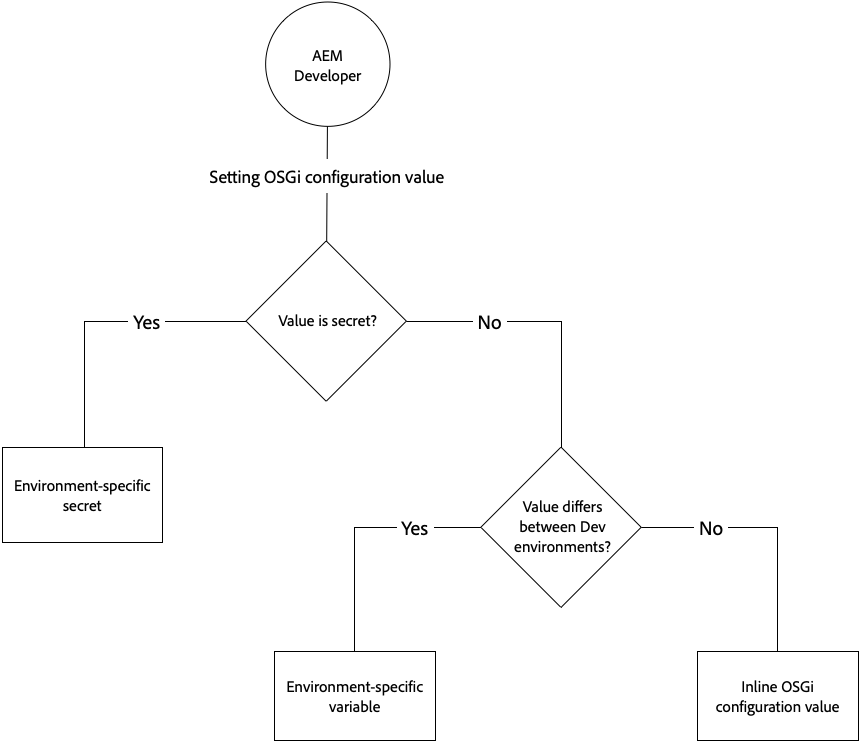

# OSGi 구성 {#osgi-configurations}

[OSGi는](https://www.osgi.org/) AEM(Adobe Experience Manager)의 기술 스택에서 기본적인 요소입니다. AEM 및 해당 구성의 복합 번들을 제어하는 데 사용됩니다.

OSGi는 표준화된 원시 도형을 제공하여 애플리케이션이 작고 재사용 가능한 공동 작업 구성 요소로 구성되도록 합니다. 이러한 구성 요소는 애플리케이션으로 구성하고 배포할 수 있습니다. 이를 통해 OSGi 번들은 개별적으로 시작, 중지, 설치 및 설치할 수 있으므로 간편하게 관리할 수 있습니다. 상호 종속성은 자동으로 처리됩니다. 각 OSGi 구성 요소는 다양한 번들 중 하나에 포함됩니다. 자세한 내용은 [OSGi 사양을 참조하십시오](https://www.osgi.org/Specifications/HomePage).

AEM 코드 프로젝트의 일부인 구성 파일을 통해 OSGi 구성 요소에 대한 구성 설정을 관리할 수 있습니다.

## OSGi 구성 파일 {#osgi-configuration-files}

구성 변경 사항은 AEM Project의 코드 패키지(`ui.apps`)에서 실행 모드 특정 구성 폴더 아래의 구성 파일(`.cfg.json`)로 정의됩니다.

`/apps/example/config.<runmode>`

OSGi 구성 파일의 형식은 Apache Sling 프로젝트에 의해 정의된 형식을 사용하는 JSON 기반 `.cfg.json` 입니다.

OSGi 구성은 OSGi 구성 요소의 Java 클래스 이름으로 기본적으로 설정되어 있는 PID(Persistent Identity)를 통해 OSGi 구성 요소를 타깃팅합니다. 예를 들어 다음 사용자가 구현한 OSGi 서비스에 대한 OSGi 구성을 제공하려면

`com.example.workflow.impl.ApprovalWorkflow.java`

OSGi 구성 파일은

`/apps/example/config/com.example.workflow.impl.ApprovalWorkflow.cfg.json`

cfg.json [OSGi 구성 형식](cfg.json OSGi 구성 형식 아래).

> [!NOTE]
>
> 이전 버전의 AEM에서는 .cfg, .config 및 XML sling:OsgiConfig 리소스 정의와 같은 다른 파일 형식을 사용하여 OSGi 구성 파일을 지원합니다. 이러한 형식은 cfg.json OSGi 구성 포맷으로 대체됩니다.

## 실행 모드 해상도 {#runmode-resolution}

특정 OSGi 구성은 런타임 모드를 사용하여 특정 AEM 인스턴스로 타깃팅할 수 있습니다. 실행 모드를 사용하려면 다음 형식으로 구성 폴더 `/apps/example` 를 만듭니다(프로젝트 이름 예:

`/apps/example/config.<author|publish>.<dev|stage|prod>/`

이러한 폴더의 모든 OSGi 구성은 구성 폴더 이름에 정의된 실행 모드가 AEM에서 사용하는 실행 모드와 일치하는 경우 사용됩니다.

예를 들어, AEM이 실행 모드 작성자 및 개발 `/apps/example/config.author/` 을 사용하는 경우 구성 노드가 적용되고 구성 노드는 적용되며 구성 노드는 `/apps/example/config.author.dev/` 적용되지 `/apps/example/config.publish/` `/apps/example/config.author.stage/` 않습니다.

동일한 PID에 대해 여러 구성을 적용할 경우 일치하는 실행 모드가 가장 많은 구성이 적용됩니다.

이 규칙의 세부기간은 PID 수준입니다. 즉, 동일한 PID에 대해 같은 PID에 대해 일부 속성을 정의할 수 `/apps/example/config.author/` 없으며 동일한 PID에 대해 더 구체적인 속성 `/apps/example/config.author.dev/` 을 정의할 수 없습니다.  가장 많은 수의 일치 실행 모드를 가진 구성은 전체 PID에 대해 유효합니다.

로컬에서 개발 시 런타임 모드 시작 매개 변수를 전달하여 어떤 런타임 모드 OSGI 구성을 사용할지 지정할 수 있습니다.

## OSGi 구성 값 유형 {#types-of-osgi-configuration-values}

클라우드 서비스로 AEM과 함께 사용할 수 있는 OSGi 구성 값에는 세 가지 종류가 있습니다.

1. **인라인 값**- OSGi 구성에 하드 코딩되어 Git에 저장된 값입니다. 예:

   ```json
   {
      "connection.timeout": 1000
   }
   ```

1. **보안 값**. 보안 이유로 Git에 저장해서는 안 되는 값입니다. 예:

   ```json
   {
   "api-key": "$[secret:server-api-key]"
   } 
   ```

1. **개발 환경에 따라 달라지는 값이므로 실행 모드로 정확하게 타깃팅할 수 없는 환경별 값**(클라우드 서비스로 AEM에 단일 `dev` 실행 모드가 있으므로). 예:

   ```json
   {
    "url": "$[env:server-url]"
   }
   ```

   단일 OSGi 구성 파일은 이러한 구성 값 유형의 조합을 함께 사용할 수 있습니다. 예:

   ```json
   {
   "connection.timeout": 1000,
   "api-key": "$[secret:server-api-key]",
   "url": "$[env:server-url]"
   }
   ```

## 적절한 OSGi 구성 값 유형을 선택하는 방법 {#how-to-choose-the-appropriate-osgi-configuration-value-type}

OSGi의 일반적인 경우 인라인 OSGi 구성 값을 사용합니다. 환경별 구성은 개발 환경 간에 값이 다른 특정 사용 사례에만 사용됩니다.



환경별 구성은 인라인 값이 들어 있는 기존의 정적으로 정의된 OSGi 구성을 확장하여 Cloud Manager API를 통해 외부에서 OSGi 구성 값을 관리하는 기능을 제공합니다. 인라인 값을 정의하고 Git에 저장하는 일반적인 방식과 기존 방식을 사용해야 하는지, 아니면 값을 환경별 구성으로 추출해야 하는지를 이해하는 것이 중요합니다.

다음 지침에서는 비비밀 및 비밀 환경별 구성을 사용해야 하는 경우에 다룹니다.

### 인라인 구성 값 사용 시기 {#when-to-use-inline-configuration-values}

인라인 구성 값은 표준 방법으로 간주되며 가능한 경우 사용해야 합니다. 인라인 구성은 다음과 같은 이점을 제공합니다.

* Git의 거버넌스 및 버전 내역을 통해 유지 관리됩니다
* 값은 코드 배포에 암시적으로 연결되어 있습니다.
* 추가적인 배포 고려 사항 또는 조정이 필요하지 않습니다

OSGi 구성 값을 정의할 때마다 인라인 값으로 시작하면 사용 사례에 필요한 경우 비밀 또는 환경별 구성만 선택합니다.

### 비비밀 환경별 구성 값을 사용하는 경우 {#when-to-use-non-secret-environment-specific-configuration-values}

값이 개발 환경에 따라 다를`$[env:ENV_VAR_NAME]`때 비보안 구성 값에 환경별 구성(CDS)만 사용하십시오. 여기에는 로컬 개발 인스턴스 및 클라우드 서비스 개발 환경으로서의 모든 AEM이 포함됩니다. 클라우드 서비스 단계 또는 프로덕션 환경에서 AEM에 대해 비비밀 환경별 구성을 사용하지 마십시오.

* 로컬 개발 인스턴스를 포함하여 개발 환경이 서로 다른 구성 값에 비비밀 환경별 구성만 사용하십시오.
* 대신 스테이지 및 프로덕션 비비밀 값에 대해 OSGi 구성의 표준 인라인 값을 사용하십시오.  이와 관련하여 런타임 시 스테이지 및 프로덕션 환경에 맞게 구성을 쉽게 변경할 수 있도록 환경별 구성을 사용하지 않는 것이 좋습니다. 이러한 변경 사항은 소스 코드 관리를 통해 도입해야 합니다.

### 비밀 환경별 구성 값을 사용해야 하는 경우 {#when-to-use-secret-environment-specific-configuration-values}

클라우드 서비스로서 AEM은 암호, 개인 API 키 또는 보안상의 이유로 Git에 저장할 수 없는 기타 모든 값과 같은 비밀 OSGi 구성 값에 대해 환경별 구성(`$[secret:SECRET_VAR_NAME]`)을 사용해야 합니다.

비밀 환경별 구성을 사용하여 스테이지 및 프로덕션을 비롯한 모든 AEM에 있는 비밀에 대한 값을 클라우드 서비스 환경으로 저장합니다.

### 저장소에 새 구성 추가 {#adding-a-new-configuration-to-the-repository}

#### 알아야 할 사항 {#what-you-need-to-know}

저장소에 새 구성을 추가하려면 다음을 알아야 합니다.

1. 서비스의 **PID** (영구 ID)입니다.

   웹 콘솔 **의 구성** 필드를 참조하십시오. 번들 이름(또는 페이지 아래쪽의 **구성 정보** )의 뒤에 대괄호로 이름이 표시됩니다.

   예를 들어 AEM WCM 버전 관리자 `com.day.cq.wcm.core.impl.VersionManagerImpl.` 를 구성하는 **노드를 만듭니다**.

   

1. 특정 실행 모드가 필요한지 여부를 나타냅니다. 폴더를 만듭니다.

   * `config` - 모든 실행 모드
   * `config.author` - 작성 환경
   * `config.publish` - 게시 환경용
   * `config.<run-mode>` - 적절하

1. 구성 **또는** **팩토리 구성** 필요여부.
1. 구성할 개별 매개 변수; 을 포함하는 경우, 다시 만들어야 하는 기존 매개 변수 정의를 포함합니다.

   웹 콘솔에서 개별 매개 변수 필드를 참조합니다. 이 이름은 각 매개 변수에 대해 대괄호로 표시됩니다.

   예를 들어 속성을 만듭니다
   `versionmanager.createVersionOnActivation` 활성화 **시 버전 만들기를 구성합니다**.

   

1. 구성이 이미 있습니까 `/libs`? 인스턴스의 모든 구성을 나열하려면 CRXDE Lite의 **쿼리** 도구를 사용하여 다음 SQL 쿼리를 제출합니다.

   `select * from sling:OsgiConfig`

   이 경우 이 구성을 복사하여 새 위치 ` /apps/<yourProject>/`에서 사용자 지정할 수 있습니다.

## 저장소에서 구성 만들기 {#creating-the-configuration-in-the-repository}

실제로 새 구성을 저장소에 추가하려면:

1. CRXDE Lite를 사용하여 다음 항목으로 이동합니다.

   ` /apps/<yourProject>`

1. 아직 존재하지 않는 경우 폴더 `config` ()를 `sling:Folder`만듭니다.

   * `config` - 모든 실행 모드 적용 가능
   * `config.<run-mode>` - 특정 실행 모드 전용

1. 이 폴더에서 노드를 만듭니다.

   * 유형: `sling:OsgiConfig`
   * 이름: 영구 ID(PID);

      예: AEM WCM Version Manager 사용 `com.day.cq.wcm.core.impl.VersionManagerImpl`
   >[!NOTE]
   >
   >공장 구성을 만들 때 이름 `-<identifier>` 에 추가합니다.
   >
   >As in: `org.apache.sling.commons.log.LogManager.factory.config-<identifier>`
   >
   >여기서 `<identifier>` 는 인스턴스를 식별하기 위해 입력한 자유 텍스트로 대체됩니다(이 정보를 생략할 수 없음). 예를 들면 다음과 같습니다.
   >
   >`org.apache.sling.commons.log.LogManager.factory.config-MINE`

1. 구성할 각 매개 변수에 대해 이 노드에 속성을 만듭니다.

   * 이름: 웹 콘솔에 표시된 대로 매개 변수 이름; 필드 설명 끝에 대괄호로 이름이 표시됩니다. 예를 들어, `Create Version on Activation` `versionmanager.createVersionOnActivation`
   * 유형: 를 참조하십시오.
   * 값: 를 참조하십시오.
   구성할 매개 변수의 속성만 만들어야 하지만 다른 매개 변수들은 AEM에서 설정한 대로 기본값을 사용합니다.

1. 모든 변경 사항을 저장합니다.

   서비스를 다시 시작하여 노드가 업데이트되는 즉시 변경 사항이 적용됩니다(웹 콘솔에서 변경한 내용).

>[!CAUTION]
>
>경로에서 어떤 것도 변경해서는 안 `/libs` 된다.

>[!CAUTION]
>
>시작 시 읽으려면 구성의 전체 경로가 정확해야 합니다.


## 소스 컨트롤의 구성 속성 형식 {#configuration-property-format-in-source-control}

새 OSGI 구성 속성 만들기에 대해서는 위의 저장소 [에 새 구성 추가 섹션에서](#creating-the-configuration-in-the-repository) 설명합니다. 다음 단계에 따라 아래 하위 섹션에 설명된 대로 구문을 수정합니다.

### 인라인 값 {#inline-values}

예상대로 인라인 값은 표준 JSON 구문에 따라 표준 이름-값 쌍으로 형식이 지정됩니다. 예:

```json
 {

 "my_var1": "val",
 "my_var2": "abc",
 "my_var3": 500

}
```

### 환경별 구성 값 {#environment-specific-configuration-values}

OSGi 구성은 환경에 따라 정의될 변수의 자리 표시자를 지정해야 합니다.

```
use $[env:ENV_VAR_NAME]
```

고객은 사용자 지정 코드와 관련된 OSGI 구성 속성에만 이 기술을 사용해야 합니다. Adobe에서 정의한 OSGI 구성을 무시하는 데 사용해서는 안 됩니다.

### 비밀 구성 값 {#secret-configuration-values}

OSGi 구성은 환경에 따라 정의될 암호를 위한 자리 표시자를 지정해야 합니다.

```
use $[secret:SECRET_VAR_NAME]
```

### 변수 이름 지정 {#variable-naming}

다음은 환경별 및 비밀 구성 값 모두에 적용됩니다.

변수 이름은 다음 규칙을 따라야 합니다.

* 최소 길이: 2
* 최대 길이: 100년
* regex와 일치해야 합니다. `[a-zA-Z_][a-zA-Z_0-9]*`

변수의 값은 2048자를 초과할 수 없습니다.

### 기본값 {#default-values}

다음은 환경별 및 비밀 구성 값 모두에 적용됩니다.

환경별 값이 설정되지 않은 경우, 런타임 시 보간이 발생하지 않으므로 자리 표시자는 교체되지 않고 그대로 유지됩니다. 이를 방지하기 위해 다음 구문을 사용하여 자리 표시자의 일부로 기본값을 제공할 수 있습니다.

```
$[env:ENV_VAR_NAME;default=<value>]
```

기본값이 제공되면 자리 표시자는 제공된 경우 환경 단위 값 또는 제공된 기본값으로 대체됩니다.

### 로컬 개발 {#local-development}

다음은 환경별 및 비밀 구성 값 모두에 적용됩니다.

변수는 로컬 환경에서 정의할 수 있으므로 런타임 시 로컬 AEM에서 변수를 선택할 수 있습니다. 예를 들어 Linux에서는

```bash
export ENV_VAR_NAME=my_value
```

AEM을 시작하기 전에 구성에 사용된 환경 변수를 설정하고 이를 실행하는 간단한 배쉬 스크립트를 작성하는 것이 좋습니다. https://direnv.net/ [과 같은](https://direnv.net/) 도구를 사용하여 이 방법을 단순화합니다. 값 유형에 따라 모든 사람 간에 공유할 수 있는 경우 소스 코드 관리에 체크 인될 수 있습니다.

비밀 값은 파일에서 읽습니다. 따라서 암호를 사용하는 각 자리 표시자에 대해 비밀 값이 포함된 텍스트 파일을 만들어야 합니다.

예를 들어 `$[secret:server_password]` 이 사용된 경우 **server_password라는 텍스트 파일을** 만들어야 합니다. 이러한 모든 비밀 파일은 동일한 디렉토리에 저장되어야 하며 프레임워크 속성을 해당 로컬 디렉토리로 구성해야 `org.apache.felix.configadmin.plugin.interpolation.secretsdir` 합니다.

### 작성자 및 게시 구성 {#author-vs-publish-configuration}

OSGI 속성에 작성자와 게시에 서로 다른 값이 필요한 경우:

* 실행 모드 `config.author` 해상도 섹션에 설명된 대로 별도의 `config.publish` 및 OSGi 폴더를 [사용해야 합니다](#runmode-resolution).
* 독립 변수 이름을 사용해야 합니다. 변수 이름이 같은 접두사를 사용하는 `author_<variablename>` `publish_<variablename>` 것이 좋습니다.

### 구성 예 {#configuration-examples}

아래 예에서 단계 및 prod 환경 외에 3개의 개발 환경이 있다고 가정해 보십시오.

**예제 1**

OSGI 속성의 값이 스테이지와 prod `my_var1` 에 대해 동일하지만 3가지 개발 환경에 따라 다릅니다.

<table>
<tr>
<td>
<b>폴더</b>
</td>
<td>
<b>myfile.cfg.json의 컨텐츠</b>
</td>
</tr>
<tr>
<td>
config
</td>
<td>
<pre>
{ "my_var1": "val", "my_var2": "abc", "my_var3": 500}
</pre>
</td>
</tr>
<tr>
<td>
config.dev
</td>
<td>
<pre>
{ "my_var1" : "$[env:my_var1]" "my_var2": "abc", "my_var3": 500}
</pre>
</td>
</tr>
</table>

**예제 2**

OSGI 속성의 값이 스테이지, prod 및 각 3가지 개발 환경에 대해 `my_var1` 다를 수 있습니다. 따라서 각 dev env에 대한 값을 설정하려면 클라우드 관리자 API를 호출해야 `my_var1` 합니다.

<table>
<tr>
<td>
<b>폴더</b>
</td>
<td>
<b>myfile.cfg.json의 컨텐츠</b>
</td>
</tr>
<tr>
<td>
config.stage
</td>
<td>
<pre>
{ "my_var1": "val1", "my_var2": "abc", "my_var3": 500}
</pre>
</td>
</tr>
<tr>
<td>
config.prod
</td>
<td>
<pre>
{ "my_var1": "val2", "my_var2": "abc", "my_var3": 500}
</pre>
</td>
</tr>
<tr>
<td>
config.dev
</td>
<td>
<pre>
{ "my_var1" : "$[env:my_var1]" "my_var2": "abc", "my_var3": 500}
</pre>
</td>
</tr>
</table>

**예제 3**

OSGi 속성 값 `my_var1` 이 스테이지, 프로덕션 및 개발 환경 중 하나에 대해 동일하지만 다른 두 개발 환경에 대해서는 다를 수 있습니다. 이 경우, 준비 및 프로덕션과 동일한 값을 가져야 하는 개발 환경을 비롯하여 각 개발 환경 `my_var1` 에 대한 값을 설정하려면 클라우드 관리자 API를 호출해야 합니다. 폴더 구성에 설정된 값은 상속되지 **않습니다**.

<table>
<tr>
<td>
<b>폴더</b>
</td>
<td>
<b>myfile.cfg.json의 컨텐츠</b>
</td>
</tr>
<tr>
<td>
config
</td>
<td>
<pre>
{ "my_var1": "val1", "my_var2": "abc", "my_var3": 500}
</pre>
</td>
</tr>
<tr>
<td>
config.dev
</td>
<td>
<pre>
{ "my_var1" : "$[env:my_var1]" "my_var2": "abc", "my_var3": 500}
</pre>
</td>
</tr>
</table>

이 작업을 수행하기 위한 또 다른 방법은 config.dev 폴더에서 교체 토큰에 대한 기본값을 설정하여 구성 **폴더에 있는 값과 같은 값을 설정하는** 것입니다.

<table>
<tr>
<td>
<b>폴더</b>
</td>
<td>
<b>myfile.cfg.json의 컨텐츠</b>
</td>
</tr>
<tr>
<td>
config
</td>
<td>
<pre>
{ "my_var1": "val1", "my_var2": "abc", "my_var3": 500}
</pre>
</td>
</tr>
<tr>
<td>
config.dev
</td>
<td>
<pre>
{ "my_var1": "$[env:my_var1;default=val1]" "my_var2": "abc", "my_var3": 500}
</pre>
</td>
</tr>
</table>

## 속성 설정을 위한 클라우드 관리자 API 형식 {#cloud-manager-api-format-for-setting-properties}

### API를 통한 값 설정 {#setting-values-via-api}

API를 호출하면 일반적인 고객 코드 배포 파이프라인과 유사한 새로운 변수와 값이 클라우드 환경에 배포됩니다. 작성자 및 게시 서비스가 다시 시작되고 새 값을 참조하며 일반적으로 몇 분 정도 걸립니다.

```
PATCH /program/{programId}/environment/{environmentId}/variables
```

```
]
        {
                "name" : "MY_VAR1",
                "value" : "plaintext value",
                "type" : "string"  <---default
        },
        {
                "name" : "MY_VAR2",
                "value" : "<secret value>",
                "type" : "secretString"
        }
]
```

기본 변수는 API를 통해 설정되지 않고 OSGi 속성 자체에서 설정됩니다.

자세한 내용은 [이 페이지를](https://www.adobe.io/apis/experiencecloud/cloud-manager/api-reference.html#/Environment_Variables/patchEnvironmentVariables) 참조하십시오.

### API를 통해 값 가져오기 {#getting-values-via-api}

```
GET /program/{programId}/environment/{environmentId}/variables
```

자세한 내용은 [이 페이지를](https://www.adobe.io/apis/experiencecloud/cloud-manager/api-reference.html#/Environment_Variables/getEnvironmentVariables) 참조하십시오.

### API를 통해 값 삭제 {#deleting-values-via-api}

```
PATCH /program/{programId}/environment/{environmentId}/variables
```

변수를 삭제하려면 빈 값과 함께 포함하십시오.

자세한 내용은 [이 페이지를](https://www.adobe.io/apis/experiencecloud/cloud-manager/api-reference.html#/Environment_Variables/patchEnvironmentVariables) 참조하십시오.

### 명령줄을 통해 값 가져오기 {#getting-values-via-cli}

```bash
$ aio cloudmanager:list-environment-variables ENVIRONMENT_ID
Name     Type         Value
MY_VAR1  string       plaintext value 
MY_VAR2  secretString ****
```


### 명령줄을 통해 값 설정 {#setting-values-via-cli}

```bash
$ aio cloudmanager:set-environment-variables ENVIRONMENT_ID --variable MY_VAR1 "plaintext value" --secret MY_VAR2 "some secret value"
```

### 명령줄을 통한 값 삭제 {#deleting-values-via-cli}

```bash
$ aio cloudmanager:set-environment-variables ENVIRONMENT_ID --delete MY_VAR1 MY_VAR2
```

> [!NOTE]
>
> Adobe I/O CLI용 Cloud Manager 플러그인을 사용하여 값을 구성하는 방법에 대한 자세한 내용은 [이 페이지를](https://github.com/adobe/aio-cli-plugin-cloudmanager#aio-cloudmanagerset-environment-variables-environmentid) 참조하십시오.

### 변수 수 {#number-of-variables}

최대 20개의 변수를 선언할 수 있습니다.

## 보안 및 환경별 구성 값에 대한 배포 고려 사항 {#deployment-considerations-for-secret-and-environment-specific-configuration-values}

보안 및 환경별 구성 값은 Git 외부에 있으므로 클라우드 서비스 배포 메커니즘인 공식 AEM에 속하지 않으므로 고객은 클라우드 서비스 배포 프로세스로 AEM을 관리, 관리 및 통합해야 합니다.

위에 언급했듯이 API를 호출하면 일반적인 고객 코드 배포 파이프라인과 유사한 새로운 변수와 값이 클라우드 환경에 배포됩니다. 작성자 및 게시 서비스가 다시 시작되고 새 값을 참조하며 일반적으로 몇 분 정도 걸립니다. 일반적인 코드 배포 동안 Cloud Manager에서 실행하는 품질 게이트와 테스트는 이 프로세스 동안 수행되지 않습니다.

일반적으로 고객은 API를 호출하여 환경 변수를 설정한 후 Cloud Manager에 의존하는 코드를 배포합니다. 코드가 이미 배포된 후 기존 변수를 수정할 수도 있습니다.

파이프라인을 사용 중인 경우, AEM 업데이트 또는 고객 배포 중 어느 부분이 해당 시점에 최종 파이프라인이 실행되고 있는지에 따라 API가 실패할 수 있습니다. 이 오류 응답에는 요청이 성공을 하지 않았음을 나타내지만 특정 이유를 나타내지는 않습니다.

예약된 고객 코드 배포가 기존 변수에 의존하여 현재 코드와 맞지 않는 새 값을 갖는 시나리오가 있을 수 있습니다. 이러한 문제가 발생하는 경우 부가적인 방식으로 변수를 수정하는 것이 좋습니다. 이렇게 하려면 이전 코드가 새 값을 참조하지 않도록 이전 변수의 값을 변경하는 대신 새 변수 이름을 만드십시오. 그런 다음 새 고객 릴리스가 안정적일 때 이전 값을 제거할 수 있습니다.

마찬가지로 변수 값의 버전이 관리되지 않으므로 코드를 롤백하면 문제를 일으키는 새로운 값을 참조할 수 있습니다. 앞서 언급한 변수 추가 전략도 여기에 도움이 될 것입니다.

이 부가적 변수 전략은 재배포하기 며칠 전의 코드가 필요한 경우, 해당 변수가 참조하는 변수 이름과 값이 그대로 유지되는 재해 복구 시나리오에 유용합니다. 이는 고객이 이전 변수를 제거하기 전에 며칠 동안 대기하는 전략에 의존합니다. 그렇지 않으면 이전 코드에 참조되는 적절한 변수가 없을 것입니다.