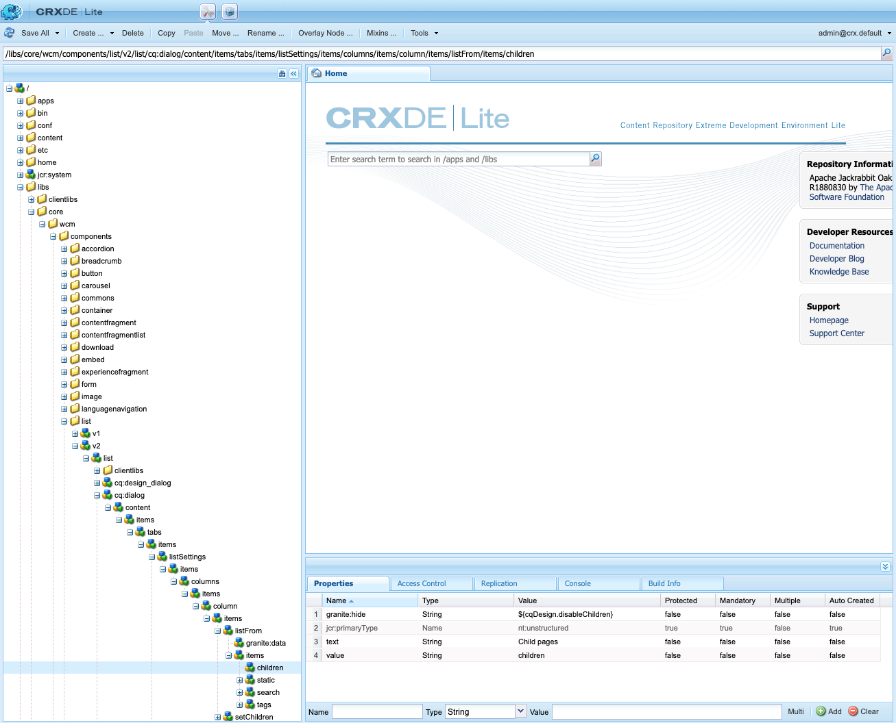

# 조건 숨기기 사용 {#using-hide-conditions}

숨기기 조건을 사용하여 구성 요소 리소스가 렌더링되는지 여부를 결정할 수 있습니다. 이 방법의 예로는 템플릿 작성자가 코어 구성 요소를 구성하는 경우입니다 [목록 구성 요소](https://experienceleague.adobe.com/docs/experience-manager-core-components/using/components/list.html) 에서 [템플릿 편집기](/help/sites-cloud/authoring/features/templates.md) 및 은 하위 페이지를 기반으로 목록을 작성하는 옵션을 비활성화하기로 합니다. 디자인 대화 상자에서 이 옵션을 비활성화하면 목록 구성 요소가 렌더링될 때 숨기기 조건이 평가되고 하위 페이지를 표시하는 옵션이 표시되지 않도록 속성이 설정됩니다.

## 개요 {#overview}

사용자가 원하는 옵션을 일부만 사용할 수 있는 다양한 옵션을 사용하면 대화 상자가 매우 복잡해질 수 있습니다. 이로 인해 사용자에게 압도적인 사용자 인터페이스 경험이 발생할 수 있습니다.

숨기기 조건을 사용하면 관리자, 개발자 및 슈퍼 사용자는 규칙 세트를 기반으로 리소스를 숨길 수 있습니다. 이 기능을 사용하면 작성자가 컨텐츠를 편집할 때 표시해야 하는 리소스를 결정할 수 있습니다.

>[!NOTE]
>
>표현식을 기반으로 리소스를 숨김해도 ACL 권한이 대체되지 않습니다. 컨텐츠는 편집 가능하지만 표시되지는 않습니다.

## 구현 및 사용 세부 정보 {#implementation-and-usage-details}

`com.adobe.granite.ui.components.FilteringResourceWrapper` 은(는) 의 존재 및 값에 따라 리소스를 필터링합니다 `granite:hide` 필터링할 필드에 있는 속성입니다. 구현 `/libs/cq/gui/components/authoring/dialog/dialog.jsp` 의 인스턴스를 포함합니다. `FilteringResourceWrapper.`

구현에서는 Granite를 사용합니다 [ELResolver API](https://helpx.adobe.com/experience-manager/6-5/sites/developing/using/reference-materials/granite-ui/api/jcr_root/libs/granite/ui/docs/server/el.html) 및 `cqDesign` ExpressionCustomizer를 통한 사용자 지정 변수입니다.

다음은 아래에 있는 디자인 노드의 숨기기 조건의 몇 가지 예입니다 `etc/design` 또는 컨텐츠 정책으로 사용할 수 있습니다.

```
${cqDesign.myProperty}
${!cqDesign.myProperty}
${cqDesign.myProperty == 'someText'}
${cqDesign.myProperty != 'someText'}
${cqDesign.myProperty == true}
${cqDesign.myProperty == true}
${cqDesign.property1 == 'someText' && cqDesign.property2 || cqDesign.property3 != 1 || header.myHeader}
```

숨기기 표현식을 정의할 때는 다음 사항에 주의하십시오.

* 속성이 발견되는 범위를 유효하게 표현해야 합니다(예: `cqDesign.myProperty`).
* 값은 읽기 전용입니다.
* 함수(필요한 경우)는 서비스가 제공한 특정 세트로 제한해야 합니다.

## 예 {#example}

숨기기 조건의 예는 AEM 및 [핵심 구성 요소](https://experienceleague.adobe.com/docs/experience-manager-core-components/using/introduction.html) 특히. 예를 들어 [목록 코어 구성 요소](https://experienceleague.adobe.com/docs/experience-manager-core-components/using/components/list.html) 다음에서 구현됨 [WKND 자습서입니다.](/help/implementing/developing/introduction/develop-wknd-tutorial.md)

[템플릿 편집기 사용](/help/sites-cloud/authoring/features/templates.md)템플릿 작성자는 디자인 대화 상자에서 페이지 작성자가 사용할 수 있는 목록 구성 요소의 옵션을 정의할 수 있습니다. 목록을 정적 목록, 하위 페이지 목록, 태그가 지정된 페이지 목록 등으로 허용할지 여부 등의 옵션입니다. 활성화하거나 비활성화할 수 있습니다.

템플릿 작성자가 하위 페이지 옵션을 비활성화하도록 선택하면 디자인 속성이 설정되고 숨기기 조건이 평가되어 페이지 작성자에 대해 옵션이 렌더링되지 않습니다.

1. 기본적으로 페이지 작성자는 목록 코어 구성 요소를 사용하여 옵션을 선택하여 하위 페이지를 사용하여 목록을 작성할 수 있습니다 **하위 페이지**.

   

1. 목록 코어 구성 요소의 디자인 대화 상자에서 템플릿 작성자는 옵션을 선택할 수 있습니다 **하위 항목 비활성화** 하위 페이지를 기반으로 목록을 생성하는 옵션이 페이지 작성자에게 표시되지 않도록 합니다.

   

1. 정책 노드는 `/conf/wknd/settings/wcm/policies/wknd/components/list` 속성 사용 `disableChildren` 설정 `true`.

   

1. 숨기기 조건은 `granite:hide` 대화 상자 속성 노드의 속성 `/libs/core/wcm/components/list/v2/list/cq:dialog/content/items/tabs/items/listSettings/items/columns/items/column/items/listFrom/items/children`

   

1. 다음 값 `disableChildren` 디자인 구성 및 표현식에서 가져옵니다. `${cqDesign.disableChildren}` 평가하기 `false`: 옵션이 구성 요소의 일부로 렌더링되지 않음을 의미합니다.

1. 옵션 **하위 페이지** 목록 구성 요소를 사용할 때 더 이상 페이지 작성자에 대해 렌더링되지 않습니다.

   
