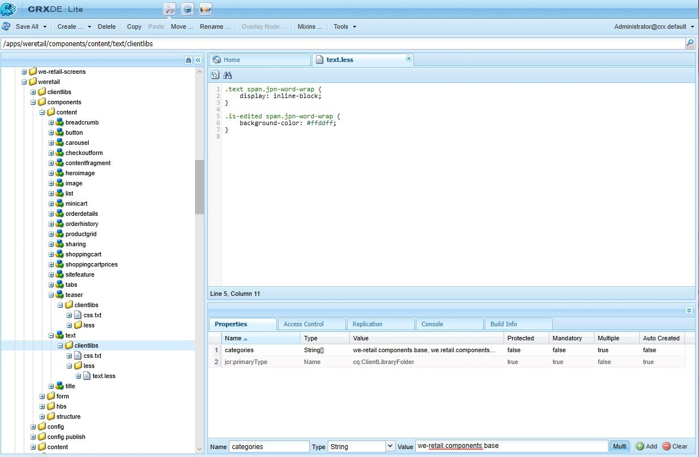
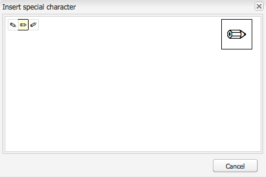

# 리치 텍스트 편집기 플러그인 구성 {#configure-the-rich-text-editor-plug-ins}

RTE 기능은 기능 속성이 있는 일련의 플러그인을 통해 사용할 수 있습니다. 하나 이상의 RTE 기능을 활성화하거나 비활성화하도록 기능 속성을 구성할 수 있습니다. 이 문서에서는 RTE 플러그인을 구체적으로 구성하는 방법에 대해 설명합니다.

다른 RTE 구성에 대한 자세한 내용은 [리치 텍스트 편집기 구성](/help/implementing/developing/extending/rich-text-editor.md)을 참조하십시오.

>[!NOTE]
>
>CRXDE Lite 작업을 할 때는 [!UICONTROL 모두 저장] 옵션을 사용하여 변경 사항을 정기적으로 저장하는 것이 좋습니다.

## 플러그인 활성화 및 기능 속성 구성 {#activateplugin}

플러그인을 활성화하려면 다음 단계를 수행합니다. 해당 노드가 없으므로 플러그인을 처음 구성할 때만 일부 단계가 필요합니다.

기본적으로 `format`, `link`, `list`, `justify` 및 `control` 플러그인과 모든 해당 기능이 RTE에서 활성화됩니다.

>[!NOTE]
>
>이 문서에서 중복을 방지하기 위해 각 `rtePlugins` 노드를 `<rtePlugins-node>`(으)로 참조합니다.

1. CRXDE Lite을 사용하여 프로젝트의 텍스트 구성 요소를 찾습니다.
1. RTE 플러그인을 구성하기 전에 `<rtePlugins-node>`의 부모 노드가 없는 경우 만듭니다.

   * 구성 요소에 따라 상위 노드는 다음과 같습니다.

      * `config: .../text/cq:editConfig/cq:inplaceEditing/config`
      * 대체 구성 노드: `.../text/cq:editConfig/cq:inplaceEditing/inplaceEditingTextConfig`
      * `text: .../text/dialog/items/tab1/items/text`

   * 유형: **jcr:primaryType** `cq:Widget`
   * 둘 다 다음 속성을 갖습니다.

      * **이름** `name`
      * **유형** `String`
      * **값** `./text`

1. 구성하려는 인터페이스에 따라 `<rtePlugins-node>` 노드가 없는 경우 만드십시오.

   * **이름** `rtePlugins`
   * **유형** `nt:unstructured`

1. 이 아래에서 활성화할 각 플러그인에 대한 노드를 만듭니다.

   * **유형** `nt:unstructured`
   * 필요한 플러그 인의 플러그 인 ID를 **이름**

플러그인을 활성화한 후 다음 지침에 따라 `features` 속성을 구성하십시오.

| | 모든 기능 활성화 | 몇 가지 특정 기능을 활성화합니다. | 모든 기능을 비활성화합니다. |
|---|---|---|---|
| 이름 | 기능 | 기능 | 기능 |
| 유형 | 문자열 | `String`(다중 문자열. Type을 `String`(으)로 설정하고 CRXDE Lite에서 `Multi` 클릭) | 문자열 |
| 값 | `*`(별표) | 하나 이상의 피쳐 값으로 설정합니다. | - |

## findreplace 플러그인 이해 {#findreplace}

`findreplace` 플러그인은 구성이 필요하지 않습니다. 그것은 즉시 작동합니다.

바꾸기 기능을 사용하면 찾기 문자열과 동시에 대체할 바꾸기 문자열을 입력해야 합니다. 단, 계속 찾기를 클릭하여 문자열을 대체하기 전에 검색할 수 있습니다. 찾기를 클릭한 후 바꾸기 문자열을 입력하면 검색은 텍스트 시작으로 재설정됩니다.

찾기를 클릭하면 찾기 및 바꾸기 대화 상자가 투명해지고, 바꾸기를 클릭하면 불투명해집니다. 이 동작을 통해 작성자는 대체될 텍스트를 검토할 수 있습니다. 사용자가 모두 바꾸기 를 클릭하면 대화 상자가 닫히고 교체된 항목 수가 표시됩니다.

## 붙여넣기 모드 구성 {#pastemodes}

RTE를 사용하는 경우 작성자는 다음 세 가지 모드 중 하나로 콘텐츠를 붙여넣을 수 있습니다.

* **브라우저 모드**: 브라우저의 기본 붙여넣기 구현을 사용하여 텍스트를 붙여넣습니다. 원하지 않는 마크업을 도입할 수 있으므로 권장되는 방법이 아닙니다.

* **일반 텍스트 모드**: 클립보드 내용을 일반 텍스트로 붙여넣습니다. [!DNL Experience Manager] 구성 요소에 삽입하기 전에 복사한 콘텐츠에서 스타일 및 서식의 모든 요소를 제거합니다.

* **MS Word 모드**: MS Word에서 복사할 때 서식을 지정하여 표를 포함한 텍스트를 붙여넣습니다. 웹 페이지나 MS Excel과 같은 다른 원본에서 텍스트를 복사하여 붙여넣을 수 없으며 부분 서식만 유지합니다.

### RTE 도구 모음에서 사용할 수 있는 붙여넣기 옵션 구성  {#configure-paste-options-available-on-the-rte-toolbar}

RTE 도구 모음에서 다음 세 가지 아이콘 중 일부, 전체 또는 일부를 작성자에게 제공할 수 있습니다.

* **[!UICONTROL 붙여넣기(Ctrl+V)]**: 위의 세 가지 붙여넣기 모드 중 하나에 대응하도록 미리 구성할 수 있습니다.

* **[!UICONTROL 텍스트로 붙여넣기]**: 일반 텍스트 모드 기능을 제공합니다.

* **[!UICONTROL Word에서 붙여넣기]**: MS Word 모드 기능을 제공합니다.

필요한 아이콘을 표시하도록 RTE를 구성하려면 다음 단계를 따르십시오.

1. 구성 요소로 이동합니다(예: `/apps/<myProject>/components/text`).
1. `rtePlugins/edit` 노드로 이동합니다. 노드가 없으면 [플러그 인 활성화](#activateplugin)를 참조하십시오.
1. `edit` 노드에 `features` 속성을 만들고 하나 이상의 기능을 추가합니다. 모든 변경 사항을 저장합니다.

### 붙여넣기(Ctrl+V) 아이콘과 바로 가기의 비헤이비어 구성 {#configure-the-behavior-of-the-paste-ctrl-v-icon-and-shortcut}

다음 단계를 사용하여 **[!UICONTROL 붙여넣기(Ctrl+V)]** 아이콘의 동작을 미리 구성할 수 있습니다. 이 구성은 작성자가 콘텐츠를 붙여넣을 때 사용하는 키보드 단축키 Ctrl+V의 비헤이비어도 정의합니다.

구성에서는 다음 세 가지 유형의 사용 사례를 사용할 수 있습니다.

* 브라우저의 기본 붙여넣기 구현을 사용하여 텍스트를 붙여넣습니다. 원하지 않는 마크업을 도입할 수 있으므로 권장되는 방법이 아닙니다. 아래 `browser`을(를) 사용하여 구성되었습니다.

* 클립보드 내용을 일반 텍스트로 붙여넣습니다. [!DNL Experience Manager] 구성 요소에 삽입하기 전에 복사한 콘텐츠에서 스타일 및 서식의 모든 요소를 제거합니다. 아래 `plaintext`을(를) 사용하여 구성되었습니다.

* MS Word에서 복사할 때 서식을 사용하여 표를 포함한 텍스트를 붙여넣습니다. 웹 페이지나 MS Excel과 같은 다른 원본에서 텍스트를 복사하여 붙여넣을 수 없으며 부분 서식만 유지합니다. 아래 `wordhtml`을(를) 사용하여 구성되었습니다.

1. 구성 요소에서 `<rtePlugins-node>/edit` 노드로 이동합니다. 노드가 없는 경우 노드를 만듭니다. 자세한 내용은 [플러그 인 활성화](#activateplugin)를 참조하십시오.
1. `edit` 노드에서 다음 세부 정보를 사용하여 속성을 만듭니다.

   * **이름** `defaultPasteMode`
   * **유형** `String`
   * **값**&#x200B;은(는) `browser`, `plaintext` 또는 `wordhtml` 모드 중 필요한 붙여넣기 모드 중 하나입니다.

### 콘텐츠를 붙여넣을 때 허용되는 형식 구성 {#pasteformats}

[!DNL Microsoft Word]과(와) 같은 다른 프로그램에서 [!DNL Experience Manager]에 붙여넣을 때 몇 가지 스타일을 명시적으로 허용하도록 Microsoft-Word로 붙여넣기(`paste-wordhtml`) 모드를 추가로 구성할 수 있습니다.

예를 들어 [!DNL Experience Manager]에서 붙여넣을 때 굵은 서식과 목록만 허용해야 하는 경우 다른 서식을 필터링할 수 있습니다. 이를 구성 가능한 붙여넣기 필터링이라고 하며, 두 작업 모두에 대해 수행할 수 있습니다.

* [텍스트](#pastemodes)
* [링크](#linkstyles)

링크의 경우 자동으로 수락되는 프로토콜을 정의할 수도 있습니다.

다른 프로그램에서 텍스트를 [!DNL Experience Manager]에 붙여넣을 때 허용되는 형식을 구성하려면 다음 작업을 수행하십시오.

1. 구성 요소에서 `<rtePlugins-node>/edit` 노드로 이동합니다. 노드가 없는 경우 노드를 만듭니다. 자세한 내용은 [플러그 인 활성화](#activateplugin)를 참조하세요.
1. `edit` 노드 아래에 노드를 만들어 HTML 붙여넣기 규칙을 유지합니다.

   * **이름** `htmlPasteRules`
   * **유형** `nt:unstructured`

1. 허용되는 기본 형식에 대한 세부 정보를 보유하려면 `htmlPasteRules` 아래에 노드를 만드십시오.

   * **이름** `allowBasics`
   * **유형** `nt:unstructured`

1. 허용되는 개별 형식을 제어하려면 `allowBasics` 노드에 다음 속성 중 하나 이상을 만듭니다.

   * **이름** `bold`
   * **이름** `italic`
   * **이름** `underline`
   * **이름** `anchor`(링크 및 명명된 앵커 모두)
   * **이름** `image`

   모든 속성은 **Type** `Boolean`이므로 해당 **Value**&#x200B;에서 확인 표시를 선택하거나 제거하여 기능을 활성화하거나 비활성화할 수 있습니다.

   >[!NOTE]
   >
   >명시적으로 정의하지 않은 경우 true라는 기본값이 사용되고 형식이 허용됩니다.

1. `htmlPasteRules` 노드에도 적용되는 다양한 다른 속성이나 노드를 사용하여 다른 형식을 정의할 수도 있습니다.

| 속성 | 유형 | 설명 |
|--- |--- |--- |
| `allowBlockTags` | `String` | 허용되는 블록 태그 목록을 정의합니다. 몇 가지 가능한 블록 태그에는 헤드라인 (h1, h2, h3), 단락 (p), 목록 (ol, ul), 테이블 (table) 이 포함됩니다. |
| `fallbackBlockTag` | `String` | `allowBlockTags`에 포함되지 않은 블록 태그가 있는 블록에 사용되는 블록 태그를 정의합니다. 일반적으로 `p`이면 충분합니다. |
| `table` | `nt:unstructured` | 표를 붙여넣을 때의 동작을 정의합니다. 테이블 붙여넣기가 허용되는지 여부를 정의하려면 이 노드에 allow(유형 부울) 속성이 있어야 합니다. allow가 false로 설정된 경우 ignoreMode(문자열 유형) 속성을 지정하여 붙여넣은 테이블 콘텐츠가 처리되는 방식을 정의해야 합니다. ignoreMode의 유효한 값은 테이블 콘텐츠를 제거하기 위한 `remove`과(와) 테이블 셀을 단락으로 바꾸기 위한 `paragraph`입니다. |
| `list` | `nt:unstructured` | 목록을 붙여넣을 때의 동작을 정의합니다. 목록 붙여넣기를 허용할지 여부를 정의하려면 `allow` 속성(유형 부울)이 있어야 합니다. `allow`이(가) `false`(으)로 설정된 경우 속성 `ignoreMode`(유형 `String`)을(를) 지정하여 붙여 넣은 목록 콘텐츠를 처리하는 방법을 정의합니다. ignoreMode의 유효한 값은 목록 콘텐츠를 제거하는 `remove`과(와) 목록 항목을 단락으로 변환하는 `paragraph`입니다. |

올바른 `htmlPasteRules` 구조의 예는 다음과 같습니다.

```xml
"htmlPasteRules": {
    "allowBasics": {
        "italic": true,
        "link": true
    },
    "allowBlockTags": [
        "p", "h1", "h2", "h3"
    ],
    "list": {
        "allow": false,
        "ignoreMode": "paragraph"
    },
    "table": {
        "allow": true,
        "ignoreMode": "paragraph"
    }
}
```

1. 모든 변경 사항을 저장합니다.

## 텍스트 스타일 구성 {#textstyles}

작성자는 스타일을 적용하여 텍스트 부분의 모양을 변경할 수 있습니다. 스타일은 CSS 스타일 시트에서 사전 정의한 CSS 클래스를 기반으로 합니다. CSS 클래스를 참조할 수 있도록 `class` 특성을 사용하여 `span` 태그로 스타일이 지정된 콘텐츠가 묶여 있습니다. 예:

`<span class=monospaced>Monospaced Text Here</span>`

스타일 플러그인을 처음 활성화하면 기본 스타일을 사용할 수 없습니다. 팝업 목록이 비어 있습니다. 작성자에게 스타일을 제공하려면 다음 작업을 수행하십시오.

* 스타일 드롭다운 선택기를 활성화합니다.
* 스타일 시트의 위치를 하나 이상 지정합니다.
* 스타일 팝업 목록에서 선택할 수 있는 개별 스타일을 지정합니다.

나중에 다시 구성할 경우 스타일을 더 추가하려면 지침만 따라 새 스타일 시트를 참조하고 추가 스타일을 지정하십시오.

>[!NOTE]
>
>[표 또는 표 셀](configure-rich-text-editor-plug-ins.md#tablestyles)에 대한 스타일을 정의할 수도 있습니다. 이러한 구성에는 별도의 절차가 필요합니다.

### 스타일 드롭다운 선택기 목록 활성화 {#styleselectorlist}

이 작업은 스타일 플러그인을 활성화하여 수행됩니다.

1. 구성 요소에서 `<rtePlugins-node>/styles` 노드로 이동합니다. 노드가 없는 경우 노드를 만듭니다. 자세한 내용은 [플러그 인 활성화](#activateplugin)를 참조하세요.
1. `styles` 노드에서 `features` 속성을 만듭니다.

   * **이름** `features`
   * **유형** `String`
   * **값** `*`(별표)

1. 모든 변경 사항을 저장합니다.

>[!NOTE]
>
>스타일 플러그인을 활성화하면 편집 대화 상자에 스타일 드롭다운 목록이 표시됩니다. 그러나 스타일이 구성되지 않아 목록이 비어 있습니다.

### 스타일 시트 위치 지정 {#locationofstylesheet}

그런 다음 참조할 스타일 시트의 위치를 지정합니다.

1. 텍스트 구성 요소의 루트 노드(예: `/apps/<myProject>/components/text`)로 이동합니다.
1. `<rtePlugins-node>`의 부모 노드에 `externalStyleSheets` 속성을 추가하십시오.

   * **이름** `externalStyleSheets`
   * **유형** `String[]`(다중 문자열; CRXDE에서 **다중** 클릭)
   * **값** 포함할 모든 스타일시트의 경로와 파일 이름입니다. 저장소 경로를 사용합니다.

   >[!NOTE]
   >
   >나중에 언제든지 추가 스타일 시트에 참조를 추가할 수 있습니다.

1. 모든 변경 사항을 저장합니다.

대화 상자(클래식 UI)에서 RTE를 사용할 때 리치 텍스트 편집에 최적화된 스타일 시트를 지정할 수 있습니다. 기술적인 제한 사항으로 인해 CSS 컨텍스트가 편집기에서 손실되므로 이 컨텍스트를 에뮬레이션하여 WYSIWYG 경험을 개선할 수 있습니다.

리치 텍스트 편집기에서 ID가 `CQrte`인 컨테이너 DOM 요소를 사용하여 보고 편집할 수 있는 다양한 스타일을 제공합니다.

```css
#CQ td {
// defines the style for viewing
 }
```

```css
#CQrte td {
 // defines the style for editing
 }
```

### 팝업 목록에서 사용 가능한 스타일 지정 {#stylesindropdown}

1. [스타일 드롭다운 선택기 사용](#styleselectorlist)에서 만든 대로 구성 요소 정의에서 `<rtePlugins-node>/styles` 노드로 이동합니다.
1. `styles` 노드 아래에서 사용 가능한 목록을 보유할 노드(`styles`)를 만듭니다.

   * **이름** `styles`
   * **유형** `cq:WidgetCollection`

1. 개별 스타일을 나타내는 노드를 `styles` 노드 아래에 만듭니다.

   * **이름**, 이름을 지정할 수 있지만 스타일에 적합해야 합니다.
   * **유형** `nt:unstructured`

1. CSS 클래스를 참조하려면 이 노드에 속성 `cssName`을(를) 추가하십시오.

   * **이름** `cssName`
   * **유형** `String`
   * **값** CSS 클래스의 이름(앞에 &#39;.&#39;가 없음); 예: `.cssClass` 대신 `cssClass`)

1. 속성 `text`을(를) 같은 노드에 추가합니다. 이렇게 하면 선택 상자에 표시되는 텍스트가 정의됩니다.

   * **이름** `text`
   * **유형** `String`
   * 스타일에 대한 **값** 설명입니다. 스타일 드롭다운 선택 상자에 표시됩니다.

1. 변경 사항을 저장합니다.

   필요한 각 스타일에 대해 위의 단계를 반복합니다.

### 일본어로 단어 분리를 최적화하도록 RTE 구성 {#jpwordwrap}

일본어 콘텐츠를 작성하기 위해 [!DNL Experience Manager]을(를) 사용하는 작성자는 줄바꿈이 필요 없는 줄 바꿈을 방지하기 위해 문자에 스타일을 적용할 수 있습니다. 이를 통해 작성자는 원하는 위치에서 문장을 끊도록 할 수 있다. 이 기능의 스타일은 CSS 스타일 시트에 사전 정의된 CSS 클래스를 기반으로 합니다.

작성자가 일본어 텍스트에 적용할 수 있는 스타일을 만들려면 다음 단계를 수행합니다.

1. 스타일 노드 아래에 노드를 만듭니다. [스타일 지정](#stylesindropdown)을 참조하세요.
   * 이름: `jpn-word-wrap`
   * 유형: `nt:unstructure`

1. CSS 클래스를 참조하려면 노드에 `cssName` 속성을 추가하십시오. 이 클래스 이름은 일본어 자동 줄바꿈 기능에 대해 예약된 이름입니다.
   * 이름: `cssName`
   * 유형: `String`
   * 값: `jpn-word-wrap`(앞에 `.`이(가) 없음)

1. 속성 텍스트를 동일한 노드에 추가합니다. 값은 작성자가 스타일을 선택할 때 보게 되는 스타일의 이름입니다.
   * 이름: `text`
*유형: `String`
   * 값: `Japanese word-wrap`

1. 스타일 시트를 만들고 해당 경로를 지정합니다. [스타일시트의 위치 지정](#locationofstylesheet)을 참조하십시오. 스타일시트에 다음 내용을 추가합니다. 원하는 대로 배경색을 변경합니다.

   ```css
   .text span.jpn-word-wrap {
       display:inline-block;
   }
   .is-edited span.jpn-word-wrap {
       background-color: #ffddff;
   }
   ```

   작성자가 일본어 자동 줄 바꿈 기능을 사용할 수 있도록 하는 

## 단락 형식 구성 {#paraformats}

RTE로 작성된 모든 텍스트는 블록 태그 내에 배치됩니다. 기본값은 `<p>`입니다. `paraformat` 플러그인을 활성화하여 드롭다운 선택 목록을 사용하여 단락에 할당할 수 있는 추가 블록 태그를 지정합니다. 단락 형식은 올바른 블록 태그를 할당하여 단락 유형을 결정합니다. 작성자는 형식 선택기를 사용하여 해당 형식을 선택하고 할당할 수 있습니다. 예제 블록 태그에는 특히 표준 단락 &lt;p>와 제목 &lt;h1>, &lt;h2> 등이 포함됩니다.

>[!CAUTION]
>
>이 플러그인은 목록 또는 표와 같이 구조가 복잡한 컨텐츠에 적합하지 않습니다.

>[!NOTE]
>
>블록 태그(예: `<hr>` 태그)를 단락에 할당할 수 없는 경우 `paraformat` 플러그인의 올바른 사용 사례가 아닙니다.

단락 서식 플러그인을 처음 활성화하면 기본 단락 서식을 사용할 수 없습니다. 팝업 목록이 비어 있습니다. 작성자에게 단락 형식을 제공하려면 다음을 수행합니다.

* [!UICONTROL 형식] 팝업 선택기 목록을 사용하도록 설정합니다.
* 팝업 메뉴에서 단락 형식으로 선택할 수 있는 블록 태그를 지정합니다.

나중에 다시 구성할 경우 형식을 더 추가하려면 관련 지침만 따르십시오.

### 형식 드롭다운 선택기 활성화 {#formatselectorlist}

`paraformat` 플러그인을 활성화하려면 다음 단계를 수행합니다.

1. 구성 요소에서 `<rtePlugins-node>/paraformat` 노드로 이동합니다. 노드가 없는 경우 노드를 만듭니다. 자세한 내용은 [플러그 인 활성화](#activateplugin)를 참조하세요.
1. `paraformat` 노드에서 `features` 속성을 만듭니다.

   * **이름** `features`
   * **유형** `String`
   * **값** `*`(별표)

>[!NOTE]
>
>플러그인을 더 이상 구성하지 않으면 사용할 수 있는 기본 형식은 단락(`<p>`), 제목 1(`<h1>`), 제목 2(`<h2>`), 제목 3(`<h3>`)입니다.

>[!CAUTION]
>
>RTE의 단락 서식을 구성할 때 서식 옵션으로 단락 태그 &lt;p>를 제거하지 마십시오. `<p>` 태그가 제거되면 추가 형식이 구성되어 있어도 콘텐츠 작성자는 [!UICONTROL 단락 형식] 옵션을 선택할 수 없습니다.

### 사용 가능한 단락 형식 지정 {#paraformatsindropdown}

단락 형식은 다음 방법으로 선택할 수 있습니다.

1. [형식 드롭다운 선택기 사용](#styleselectorlist)에서 만든 대로 구성 요소 정의에서 `<rtePlugins-node>/paraformat` 노드로 이동합니다.
1. `paraformat` 노드 아래에서 형식 목록을 보관할 노드를 만듭니다.

   * **이름** `formats`
   * **유형** `cq:WidgetCollection`

1. `formats` 노드 아래에 노드를 만드십시오. 여기에는 개별 형식에 대한 세부 정보가 들어 있습니다.

   * **이름**, 이름을 지정할 수 있지만, 형식(예: myparagraph, myheading1)에 적합해야 합니다.
   * **유형** `nt:unstructured`

1. 이 노드에 속성을 추가하여 사용된 블록 태그를 정의합니다.

   * **이름** `tag`
   * **유형** `String`
   * **값** 형식의 블록 태그입니다(예: p, h1, h2 등).

     구분 꺾쇠 괄호는 입력할 필요가 없습니다.

1. 동일한 노드에 설명 텍스트가 드롭다운 목록에 표시되도록 다른 속성을 추가합니다.

   * **이름** `description`
   * **유형** `String`
   * **값** 이 형식에 대한 설명 텍스트입니다(예: 단락, 제목 1, 제목 2 등). 이 텍스트는 서식 선택 목록에 표시됩니다.

1. 변경 사항을 저장합니다.

   필요한 각 형식에 대해 단계를 반복합니다.

>[!CAUTION]
>
사용자 지정 형식을 정의하면 기본 형식(`<p>`, `<h1>`, `<h2>` 및 `<h3>`)이 제거됩니다. `<p>` 형식이 기본 형식이므로 다시 만드십시오.

## 특수 문자 구성 {#spchar}

표준 [!DNL Experience Manager] 설치에서 특수 문자(`specialchars`)에 대해 `misctools` 플러그인을 활성화하면 저작권 및 상표 기호와 같은 기본 선택을 즉시 사용할 수 있습니다.

고유한 문자 또는 전체 시퀀스를 정의하여 문자 선택을 사용할 수 있도록 RTE를 구성할 수 있습니다.

>[!CAUTION]
>
특수 문자를 추가하면 기본 선택이 무시됩니다. 필요한 경우 선택 항목에서 이러한 문자를 재정의합니다.

### 단일 문자 정의 {#definesinglechar}

1. 구성 요소에서 `<rtePlugins-node>/misctools` 노드로 이동합니다. 노드가 없는 경우 노드를 만듭니다. 자세한 내용은 [플러그 인 활성화](#activateplugin)를 참조하세요.
1. `misctools` 노드에서 `features` 속성을 만듭니다.

   * **이름** `features`
   * **유형** `String[]`
   * **값** `specialchars`

         (또는 이 플러그인의 모든 기능을 적용하는 경우 `String / *`)

1. `misctools`에서 특수 문자 구성을 포함하는 노드를 만듭니다.

   * **이름** `specialCharsConfig`
   * **유형** `nt:unstructured`

1. `specialCharsConfig`에서 문자 목록을 보관할 다른 노드를 만드십시오.

   * **이름** `chars`
   * **유형** `nt:unstructured`

1. `chars` 아래에 개별 문자 정의를 포함하는 노드를 추가하십시오.

   * **이름** 이름을 지정할 수 있지만 반과 같은 문자를 포함해야 합니다.
   * **유형** `nt:unstructured`

1. 이 노드에 다음 속성을 추가합니다.

   * **이름** `entity`
   * **유형** `String`
   * **값** 필요한 문자의 HTML 표현입니다(예: 소수 반분의 경우 `&189;`).

1. 변경 사항을 저장합니다.

CRXDE에서는 속성이 저장되면 표시된 문자가 표시됩니다. 절반의 예 아래를 참조하십시오. 작성자가 사용할 수 있는 특수 문자를 더 많이 만들려면 위의 단계를 반복합니다.


### 문자 범위 정의 {#definerangechar}

1. [단일 문자 정의](#definesinglechar)에서 1~3단계를 사용합니다.
1. `chars` 아래에 문자 범위의 정의를 포함하는 노드를 추가하십시오.

   * **이름** 이름을 지정할 수 있지만 연필 등 문자 범위를 반영해야 합니다.
   * **유형** `nt:unstructured`

1. 이 노드(특수 문자 범위에 따라 이름이 지정됨) 아래에 다음 두 속성을 추가합니다.

   * **이름** `rangeStart`
     **유형** `Long`
     **값** 범위에 있는 첫 번째 문자의 [유니코드](https://unicode.org/) 표시(십진수)

   * **이름** `rangeEnd`
     **유형** `Long`
     **값** 범위에 있는 마지막 문자의 [유니코드](https://unicode.org/) 표시(십진수)

1. 변경 사항을 저장합니다.

   예를 들어 9998 - 10000 범위의 범위를 정의하면 다음과 같은 문자가 제공됩니다.

   

   *그림: CRXDE에서 RTE에서 사용할 수 있는 문자 범위를 정의합니다*

   

## 표 스타일 구성 {#tablestyles}

스타일은 일반적으로 텍스트에 적용되지만, 별도의 스타일 세트는 표 또는 일부 표 셀에도 적용할 수 있습니다. 이러한 스타일은 작성자가 셀 속성이나 표 속성 대화 상자의 스타일 선택기 상자에서 사용할 수 있습니다. 표준 표 구성 요소가 아닌 텍스트 구성 요소(또는 파생) 내에서 표를 편집할 때 스타일을 사용할 수 있습니다.

>[!NOTE]
>
클래식 UI에 대해서만 표 및 셀의 스타일을 정의할 수 있습니다.

>[!NOTE]
>
RTE 구성 요소에서 표를 복사하고 붙여넣는 작업은 브라우저에 따라 다릅니다. 모든 브라우저에 대해 기본적으로 지원되지 않습니다. 표 구조 및 브라우저에 따라 다양한 결과를 얻을 수 있습니다. 예를 들어 클래식 UI 및 Touch UI의 Mozilla Firefox에서 RTE 구성 요소로 표를 복사하여 붙여넣으면 표의 레이아웃이 유지되지 않습니다.

1. 구성 요소 내에서 `<rtePlugins-node>/table` 노드로 이동합니다. 노드가 없는 경우 노드를 만듭니다. 자세한 내용은 [플러그 인 활성화](#activateplugin)를 참조하세요.
1. `table` 노드에서 `features` 속성을 만듭니다.

   * **이름** `features`
   * **유형** `String`
   * **값** `*`

   >[!NOTE]
   >
   모든 테이블 기능을 사용하지 않으려면 `features` 속성을 다음과 같이 만들 수 있습니다.
   >
   * **유형** `String[]`
   >
   * 필요에 따라 다음 값 중 하나 또는 둘 다 **값**&#x200B;입니다.
   * 스타일을 포함하여 표 속성을 편집할 수 있도록 `table`합니다.
   * 스타일을 포함한 셀 속성을 편집할 수 있도록 `cellprops`.

1. CSS 스타일 시트의 위치를 정의하여 해당 위치를 참조합니다. [스타일시트의 위치 지정](#locationofstylesheet)을 참조하십시오. 이는 [텍스트에 대한 스타일을 정의할 때와 동일합니다](#textstyles). 다른 스타일을 정의한 경우 위치를 정의할 수 있습니다.
1. `table` 노드 아래에서 필요에 따라 다음 노드를 만듭니다.

   * 전체 표에 대한 스타일을 정의하려면(**[!UICONTROL 표 속성]**&#x200B;에서 사용 가능):

      * **이름** `tableStyles`
      * **유형** `cq:WidgetCollection`

   * 개별 셀의 스타일을 정의하려면(**[!UICONTROL 셀 속성]**&#x200B;에서 사용 가능),

      * **이름** `cellStyles`
      * **유형** `cq:WidgetCollection`

1. 개별 스타일을 나타내는 노드를 만들어 `tableStyles` 또는 `cellStyles` 노드 아래에 적절하게 만듭니다.

   * **이름** 이름을 지정할 수 있지만 스타일을 반영해야 합니다.
   * **유형** `nt:unstructured`

1. 이 노드에서 속성을 만듭니다.

   * 참조되는 CSS 스타일을 정의하려면

      * **이름** `cssName`
      * **유형** `String`
      * **값** CSS 클래스 이름(앞에 `.`이 없음, 예: `.cssClass` 대신 `cssClass`)

   * 팝업 선택기에 표시할 설명 텍스트를 정의하려면

      * **이름** `text`
      * **유형** `String`
      * 선택 목록에 표시할 텍스트 **값**

1. 모든 변경 사항을 저장합니다.

필요한 각 스타일에 대해 위의 단계를 반복합니다.

### 접근성을 위해 테이블에서 숨겨진 헤더 구성 {#hiddenheader}

열 머리글에 시각적 텍스트 없이 데이터 표를 만들 수도 있습니다. 머리글의 용도가 다른 열과 열의 시각적 관계에 의해 암시된다고 가정할 때 이러한 경우 열 머리글에 데이터 표를 만들 수 있습니다. 이 경우 다양한 요구를 가진 독자가 열의 목적을 이해할 수 있도록 화면 판독기 및 기타 보조 기술을 사용할 수 있도록 머리글 셀의 셀 내에 숨겨진 내부 텍스트를 제공해야 합니다.

이러한 시나리오에서 접근성을 개선하기 위해 RTE는 숨겨진 헤더 셀을 지원합니다. 또한 표의 숨겨진 헤더와 관련된 구성 설정도 제공합니다. 이러한 설정을 사용하면 편집 및 미리보기 모드에서 숨겨진 헤더에 CSS 스타일을 적용할 수 있습니다. 작성자가 편집 모드에서 숨겨진 헤더를 식별할 수 있도록 코드에 다음 매개 변수를 포함하십시오.

* `hiddenHeaderEditingCSS`: RTE를 편집할 때 hidden-header 셀에 적용되는 CSS 클래스의 이름을 지정합니다.
* `hiddenHeaderEditingStyle`: RTE를 편집할 때 숨겨진 헤더 셀에 적용되는 스타일 문자열을 지정합니다.

코드에서 CSS와 스타일 문자열을 모두 지정하는 경우 CSS 클래스는 스타일 문자열보다 우선하며 스타일 문자열에서 변경한 모든 구성 변경 사항을 덮어쓸 수 있습니다.

작성자가 미리보기 모드에서 숨겨진 헤더에 CSS를 적용할 수 있도록 코드에 다음 매개 변수를 포함할 수 있습니다.

* `hiddenHeaderClassName`: 미리 보기 모드에서 숨겨진 헤더 셀에 적용되는 CSS 클래스의 이름을 지정합니다.
* `hiddenHeaderStyle`: 미리 보기 모드에서 숨겨진 헤더 셀에 적용되는 스타일 문자열을 지정합니다.

코드에서 CSS와 스타일 문자열을 모두 지정하는 경우 CSS 클래스는 스타일 문자열보다 우선하며 스타일 문자열에서 변경한 모든 구성 변경 사항을 덮어쓸 수 있습니다.

## 맞춤법 검사기 사전 추가 {#adddict}

맞춤법 검사 플러그인이 활성화되면 RTE는 각 해당 언어에 대한 사전을 사용합니다. 그런 다음 하위 트리의 언어 속성을 사용하거나 URL에서 언어를 추출하여 웹 사이트의 언어에 따라 선택합니다(예: ). `/en/` 분기는 영어로, `/de/` 분기는 독일어로 확인됩니다.

>[!NOTE]
>
&quot;맞춤법 검사 실패&quot; 메시지. 설치되지 않은 언어에 대해 검사를 시도하면 표시됩니다.

표준 Experience Manager 설치에는 다음에 대한 사전이 포함되어 있습니다.

* 미국 영어(en_us)
* 영국 영어(en_gb)

>[!NOTE]
>
표준 사전은 적절한 ReadMe 파일과 함께 `/libs/cq/spellchecker/dictionaries`에 있습니다. 파일을 수정하지 마십시오.

필요한 경우 사전을 더 추가하려면 다음 단계를 수행합니다.

1. [https://extensions.openoffice.org/](https://extensions.openoffice.org/) 페이지로 이동합니다.
1. 필요한 언어를 선택하고 맞춤법 정의가 있는 ZIP 파일을 다운로드합니다. 파일 시스템에서 아카이브의 컨텐츠를 추출합니다.

   >[!CAUTION]
   >
   OpenOffice.org v2.0.1 또는 이전 버전에 대한 `MySpell` 형식의 사전만 지원됩니다. 이제 사전이 아카이브 파일이므로 다운로드 후 아카이브를 확인하는 것이 좋습니다.

1. .aff 및 .dic 파일을 찾습니다. 파일 이름을 소문자로 유지합니다. 예: `de_de.aff` 및 `de_de.dic`.
1. `/apps/cq/spellchecker/dictionaries`의 저장소에 .aff 및 .dic 파일을 로드합니다.

>[!NOTE]
>
RTE 맞춤법 검사기는 온디맨드로 사용할 수 있습니다. 텍스트를 입력할 때 자동으로 실행되지 않습니다.
>
맞춤법 검사기를 실행하려면 도구 모음에서 맞춤법 검사기 버튼을 선택합니다. RTE는 단어의 맞춤법을 검사하고 맞춤법이 틀린 단어를 강조 표시합니다.
>
맞춤법 검사기에서 제시하는 변경 내용을 통합하면 텍스트 상태가 변경되고 맞춤법이 틀린 단어가 더 이상 강조 표시되지 않습니다. 맞춤법 검사기를 실행하려면 맞춤법 검사기 버튼을 다시 선택합니다.

## 실행 취소 및 재실행 작업에 대한 내역 크기 구성 {#undohistory}

RTE를 사용하면 작성자가 몇 가지 마지막 편집 내용을 실행 취소하거나 다시 실행할 수 있습니다. 기본적으로 기록에 50개의 편집 내용이 저장됩니다. 필요에 따라 이 값을 구성할 수 있습니다.

1. 구성 요소 내에서 `<rtePlugins-node>/undo` 노드로 이동합니다. 존재하지 않는 경우 이러한 노드를 만듭니다. 자세한 내용은 [플러그 인 활성화](#activateplugin)를 참조하세요.
1. `undo` 노드에서 속성을 만듭니다.

   * **이름** `maxUndoSteps`
   * **유형** `Long`
   * **값** 기록에 저장할 실행 취소 단계 수입니다. 기본값은 50입니다. `0`을(를) 사용하여 실행 취소/다시 실행을 완전히 비활성화하십시오.

1. 변경 사항을 저장합니다.

## 탭 크기 구성 {#tabsize}

텍스트 내에서 탭 문자를 누르면 사전 정의된 수의 공백이 삽입됩니다. 기본적으로 이는 구분되지 않는 공백 3개와 공백 1개입니다.

탭 크기를 정의하려면 다음을 수행합니다.

1. 구성 요소에서 `<rtePlugins-node>/keys` 노드로 이동합니다. 노드가 없는 경우 노드를 만듭니다. 자세한 내용은 [플러그 인 활성화](#activateplugin)를 참조하세요.
1. `keys` 노드에서 속성을 만듭니다.

   * **이름** `tabSize`
   * **유형** `String`
   * **값** 테이블에 사용할 공백 문자 수입니다.

1. 변경 사항을 저장합니다.

## 들여쓰기 여백 설정 {#indentmargin}

들여쓰기가 활성화되어 있으면(기본값) 들여쓰기 크기를 정의할 수 있습니다.

>[!NOTE]
>
이 들여쓰기 크기는 텍스트의 단락(블록)에만 적용되며 실제 목록의 들여쓰기에는 영향을 주지 않습니다.

1. 구성 요소 내에서 `<rtePlugins-node>/lists` 노드로 이동합니다. 존재하지 않는 경우 이러한 노드를 만듭니다. 자세한 내용은 [플러그 인 활성화](#activateplugin)를 참조하세요.
1. `lists` 노드에서 `identSize` 매개 변수를 만듭니다.

   * **이름**: `identSize`
   * **유형**: `Long`
   * **값**: 들여쓰기 여백에 필요한 픽셀 수입니다.

## 편집 가능한 공간의 높이 구성 {#editablespace}

구성 요소 대화 상자 내에 표시되는 편집 가능한 공간의 높이를 정의할 수 있습니다. 이 구성은 대화 상자에서 RTE를 사용할 때만 적용할 수 있습니다. 대화 상자 창의 높이는 변경되지 않습니다.

1. `../items/text` 노드의 구성 요소에 대한 대화 상자 정의에서 속성을 만듭니다.

   * **이름** `height`
   * **유형** `Long`
   * **값** 편집 캔버스의 높이(픽셀 단위)입니다.

1. 변경 사항을 저장합니다.

## 링크의 스타일 및 프로토콜 구성 {#linkstyles}

[!DNL Experience Manager]에 링크를 추가할 때 사용할 CSS 스타일과 프로토콜을 자동으로 적용할 수 있습니다. 다른 프로그램의 [!DNL Experience Manager]에 링크를 추가하는 방법을 구성하려면 HTML 규칙을 정의합니다.

1. CRXDE Lite을 사용하여 프로젝트의 텍스트 구성 요소를 찾습니다.
1. `<rtePlugins-node>`과(와) 동일한 수준에 노드를 만듭니다. 즉, `<rtePlugins-node>`의 상위 노드 아래에 노드를 만듭니다.

   * **이름** `htmlRules`
   * **유형** `nt:unstructured`

   >[!NOTE]
   >
   `../items/text` 노드에 속성이 있습니다.
   >
   * **이름** `xtype`
   * **유형** `String`
   * **값** `richtext`
   >
   `../items/text` 노드의 위치는 대화 상자의 구조에 따라 다를 수 있습니다. 두 가지 예는 `/apps/myProject>/components/text/dialog/items/text` 및 `/apps/<myProject>/components/text/dialog/items/panel/items/text`입니다.

1. `htmlRules`에서 노드를 만듭니다.

   * **이름** `links`
   * **유형** `nt:unstructured`

1. `links` 노드 아래에서 필요에 따라 속성을 정의합니다.

   * 내부 링크에 대한 CSS 스타일:

      * **이름** `cssInternal`
      * **유형** `String`
      * **값** 앞에 &#39;.&#39;가 없는 CSS 클래스의 이름입니다.; 예: `.cssClass` 대신 `cssClass`)

   * 외부 링크에 대한 CSS 스타일

      * **이름** `cssExternal`
      * **유형** `String`
      * **값** 앞에 &#39;.&#39;가 없는 CSS 클래스의 이름입니다.; 예: `.cssClass` 대신 `cssClass`)

   * `https://`, `https://`, `file://`, `mailto:` 등을 포함한 올바른 **[!UICONTROL 프로토콜]** 배열,

      * **이름** `protocols`
      * **유형** `String[]`
      * **값** 하나 이상의 프로토콜

   * **defaultProtocol**(유형 **String**&#x200B;의 속성): 사용자가 프로토콜을 명시적으로 지정하지 않은 경우 사용할 프로토콜입니다.

      * **이름** `defaultProtocol`
      * **유형** `String`
      * **값** 하나 이상의 기본 프로토콜

   * 링크의 대상 속성을 처리하는 방법의 정의입니다. 노드 만들기:

      * **이름** `targetConfig`
      * **유형** `nt:unstructured`

     `targetConfig` 노드에서 필요한 속성을 정의합니다.

      * 대상 모드를 지정합니다.

         * **이름** `mode`
         * **유형** `String`)
         * **값**:

            * `auto`: 자동 대상이 선택되었음을 의미합니다

              외부 링크의 경우 `targetExternal` 속성으로, 내부 링크의 경우 `targetInternal` 속성으로 지정됨).

            * `manual`: 이 컨텍스트에는 적용할 수 없습니다.
            * `blank`: 이 컨텍스트에는 적용할 수 없습니다.

      * 내부 링크의 대상:

         * **이름** `targetInternal`
         * **유형** `String`
         * **값** 내부 링크 대상(모드가 `auto`인 경우에만 사용)

      * 외부 링크 대상:

         * **이름** `targetExternal`
         * **유형** `String`
         * **값** 외부 링크 대상(모드가 `auto`인 경우에만 사용됨)입니다.

1. 모든 변경 사항을 저장합니다.
