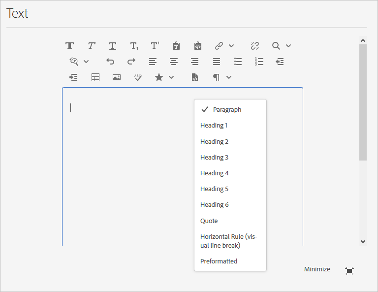

# 리치 텍스트 편집기 구성 {#configure-the-rich-text-editor}

리치 텍스트 편집기(RTE)는 작성자에게 텍스트 콘텐츠를 편집할 수 있는 다양한 기능을 제공합니다. WYSIWYG 텍스트 편집 환경을 위해 아이콘, 선택 상자, 도구 모음 및 메뉴가 제공됩니다. 관리자는 작성 구성 요소에서 사용할 수 있는 기능을 활성화, 비활성화 및 확장하도록 RTE를 구성합니다. 작성자가 [작성에 RTE 사용](/help/sites-cloud/authoring/fundamentals/rich-text-editor.md) 웹 컨텐츠.

이를 구성하는 데 필요한 RTE 개념 및 단계는 아래에 나와 있습니다.

| RTE 개념 이해 | 필요한 기능 활성화 | 개별 기능 구성 |
|---|---|---|
| [인터페이스 이해](#understand-rte-ui) | [구성 위치 이해 및 설정](#understand-the-configuration-paths-and-locations) | [플러그인 구성](#enable-rte-functionalities-by-activating-plug-ins) |
| [편집 모드 유형](#editingmodes) | [플러그인 활성화](/help/implementing/developing/extending/configure-rich-text-editor-plug-ins.md#activateplugin) | [기능 속성 설정](#aboutplugins) |
| [플러그인 기본 정보](#aboutplugins) | [RTE 도구 모음 구성](#dialogfullscreen) | [붙여넣기 모드 구성](/help/implementing/developing/extending/configure-rich-text-editor-plug-ins.md#textstyles) |

## 작성자가 사용할 수 있는 사용자 인터페이스 이해 {#understand-rte-ui}

RTE 인터페이스는 [반응형 디자인](/help/sites-cloud/authoring/features/responsive-layout.md) 작성 환경용입니다. 인터페이스는 터치 및 데스크탑 디바이스에서 사용하도록 설계되었습니다.



*그림: 사용 가능한 모든 옵션이 활성화된 리치 텍스트 편집기 도구 모음*

도구 모음은 WYSIWYG 작성 환경에 대한 옵션을 제공합니다. [!DNL Experience Manager] 관리자는 인터페이스의 도구 모음에서 사용할 수 있는 옵션을 구성할 수 있습니다. 포괄적인 편집 옵션 세트는 기본적으로 다음 위치에서 사용할 수 있습니다 [!DNL Experience Manager]. 개발자는 사용자 정의 가능 [!DNL Experience Manager] 을 클릭하여 더 많은 편집 옵션을 추가합니다.

## 다양한 편집 모드 {#editingmodes}

작성자는에서 텍스트 콘텐츠를 만들고 편집할 수 있습니다. [!DNL Experience Manager] 다양한 구성 요소 모드 사용 다른 편집 모드에서 RTE 사용 구성 요소의 사용자 경험 및 컨텐츠를 작성하고 형식을 지정하기 위한 도구 모음 옵션은 RTE 구성에 따라 다릅니다.

| 편집 모드 | 편집 영역 | 활성화할 권장 기능 |
|--- |--- |--- |
| 인라인 | 빠르고 사소한 편집을 위한 즉석 편집. 대화 상자를 열지 않은 포맷. | 최소 RTE 기능. |
| RTE 전체 화면 | 전체 페이지를 포함합니다. | 모든 필수 RTE 기능. |
| 대화 상자 | 페이지 컨텐츠 위에 있는 대화 상자로, 전체 페이지를 다루지는 않습니다. | 기능을 신중하게 활성화합니다. |
| 대화 상자 전체 화면 | 전체 화면 모드와 동일; RTE와 함께 대화 상자의 필드를 포함합니다. | 모든 필수 RTE 기능. |

>[!NOTE]
>
>인라인 편집 모드에서는 소스 편집 기능을 사용할 수 없습니다. 전체 화면 모드에서는 이미지를 드래그할 수 없습니다. 다른 모든 기능은 모든 모드에서 작동합니다.

### 인라인 편집 {#inline-editing}

페이지 내의 콘텐츠를 편집하려면 느리게 더블 클릭하여 콘텐츠를 엽니다 . 기본 옵션이 있는 작은 도구 모음이 표시됩니다.


*그림: 도구 모음에서 기본 옵션을 사용하여 인라인 편집*

### 전체 화면 편집 {#full-screen-editing}

[!DNL Experience Manager] 페이지 콘텐츠를 숨기고 사용 가능한 화면을 차지하는 전체 화면 보기에서 구성 요소를 열 수 있습니다. 인라인 편집은 가장 많은 편집 옵션을 제공하므로 전체 화면 편집을 고려하십시오. 다음을 클릭하여 열 수 있습니다. 인라인 편집 모드를 사용할 때 압축 도구 모음에서 를 클릭합니다.

대화 상자 전체 화면 모드에서는 세부 RTE 도구 모음과 함께 대화 상자에서 사용할 수 있는 옵션 및 구성 요소도 사용할 수 있습니다. 다른 구성 요소와 함께 RTE가 포함된 대화 상자에만 적용됩니다.


*그림: 전체 화면 모드로 편집할 때 자세한 RTE 도구 모음*

### 대화 상자 편집 {#dialog-editing}

구성 요소를 두 번 클릭하면 콘텐츠를 편집할 수 있는 대화 상자가 열립니다. 대화 상자가 기존 페이지 위에 열립니다. 일부 특정 시나리오에서는 대화 상자가 팝업 창으로 열립니다. 예를 들어 텍스트 구성 요소가 다중 열 페이지 레이아웃의 열에 속하고 대화 상자에 사용할 수 있는 영역이 적은 경우.


*그림: 대화 상자 편집 모드*

## RTE 플러그인 및 관련 기능 정보 {#aboutplugins}

이 기능은 각각 다음과 같은 일련의 플러그인을 통해 사용할 수 있습니다.

* A `features` 즉,

   * 해당 플러그인의 기본 기능을 활성화 또는 비활성화하는 데 사용됩니다.
   * 표준화된 절차를 사용하여 구성합니다.

* 적절한 경우 더 많은 속성과 옵션을 사용하여 전문적인 구성을 요구합니다.

RTE의 기본 기능은 의 값에 따라 활성화되거나 비활성화됩니다. `features` 적절한 플러그인과 관련된 노드의 속성입니다.

다음 표에는 현재 플러그인이 나열되어 있습니다.

* API 설명서 링크가 있는 플러그인 ID. ID는 다음과 같은 경우에 노드 이름으로 사용됩니다. [플러그인 활성화](/help/implementing/developing/extending/configure-rich-text-editor-plug-ins.md#activateplugin).
* 에 대해 허용되는 값 `features` 속성.
* 플러그인에서 제공하는 기능에 대한 설명입니다.

| 플러그인 ID | 기능 | 설명 |
|--- |--- |--- |
| 편집 | `cut`, `copy`, `paste-default`, `paste-plaintext`, `paste-wordhtml` | [잘라내기, 복사 및 세 가지 붙여넣기 모드](/help/implementing/developing/extending/configure-rich-text-editor-plug-ins.md#textstyles). |
| 핀드레플레이스 | `find`, `replace` | 찾기 및 바꾸기. |
| 형식 | `bold`, `italic`, `underline` | [기본 텍스트 서식](configure-rich-text-editor-plug-ins.md#textstyles). |
| 이미지 | `image` | 기본 이미지 지원(콘텐츠 또는 콘텐츠 파인더에서 드래그). 브라우저에 따라 작성자에 대한 지원 동작이 다릅니다 |
| 키 | - | 이 값을 정의하려면 다음을 참조하십시오 [탭 크기](configure-rich-text-editor-plug-ins.md#tabsize). |
| 양쪽 맞춤 | `justifyleft`, `justifycenter`, `justifyright` | 단락 정렬. |
| 링크 | `modifylink`, `unlink`, `anchor` | [하이퍼링크 및 앵커](configure-rich-text-editor-plug-ins.md#linkstyles). |
| 목록 | `ordered`, `unordered`, `indent`, `outdent` | 이 플러그인은 두 가지 작업을 모두 제어합니다. [들여쓰기 및 목록](configure-rich-text-editor-plug-ins.md#indentmargin); 중첩된 목록 포함. |
| misctools | `specialchars`, `sourceedit` | 기타 도구를 사용하면 작성자가 입력할 수 있습니다. [특수 문자](configure-rich-text-editor-plug-ins.md#spchar) 또는 HTML 소스를 편집합니다. 또한 다음을 추가할 수 있습니다 [특수 문자 범위](configure-rich-text-editor-plug-ins.md#definerangechar) 고유한 목록을 정의하려는 경우 |
| Paraformat | `paraformat` | 기본 단락 형식은 단락, 제목 1, 제목 2 및 제목 3 입니다(`<p>`, `<h1>`, `<h2>`, 및 `<h3>`). 다음을 수행할 수 있습니다. [더 많은 단락 형식 추가](configure-rich-text-editor-plug-ins.md#paraformats) 또는 목록을 확장합니다. |
| 맞춤법 검사 | `checktext` | [언어 인식 맞춤법 검사기](configure-rich-text-editor-plug-ins.md#adddict). |
| 스타일 | `styles` | CSS 클래스를 사용한 스타일링을 지원합니다. [새 텍스트 스타일 추가](configure-rich-text-editor-plug-ins.md#textstyles) 텍스트에서 사용할 고유한 스타일 범위를 추가(또는 확장)하려는 경우 |
| 부분 위 첨자 | `subscript`, `superscript` | 기본 형식의 확장으로, 하위 스크립트 및 슈퍼 스크립트를 추가합니다. |
| 표 | `table`, `removetable`, `insertrow`, `removerow`, `insertcolumn`, `removecolumn`, `cellprops`, `mergecells`, `splitcell`, `selectrow`, `selectcolumns` | 다음을 참조하십시오 [표 스타일 구성](configure-rich-text-editor-plug-ins.md#tablestyles) 전체 표 또는 개별 셀에 고유한 스타일을 추가합니다. |
| 실행 취소 | `undo`, `redo` | 기록 크기 [실행 취소 및 다시 실행](configure-rich-text-editor-plug-ins.md#undohistory) 작업. |

>[!NOTE]
>
>전체 화면 플러그인은 대화 상자 모드에서 지원되지 않습니다. 사용 `dialogFullScreen` 을 설정하여 전체 화면 모드에 대한 도구 모음을 구성합니다.

## 구성 경로 및 위치 이해 {#understand-the-configuration-paths-and-locations}

다음 [RTE 편집 모드 및 인터페이스](#editingmodes) 작성자를 위해 제공한 는 다음과 같은 상황에서 구성 세부 정보의 위치를 결정합니다. [RTE 플러그인 활성화](configure-rich-text-editor-plug-ins.md#activateplugin). 위치는 다음과 같습니다.

* 인라인 모드: `cq:editConfig/cq:inplaceEditing`.
* 전체 화면 모드: `cq:editConfig/cq:inplaceEditing`.
* 대화 상자 모드: `cq:dialog`.
* 전체 화면 대화 상자 모드: `cq:dialog`.

>[!NOTE]
>
>아래에 노드의 이름을 지정하지 마십시오. `cq:inplaceEditing` 다음으로: `config`. 날짜 `cq:inplaceEditing` 노드를 정의하고 다음 속성을 정의합니다.
>
>* **이름**: `configPath`
>* **유형**: `String`
>* **값**: 실제 구성이 포함된 노드의 경로
>
>RTE 구성 노드의 이름을 로 지정하지 마십시오. `config`. 그렇지 않으면 RTE 구성은 관리자에게만 적용되며 그룹의 사용자에게는 적용되지 않습니다 `content-author`.

대화 상자 편집 모드에 적용되는 다음 속성을 구성합니다.

* `useFixedInlineToolbar`: RTE 도구 모음을 부동 대신 고정할 수 있습니다. sling:resourceType=을 사용하여 RTE 노드에 정의된 이 부울 속성 설정 `cq/gui/components/authoring/dialog/richtext` 끝 `True`. 이 속성이 로 설정된 경우 `True`, 서식 있는 텍스트 편집기가 `foundation-contentloaded` 이벤트. 이를 방지하려면 속성을 설정합니다 `customStart` 끝 `True` 및 트리거 `rte-start` 이벤트를 사용하여 RTE 편집을 시작합니다. 이 속성이 다음과 같은 경우 `true`, 클릭 시 RTE가 시작되지 않으며 기본 동작입니다.

* `customStart`: RTE 노드에 정의된 이 부울 속성을 다음으로 설정 `True`이벤트를 트리거하여 RTE를 시작할 시기를 제어합니다. `rte-start`.

* `rte-start`: 다음에서 이 이벤트 트리거 `contenteditable-div` RTE의 경우 RTE 편집을 시작할 때입니다. 다음 경우에만 작동합니다. `customStart` 이(가) (으)로 설정되었습니다. `true`.

터치 사용 대화 상자에서 RTE를 사용하는 경우 속성을 설정합니다 `useFixedInlineToolbar` 끝 `true` 문제를 방지합니다.

## 플러그인을 활성화하여 RTE 기능 활성화 {#enable-rte-functionalities-by-activating-plug-ins}

RTE 기능은 기능 속성이 있는 일련의 플러그인을 통해 사용할 수 있습니다. 각 플러그인의 다양한 기능을 활성화하거나 비활성화하도록 기능 속성을 구성할 수 있습니다.

RTE 플러그인의 자세한 구성은 다음을 참조하십시오. [rte 플러그인을 활성화하고 구성하는 방법](configure-rich-text-editor-plug-ins.md).

<!-- TBD ENGREVIEW: To confirm if the sample works in CS or not?
**Sample**: Download [this sample configuration](/help/sites-administering/assets/rte-sample-all-features-enabled-10.zip) that illustrates how to configure RTE. In this package all the features are enabled. -->

다음 [코어 구성 요소 텍스트 구성 요소](https://experienceleague.adobe.com/docs/experience-manager-core-components/using/components/text.html#the-text-component-and-the-rich-text-editor) 템플릿 편집기에서 사용자 인터페이스를 콘텐츠 정책으로 사용하여 여러 RTE 플러그인을 구성할 수 있으므로 기술 구성이 필요하지 않습니다. 콘텐츠 정책은 이 문서에 설명된 대로 RTE UI 구성에서 작동할 수 있습니다. 자세한 내용은 [페이지 템플릿 만들기](/help/sites-cloud/authoring/features/templates.md) 및 [핵심 구성 요소 개발자 설명서](https://experienceleague.adobe.com/docs/experience-manager-core-components/using/developing/developing.html).

>참조용으로 기본 텍스트 구성 요소(표준 설치의 일부로 제공)는 다음에서 찾을 수 있습니다.
>
>* `/libs/wcm/foundation/components/text`
>* `/libs/foundation/components/text`
>
>고유한 텍스트 구성 요소를 만들려면 이러한 구성 요소를 편집하는 대신 위의 구성 요소를 복사하십시오.

## RTE 도구 모음 구성 {#dialogfullscreen}

[!DNL Experience Manager] 리치 텍스트 편집기에 대한 인터페이스를 다양한 편집 모드에 대해 다르게 구성할 수 있습니다. 기본 설정은 아래에 제공됩니다. 요구 사항에 따라 이러한 기본값을 재정의할 수 있습니다. 작성자에게 제공할 도구 모음 기능만 사용자 지정합니다. 모든 도구 모음 구성을 지정할 필요는 없습니다.

다음에 대한 도구 모음을 구성하려면 `dialogFullScreen`, 다음 샘플 구성을 사용하십시오.

```java
<uiSettings jcr:primaryType="nt:unstructured">
  <cui jcr:primaryType="nt:unstructured">
    <inline
      jcr:primaryType="nt:unstructured"
      toolbar="[format#bold,format#italic,format#underline,#justify,#lists,links#modifylink,links#unlink,#paraformat]">
      <popovers jcr:primaryType="nt:unstructured">
        <justify
          jcr:primaryType="nt:unstructured"
          items="[justify#justifyleft,justify#justifycenter,justify#justifyright,justify#justifyjustify]"
          ref="justify"/>
        <lists
          jcr:primaryType="nt:unstructured"
          items="[lists#unordered,lists#ordered,lists#outdent,lists#indent]"
          ref="lists"/>
        <paraformat
          jcr:primaryType="nt:unstructured"
          items="paraformat:getFormats:paraformat-pulldown"
          ref="paraformat"/>
      </popovers>
    </inline>
    <dialogFullScreen
      jcr:primaryType="nt:unstructured"
      toolbar="[format#bold,format#italic,format#underline,justify#justifyleft,justify#justifycenter,justify#justifyright,justify#justifyjustify,lists#unordered,lists#ordered,lists#outdent,lists#indent,links#modifylink,links#unlink,table#createoredit,#paraformat,image#imageProps]">
      <popovers jcr:primaryType="nt:unstructured">
        <paraformat
          jcr:primaryType="nt:unstructured"
          items="paraformat:getFormats:paraformat-pulldown"
          ref="paraformat"/>
      </popovers>
    </dialogFullScreen>
    <tableEditOptions
      jcr:primaryType="nt:unstructured"
      toolbar="[table#insertcolumn-before,table#insertcolumn-after,table#removecolumn,-,table#insertrow-before,table#insertrow-after,table#removerow,-,table#mergecells-right,table#mergecells-down,table#mergecells,table#splitcell-horizontal,table#splitcell-vertical,-,table#selectrow,table#selectcolumn,-,table#ensureparagraph,-,table#modifytableandcell,table#removetable,-,undo#undo,undo#redo,-,table#exitTableEditing,-]">
    </tableEditOptions>
  </cui>
</uiSettings>
```

인라인 모드와 전체 화면 모드에서는 서로 다른 사용자 인터페이스 설정이 사용됩니다. toolbar 속성은 도구 모음의 옵션을 지정합니다.

예를 들어 옵션이 그 자체인 경우(예: `Bold`)으로 지정됩니다. `PluginName#FeatureName` (예: `links#modifylink`).

옵션이 팝업(플러그인의 일부 기능 포함)이면 다음과 같이 지정됩니다. `#PluginName` (예: `#format`).

구분 기호(`|`) 옵션 그룹 사이에 을 지정할 수 있습니다. `-`.

인라인 또는 전체 화면 모드 아래의 팝업 노드에는 사용 중인 팝업 오버 목록이 포함됩니다. 아래에 있는 각 하위 노드 `popovers` 노드의 이름은 플러그인(예: format) 이름을 따서 지정합니다. 여기에는 플러그인의 기능 목록이 포함된 속성 &#39;items&#39;가 있습니다(예: format#bold).

## RTE 사용자 인터페이스 설정 및 콘텐츠 정책 {#rtecontentpolicies}

관리자는 위에서 설명한 대로 구성을 수행하는 대신 콘텐츠 정책을 사용하여 RTE 옵션을 제어할 수 있습니다. 콘텐츠 정책은 의 일부로 사용할 때 구성 요소의 디자인 속성을 정의합니다. [편집 가능한 템플릿](/help/sites-cloud/authoring/features/templates.md). 예를 들어 RTE를 사용하는 텍스트 구성 요소를 편집 가능한 템플릿과 함께 사용하는 경우 콘텐츠 정책에서 굵게 옵션을 사용할 수 있고 몇 가지 단락 서식 옵션을 사용할 수 있도록 정의할 수 있습니다. 콘텐츠 정책은 재사용이 가능하며 여러 템플릿에 적용할 수 있습니다.

RTE에서 사용할 수 있는 옵션은 사용자 인터페이스 구성에서 콘텐츠 정책으로 다운스트림됩니다.

* 사용자 인터페이스 구성 설정은 콘텐츠 정책에 사용할 수 있는 옵션을 정의합니다.
* RTE의 사용자 인터페이스 구성이 제거되었거나 항목을 사용할 수 없는 경우 콘텐츠 정책이 항목을 구성할 수 없습니다.
* 작성자는 사용자 인터페이스 구성 및 콘텐츠 정책에 의해 제공되는 기능에만 액세스할 수 있습니다.

예를 들어 다음을 볼 수 있습니다. [텍스트 핵심 구성 요소 설명서](https://experienceleague.adobe.com/docs/experience-manager-core-components/using/components/text.html#the-text-component-and-the-rich-text-editor).

## 도구 모음 아이콘과 명령 간의 매핑 사용자 정의 {#iconstoolbar}

RTE 도구 모음에 표시되는 Coral 아이콘과 사용 가능한 명령 간의 매핑을 사용자 정의할 수 있습니다. 코랄 아이콘 이외의 다른 아이콘은 사용할 수 없습니다.

1. 다음 이름의 노드 만들기 `icons` 아래에 `uiSettings/cui`.

1. 아래에 개별 아이콘에 대한 노드를 만듭니다.
1. 각 개별 아이콘 노드에서 Coral 아이콘과 해당 아이콘에 매핑할 명령을 지정합니다.

다음은 명령을 매핑할 샘플 코드 조각입니다 `Bold` (이)가 이라는 Coral 아이콘에 `textItalic`.

```java
<text jcr:primaryType="nt:unstructured" sling:resourceType="cq/gui/components/authoring/dialog/richtext" name="./text" useFixedInlineToolbar="{Boolean}true">
    <rtePlugins jcr:primaryType="nt:unstructured">
        <format jcr:primaryType="nt:unstructured" features="bold,italic"/>
    </rtePlugins>
    <uiSettings jcr:primaryType="nt:unstructured">
        <cui jcr:primaryType="nt:unstructured">
            <inline jcr:primaryType="nt:unstructured"
                toolbar="[format#bold,format#italic,format#underline,links#modifylink,links#unlink]">
            </inline>
            <icons jcr:primaryType="nt:unstructured">
                <bold jcr:primaryType="nt:unstructured"
                    command="format#bold"
                    icon="textItalic"/>
            </icons>
        </cui>
    </uiSettings>
</text>
```

## 알려진 제한 사항 {#known-limitations}

[!DNL Experience Manager] RTE 기능에는 다음과 같은 제한 사항이 있습니다.

* RTE 기능은 [!DNL Experience Manager] 구성 요소 대화 상자 RTE는 마법사 또는 Foundation-Forms에서 지원되지 않습니다.

* [!DNL Experience Manager] 하이브리드 디바이스에서 작동하지 않습니다. <!-- TBD: Check. This is not mentioned in Known Issue /help/release-notes/known-issues.md-->

* RTE 구성 노드의 이름을 지정하지 마십시오 `config`. 그렇지 않으면 RTE 구성은 관리자에게만 적용되며 그룹의 사용자에게는 적용되지 않습니다 `content-author`.

* RTE는 인라인 프레임 또는 iframe에 콘텐츠를 포함할 수 없습니다.

## 모범 사례 및 팁 {#best-practices-and-tips}

* 부동 대화 상자의 경우 팝업 대화 상자 없이 플러그인만 활성화합니다. 팝업이 없는 플러그인은 크기가 더 작으며 부동 대화 상자에 가장 적합합니다.
* 다음과 같이 큰 팝업으로 플러그인을 활성화합니다. `Paste` 플러그인은 전체 화면 대화 상자 모드 또는 전체 화면 모드에서만 사용할 수 있습니다. 팝업이 큰 플러그인은 좋은 작성 환경을 제공하기 위해 더 많은 화면 실제가 필요합니다.
* CoralUI3 RTE용 사용자 지정 플러그인을 사용하는 경우 `rte.coralui3` 라이브러리입니다.

>[!MORELIKETHIS]
>
>* [RTE 플러그인 구성](configure-rich-text-editor-plug-ins.md)
>* [작성을 위해 리치 텍스트 편집기 사용](/help/sites-cloud/authoring/fundamentals/rich-text-editor.md)
>* [액세스 가능한 사이트에 대한 RTE 구성](rte-accessible-content.md)

