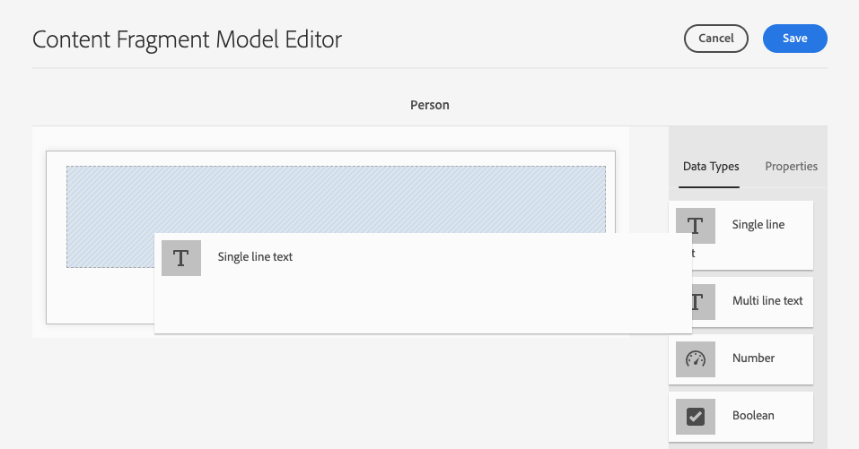

# 컨텐츠 조각 모델 만들기 헤드리스 빠른 시작 안내서 {#creating-content-fragment-models}

컨텐츠 조각 모델은 AEM 헤드리스 기능을 사용하여 만들고 제공할 컨텐츠의 구조를 정의합니다.

## 컨텐츠 조각 모델이란 무엇입니까?{#what-are-content-fragment-models}

[구성을 생성했으므로 이 구성](create-configuration.md) 을 사용하여 컨텐츠 조각 모델을 만들 수 있습니다.

컨텐츠 조각 모델은 AEM에서 생성 및 관리할 데이터와 컨텐츠의 구조를 정의합니다. 컨텐츠를 위한 스캐폴딩 역할을 합니다. 컨텐츠 생성을 선택할 때 작성자는 정의한 컨텐츠 조각 모델에서 컨텐츠를 생성하는 데 안내하는 컨텐츠를 선택합니다.

## 컨텐츠 조각 모델 {#how-to-create-a-content-fragment-model} 생성 방법

정보 설계자는 새로운 모델이 필요하므로 이러한 작업을 간간히 수행할 수 있습니다. 이 시작 안내서의 목적을 위해 하나의 모델만 만들어야 합니다.

1. AEM에 Cloud Service으로 로그인하고 주 메뉴에서 **도구 -> 자산 -> 컨텐츠 조각 모델**&#x200B;을 선택합니다.
1. 구성을 만들어 만든 폴더를 탭하거나 클릭합니다.

   
1. **만들기**&#x200B;를 탭하거나 클릭합니다.
1. **모델 제목**, **태그** 및 **설명**&#x200B;을 제공합니다. **모델 활성화**&#x200B;를 선택/선택 해제하여 생성 시 모델이 즉시 활성화되는지 여부를 제어할 수도 있습니다.

   
1. 확인 창에서 **열기**&#x200B;를 탭하거나 클릭하여 모델을 구성합니다.

   
1. **컨텐츠 조각 모델 편집기**&#x200B;를 사용하여 **데이터 유형** 열에서 필드를 드래그 앤 드롭하여 컨텐츠 조각 모델을 작성합니다.

   

1. 필드를 배치하면 해당 속성을 구성해야 합니다. 편집기는 필수 필드를 제공할 수 있는 추가된 필드에 대해 **속성** 탭으로 자동 전환됩니다.

   
1. 모델 작성을 마쳤으면 **저장**&#x200B;을 탭하거나 클릭합니다. 새로 만든 모델은 **초안** 모드로 저장됩니다.

   
1. 모델을 사용하려면 해당 모델을 활성화해야 합니다(아직 활성화되지 않은 경우). 방금 만든 모델을 선택한 다음 **활성화**&#x200B;를 탭하거나 클릭합니다.

   
1. 확인 대화 상자에서 **활성화**&#x200B;를 탭하거나 클릭하여 모델 활성화를 확인합니다.

   
1. 이제 모델이 활성화되고 사용할 준비가 되었습니다.

   

**컨텐츠 조각 모델 편집기**&#x200B;는 단순 텍스트 필드, 에셋 참조, 다른 모델에 대한 참조 및 JSON 데이터와 같은 다양한 데이터 유형을 지원합니다.

여러 모델을 만들 수 있습니다. 모델은 다른 컨텐츠 조각을 참조할 수 있습니다. [구성](create-configuration.md)을 사용하여 모델을 구성합니다.

## 다음 단계 {#next-steps}

모델을 만들어 컨텐츠 조각 구조를 정의하였으므로 이제 시작 안내서의 세 번째 부분으로 이동하고 [조각을 저장할 폴더 만들기](create-assets-folder.md)

>[!TIP]
>
>컨텐츠 조각 모델에 대한 자세한 내용은 [컨텐츠 조각 모델 설명서](/help/assets/content-fragments/content-fragments-models.md)를 참조하십시오.
