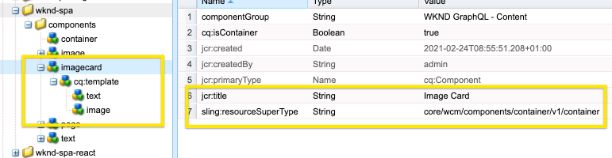

# SPA의 구성 요소 합성 {#composite-components-in-spas}

복합 구성 요소는 여러 기본 구성 요소를 단일 구성 요소로 결합하여 AEM 구성 요소의 모듈식 특성을 활용합니다. 일반적인 복합 구성 요소 사용 사례는 이미지와 텍스트 구성 요소의 조합으로 구성된 카드 구성 요소입니다.

복합 구성 요소가 AEM 단일 페이지 애플리케이션(SPA) 편집기 프레임워크 내에서 제대로 구현되면 컨텐츠 작성자는 다른 구성 요소와 같이 구성 요소를 드래그하여 놓을 수 있지만, 여전히 복합 구성 요소를 구성하는 각 구성 요소를 개별적으로 편집할 수 있습니다.

이 문서에서는 단일 페이지 애플리케이션에 복합 구성 요소를 추가하여 AEM SPA 편집기와 원활하게 작업하는 방법을 보여 줍니다.

## 사용 사례 {#use-case}

이 문서에서는 일반적인 카드 구성 요소를 사용 사례로 사용합니다. 카드는 많은 디지털 경험을 위한 일반적인 UI 요소로서, 일반적으로 이미지와 연관된 텍스트 또는 캡션으로 구성됩니다. 작성자가 전체 카드를 드래그 앤 드롭할 수 있지만 카드 이미지를 개별적으로 편집하고 관련 텍스트를 사용자 지정할 수 있습니다.

## 사전 요구 사항 {#prerequisites}

복합 구성 요소 사용 사례를 지원하기 위한 다음 모델에는 다음 전제 조건이 필요합니다.

* AEM 개발 인스턴스가 샘플 프로젝트를 사용하여 포트 4502에서 로컬로 실행되고 있습니다.
* 작동하는 외부 React 앱이 있습니다 [AEM에서 편집할 수 있도록 활성화되었습니다.](editing-external-spa.md)
* React 앱은 AEM 편집기에 로드됩니다 [RemotePage 구성 요소 사용.](remote-page.md)

## SPA에 복합 구성 요소 추가 {#adding-composite-components}

AEM 내의 SPA 구현에 따라 복합 구성 요소를 구현하는 세 가지 모델이 있습니다.

* [구성 요소가 AEM 프로젝트에 없습니다.](#component-does-not-exist)
* [구성 요소는 AEM 프로젝트에 있지만 필요한 컨텐츠는 없습니다.](#content-does-not-exist)
* [구성 요소와 필요한 컨텐츠는 모두 AEM 프로젝트에 있습니다.](#both-exist)

다음 섹션에서는 카드 구성 요소를 예로 사용하여 각 사례를 구현하는 예를 제공합니다.

### 구성 요소가 AEM 프로젝트에 없습니다. {#component-does-not-exist}

먼저 합성 구성 요소(예: 이미지 및 해당 텍스트에 대한 구성 요소)를 구성하는 구성 요소를 만듭니다.

1. AEM 프로젝트에서 텍스트 구성 요소를 만듭니다.
1. 해당 추가 `resourceType` 구성 요소의 `editConfig` 노드 아래에 있어야 합니다.

   ```text
    resourceType: 'wknd-spa/components/text' 
   ```

1. 를 사용하십시오 `withMappable` 구성 요소에 대한 편집을 활성화하는 도우미.

   ```text
   export const AEMText = withMappable(Text, TextEditConfig); 
   ```

텍스트 구성 요소는 다음과 유사합니다.

```javascript
import React from 'react';
import { withMappable } from '@adobe/aem-react-editable-components';

export const TextEditConfig = {
  emptyLabel: 'Text',
  isEmpty: function(props) {
    return !props || !props.text || props.text.trim().length < 1;
  },
  resourceType: 'wknd-spa/components/text'
};

export const Text = ({ cqPath, richText, text }) => {
  const richTextContent = () => (
    <div className="aem_text"
      id={cqPath.substr(cqPath.lastIndexOf('/') + 1)}
      data-rte-editelement
      dangerouslySetInnerHTML={{__html: text}} />
  );
  return richText ? richTextContent() : (
     <div className="aem_text">{text}</div>
  );
};

export const AEMText = withMappable(Text, TextEditConfig);
```

유사한 방식으로 이미지 구성 요소를 만드는 경우 해당 구성 요소를 와 결합할 수 있습니다 `AEMText` 구성 요소를 새 카드 구성 요소로, 이미지 및 텍스트 구성 요소를 하위 요소로 사용합니다.

```javascript
import React from 'react';
import { AEMText } from './AEMText';
import { AEMImage } from './AEMImage';

export const AEMCard = ({ pagePath, itemPath}) => (
  <div>
    <AEMText
       pagePath={pagePath}
       itemPath={`text`} />
    <AEMImage
       pagePath={pagePath}
       itemPath={`image`} />
   </div>
);
```

이 결과 복합 구성 요소는 이제 앱의 어디에나 배치할 수 있으며, 은 SPA 편집기에서 텍스트 및 이미지 구성 요소에 대한 자리 표시자를 추가합니다. 아래 샘플에서는 카드 구성 요소가 제목 아래의 홈 구성 요소에 추가됩니다.

```javascript
function Home() {
  return (
    <div className="Home">
      <h2>Current Adventures</h2>
      <AEMCard
        pagePath='/content/wknd-spa/home' />
    </div>
  );
}
```

그러면 편집기에 텍스트 및 이미지에 대한 빈 자리 표시자가 표시됩니다. 편집기를 사용하여 이러한 요소에 대한 값을 입력할 때 지정된 페이지 경로(예: `/content/wknd-spa/home`  루트 수준에서 `itemPath`.


### 구성 요소는 AEM 프로젝트에 있지만 필요한 컨텐츠는 없습니다. {#content-does-not-exist}

이 경우 카드 구성 요소는 이미 제목 및 이미지 노드를 포함하는 AEM 프로젝트에서 만듭니다. 하위 노드(텍스트 및 이미지)에는 해당 리소스 유형이 있습니다.



그런 다음 SPA에 추가하고 해당 콘텐츠를 검색할 수 있습니다.

1. 이를 위해 SPA에서 해당 구성 요소를 만듭니다. 하위 구성 요소가 SPA 프로젝트 내의 해당 AEM 리소스 유형에 매핑되어 있는지 확인합니다. 이 예제에서는 동일한 `AEMText` 및 `AEMImage` 구성 요소를 자세히 설명합니다. [이전 경우입니다.](#component-does-not-exist)

   ```javascript
   import React from 'react';
   import { Container, withMappable, MapTo } from '@adobe/aem-react-editable-components';
   import { Text, TextEditConfig } from './AEMText';
   import Image, { ImageEditConfig } from './AEMImage';
   
   export const AEMCard = withMappable(Container, {
     resourceType: 'wknd-spa/components/imagecard'
   });
   
   MapTo('wknd-spa/components/text')(Text, TextEditConfig);
   MapTo('wknd-spa/components/image')(Image, ImageEditConfig);
   ```

1. 에 대한 컨텐츠가 없으므로 `imagecard` 구성 요소에서 카드를 페이지에 추가합니다. AEM의 기존 컨테이너를 SPA에 포함합니다.
   * AEM 프로젝트에 이미 컨테이너가 있는 경우 SPA에 이를 대신 포함하고 AEM의 컨테이너에 구성 요소를 대신 추가할 수 있습니다.
   * 카드 구성 요소가 SPA에서 해당 리소스 유형에 매핑되어 있는지 확인합니다.

   ```javascript
   <ResponsiveGrid
    pagePath='/content/wknd-spa/home'
    itemPath='root/responsivegrid' />
   ```

1. 생성된 를 추가합니다 `wknd-spa/components/imagecard` 구성 요소를 컨테이너 구성 요소에 대해 허용되는 구성 요소에 [참조하십시오.](/help/sites-cloud/authoring/features/templates.md)

이제 `imagecard` 구성 요소를 AEM 편집기에서 컨테이너에 직접 추가할 수 있습니다.


### 구성 요소와 필요한 컨텐츠는 모두 AEM 프로젝트에 있습니다. {#both-exist}

컨텐츠가 AEM에 있는 경우 컨텐츠에 경로를 제공하여 SPA에 직접 포함할 수 있습니다.

```javascript
<AEMCard
    pagePath='/content/wknd-spa/home'
    itemPath='root/responsivegrid/imagecard' />
```


다음 `AEMCard` 구성 요소는 정의된 것과 같습니다 [이전 사용 사례에서 찾아볼 수 있습니다.](#content-does-not-exist) 여기서는 AEM 프로젝트에서 위의 위치에 정의된 컨텐츠가 SPA에 포함됩니다.
