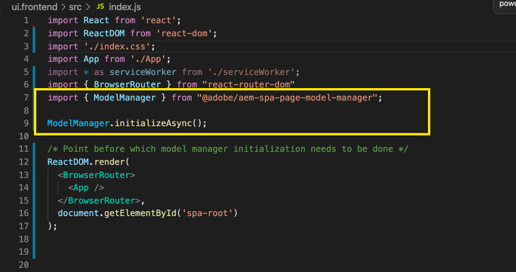
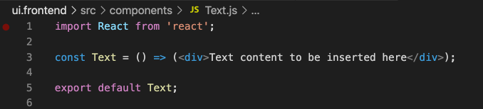
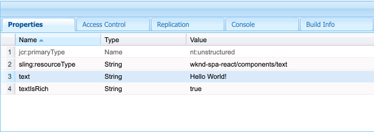
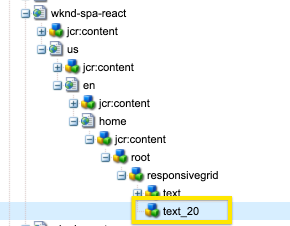
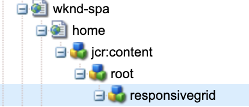

# AEM에서 외부 SPA 편집 {#editing-external-spa-within-aem}

결정 시 [통합 수준](/help/implementing/developing/headful-headless.md) 외부 SPA과 AEM 간에 SPAAEM 를 자주 편집하고 볼 수 있어야 한다고 가정합니다.

## 개요 {#overview}

이 문서에서는 독립 실행형 SPA을 AEM 인스턴스에 업로드하고, 편집 가능한 콘텐츠 섹션을 추가하고, 저작을 활성화하는 권장 단계에 대해 설명합니다.

## 사전 요구 사항 {#prerequisites}

사전 요구 사항은 간단합니다.

* AEM 인스턴스가 로컬에서 실행 중인지 확인합니다.
* 다음을 사용하여 기본 AEM SPA 프로젝트 만들기 [AEM Project Archetype](https://experienceleague.adobe.com/docs/experience-manager-core-components/using/developing/archetype/overview.html?#available-properties).
   * Forms은 외부 SPA을 포함하도록 업데이트되는 AEM 프로젝트의 기초입니다.
   * 이 문서의 샘플에 대해 Adobe은 시작점을 [WKND SPA 프로젝트](https://experienceleague.adobe.com/docs/experience-manager-learn/sites/spa-editor/spa-editor-framework-feature-video-use.html#spa-editor).
* 즉시 통합할 작업 중인 외부 React SPA이 있습니다.

## AEM 프로젝트에 SPA 업로드 {#upload-spa-to-aem-project}

먼저 외부 SPA을 AEM 프로젝트에 업로드해야 합니다.

1. 바꾸기 `src` 다음에서 `/ui.frontend` React 응용 프로그램의 프로젝트 폴더 `src` 폴더를 삭제합니다.
1. 앱에 추가 종속성 포함 `package.json` 다음에서 `/ui.frontend/package.json` 파일.
   * SPA SDK 종속성이 [권장 버전](/help/implementing/developing/hybrid/getting-started-react.md#dependencies).
1. 에 모든 사용자 정의 포함 `/public` 폴더를 삭제합니다.
1. 에 추가된 모든 인라인 스크립트 또는 스타일 포함 `/public/index.html` 파일.

## 원격 SPA 구성 {#configure-remote-spa}

이제 외부 SPA은 AEM 프로젝트의 일부이므로 AEM 내에서 구성해야 합니다.

### Adobe SPA SDK 패키지 포함 {#include-spa-sdk-packages}

AEM SPA 기능을 활용하기 위해 다음 세 가지 패키지에 종속성이 있습니다.

* [`@adobe/aem-react-editable-components`](https://github.com/adobe/aem-react-editable-components)
* [`@adobe/aem-spa-component-mapping`](https://www.npmjs.com/package/@adobe/aem-spa-component-mapping)
* [`@adobe/aem-spa-page-model-manager`](https://www.npmjs.com/login?next=/package/@adobe/aem-spa-model-manager)

다음 `@adobe/aem-spa-page-model-manager` 패키지는 모델 관리자를 초기화하고 AEM 인스턴스에서 모델을 검색하는 API를 제공합니다. 그런 다음 이 모델을 사용하여 의 API를 사용하여 AEM 구성 요소를 렌더링할 수 있습니다. `@adobe/aem-react-editable-components` 및 `@adobe/aem-spa-component-mapping`.

#### 설치 {#installation}

다음 실행 `npm` 필요한 패키지를 설치할 수 있도록 명령합니다.

```shell
npm install --save @adobe/aem-spa-component-mapping @adobe/aem-spa-page-model-manager @adobe/aem-react-editable-components
```

### ModelManager 초기화 {#model-manager-initialization}

앱이 렌더링되기 전에 [`ModelManager`](/help/implementing/developing/hybrid/blueprint.md#pagemodelmanager) AEM 생성을 처리하려면 초기화해야 합니다. `ModelStore`.

이 초기화는 다음 기간 내에 수행해야 합니다. `src/index.js` 애플리케이션 파일 또는 애플리케이션 루트가 렌더링되는 모든 위치.

이 초기화를 수행하려면 다음을 사용할 수 있습니다. `initializationAsync` 에서 제공하는 API `ModelManager`.

다음 스크린샷은 의 초기화를 활성화하는 방법을 보여 줍니다. `ModelManager` 를 입력합니다. 유일한 제한 사항은 다음과 같습니다. `initializationAsync` 은(는) 전에 호출되어야 합니다. `ReactDOM.render()`.



이 예에서는 `ModelManager` 초기화되어 비어 있습니다. `ModelStore` 이(가) 만들어졌습니다.

다음 `initializationAsync` 을(를) 선택적으로 수락할 수 있음 `options` 매개 변수로서의 개체:

* `path` - 초기화 시 정의된 경로의 모델을 가져와서 `ModelStore`. 이 경로를 사용하여 다음을 가져올 수 있습니다. `rootModel` 필요한 경우 초기화 시.
* `modelClient` - 모델 가져오기를 담당하는 사용자 지정 클라이언트를 제공할 수 있습니다.
* `model` - A `model` 매개 변수로 전달된 개체는 일반적으로 다음과 같은 경우에 채워짐 [ssr 사용](/help/implementing/developing/hybrid/ssr.md).

### AEM Authorable Leaf 구성 요소 {#authorable-leaf-components}

1. 작성 가능한 React 구성 요소가 생성된 AEM 구성 요소를 생성/식별합니다. 이 예제에서는 WKND 프로젝트의 텍스트 구성 요소를 사용하고 있습니다.

   

1. SPA에서 간단한 React 텍스트 구성 요소를 만듭니다. 이 예제에서 새 파일 `Text.js` 이(가) 다음 콘텐츠로 만들어졌습니다.

   

1. AEM 편집을 활성화하는 데 필요한 속성을 지정할 수 있도록 구성 객체를 만듭니다.

   

   * `resourceType` AEM Editor에서 를 열 때 React 구성 요소를 AEM 구성 요소에 매핑하고 편집을 활성화하려면 가 필수입니다.

1. 래퍼 함수 사용 `withMappable`.

   

   이 래퍼 함수는 React 구성 요소를 AEM에 매핑합니다. `resourceType` 구성에 지정되며 AEM 편집기에서 열면 편집 기능이 활성화됩니다. 독립형 구성 요소의 경우 특정 노드에 대한 모델 콘텐츠도 가져옵니다.

   >[!NOTE]
   >
   >이 예에는 구성 요소의 개별 버전인 AEM 래핑된 구성 요소와 래핑되지 않은 React 구성 요소가 있습니다. 구성 요소를 명시적으로 사용할 때는 래핑된 버전을 사용해야 합니다. 구성 요소가 페이지의 일부인 경우 SPA 편집기에서 현재 작업을 수행한 대로 기본 구성 요소를 계속 사용할 수 있습니다.

1. 구성 요소에서 콘텐츠를 렌더링합니다.

   텍스트 구성 요소의 JCR 속성은 AEM에서 다음과 같이 표시됩니다.

   

   이러한 값은 새로 만든 에 속성으로 전달됩니다 `AEMText` React 구성 요소이며 콘텐츠 렌더링에 사용할 수 있습니다.

   ```javascript
   import React from 'react';
   import { withMappable } from '@adobe/aem-react-editable-components';
   
   export const TextEditConfig = {
       // Empty component placeholder label
       emptyLabel:'Text', 
       isEmpty:function(props) {
          return !props || !props.text || props.text.trim().length < 1;
       },
       // resourcetype of the AEM counterpart component
       resourceType:'wknd-spa-react/components/text'
   };
   
   const Text = ({ text }) => (<div>{text}</div>);
   
   export default Text;
   
   export const AEMText = withMappable(Text, TextEditConfig);
   ```

   AEM 구성이 완료되면 구성 요소가 표시되는 방식은 다음과 같습니다.

   ```javascript
   const Text = ({ cqPath, richText, text }) => {
      const richTextContent = () => (
         <div className="aem_text" id={cqPath.substr(cqPath.lastIndexOf('/') + 1)} data-rte-editelement dangerouslySetInnerHTML={{__html: text}}/>
      );
      return richText ? richTextContent() : (<div className="aem_text">{text}</div>);
   };
   ```

   >[!NOTE]
   >
   >이 예제에서는 렌더링된 구성 요소를 기존 텍스트 구성 요소와 일치하도록 추가로 사용자 지정했습니다. AEM의 작성과 관련이 없습니다.

#### 페이지에 작성 가능한 구성 요소 추가 {#add-authorable-component-to-page}

작성 가능한 React 구성 요소가 생성되면 애플리케이션 전체에서 사용할 수 있습니다.

WKND SPA 프로젝트에서 텍스트를 추가해야 하는 예제 페이지를 예로 들어 보겠습니다. 이 예제에서는 &quot;Hello World!&quot; 텍스트를 표시합니다. 켜짐 `/content/wknd-spa-react/us/en/home.html`.

1. 표시할 노드의 경로를 결정합니다.

   * `pagePath`: 이 예제의 노드가 포함된 페이지 `/content/wknd-spa-react/us/en/home`
   * `itemPath`: 페이지 내의 노드 경로(이 예에서는 다음과 같음) `root/responsivegrid/text`
      * 페이지에 있는 포함 항목의 이름으로 구성됩니다.

   

1. 페이지에서 필요한 위치에 구성 요소를 추가합니다.

   

   다음 `AEMText` 구성 요소는 을 사용하여 페이지 내에서 필요한 위치에 추가할 수 있습니다. `pagePath` 및 `itemPath` 값을 속성으로 설정합니다. `pagePath` 는 필수 속성입니다.

#### AEM에서 텍스트 컨텐츠 편집 확인 {#verify-text-edit}

이제 실행 중인 AEM 인스턴스에서 구성 요소를 테스트합니다.

1. 에서 다음 Maven 명령을 실행합니다. `aem-guides-wknd-spa` 프로젝트를 빌드하고 AEM에 배포할 수 있도록 디렉터리입니다.

```shell
mvn clean install -PautoInstallSinglePackage
```

1. AEM 인스턴스에서 `http://<host>:<port>/editor.html/content/wknd-spa-react/us/en/home.html`.


다음 `AEMText` 이제 AEM에서 구성 요소를 작성할 수 있습니다.

### AEM 승인 가능 페이지 {#aem-authorable-pages}

1. SPA에서 작성하기 위해 추가할 페이지를 식별합니다. 이 예에서는 를 사용합니다. `/content/wknd-spa-react/us/en/home.html`.
1. 파일 만들기(예: `Page.js`)을 참조하십시오. 에 제공된 페이지 구성 요소 사용 `@adobe/cq-react-editable-components`.
1. 섹션에서 4단계를 반복합니다 [AEM 승인 가능한 리프 구성 요소](#authorable-leaf-components). 래퍼 함수 사용 `withMappable` 구성 요소에 매핑됩니다.
1. 이전에 수행한 대로 를 적용합니다. `MapTo` 페이지 내의 모든 하위 구성 요소에 대한 AEM 리소스 유형으로 이동합니다.

   ```javascript
   import { Page, MapTo, withMappable } from '@adobe/aem-react-editable-components';
   import Text, { TextEditConfig } from './Text';
   
   export default withMappable(Page);
   
   MapTo('wknd-spa-react/components/text')(Text, TextEditConfig);
   ```

   >[!NOTE]
   >
   >이 예제에서는 래핑된 텍스트 대신 래핑되지 않은 React 텍스트 구성 요소를 사용합니다 `AEMText` 이전에 생성되었습니다. 구성 요소가 단독이 아닌 페이지/컨테이너의 일부인 경우 해당 컨테이너는 구성 요소를 재귀적으로 매핑하는 기능을 담당하기 때문입니다. 또한 각 하위 항목에 대해 작성 기능 및 추가 래퍼를 활성화할 필요가 없습니다.

1. SPA에서 작성 가능한 페이지를 추가하려면 섹션에서 동일한 단계를 수행합니다 [페이지에 작성 가능한 구성 요소 추가](#add-authorable-component-to-page). 여기서 다음을 건너뛸 수 있습니다. `itemPath` 속성.

#### AEM에서 페이지 컨텐츠 확인 {#verify-page-content}

페이지를 편집할 수 있는지 확인하려면 섹션에서 동일한 단계를 수행합니다 [AEM에서 텍스트 컨텐츠 편집 확인](#verify-text-edit).


이제 레이아웃 컨테이너 및 하위 텍스트 구성 요소를 사용하여 AEM에서 페이지를 편집할 수 있습니다.

### 가상 리프 구성 요소 {#virtual-leaf-components}

앞의 예제에서는 기존 AEM 컨텐츠가 있는 SPA에 구성 요소를 추가했습니다. 그러나 AEM에서 아직 컨텐츠가 만들어지지 않았지만 나중에 컨텐츠 작성자가 추가해야 하는 경우가 있습니다. 이 시나리오를 수용하기 위해 프론트엔드 개발자는 SPA 내의 적절한 위치에 구성 요소를 추가할 수 있습니다. 이러한 구성 요소는 AEM의 편집기에서 열리면 자리 표시자를 표시합니다. 콘텐츠 작성자가 이러한 자리 표시자 내에 콘텐츠를 추가하면 노드가 JCR 구조로 만들어지고 콘텐츠가 유지됩니다. 생성된 구성 요소를 사용하여 독립 실행형 리프 구성 요소와 동일한 작업 세트를 사용할 수 있습니다.

이 예에서는 를 재사용하고 있습니다. `AEMText` 구성 요소가 이전에 생성되었습니다. WKND 홈 페이지의 기존 텍스트 구성 요소 아래에 새 텍스트를 추가하려고 합니다. 컴포넌트 추가는 일반 리프 컴포넌트와 동일합니다. 그러나 `itemPath` 는 새 구성 요소를 추가해야 하는 경로로 업데이트할 수 있습니다.

새 구성 요소는 의 기존 텍스트 아래에 추가되어야 하기 때문입니다 `root/responsivegrid/text`, 새 경로는 입니다. `root/responsivegrid/{itemName}`.

```html
<AEMText
 pagePath='/content/wknd-spa-react/us/en/home'
 itemPath='root/responsivegrid/text_20' />
```

다음 `TestPage` 구성 요소는 가상 구성 요소를 추가한 후 다음과 같습니다.


>[!NOTE]
>
>다음을 확인합니다. `AEMText` 구성 요소에 해당 `resourceType` 이 기능을 활성화할 수 있도록 구성을 설정하십시오.

이제 섹션의 단계에 따라 변경 사항을 AEM에 배포할 수 있습니다 [AEM에서 텍스트 컨텐츠 편집 확인](#verify-text-edit). 현재 존재하지 않는 자리표시자가 표시됩니다 `text_20` 노드.


콘텐츠 작성자가 이 구성 요소를 업데이트하면 `text_20` 노드가 다음 위치에 생성됨: `root/responsivegrid/text_20` 위치: `/content/wknd-spa-react/us/en/home`.



#### 요구 사항 및 제한 사항 {#limitations}

가상 리프 구성 요소를 추가하기 위한 몇 가지 요구 사항과 몇 가지 제한 사항이 있습니다.

* 다음 `pagePath` 속성은 가상 구성 요소를 만드는 데 필수입니다.
* 의 경로에 제공된 페이지 노드 `pagePath` 은(는) AEM 프로젝트에 있어야 합니다.
* 만들 노드의 이름을 `itemPath`.
* 구성 요소는 모든 수준에서 만들 수 있습니다.
   * 다음을 제공하는 경우 `itemPath='text_20'` 앞의 예에서 새 노드는 페이지 바로 아래에 만들어집니다. 즉, `/content/wknd-spa-react/us/en/home/jcr:content/text_20`
* 새 노드가 생성되는 노드로의 경로는 를 통해 제공되는 경우 유효해야 합니다. `itemPath`.
   * 이 예에서는 `root/responsivegrid` 새 노드가 존재해야 합니다. `text_20` 여기에서 만들 수 있습니다.
* 리프 구성 요소 생성만 지원됩니다. 가상 컨테이너 및 페이지는 이후 버전에서 지원됩니다.

### 가상 컨테이너 {#virtual-containers}

해당 컨테이너가 AEM에서 아직 만들어지지 않은 경우에도 컨테이너를 추가하는 기능이 지원됩니다. 개념과 접근 방식은 다음과 유사합니다 [virtual leaf 구성 요소](#virtual-leaf-components).

프론트엔드 개발자는 SPA 내의 적절한 위치에 컨테이너 구성 요소를 추가할 수 있으며 AEM의 편집기에서 열면 이러한 구성 요소에 자리 표시자가 표시됩니다. 그런 다음 작성자는 구성 요소와 해당 콘텐츠를 JCR 구조에 필요한 노드를 만드는 컨테이너에 추가할 수 있습니다.

예를 들어 다음 위치에 컨테이너가 있는 경우: `/root/responsivegrid`, 그리고 개발자가 하위 컨테이너를 추가하려고 합니다.


다음 `newContainer` AEM에 아직 존재하지 않습니다.

AEM에서 이 구성 요소가 포함된 페이지를 편집할 때 작성자가 컨텐츠를 추가할 수 있는 컨테이너에 대한 빈 자리 표시자가 표시됩니다.




작성자가 하위 구성 요소를 컨테이너에 추가하면 새 컨테이너 노드가 JCR 구조에서 해당 이름으로 만들어집니다.


작성자가 요구하고 변경 사항이 유지되므로 이제 더 많은 구성 요소 및 콘텐츠를 컨테이너에 추가할 수 있습니다.

#### 요구 사항 및 제한 사항 {#container-limitations}

가상 컨테이너를 추가하기 위한 몇 가지 요구 사항과 몇 가지 제한 사항이 있습니다.

* 추가할 수 있는 구성 요소를 결정하는 정책은 상위 컨테이너에서 상속됩니다.
* 만들 컨테이너의 바로 상위 항목이 AEM에 있어야 합니다.
   * 컨테이너인 경우 `root/responsivegrid` AEM 컨테이너에 있으면 경로를 제공하여 새 컨테이너를 만들 수 있습니다 `root/responsivegrid/newContainer`.
   * 그러나 `root/responsivegrid/newContainer/secondNewContainer` 은(는) 불가능합니다.
* 한 번에 하나의 새 수준 구성 요소만 만들 수 있습니다.

## 추가 사용자 정의 {#additional-customizations}

이전 예제를 따랐다면 이제 AEM 내에서 외부 SPA을 편집할 수 있습니다. 그러나 추가로 사용자 정의할 수 있는 외부 SPA의 추가 측면이 있습니다.

### 루트 노드 ID {#root-node-id}

기본적으로 React 응용 프로그램이 `div` 요소 ID의 `spa-root`. 필요한 경우 이 구문을 사용자 지정할 수 있습니다.

예를 들어 애플리케이션이 내에서 렌더링되는 SPA이 있다고 가정해 보겠습니다. `div` 요소 ID의 `root`. 이 구문은 세 개의 파일에 반영되어야 합니다.

1. 다음에서 `index.js` React 애플리케이션(또는 `ReactDOM.render()` 이(가) 호출됨)

   

1. 다음에서 `index.html` React 애플리케이션

   

1. 다음 두 단계를 통해 AEM 앱의 페이지 구성 요소 본문에서 확인할 수 있습니다.

   1. 만들기 `body.html` 페이지 구성 요소용

   

   1. 새 항목에 루트 요소 추가 `body.html` 파일.

   

### 라우팅으로 React SPA 편집 {#editing-react-spa-with-routing}

외부 React SPA 애플리케이션에 여러 페이지가 있는 경우 [라우팅을 사용하여 렌더링할 페이지/구성 요소를 결정할 수 있습니다.](/help/implementing/developing/hybrid/routing.md). 기본 사용 사례는 경로에 대해 제공된 경로에 대해 현재 활성화된 URL을 일치시키는 것입니다. 이러한 라우팅 지원 응용 프로그램에서 편집할 수 있도록 하려면 AEM 관련 정보를 수용하도록 일치시킬 경로를 변환해야 합니다.

다음 예에서는 페이지가 두 개인 간단한 React 애플리케이션이 있습니다. 렌더링할 페이지는 라우터에 제공된 경로를 활성 URL과 일치시켜 결정됩니다. 예를 들어 을 사용 중인 경우 `mydomain.com/test`, `TestPage` 렌더링됩니다.


이 예제 SPA에 대해 AEM 내에서 편집을 활성화하려면 다음 단계를 수행해야 합니다.

1. AEM에서 루트로 사용할 레벨을 식별합니다.

   * 샘플의 경우 wknd-spa-react/us/en을 SPA의 루트로 간주합니다. 이 루트는 해당 경로 이전의 모든 항목이 AEM 전용 페이지/콘텐츠임을 의미합니다.

1. 필요한 수준에서 페이지를 만듭니다.

   * 이 예에서 편집할 페이지는 입니다. `mydomain.com/test`. `test` 은(는) 앱의 루트 경로에 있습니다. AEM에서 페이지를 만들 때도 이 루트 경로를 유지해야 합니다. 따라서 이전 단계에서 정의된 루트 수준에서 페이지를 만들 수 있습니다.
   * 작성된 새 페이지는 편집할 페이지와 이름이 같아야 합니다. 이 예에서는 `mydomain.com/test`, 새 페이지가 만들어지는 위치는 다음과 같아야 합니다. `/path/to/aem/root/test`.

1. SPA 라우팅 내에 도우미를 추가합니다.

   * 새로 만든 페이지는 아직 AEM에서 예상 콘텐츠를 렌더링할 수 없습니다. 이유는 라우터에 다음 경로가 필요하기 때문입니다. `/test` 반면 AEM 활성 경로는 `/wknd-spa-react/us/en/test`. URL의 AEM 관련 부분을 수용하려면 SPA 측에 몇 가지 도우미를 추가해야 합니다.

   

   * 다음 `toAEMPath` 에서 제공한 도우미 `@adobe/cq-spa-page-model-manager` 를 사용할 수 있습니다. AEM 인스턴스에서 애플리케이션이 열려 있을 때 AEM 관련 부분을 포함하도록 라우팅에 제공된 경로를 변환합니다. 세 가지 매개 변수를 사용할 수 있습니다.
      * 라우팅에 필요한 경로
      * SPA이 편집되는 AEM 인스턴스의 원본 URL
      * 첫 번째 단계에서 결정된 대로 AEM의 프로젝트 루트

   * 이러한 값은 보다 유연하게 사용할 수 있도록 환경 변수로 설정할 수 있습니다.

1. AEM에서 페이지 편집을 확인합니다.

   * AEM에 프로젝트를 배포하고 새로 생성된 로 이동합니다. `test` 페이지를 가리키도록 업데이트하는 중입니다. 이제 페이지 콘텐츠가 렌더링되고 AEM 구성 요소를 편집할 수 있습니다.

## 프레임워크 제한 사항 {#framework-limitations}

RemotePage 구성 요소에서는 구현이 자산 매니페스트와 같은 자산 매니페스트를 제공할 것으로 예상합니다 [여기에서 찾음](https://github.com/shellscape/webpack-manifest-plugin). 그러나 RemotePage 구성 요소는 React 프레임워크(및 remote-page-next 구성 요소를 통한 Next.js)에서만 작동하도록 테스트되었으므로 Angular과 같은 다른 프레임워크에서 원격으로 응용 프로그램을 로드할 수 없습니다.

## 추가 리소스 {#additional-resources}

다음 참조 자료가 AEM의 컨텍스트에서 SPA을 이해하는 데 도움이 될 수 있습니다.

* [AEM Headful 및 Headless](/help/implementing/developing/headful-headless.md)
* [AEM Project Archetype](https://experienceleague.adobe.com/docs/experience-manager-core-components/using/developing/archetype/overview.html)
* [WKND SPA 프로젝트](https://experienceleague.adobe.com/docs/experience-manager-learn/sites/spa-editor/spa-editor-framework-feature-video-use.html?lang=ko-KR)
* [React를 사용하여 AEM에서 SPA 시작하기](/help/implementing/developing/hybrid/getting-started-react.md)
* [SPA 참조 자료(API 참조)](/help/implementing/developing/hybrid/reference-materials.md)
* [SPA 블루프린트 및 PageModelManager](/help/implementing/developing/hybrid/blueprint.md#pagemodelmanager)
* [SPA 모델 라우팅](/help/implementing/developing/hybrid/routing.md)
* [SPA 및 서버측 렌더링](/help/implementing/developing/hybrid/ssr.md)
