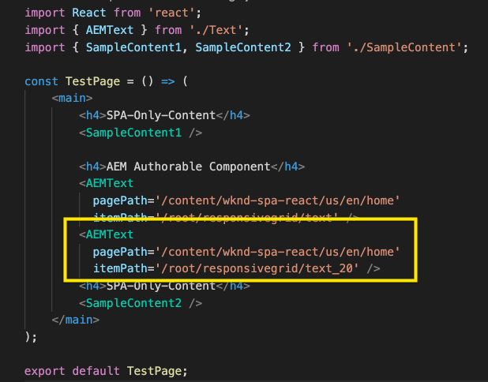

# AEM에서 외부 SPA 편집 {#editing-external-spa-within-aem}

결정할 때 [통합 수준](/help/implementing/developing/headful-headless.md) 외부 SPA과 AEM 사이에 두고 싶을 때, AEM 내에서 SPA을 보고 편집할 수도 있어야 합니다.

## 개요 {#overview}

이 문서에서는 독립 실행형 SPA을 AEM 인스턴스에 업로드하고 편집 가능한 컨텐츠 섹션을 추가하고 작성을 활성화하기 위한 권장 단계에 대해 설명합니다.

## 사전 요구 사항 {#prerequisites}

전제 조건은 간단합니다.

* AEM 인스턴스가 로컬에서 실행 중인지 확인합니다.
* 을 사용하여 기본 AEM SPA 프로젝트 만들기 [AEM 프로젝트 원형.](https://experienceleague.adobe.com/docs/experience-manager-core-components/using/developing/archetype/overview.html?#available-properties)
   * 이렇게 하면 외부 SPA을 포함하도록 업데이트되는 AEM 프로젝트의 기반이 됩니다.
   * 이 문서의 샘플은 [WKND SPA 프로젝트.](https://experienceleague.adobe.com/docs/experience-manager-learn/sites/spa-editor/spa-editor-framework-feature-video-use.html#spa-editor)
* 즉시 통합하려는 작동하는 외부 React SPA이 있어야 합니다.

## AEM Project에 SPA 업로드 {#upload-spa-to-aem-project}

먼저 외부 SPA을 AEM 프로젝트에 업로드해야 합니다.

1. 바꾸기 `src` 에서 `/ui.frontend` React 응용 프로그램의 프로젝트 폴더 `src` 폴더를 입력합니다.
1. 앱의 `package.json` 에서 `/ui.frontend/package.json` 파일.
   * SPA SDK 종속성이 [권장 버전.](/help/implementing/developing/hybrid/getting-started-react.md#dependencies)
1. 에 사용자 지정 사항을 포함하십시오 `/public` 폴더를 입력합니다.
1. 에 추가된 인라인 스크립트 또는 스타일을 포함합니다 `/public/index.html` 파일.

## 원격 SPA 구성 {#configure-remote-spa}

외부 SPA이 AEM 프로젝트의 일부이므로 AEM 내에서 구성해야 합니다.

### Adobe SPA SDK 패키지 포함 {#include-spa-sdk-packages}

AEM SPA 기능을 사용하기 위해 다음 세 가지 패키지에 종속성이 있습니다.

* [`@adobe/aem-react-editable-components`](https://github.com/adobe/aem-react-editable-components)
* [`@adobe/aem-spa-component-mapping`](https://www.npmjs.com/package/@adobe/aem-spa-component-mapping)
* [`@adobe/aem-spa-page-model-manager`](https://www.npmjs.com/package/@adobe/aem-spa-model-manager)

`@adobe/aem-spa-page-model-manager` 는 모델 관리자를 초기화하고 AEM 인스턴스에서 모델을 검색하기 위한 API를 제공합니다. 그런 다음 이 모델을 사용하여 API를 사용하여 AEM 구성 요소를 렌더링할 수 있습니다 `@adobe/aem-react-editable-components` 및 `@adobe/aem-spa-component-mapping`.

#### 설치 {#installation}

다음 npm 명령을 실행하여 필요한 패키지를 설치합니다.

```shell
npm install --save @adobe/aem-spa-component-mapping @adobe/aem-spa-page-model-manager @adobe/aem-react-editable-components
```

### ModelManager 초기화 {#model-manager-initialization}

앱이 렌더링되기 전에 [`ModelManager`](/help/implementing/developing/hybrid/blueprint.md#pagemodelmanager) AEM 생성을 처리하려면 초기화해야 합니다. `ModelStore`.

이 작업은 내에서 수행해야 합니다 `src/index.js` 응용 프로그램의 파일 또는 응용 프로그램의 루트가 렌더링되는 모든 위치의 파일입니다.

이를 위해 `initializationAsync` 에서 제공하는 API `ModelManager`.

다음 스크린샷에서는 `ModelManager` ( 간단한 React 애플리케이션) 유일한 제약조건은 `initializationAsync` 를 호출해야 함 `ReactDOM.render()`.


이 예에서 `ModelManager` 가 초기화되어 비어 있음 `ModelStore` 가 만들어집니다.

`initializationAsync` 원할 경우 수락할 수 있습니다 `options` 개체를 매개 변수로 사용합니다.

* `path` - 초기화 시 정의된 경로의 모델을 가져와 `ModelStore`. 이 옵션은 를 가져오는 데 사용할 수 있습니다 `rootModel` 필요한 경우 초기화합니다.
* `modelClient` - 모델을 가져올 책임이 있는 사용자 지정 클라이언트를 제공할 수 있습니다.
* `model` - A `model` 매개 변수로 전달된 개체 [SSR 사용.](/help/implementing/developing/hybrid/ssr.md)

### AEM 작성 가능한 리프 구성 요소 {#authorable-leaf-components}

1. 작성 가능한 React 구성 요소가 생성될 AEM 구성 요소를 생성/식별합니다. 이 예에서는 WKND 프로젝트의 텍스트 구성 요소를 사용합니다.

   

1. SPA에서 간단한 React 텍스트 구성 요소를 만듭니다. 이 예제에서는 새 파일을 만듭니다 `Text.js` 이(가) 다음 콘텐츠로 작성되었습니다.

   

1. AEM 편집을 활성화하는 데 필요한 속성을 지정할 구성 객체를 만듭니다.

   

   * `resourceType` 은 React 구성 요소를 AEM 구성 요소에 매핑하고 AEM 편집기에서 열 때 편집을 활성화해야 합니다.

1. 래퍼 함수 사용 `withMappable`.

   

   이 래퍼 함수는 React 구성 요소를 AEM에 매핑합니다 `resourceType` 구성에 지정되며 AEM 편집기에서 열 때 편집 기능을 활성화합니다. 독립형 구성 요소의 경우 특정 노드에 대한 모델 컨텐츠도 가져옵니다.

   >[!NOTE]
   >
   >이 구성 요소에는 별도의 버전의 가 있습니다. AEM 래핑된 및 래핑되지 않은 React 구성 요소입니다. 구성 요소를 명시적으로 사용할 때는 래핑된 버전을 사용해야 합니다. 구성 요소가 페이지의 일부인 경우 SPA 편집기에서 현재 수행한 대로 기본 구성 요소를 계속 사용할 수 있습니다.

1. 구성 요소에서 컨텐츠를 렌더링합니다.

   텍스트 구성 요소의 JCR 속성은 AEM에서 다음과 같이 표시됩니다.

   

   이러한 값은 새로 만든 속성에 전달됩니다 `AEMText` React 구성 요소 및 를 사용하여 컨텐츠를 렌더링할 수 있습니다.

   ```javascript
   import React from 'react';
   import { withMappable } from '@adobe/aem-react-editable-components';
   
   export const TextEditConfig = {
       // Empty component placeholder label
       emptyLabel:'Text', 
       isEmpty:function(props) {
          return !props || !props.text || props.text.trim().length < 1;
       },
       // resourcetype of the AEM counterpart component
       resourceType:'wknd-spa-react/components/text'
   };
   
   const Text = ({ text }) => (<div>{text}</div>);
   
   export default Text;
   
   export const AEMText = withMappable(Text, TextEditConfig);
   ```

   AEM 구성이 완료되면 구성 요소가 표시되는 방식입니다.

   ```javascript
   const Text = ({ cqPath, richText, text }) => {
      const richTextContent = () => (
         <div className="aem_text" id={cqPath.substr(cqPath.lastIndexOf('/') + 1)} data-rte-editelement dangerouslySetInnerHTML={{__html: text}}/>
      );
      return richText ? richTextContent() : (<div className="aem_text">{text}</div>);
   };
   ```

   >[!NOTE]
   >
   >이 예에서는 기존 텍스트 구성 요소와 일치하도록 렌더링된 구성 요소에 대한 추가 사용자 지정을 수행했습니다. 하지만 AEM의 작성과 관련이 없습니다.

#### 페이지에 작성 가능한 구성 요소 추가 {#add-authorable-component-to-page}

작성 가능한 React 구성 요소가 만들어지면 애플리케이션 전체에서 사용할 수 있습니다.

WKND SPA 프로젝트에서 텍스트를 추가해야 하는 예제 페이지를 예로 들어 보겠습니다. 이 예제에서는 &quot;Hello World!&quot; 텍스트를 표시하려고 합니다. on `/content/wknd-spa-react/us/en/home.html`.

1. 표시할 노드의 경로를 결정합니다.

   * `pagePath`: 이 예에서 노드가 포함된 페이지입니다 `/content/wknd-spa-react/us/en/home`
   * `itemPath`: 이 예에서 페이지 내의 노드에 대한 경로 `root/responsivegrid/text`
      * 페이지의 포함 항목 이름으로 구성됩니다.

   

1. 페이지에서 필요한 위치에 구성 요소를 추가합니다.

   

   다음 `AEMText` 구성 요소는 를 사용하는 페이지 내의 필요한 위치에 추가할 수 있습니다. `pagePath` 및 `itemPath` 값이 속성으로 설정됩니다. `pagePath` 는 필수 속성입니다.

#### AEM에서 텍스트 컨텐츠 편집 확인 {#verify-text-edit}

이제 실행 중인 AEM 인스턴스에서 구성 요소를 테스트할 수 있습니다.

1. 다음 Maven 명령을 `aem-guides-wknd-spa` 프로젝트를 빌드하고 AEM에 배포할 디렉터리입니다.

```shell
mvn clean install -PautoInstallSinglePackage
```

1. AEM 인스턴스에서 다음 위치로 이동합니다. `http://<host>:<port>/editor.html/content/wknd-spa-react/us/en/home.html`.


다음 `AEMText` 이제 AEM에서 구성 요소를 작성할 수 있습니다.

### AEM 작성 가능한 페이지 {#aem-authorable-pages}

1. SPA에서 작성할 페이지를 식별합니다. 이 예에서는 을 사용합니다 `/content/wknd-spa-react/us/en/home.html`.
1. 새 파일 만들기(예: `Page.js`) 내의 아무 곳에나 삽입할 수 있습니다. 여기에서 제공된 페이지 구성 요소를 다시 사용할 수 있습니다 `@adobe/cq-react-editable-components`.
1. 섹션에서 4단계를 반복합니다 [AEM 작성 가능한 리프 구성 요소.](#authorable-leaf-components) 래퍼 함수 사용 `withMappable` 추가 작업이 필요합니다.
1. 이전에 수행한 대로 적용합니다. `MapTo` 페이지 내의 모든 하위 구성 요소에 대한 AEM 리소스 유형.

   ```javascript
   import { Page, MapTo, withMappable } from '@adobe/aem-react-editable-components';
   import Text, { TextEditConfig } from './Text';
   
   export default withMappable(Page);
   
   MapTo('wknd-spa-react/components/text')(Text, TextEditConfig);
   ```

   >[!NOTE]
   >
   >이 예에서는 래핑된 텍스트 구성 요소 대신 래핑되지 않은 React 텍스트 구성 요소를 사용합니다 `AEMText` 이전에 만든 것입니다. 구성 요소가 페이지/컨테이너의 일부이며 독립 실행형 이 아닌 경우 컨테이너는 구성 요소를 재귀적으로 매핑하고 작성 기능을 활성화하며 각 하위 항목에 추가 래퍼가 필요하지 않기 때문입니다.

1. SPA에서 작성 가능한 페이지를 추가하려면 섹션의 동일한 단계를 따르십시오 [페이지에 작성 가능한 구성 요소 를 추가합니다.](#add-authorable-component-to-page) 여기에서 을 건너뛸 수 있습니다 `itemPath` 하지만 속성은 다음 중 하나일 수 있습니다.

#### AEM에서 페이지 컨텐츠 확인 {#verify-page-content}

페이지를 편집할 수 있는지 확인하려면 섹션에서 동일한 단계를 수행합니다 [AEM에서 텍스트 컨텐츠 편집을 확인합니다.](#verify-text-edit)


이제 레이아웃 컨테이너 및 하위 텍스트 구성 요소로 AEM에서 페이지를 편집할 수 있습니다.

### 가상 리프 구성 요소 {#virtual-leaf-components}

이전 예에서는 기존 AEM 컨텐츠가 있는 SPA에 구성 요소를 추가했습니다. 그러나 AEM에서 아직 컨텐츠를 만들지 않았지만 나중에 컨텐츠 작성자가 추가해야 하는 경우가 있습니다. 이를 수용하기 위해 프런트 엔드 개발자는 SPA 내의 적절한 위치에 구성 요소를 추가할 수 있습니다. 이러한 구성 요소는 AEM의 편집기에서 열 때 자리 표시자를 표시합니다. 컨텐츠 작성자가 이러한 자리 표시자 내에 컨텐츠를 추가하면 노드는 JCR 구조로 만들어지고 컨텐츠는 유지됩니다. 생성된 구성 요소는 독립형 리프 구성 요소와 동일한 작업 세트를 허용합니다.

이 예에서는 다음과 같이 바꿉니다 `AEMText` 이전에 만든 구성 요소입니다. WKND 홈 페이지의 기존 텍스트 구성 요소 아래에 새 텍스트를 추가하려고 합니다. 컴포넌트의 추가는 일반적인 리프 컴포넌트와 동일합니다. 하지만, `itemPath` 새 구성 요소를 추가해야 하는 경로로 업데이트할 수 있습니다.

새 구성 요소를 의 기존 텍스트 아래에 추가해야 하므로 `root/responsivegrid/text`로 지정하는 경우 새 경로는 다음과 같습니다. `root/responsivegrid/{itemName}`.

```html
<AEMText
 pagePath='/content/wknd-spa-react/us/en/home'
 itemPath='root/responsivegrid/text_20' />
```

다음 `TestPage` 구성 요소는 가상 구성 요소를 추가한 후 다음과 같습니다.



>[!NOTE]
>
>다음을 확인합니다. `AEMText` 구성 요소 `resourceType` 구성에서 이 기능을 사용하도록 설정합니다.

이제 섹션의 단계에 따라 AEM에 변경 사항을 배포할 수 있습니다 [AEM에서 텍스트 컨텐츠 편집을 확인합니다.](#verify-text-edit) 현재 존재하지 않는 위치에 대한 자리 표시자가 표시됩니다 `text_20` 노드 아래에 있어야 합니다.


컨텐츠 작성자가 이 구성 요소를 업데이트하면 새 `text_20` 노드 작성 위치 `root/responsivegrid/text_20` in `/content/wknd-spa-react/us/en/home`.


#### 요구 사항 및 제한 사항 {#limitations}

가상 리프 구성 요소를 추가하기 위한 요구 사항에는 몇 가지 제한 사항이 있습니다.

* 다음 `pagePath` 속성은 가상 구성 요소를 만드는 데 필수입니다.
* 의 경로에 제공된 페이지 노드입니다 `pagePath` AEM 프로젝트에 있어야 합니다.
* 만들 노드의 이름은 `itemPath`.
* 구성 요소는 모든 수준에서 만들 수 있습니다.
   * Adobe에서 `itemPath='text_20'` 앞의 예에서, 새 노드는 페이지 즉, `/content/wknd-spa-react/us/en/home/jcr:content/text_20`
* 새 노드를 만드는 노드의 경로는 를 통해 제공할 때 유효해야 합니다 `itemPath`.
   * 이 예제에서는 `root/responsivegrid` 새 노드가 존재해야 함 `text_20` 여기에서 만들 수 있습니다.
* 리프 구성 요소 생성만 지원됩니다. 가상 컨테이너 및 페이지는 향후 버전에서 지원됩니다.

### 가상 컨테이너 {#virtual-containers}

해당 컨테이너가 아직 AEM에서 만들어지지 않았더라도 컨테이너를 추가하는 기능이 지원됩니다. 개념과 접근 방식은 [가상 리프 구성 요소.](#virtual-leaf-components)

프런트엔드 개발자는 SPA 내의 적절한 위치에 컨테이너 구성 요소를 추가할 수 있으며, 이러한 구성 요소는 AEM에서 편집기에서 열면 자리 표시자를 표시합니다. 그런 다음 작성자는 구성 요소 및 해당 컨텐츠를 컨테이너에 추가하여 JCR 구조에서 필요한 노드를 만들 수 있습니다.

예를 들어 컨테이너가에 이미 존재하는 경우 `/root/responsivegrid` 개발자가 새 하위 컨테이너를 추가하려고 합니다.


`newContainer` AEM에 아직 존재하지 않습니다.

AEM에서 이 구성 요소가 포함된 페이지를 편집할 때 작성자가 컨텐츠를 추가할 수 있는 컨테이너에 대한 빈 자리 표시자가 표시됩니다.


작성자가 컨테이너에 하위 구성 요소를 추가하면 JCR 구조에 해당 이름을 사용하여 새 컨테이너 노드가 만들어집니다.


작성자가 요구하고 변경 사항이 유지되므로 이제 더 많은 구성 요소 및 컨텐츠를 컨테이너에 추가할 수 있습니다.

#### 요구 사항 및 제한 사항 {#container-limitations}

가상 컨테이너를 추가하기 위한 요구 사항에는 몇 가지 제한 사항이 있습니다.

* 추가할 수 있는 구성 요소를 결정하는 정책은 상위 컨테이너에서 상속됩니다.
* 만들 컨테이너의 바로 위 상위가 AEM에 이미 있어야 합니다.
   * 컨테이너 `root/responsivegrid` AEM 컨테이너에 이미 존재하는 경우 경로를 제공하여 새 컨테이너를 만들 수 있습니다 `root/responsivegrid/newContainer`.
   * 하지만 `root/responsivegrid/newContainer/secondNewContainer` 는 가능하지 않습니다.
* 한 번에 하나의 새로운 구성 요소 수준만 만들 수 있습니다.

## 추가 사용자 지정 {#additional-customizations}

이전 예를 따라간 경우 이제 외부 SPA을 AEM 내에서 편집할 수 있습니다. 그러나 사용자 지정할 수 있는 외부 SPA의 추가 측면이 있습니다.

### 루트 노드 ID {#root-node-id}

기본적으로 React 애플리케이션이 `div` 요소 ID의 `spa-root`. 필요한 경우 사용자 지정할 수 있습니다.

예를 들어 애플리케이션이 `div` 요소 ID의 `root`. 이 기능은 세 개의 파일에 반영되어야 합니다.

1. 에서 `index.js` React 응용 프로그램의 경우(또는 `ReactDOM.render()` 가 호출됨)

   

1. 에서 `index.html` React 애플리케이션의

   

1. 다음 두 단계를 통해 AEM 앱의 페이지 구성 요소 본문에서

   1. 새 만들기 `body.html` 페이지를 구성하는 데 사용됩니다.

   

   1. 새 루트 요소에 새 루트 요소 추가 `body.html` 파일.

   

### 공정순서를 사용하여 React SPA 편집 {#editing-react-spa-with-routing}

외부 React SPA 응용 프로그램에 여러 페이지가 있는 경우, [라우팅 을 사용하여 렌더링할 페이지/구성 요소를 결정할 수 있습니다.](/help/implementing/developing/hybrid/routing.md) 기본 사용 사례는 경로에 제공된 경로와 현재 활성 URL을 일치시키는 것입니다. 이러한 라우팅 사용 응용 프로그램에서 편집을 사용하려면 AEM 관련 정보를 수용하도록 경로를 변환해야 합니다.

다음 예제에서는 두 페이지에 간단한 React 애플리케이션을 제공합니다. 렌더링할 페이지는 라우터에 제공된 경로를 활성 URL과 일치시켜 결정됩니다. 예를 들어, `mydomain.com/test`, `TestPage` 이 렌더링됩니다.


이 예제 SPA에서 AEM을 편집하려면 다음 단계를 수행해야 합니다.

1. AEM의 루트로 사용할 수준을 식별합니다.

   * 샘플에서는 SPA의 루트로 wknd-spa-react/us/en을 고려하고 있습니다. 즉, 해당 경로 이전의 모든 항목이 AEM 전용 페이지/콘텐츠임을 의미합니다.

1. 필요한 수준에서 새 페이지를 만듭니다.

   * 이 예제에서 편집할 페이지는 다음과 같습니다 `mydomain.com/test`. `test` 이 앱의 루트 경로에 있습니다. AEM에서 페이지를 만들 때도 이를 유지해야 합니다. 따라서 이전 단계에서 정의한 루트 수준에서 새 페이지를 만들 수 있습니다.
   * 새로 만든 페이지의 이름은 편집할 페이지와 같아야 합니다. 이 예제에서는 `mydomain.com/test`를 지정하는 경우 새로 만든 페이지는 `/path/to/aem/root/test`.

1. SPA 라우팅 내에 도움말을 추가합니다.

   * 새로 만든 페이지는 아직 AEM에서 예상 콘텐츠를 렌더링하지 않습니다. 라우터에 `/test` 반면에 AEM 활성 경로는 `/wknd-spa-react/us/en/test`. URL의 AEM 특정 부분을 수용하려면 SPA 측에 몇 가지 도우미를 추가해야 합니다.

   

   * 다음 `toAEMPath` 도우미 제공 `@adobe/cq-spa-page-model-manager` 사용할 수 있습니다. AEM 인스턴스에서 애플리케이션이 열려 있을 때 라우팅에 제공된 경로가 AEM 특정 부분을 포함하도록 변형됩니다. 여기에서는 다음 세 가지 매개 변수를 사용할 수 있습니다.
      * 라우팅에 필요한 경로
      * SPA이 편집된 AEM 인스턴스의 원본 URL
      * 첫 번째 단계에서 결정된 대로 AEM의 프로젝트 루트입니다
   * 이러한 값을 환경 변수로 설정하여 보다 유연하게 대처할 수 있습니다.


1. AEM에서 페이지 편집을 확인합니다.

   * 프로젝트를 AEM에 배포하고 새로 만든 페이지로 이동합니다 `test` 페이지. 이제 페이지 컨텐츠가 렌더링되고 AEM 구성 요소를 편집할 수 있습니다.

## 추가 리소스 {#additional-resources}

다음 참조 자료는 AEM 컨텍스트에서 SPA을 이해하는 데 도움이 될 수 있습니다.

* [AEM Headful 및 Headless](/help/implementing/developing/headful-headless.md)
* [AEM 프로젝트 원형](https://experienceleague.adobe.com/docs/experience-manager-core-components/using/developing/archetype/overview.html)
* [WKND SPA 프로젝트](https://experienceleague.adobe.com/docs/experience-manager-learn/sites/spa-editor/spa-editor-framework-feature-video-use.html)
* [React를 사용하여 AEM에서 SPA 시작하기](/help/implementing/developing/hybrid/getting-started-react.md)
* [SPA 참조 자료(API 참조)](/help/implementing/developing/hybrid/reference-materials.md)
* [SPA 블루프린트 및 PageModelManager](/help/implementing/developing/hybrid/blueprint.md#pagemodelmanager)
* [SPA 모델 라우팅](/help/implementing/developing/hybrid/routing.md)
* [SPA 및 서버측 렌더링](/help/implementing/developing/hybrid/ssr.md)
