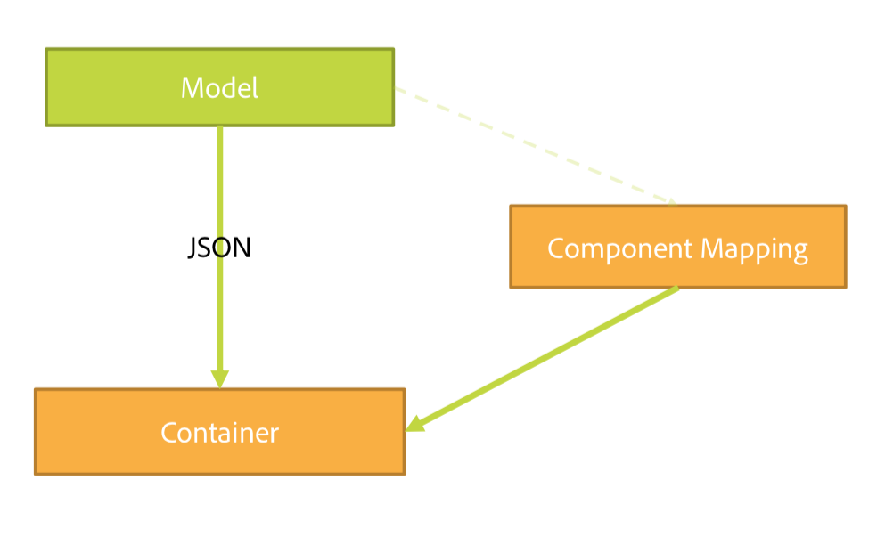
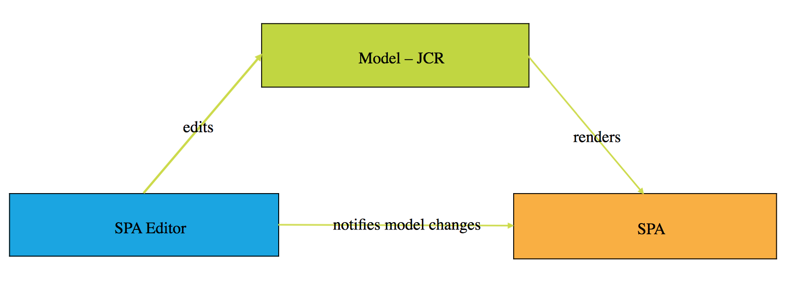

# SPA 편집기 개요 {#spa-editor-overview}

SPA(단일 페이지 애플리케이션)는 웹 사이트 사용자에게 적합한 멋진 경험을 제공할 수 있습니다. 개발자는 SPA 프레임워크를 사용하여 사이트를 작성하려고 하며 작성자는 해당 프레임워크를 통해 빌드된 사이트의 AEM 내에서 콘텐츠를 원활하게 편집하려고 합니다.

SPA 편집기는 AEM 내에서 SPA를 지원하는 복합 솔루션을 제공합니다. 이 페이지에서는 AEM에서 SPA 지원이 구조화되는 방식, SPA 편집기가 작동하는 방식, SPA 프레임워크와 AEM이 동기화되는 방식에 대한 개요를 제공합니다.

## 소개 {#introduction}

React, Angular와 같은 일반적인 SPA 프레임워크를 사용하여 빌드한 사이트는 동적 JSON을 통해 콘텐츠를 로드하고 AEM 페이지 편집기에서 편집 컨트롤을 배치하는 데 필요한 HTML 구조를 제공하지 않습니다.

AEM 내에서 SPA 편집 기능을 활성화하려면 SPA의 JSON 출력과 AEM 저장소의 콘텐츠 모델 간에 매핑을 사용하여 콘텐츠에 대한 변경 사항을 저장해야 합니다.

AEM의 SPA 지원을 통해 페이지 편집기에 로드하는 경우 SPA JS 코드와 상호 작용하는 얇은 JS 레이어를 도입하여 이벤트를 전송할 수 있고 편집 컨트롤 위치를 활성화하여 상황에 맞게 편집할 수 있습니다. 콘텐츠 서비스를 통해 SPA의 콘텐츠를 로드해야 하므로 이 기능이 콘텐츠 서비스 API 엔드포인트 개념에 빌드됩니다.

AEM의 SPA에 대한 자세한 내용은 다음 문서를 참조하십시오.

* SPA 기술 요구 사항에 대한 [SPA 블루프린트](blueprint.md)
* React를 통해 간단히 SPA를 둘러보기 위해 [React를 사용하여 AEM에서 SPA 시작하기](getting-started-react.md)
* Angular를 통해 간단히 SPA를 둘러보기 위해 [Angular를 사용하여 AEM에서 SPA 시작하기](getting-started-angular.md)

## 디자인 {#design}

SPA에 대한 페이지 구성 요소는 JSP 또는 HTL 파일을 통해 하위 구성 요소의 HTML 요소를 제공하지 않습니다. 이 작업은 SPA 프레임워크에 위임됩니다. 하위 구성 요소 또는 모델 표현은 JCR의 JSON 데이터 구조로 가져옵니다. 그런 다음 SPA 구성 요소는 해당 구조에 따라 페이지에 추가됩니다. 이 비헤이비어는 SPA가 아닌 구성 요소에서 페이지 구성 요소의 초기 본문 구성을 구별합니다.

### 페이지 모델 관리 {#page-model-management}

페이지 모델의 해상도와 관리는 제공되는 `PageModel`라이브러리에 위임됩니다. SPA 편집기에서 SPA를 초기화하고 작성하려면 모델 라이브러리를 사용해야 합니다. `aem-react-editable-components` npm을 통해 AEM 페이지 구성 요소에 페이지 모델 라이브러리를 간접적으로 제공합니다. 페이지 모델은 AEM과 SPA 사이의 인터프리터이므로 항상 있어야 합니다. 페이지가 작성되면 페이지 편집기와 통신할 수 있도록 추가 라이브러리 `cq.authoring.pagemodel.messaging`을 추가해야 합니다.

SPA 페이지 구성 요소가 페이지 핵심 구성 요소로부터 상속받는 경우 `cq.authoring.pagemodel.messaging` 클라이언트 라이브러리 범주를 사용할 수 있는 두 가지 옵션이 있습니다.

* 템플릿이 편집 가능한 경우 페이지 정책에 추가합니다.
* 또는 `customfooterlibs.html`을 사용하여 범주를 추가합니다.

SPA는 내보낸 모델의 각 리소스에 대한 렌더링을 수행할 실제 구성 요소를 매핑합니다. JSON으로 표시되는 모델은 컨테이너 내 구성 요소 매핑을 통해 렌더링됩니다.

>[!CAUTION]
>
>`cq.authoring.pagemodel.messaging` 범주 포함은 SPA 편집기의 컨텍스트로 제한되어야 합니다.

### 커뮤니케이션 데이터 유형 {#communication-data-type}

`cq.authoring.pagemodel.messaging`범주가 페이지에 추가되면 메시지를 페이지 편집기에 전송하여 JSON 통신 데이터 유형을 설정합니다. 통신 데이터 유형이 JSON으로 설정되면 GET 요청은 구성 요소의 Sling 모델 엔드포인트와 통신합니다. 업데이트가 페이지 편집기에서 발생하면 업데이트된 구성 요소의 JSON 표현식이 페이지 모델 라이브러리에 전송됩니다. 그런 다음 페이지 모델 라이브러리는 SPA에 업데이트를 알립니다.

## 워크플로 {#workflow}

SPA 편집기를 SPA와 AEM 간의 중재자로 간주하여 두 사이의 상호 작용 흐름을 이해할 수 있습니다.

* HTML 대신 JSON을 사용하여 페이지 편집기와 SPA 간의 통신이 이뤄집니다.
* 페이지 편집기는 iframe과 메시지 API를 통해 최신 버전의 페이지 모델을 SPA에 제공합니다.
* 페이지 모델 관리자는 편집할 준비가 되었음을 편집자에게 알리고 페이지 모델을 JSON 구조로 전달합니다.
* 편집기는 작성 중인 페이지의 DOM 구조를 변경하거나 액세스하지 않으며 최신 페이지 모델을 제공합니다.

### 기본 SPA 편집기 워크플로 {#basic-spa-editor-workflow}

SPA 편집기의 핵심 요소에 중점을 두면 AEM 내 SPA를 편집하는 높은 수준의 워크플로가 다음과 같이 작성자에게 표시됩니다.

1. SPA 편집기가 로드됩니다.
1. SPA는 별도의 프레임에 로드됩니다.
1. SPA는 JSON 콘텐츠를 요청하고 클라이언트측 구성 요소를 렌더링합니다.
1. SPA 편집기는 렌더링된 구성 요소를 감지하고 오버레이를 생성합니다.
1. 작성자가 오버레이를 클릭하면 구성 요소의 편집 도구 모음이 표시됩니다.
1. 서버에 대한 POST 요청이 있는 경우 SPA 편집기는 편집을 유지합니다.
1. SPA 편집기는 SPA 편집기에 업데이트된 JSON을 요청하고 DOM 이벤트와 함께 SPA에 전송합니다.
1. SPA는 문제가 있는 구성 요소를 다시 렌더링하여 DOM을 업데이트합니다.

>[!NOTE]
>
>다음 사항에 주의하십시오.
>
>* SPA는 항상 디스플레이를 담당합니다.
>* SPA 편집기는 SPA 자체와 분리되어 있습니다.
>* 프로덕션(게시)에서는 SPA 편집기가 로드되지 않습니다.

### 클라이언트-서버 페이지 편집 워크플로 {#client-server-page-editing-workflow}

이는 SPA 편집 시 제공되는 클라이언트-서버 상호 작용에 대한 자세한 개요입니다.

1. SPA는 자체 초기화하고 Sling 모델 내보내기에서 페이지 모델을 요청합니다.
1. Sling 모델 내보내기는 저장소에서 페이지를 구성하는 리소스를 요청합니다.
1. 저장소는 리소스를 반환합니다.
1. Sling 모델 내보내기는 페이지의 모델을 반환합니다.
1. SPA는 페이지 모델을 기반으로 구성 요소를 인스턴스화합니다.
1. **6a** 콘텐츠는 작성할 준비가 되었음을 편집기에 알려 줍니다.

   **6b** 페이지 편집기는 구성 요소 작성 구성을 요청합니다.

   **6c** 페이지 편집기는 구성 요소 구성을 수신합니다.
1. 작성자가 구성 요소를 편집하면 페이지 편집기는 수정 요청을 기본 POST 서블릿에 게시합니다.
1. 리소스가 저장소에서 업데이트됩니다.
1. 업데이트된 리소스는 POST 서블릿에 제공됩니다.
1. 기본 POST 서블릿은 리소스가 업데이트되었음을 페이지 편집기에 알려 줍니다.
1. 페이지 편집기는 새 페이지 모델을 요청합니다.
1. 페이지를 구성하는 리소스가 저장소에서 요청됩니다.
1. 저장소에서 페이지를 구성하는 리소스를 Sling 모델 내보내기에 제공합니다.
1. 업데이트된 페이지 모델이 편집기에 반환됩니다.
1. 페이지 편집기는 SPA의 페이지 모델 참조를 업데이트합니다.
1. SPA는 새 페이지 모델 참조를 기반으로 구성 요소를 업데이트합니다.
1. 페이지 편집기의 구성 요소 구성이 업데이트됩니다.

   **17a** SPA는 페이지 편집기에 콘텐츠를 준비하라는 신호를 보냅니다.

   **17b** 페이지 편집기는 SPA에 구성 요소 구성을 제공합니다.

   **17c** SPA는 업데이트된 구성 요소 구성을 제공합니다.

### 작성 워크플로 {#authoring-workflow}

작성 경험을 집중적으로 다루는 자세한 개요를 제공합니다.

1. SPA는 페이지 모델을 가져옵니다.
1. **2a** 페이지 모델은 작성에 필요한 데이터를 편집기에 제공합니다.

   **2b** 알림을 받으면 구성 요소 오케스트레이터는 페이지의 콘텐츠 구조를 업데이트합니다.
1. 구성 요소 오케스트레이터는 AEM 리소스 유형과 SPA 구성 요소 사이의 매핑을 쿼리합니다.
1. 구성 요소 오케스트레이터는 페이지 모델과 구성 요소 매핑을 기반으로 SPA 구성 요소를 동적으로 인스턴스화합니다.
1. 페이지 편집기는 페이지 모델을 업데이트합니다.
1. **6a** 페이지 모델은 업데이트된 작성 데이터를 페이지 편집기에 제공합니다.

   **6b** 페이지 모델은 변경 사항을 구성 요소 오케스트레이터에 발송합니다.
1. 구성 요소 오케스트레이터는 구성 요소 매핑을 가져옵니다.
1. 구성 요소 오케스트레이터는 페이지의 콘텐츠를 업데이트합니다.
1. SPA가 페이지 콘텐츠 업데이트를 완료하면 페이지 편집기는 작성 환경을 로드합니다.

## 요구 사항 및 제한 사항 {#requirements-limitations}

작성자가 SPA 콘텐츠를 편집할 수 있도록 페이지 편집기를 사용하려면 SPA 애플리케이션을 구현하여 AEM SPA Editor SDK와 상호 작용해야 합니다. 다음을 참조하십시오. [React를 사용하여 AEM에서 SPA 시작하기](getting-started-react.md) 문서화에서 실행하는 데 필요한 최소한의 정보만 제공합니다.

### 지원되는 프레임워크 {#supported-frameworks}

SPA Editor SDK는 다음의 최소 버전을 지원합니다.

* React 16.x 이상
* Angular 6.x 이상

해당 프레임워크의 이전 버전은 AEM SPA Editor SDK와 구동할 수 있지만 지원되지 않습니다.

### 추가 프레임워크 {#additional-frameworks}

AEM SPA Editor SDK와 구동할 수 있도록 추가 SPA 프레임워크를 구현할 수 있습니다. 다음을 참조하십시오. [SPA 블루프린트](blueprint.md) AEM SPA Editor에서 사용할 모듈, 구성 요소 및 서비스로 구성된 프레임워크별 계층을 만들기 위해 프레임워크가 충족해야 하는 요구 사항에 대한 문서입니다.

### 여러 선택기 사용 {#multiple-selectors}

추가 사용자 정의 선택기를 AEM SPA SDK용으로 개발된 SPA의 일부로 정의하고 사용할 수 있습니다. 단, 이 지원을 생성하려면 `model`선택기는 첫 번째 선택기가 되고 확장자는 JSON 내보내기의 요구 사항에 `.json`따라야 합니다.

### 텍스트 편집기 요구 사항 {#text-editor-requirements}

SPA에 생성된 텍스트 구성 요소의 내부 편집기를 사용하려면 추가 구성이 필요합니다.

1. 텍스트 HTML이 포함된 컨테이너 래퍼 요소의 속성(모든 속성일 수 있음)을 설정합니다. WKND SPA Project의 경우 `
` 요소이고 사용된 선택기는 `data-rte-editelement`입니다.
1. 해당 선택기(예: `data-rte-editelement`)를 가리키는 해당 AEM 텍스트 구성 요소의 `cq:InplaceEditingConfig`에서 구성 `editElementQuery`를 설정합니다. 이를 통해 편집기는 HTML 텍스트를 래핑하는 HTML 요소를 인식할 수 있습니다.

에 대한 추가 정보 `editElementQuery` 속성 및 리치 텍스트 편집기의 구성을 참조하십시오. [리치 텍스트 편집기 구성](/help/implementing/developing/extending/rich-text-editor.md).

### 제한 사항 {#limitations}

AEM SPA Editor SDK는 Adobe에서 완벽하게 지원하며, 지속적으로 강화되고 확장됩니다. 다음 AEM 기능은 SPA Editor에서 아직 지원하지 않습니다.

* 타겟 모드
* ContextHub
* 인라인 이미지 편집
* 구성 편집 (예: 리스너)
* 실행 취소 / 다시 실행
* 페이지 비교 및 시간 비틀기
* 링크 검사기, CDN 재작성 서비스, URL 단축 등 서버측 HTML 재작성 수행 기능
* 개발자 모드
* AEM 론치
