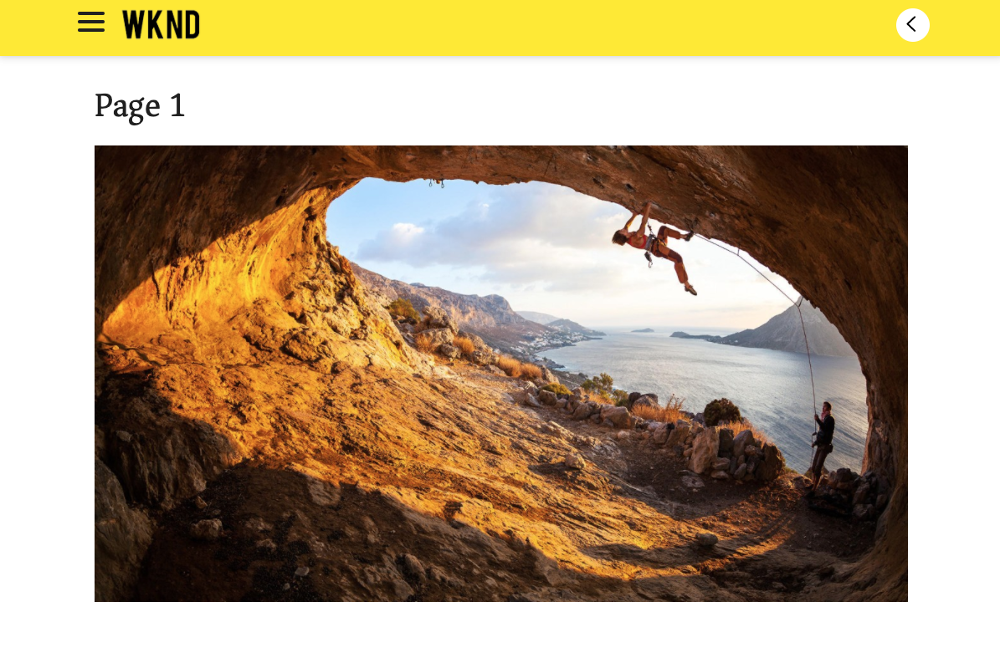

# SPA 소개 및 워크스루 {#spa-introduction}

SPA(단일 페이지 애플리케이션)는 웹 사이트 사용자에게 적합한 멋진 경험을 제공할 수 있습니다. 개발자는 SPA 프레임워크를 사용하여 사이트를 작성하려고 하며 작성자는 해당 프레임워크를 통해 빌드된 사이트의 AEM 내에서 콘텐츠를 원활하게 편집하려고 합니다.

SPA 편집기는 AEM 내에서 SPA를 지원하는 복합 솔루션을 제공합니다. 이 문서에서는 작성용 SPA 애플리케이션을 사용하는 과정을 안내하고 기본 AEM SPA 편집기와 관련되는 방식을 보여 줍니다.

## 소개 {#introduction}

### 문서 목표 {#article-objective}

이 문서에서는 SPA 편집기를 독자에게 설명하기 전에 간단한 SPA 애플리케이션을 통해 기본적인 콘텐츠 편집을 시연하여 SPA의 기본 개념을 소개합니다. 그런 다음 페이지 구성을 다루고 SPA 애플리케이션이 AEM SPA 편집기와 관련되는 방식과 상호 작용하는 방법에 대해 자세히 설명합니다.

이 소개 및 워크스루의 목표는 AEM 개발자에게 SPA가 관련이 있는 이유, 일반적인 작동 방식, AEM SPA 편집기에서 SPA를 처리하는 방법과 표준 AEM 애플리케이션과 어떤 차이가 있는지 보여 주는 것입니다.

## 요구 사항 {#requirements}

워크스루는 표준 AEM 기능 및 샘플 WKND SPA Project 앱을 기반으로 합니다. 워크스루와 함께 팔로우하려면 다음 사항을 사용할 수 있어야 합니다.

* [AEMaaCS의 최신 개발 SDK](/help/release-notes/release-notes-cloud/release-notes-current.md)
   * 로컬 개발 환경으로 실행해야 합니다.
   * 시스템에 대한 관리 권한이 있어야 합니다.
* [GitHub에서 사용 가능한 샘플 WKND SPA Project 앱](https://github.com/adobe/aem-guides-wknd-spa)
   * `wknd-spa-react.all-X.Y.Z-SNAPSHOT.zip`과 유사한 이름이 지정된 [최신 React 앱 릴리스](https://github.com/adobe/aem-guides-wknd-spa/releases)를 다운로드합니다.
   * `wknd-spa-sample-images-X.Y.Z.zip`과 유사한 이름이 지정된 [최신 앱 이미지](https://github.com/adobe/aem-guides-wknd-spa/releases)를 다운로드합니다.
   * [패키지 관리자를 사용](/help/implementing/developing/tools/package-manager.md)하여 AEM의 다른 패키지처럼 두 패키지를 모두 설치합니다.
   * 이 워크스루를 위해 Maven을 사용하여 앱을 설치할 필요는 없습니다.

>[!CAUTION]
>
>이 문서는 데모용으로만 [WKND SPA Project 앱](https://github.com/adobe/aem-guides-wknd-spa)을 사용합니다. 프로젝트 작업에 사용해서는 안 됩니다.

>[!TIP]
>
>AEM 프로젝트는 React 또는 Angular를 통해 SPA 프로젝트를 지원하고 SPA SDK를 사용하는 [AEM Project Archetype](https://experienceleague.adobe.com/docs/experience-manager-core-components/using/developing/archetype/overview.html)을 사용해야 합니다.

### SPA란 무엇입니까? {#what-is-a-spa}

단일 페이지 애플리케이션(SPA)은 데이터를 로드하여 페이지를 동적으로 업데이트하는 Ajax 호출을 통해 클라이언트측에서 렌더링되고 주로 JavaScript를 기반으로 하는 기존 페이지와 다릅니다. 페이지와의 사용자 상호 작용을 기반으로 필요에 따라 대부분의 콘텐츠나 모든 콘텐츠를 추가 리소스가 비동기적으로 로드된 단일 페이지 로드에서 한 번 검색합니다.

이렇게 하면 페이지 새로 고침의 필요성이 줄어들고 사용자에게 원활하고 빠르며 기본 앱 환경과 같은 경험을 제공할 수 있습니다.

AEM SPA 편집기를 통해 프론트엔드 개발자가 AEM 사이트에 통합할 수 있는 SPA를 만들게 되면 콘텐츠 작성자는 다른 AEM 콘텐츠와 같이 SPA 콘텐츠를 손쉽게 편집할 수 있습니다.

### 왜 SPA입니까? {#why-a-spa}

더 빠르고 유동적이며 기본 애플리케이션과 매우 유사한 SPA는 작동 방법의 특성으로 인해 웹 페이지 방문자뿐만 아니라 마케터와 개발자에게도 매우 매력적인 경험입니다.

#### 방문자 수 {#visitors}

* 방문자는 콘텐츠와 상호 작용할 때 네이티브와 같은 경험을 원합니다.
* 페이지가 빠를수록 전환될 가능성이 더 높아진다는 명확한 데이터가 있습니다.

#### 마케터 {#marketers}

* 마케터는 방문자 참여를 유도함으로써 다양하고 네이티브와 같은 경험을 제공하려고 합니다.
* 개인화는 이 경험을 더욱 매력적으로 만들 수 있습니다.

#### 개발자 {#developers}

* 개발자는 콘텐츠와 프레젠테이션 사이의 문제를 명확하게 구분하려고 합니다.
* 명확하게 구분하여 시스템을 좀 더 많이 확장 가능하게 하고, 독립적인 프론트엔드를 개발할 수 있습니다.

### SPA는 어떻게 작동합니까? {#how-does-a-spa-work}

SPA의 기본 아이디어는 서버 대기 시간으로 인한 지연을 최소화하기 위해 서버에 대한 호출과 종속성을 감소시켜 SPA가 기본 애플리케이션의 응답성에 접근하도록 하는 것입니다.

기존 순차적 웹 페이지에서는 직접적인 페이지에 필요한 데이터만 로드합니다. 즉, 방문자가 다른 페이지로 이동하는 경우 서버는 추가 리소스에 대해 호출됩니다. 방문자가 페이지의 요소와 상호 작용하는 경우 추가 호출이 필요할 수 있습니다. 해당 다중 호출은 페이지가 방문자의 요청을 확인하므로 지연 시간 또는 지연을 파악할 수 있습니다.

방문자가 모바일, 네이티브 앱에서 예상하는 부분과 유사한 보다 유동적인 경험을 갖기 위해 SPA는 첫 번째 로드에서 방문자가 원하는 모든 데이터를 로드합니다. 처음에는 시간이 다소 걸릴 수 있지만 서버 호출을 추가할 필요가 없습니다.

클라이언트측에서 렌더링하면 페이지 요소가 더 빠르게 반응하고 방문자 페이지와 상호 작용이 즉각적으로 이뤄집니다. 필요한 추가 데이터는 페이지 속도를 극대화하기 위해 비동기적으로 호출됩니다.

>[!TIP]
>
>AEM에서 SPA가 작동하는 방식에 대한 기술적인 세부 정보는 다음 문서를 참조하십시오.
>* [React를 사용하여 AEM에서 SPA 시작하기](getting-started-react.md)
>* [Angular를 사용하여 AEM에서 SPA 시작하기](getting-started-angular.md)
>
>SPA 편집기의 디자인, 아키텍처 및 기술 워크플로에 대한 자세한 내용은 다음 문서를 참조하십시오.
>* [SPA 편집기 개요](editor-overview.md).

## SPA를 통한 콘텐츠 편집 경험 {#content-editing-experience-with-spa}

SPA를 빌드하여 AEM SPA 편집기를 사용하는 경우 콘텐츠 작성자가 콘텐츠를 편집 및 생성할 때 차이가 감지되지 않습니다. 일반적인 AEM 기능을 사용할 수 있고 작성자의 워크플로를 변경할 수 없습니다.

1. AEM에서 WKND SPA Project 앱을 편집합니다.

   `http://localhost:4502/editor.html/content/wknd-spa-react/us/en/home.html`

   

1. 텍스트 구성 요소를 선택하면 다른 구성 요소와 마찬가지로 도구 모음이 표시됩니다. **편집**&#x200B;을 선택합니다.

   

1. AEM 내에서 콘텐츠를 정상적으로 편집하고 변경 사항이 지속되고 있는지 확인합니다.

   

1. 자산 브라우저를 사용하여 새 이미지를 이미지 구성 요소로 드래그 앤 드롭합니다.

   

1. 변경 사항이 지속됩니다.

   

페이지에서 추가 구성 요소 드래그 앤 드롭, 구성 요소 재정렬과 레이아웃 수정 등 추가 작성 도구는 SPA AEM이 아닌 애플리케이션으로 지원됩니다.

>[!NOTE]
>
>SPA 편집기는 애플리케이션의 DOM을 수정하지 않습니다. SPA는 자체 DOM을 담당합니다.
>
>이 작동 방식을 보려면 이 문서의 다음 섹션인 [SPA 앱 및 AEM SPA 편집기](#spa-apps-and-the-aem-spa-editor)로 계속 진행합니다.

## SPA 앱 및 AEM SPA 편집기 {#spa-apps-and-the-aem-spa-editor}

SPA가 최종 사용자에게 어떻게 동작하는지 경험한 다음 SPA 페이지를 검사하게 되면 AEM 내 SPA 편집기에서 SAP 앱이 작동하는 방식을 더 잘 파악할 수 있습니다.

### SPA 애플리케이션 사용 {#using-an-spa-application}

1. 게시 서버에서 또는 페이지 편집기의 **페이지 정보** 메뉴에서 **게시됨으로 보기** 옵션을 사용하여 WKND SPA 프로젝트 애플리케이션을 편집기에 로드합니다.

   `http://<host>:<port>/content/wknd-spa-react/us/en/home.html`

   

   하위 페이지 탐색, 메뉴와 문서 카드가 포함된 페이지 구조를 참고하십시오.

1. 메뉴를 사용하여 하위 페이지로 이동한 다음 페이지가 새로 고칠 필요 없이 즉시 로드되는지 확인합니다.

   

1. 브라우저 기본 제공 개발자 도구를 열고 하위 페이지를 탐색하면서 네트워크 활동을 모니터링합니다.

   

   앱에서 페이지 사이를 이동할 때 트래픽이 거의 없습니다. 페이지를 다시 로드하지 않고 새 이미지만 요청합니다.

   SPA는 전적으로 클라이언트측에서 콘텐츠와 라우팅을 관리합니다.

따라서 하위 페이지를 탐색할 때 페이지가 다시 로드되지 않으면 어떻게 로드해야 합니까?

다음 섹션 [SPA 애플리케이션 로드](#loading-a-spa-application)에서는 SPA 로드 메커니즘과 콘텐츠를 동기적으로 또는 비동기적으로 로드하는 방법에 대해 자세히 알아봅니다.

### SPA 애플리케이션 로드 {#loading-a-spa-application}

1. 아직 로드되지 않은 경우에는 게시 서버에서 또는 페이지 편집기의 **페이지 정보** 메뉴에서 **게시됨으로 보기** 옵션을 사용하여 WKND SPA 프로젝트 앱을 편집기에 로드합니다.

   `http://<host>:<port>/content/wknd-spa-react/us/en/home.html`

   

1. 브라우저 기본 제공 도구를 사용하여 페이지 소스를 봅니다.
1. 소스 콘텐츠는 제한되어 있습니다.
   * 페이지 본문에는 콘텐츠가 없습니다. 주로 스타일 시트와 `clientlib-react.min.js` 등 다양한 스크립트에 대한 호출로 구성됩니다.
   * 해당 스크립트는 이 애플리케이션의 기본 드라이버이고 모든 콘텐츠 렌더링을 담당합니다.

1. 브라우저 기본 내장 도구를 사용하여 페이지를 검사합니다. DOM 콘텐츠가 완전히 로드되어 있는지 확인합니다.

   

1. 검사기의 네트워크 탭으로 전환하고 페이지를 다시 로드합니다.

   이미지 요청을 무시하면서 페이지에 로드된 기본 리소스가 페이지 자체, CSS, React JavaScript, 해당 종속성과 페이지의 JSON 데이터인지 확인합니다.

   

1. 새 탭에 `home.model.json`을 로드합니다.

   `http://<host>:<port>/content/wknd-spa-react/us/en/home.model.json`

   

   AEM SPA 편집기는 [AEM Content Services](/help/sites-cloud/administering/content-fragments/content-fragments.md)를 사용하여 페이지 전체 콘텐츠를 JSON 모델로 제공합니다.

   특정 인터페이스를 구현하면 Sling 모델은 SPA에 필요한 정보를 제공합니다. JSON 데이터 게재가 각 구성 요소로 하향 위임됩니다(페이지 - 단락, 구성 요소 등).

   각 구성 요소는 노출되는 항목과 렌더링 방법을 선택합니다(HTL의 서버측 또는 React 또는 Angular의 클라이언트측). 이 문서는 React를 통해 클라이언트측 렌더링에 중점을 둡니다.

1. 또한 모델이 페이지를 그룹화할 경우 페이지를 동기적으로 로드하여 필요한 페이지 로드 횟수를 줄일 수 있습니다.

   방문자가 이 모든 페이지를 방문하므로 WKND SPA Project 앱 예에서 `home`, `page-1`, `page-2` 및 `page-3` 페이지를 동기적으로 로드합니다.

   이 비헤이비어는 필수 사항이 아니고 완전히 정의할 수 있습니다.

   

1. 비헤이비어의 이 차이를 확인하려면 `home` 페이지를 다시 로드하고 관리자의 네트워크 활동을 지웁니다. 페이지 메뉴의 `page-1`로 이동하여 유일한 네트워크 활동이 `page-1`의 이미지에 대한 요청인지 확인합니다. `page-1` 자체는 로드할 필요가 없습니다.

   

### SPA 편집기와의 상호 작용 {#interaction-with-the-spa-editor}

샘플 WKND SPA Project 애플리케이션을 통해 게시될 때 앱의 작동과 로드 방식을 분명히 파악하고 JSON 콘텐츠 게재와 리소스의 비동기식 로드에 콘텐츠 서비스를 활용합니다.

또한 콘텐츠 작성자는 SPA 편집기를 사용하여 AEM 내에서 콘텐츠를 원활하게 생성할 수 있습니다.

다음 섹션에서는 SPA 편집기가 SPA 내부 구성 요소를 AEM 구성 요소에 연결하여 원활한 편집 경험을 제공할 수 있는 계약 내용을 살펴봅니다.

1. WKND SPA 프로젝트 애플리케이션을 편집기에 로드하고 **미리보기** 모드로 전환합니다.

   `http://<host>:<port>/editor.html/content/wknd-spa-react/us/en/home.html`

1. 브라우저의 기본 제공 개발자 도구를 사용하여 페이지 콘텐츠를 검사합니다. 선택 도구를 사용하여 페이지에서 편집 가능한 구성 요소를 선택하고 요소 세부 정보를 조회합니다.

   구성 요소에는 새 데이터 속성 `data-cq-data-path`이 있습니다.

   

   예

   `data-cq-data-path="/content/wknd-spa-react/us/en/home/jcr:content/root/responsivegrid/text`

   이 경로를 통해 각 구성 요소의 편집 컨텍스트 구성 오브젝트를 검색하고 연결할 수 있습니다.

   이는 편집기가 SPA 내에서 편집 가능한 구성 요소로 인식하는 데 필요한 유일한 마크업 속성입니다. 이 속성을 기반으로 SPA 편집기는 구성 요소와 연결된 편집 가능한 구성을 결정하므로 올바른 프레임, 도구 모음 등이 로드됩니다.

   일부 특정 클래스 이름이 플레이스홀더 표기 및 자산 드래그 앤 드롭 기능에 추가되기도 합니다.

   >[!NOTE]
   >
   >이 비헤이비어는 편집 가능한 각 구성 `cq`요소에 삽입된 요소가 포함된 AEM의 서버측 렌더링된 페이지와 다릅니다.
   >
   >SPA 편집기에서 이 방식을 사용하면 사용자 정의 요소 삽입의 필요성을 제거하여 추가 데이터 속성만 사용하고 프론트엔드 개발자용 마크업을 간소화할 수 있습니다.

## AEM Headful 및 Headless {#headful-headless}

개발 및 유지 관리되는 AEM 외부 SPA를 포함하여 유연한 AEM 내부 통합 기능을 사용하여 SPA를 활성화할 수 있습니다. 또한 SPA를 AEM 내부에서 사용하는 동시에 AEM을 사용하여 콘텐츠를 Headless 방식으로 추가 엔드포인트에 게재할 수 있습니다.

>[!TIP]
>
>자세한 내용은 [AEM의 Headful과 Headless](/help/implementing/developing/headful-headless.md)설명서를 참조하십시오.

## 다음 단계 {#next-steps}

이제 AEM의 SPA 편집 환경과 SPA가 SPA 편집기와 관련되는 방식을 이해했으므로 SPA의 빌드 방법에 대해 자세히 알아볼 수 있습니다.

* [React를 사용하여 AEM에서 SPA 시작하기](getting-started-react.md) React를 통해 AEM에서 기본 SPA를 빌드하여 SPA 편집기에서 작업하는 방법을 표시함
* [Angular를 사용하여 AEM에서 SPA 시작하기](getting-started-angular.md) Angular를 통해 AEM에서 기본 SPA를 빌드하여 SPA 편집기에서 작업하는 방법을 표시함
* [SPA 편집기 개요](editor-overview.md)는 AEM과 SPA 간의 커뮤니케이션 모델에 대해 자세히 설명합니다.
* [AEM용 SPA 개발](developing.md)에서는 프론트엔드 개발자를 AEM용 SPA 개발에 유도하는 방법 및 SPA가 AEM의 아키텍처와 상호 작용하는 방법에 대해 설명합니다.
