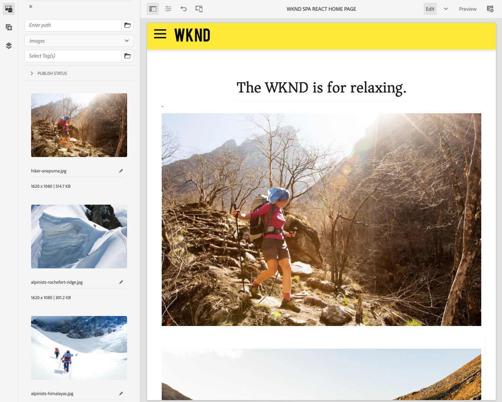

# SPA 소개 및 워크스루 {#spa-introduction}

SPA(단일 페이지 애플리케이션)는 웹 사이트 사용자에게 훌륭한 경험을 제공할 수 있습니다. 개발자는 SPA 프레임워크을 사용하여 사이트를 작성하려고 하며 작성자는 이러한 프레임워크를 사용하여 작성된 사이트의 AEM 내에서 컨텐츠를 원활하게 편집하려고 합니다.

SPA 편집기는 AEM 내에서 SPA을 지원하는 포괄적인 솔루션을 제공합니다. 이 문서에서는 작성을 위한 기본 SPA 애플리케이션을 사용하는 과정을 단계별로 살펴보고 기본 AEM SPA 편집기와 관련된 방법을 보여줍니다.

## 소개 {#introduction}

### 문서 목표 {#article-objective}

이 문서에서는 간단한 SPA 애플리케이션을 사용하여 기본 컨텐츠 편집 방법을 보여 주는 SPA 편집기의 연습을 통해 리더를 지휘하기 전에 SPA의 기본 개념을 소개합니다. 그런 다음 페이지 구성과 SPA 애플리케이션이 AEM SPA 편집기와 상호 작용하는 방법을 자세히 설명합니다.

이 소개 및 연습의 목표는 AEM 개발자에게 SPA이 적절한 이유, 일반적으로 작동하는 방법, AEM SPA 편집기에서 SPA을 처리하는 방법, 표준 AEM 애플리케이션과 어떻게 다른지를 보여 주기 위한 것입니다.

이 연습은 표준 AEM 기능과 샘플 WKND SPA Project 앱을 기반으로 합니다. 따라가려면, [gitHub에서 샘플 WKND SPA Project 앱을 다운로드하여 설치합니다.](https://github.com/adobe/aem-guides-wknd-spa)

>[!CAUTION]
>
>이 문서에서는 [WKND SPA 프로젝트 앱](https://github.com/adobe/aem-guides-wknd-spa) 를 사용하십시오. 프로젝트 작업에 사용해서는 안 됩니다.

>[!TIP]
>
>모든 AEM 프로젝트는 [AEM 프로젝트 원형](https://experienceleague.adobe.com/docs/experience-manager-core-components/using/developing/archetype/overview.html): React 또는 Angular을 사용하여 SPA 프로젝트를 지원하고 SPA SDK를 활용합니다.

### SPA란? {#what-is-a-spa}

단일 페이지 애플리케이션(SPA)은 클라이언트측에서 렌더링되고 주로 Javascript 기반이라는 기존 페이지와 다르며, Ajax 호출에 의존하여 데이터를 로드하고 페이지를 동적으로 업데이트합니다. 대부분의 또는 모든 컨텐츠는 페이지와의 사용자 상호 작용에 따라 필요에 따라 비동기식으로 로드되는 추가 리소스와 함께 단일 페이지 로드에서 한 번 검색됩니다.

이를 통해 페이지를 새로 고칠 필요가 줄어들고 사용자에게 매끄럽고 빠르며 기본 앱 환경과 같은 경험을 제공할 수 있습니다.

프런트엔드 개발자는 AEM SPA 편집기를 사용하여 AEM 사이트에 통합할 수 있는 SPA을 만들어 컨텐츠 작성자가 다른 AEM 컨텐츠처럼 쉽게 SPA 컨텐츠를 편집할 수 있습니다.

### 왜 SPA인가? {#why-a-spa}

빠르고 유동적이며 네이티브 애플리케이션과 유사하게 SPA은 웹 페이지의 방문자뿐만 아니라 SPA 작동 방식의 특성으로 인해 마케터와 개발자에게도 매우 매력적인 경험이 됩니다.

#### 방문자 수 {#visitors}

* 방문자가 콘텐츠와 상호 작용할 때 원주민들이 경험하는 것과 같은 경험을 원합니다.
* 페이지가 더 빠를 수록 전환이 더 많이 발생할 가능성이 높은 데이터가 있습니다.

#### 마케터 {#marketers}

* 마케터는 방문자를 컨텐츠에 전적으로 참여하도록 유도하기 위한 풍부한 네이티브 경험을 제공하기를 원합니다.
* 개인화는 이러한 경험을 더 매력적인 경험으로 만들 수 있습니다.

#### 개발자 {#developers}

* 개발자는 컨텐츠와 프레젠테이션에 대한 우려를 명확하게 구분해야 합니다.
* Clean Separation을 통해 시스템을 보다 확장 가능하고 별도의 프런트 엔드 개발을 수행할 수 있습니다.

### SPA은 어떻게 작동합니까? {#how-does-a-spa-work}

SPA의 기본 생각은 서버에 대한 호출과 종속성이 감소하여 서버 지연으로 인한 지연을 최소화하여 SPA이 기본 애플리케이션의 응답성에 근접한다는 것입니다.

기존의 순차적 웹 페이지에서 즉시 페이지에 필요한 데이터만 로드됩니다. 즉, 방문자가 다른 페이지로 이동할 때 추가 리소스를 위해 서버가 호출됩니다. 방문자가 페이지의 요소와 상호 작용하므로 추가 호출이 필요할 수 있습니다. 페이지가 방문자의 요청을 따라가야 하므로 이러한 여러 호출로 인해 지연 또는 지연이 발생할 수 있습니다.

방문자가 모바일, 기본 앱에서 예상하는 것에 접근하는 보다 유연한 환경을 위해 SPA은 첫 번째 로드 시 방문자를 위해 필요한 모든 데이터를 로드합니다. 처음에는 시간이 조금 더 걸릴 수 있지만 그렇게 되면 추가 서버 호출이 필요하지 않습니다.

클라이언트측에서 렌더링하면 페이지 요소가 더 빨리 반응하고 방문자가 페이지와의 상호 작용이 바로 나타납니다. 페이지 속도를 최대화하기 위해 필요한 추가 데이터는 비동기식으로 호출됩니다.

>[!TIP]
>
>AEM에서 SPA이 작동하는 방식에 대한 자세한 내용은 문서를 참조하십시오.
>* [React를 사용하여 AEM에서 SPA 시작하기](getting-started-react.md)
>* [angular을 사용하여 AEM에서 SPA 시작하기](getting-started-angular.md)
>
>SPA Editor의 디자인, 아키텍처 및 기술 워크플로우를 자세히 살펴보려면 문서를 참조하십시오.
>* [SPA 편집기 개요](editor-overview.md).

## SPA에서 경험 컨텐츠 편집 {#content-editing-experience-with-spa}

SPA을 AEM SPA 편집기를 활용하기 위해 빌드하면 컨텐츠 작성자는 컨텐츠를 편집하고 작성할 때 차이를 보이지 않습니다. 일반적인 AEM 기능을 사용할 수 있으며 작성자 워크플로우를 변경할 필요가 없습니다.

1. AEM에서 WKND SPA 프로젝트 앱을 편집합니다.

   `http://localhost:4502/editor.html/content/wknd-spa-react/us/en/home.html`

   

1. 텍스트 구성 요소를 선택하면 다른 구성 요소에 대해 도구 모음이 표시됩니다. **편집**&#x200B;을 선택하십시오.

   

1. 컨텐츠를 AEM 내에서 정상으로 편집하고 변경 사항은 유지됩니다.

   

1. 자산 브라우저를 사용하여 새 이미지를 이미지 구성 요소로 드래그 앤 드롭합니다.

   

1. 변경 내용은 지속됩니다.

   

페이지에서 추가 구성 요소 드래그 앤 드롭, 구성 요소 다시 정렬 및 레이아웃 수정과 같은 추가 작성 도구는 SPA이 아닌 모든 애플리케이션에서 지원됩니다.

>[!NOTE]
>
>SPA 편집기는 애플리케이션의 DOM을 수정하지 않습니다. SPA 자체는 DOM에 책임이 있습니다.
>
>이 작동 방식을 보려면 이 문서의 다음 섹션을 계속 진행합니다 [SPA 앱 및 AEM SPA 편집기](#spa-apps-and-the-aem-spa-editor).

## SPA 앱 및 AEM SPA 편집기 {#spa-apps-and-the-aem-spa-editor}

SPA이 최종 사용자에 대해 동작하는 방식을 경험하고 SPA 페이지를 검사하면 AEM에서 SPA 편집기와 SAP 앱이 작동하는 방식을 더 잘 이해할 수 있습니다.

### SPA 애플리케이션 사용 {#using-an-spa-application}

1. 게시 서버에서 또는 옵션을 사용하여 WKND SPA Project 애플리케이션을 로드합니다 **게시됨으로 보기** 에서 **페이지 정보** 메뉴 아래의 페이지 편집기:

   `http://<host>:<port>/content/wknd-spa-react/us/en/home.html`

   

   하위 페이지, 메뉴 및 문서 카드에 대한 탐색을 포함한 페이지 구조를 확인합니다.

1. 메뉴를 사용하여 하위 페이지로 이동하여 새로 고칠 필요 없이 페이지가 즉시 로드되는지 확인합니다.

   

1. 브라우저에 내장된 개발자 도구를 열고 하위 페이지를 탐색할 때 네트워크 활동을 모니터링합니다.

   

   앱에서 페이지로 이동하는 동안 트래픽이 거의 없습니다. 페이지가 다시 로드되지 않고 새 이미지만 요청됩니다.

   SPA은 완전히 클라이언트 측에서 컨텐츠 및 라우팅을 관리합니다.

따라서 하위 페이지를 탐색할 때 페이지가 다시 로드되지 않으면 어떻게 로드됩니까?

다음 섹션, [SPA 애플리케이션 로드](#loading-a-spa-application): SPA을 로드하는 역학과 컨텐츠를 동기적으로 및 비동기적으로 로드하는 방법에 대해 자세히 설명합니다.

### SPA 애플리케이션 로드 {#loading-a-spa-application}

1. 아직 로드되지 않은 경우 게시 서버에서 또는 옵션을 사용하여 WKND SPA Project 앱을 로드합니다 **게시됨으로 보기** 에서 **페이지 정보** 메뉴 아래의 페이지 편집기:

   `http://<host>:<port>/content/wknd-spa-react/us/en/home.html`

   

1. 브라우저의 기본 제공 도구를 사용하여 페이지의 소스를 봅니다.
1. 소스의 컨텐츠는 제한되어 있습니다.
   * 페이지의 본문 내에 콘텐츠가 없습니다. 주로 스타일시트와 다음과 같은 다양한 스크립트에 대한 호출로 구성됩니다 `clientlib-react.min.js`.
   * 이러한 스크립트는 이 애플리케이션의 기본 드라이버이며 모든 컨텐츠를 렌더링합니다.

1. 브라우저의 기본 제공 도구를 사용하여 페이지를 검사합니다. 완전히 로드된 DOM의 컨텐츠를 참조하십시오.

   

1. Inspector에서 Network 탭으로 전환한 다음 페이지를 다시 로드합니다.

   이미지 요청을 무시하고 페이지에 대해 로드되는 기본 리소스는 페이지 자체, CSS, React Javascript, 해당 종속성 및 페이지에 대한 JSON 데이터입니다.

   

1. 로드 `home.model.json` 새 탭에서 다음을 수행합니다.

   `http://<host>:<port>/content/wknd-spa-react/us/en/home.model.json`

   

   AEM SPA 편집기는 [AEM 컨텐츠 서비스](/help/sites-cloud/administering/content-fragments/content-fragments.md) 페이지의 전체 컨텐츠를 JSON 모델로 전달하는 데 사용됩니다.

   Sling 모델은 특정 인터페이스를 구현하여 SPA에 필요한 정보를 제공합니다. JSON 데이터 전달은 각 구성 요소(페이지, 단락, 구성 요소 등)에 하향 전달됩니다.

   각 구성 요소는 노출하는 내용과 렌더링되는 방법을 선택합니다(서버측 또는 React 또는 Angular이 있는 클라이언트측). 이 문서는 React를 사용한 클라이언트측 렌더링에 중점을 둡니다.

1. 또한 모델은 페이지를 동기식으로 로드되도록 함께 그룹화하여 필요한 페이지 다시 로드 수를 줄일 수 있습니다.

   WKND SPA 프로젝트 앱의 예에서 `home`, `page-1`, `page-2`, 및 `page-3` 페이지는 일반적으로 해당 페이지를 방문하므로 동기식으로 로드됩니다.

   이 동작은 필수가 아니며, 완전히 정의할 수 있습니다.

   

1. 동작의 이러한 차이를 보려면 를 다시 로드합니다. `home` 검사자의 네트워크 활동을 지우고 다음으로 이동 `page-1` 페이지 메뉴에서 유일한 네트워크 활동이 이미지 요청임을 확인합니다. `page-1`. `page-1` 자체적으로 로드할 필요가 없습니다.

   

### SPA 편집기와의 상호 작용 {#interaction-with-the-spa-editor}

샘플 WKND SPA Project 애플리케이션을 사용하면 앱이 게시 시 어떻게 동작하고 로드되는지 명확히 알 수 있으며, JSON 컨텐츠 전달을 위한 컨텐츠 서비스와 리소스 비동기 로드를 활용합니다.

또한 컨텐츠 작성자의 경우 SPA 편집기를 사용한 컨텐츠 만들기가 AEM 내에서 매끄럽게 진행됩니다.

다음 섹션에서는 SPA 편집기에서 SPA 내의 구성 요소를 AEM 구성 요소에 연결하고 이 원활한 편집 환경을 달성할 수 있는 계약을 살펴봅니다.

1. 편집기에서 WKND SPA Project 애플리케이션을 로드하고 로 전환합니다. **미리 보기** 모드.

   `http://<host>:<port>/editor.html/content/wknd-spa-react/us/en/home.html`

1. 브라우저의 기본 제공 개발자 도구를 사용하여 페이지의 콘텐츠를 검사합니다. 선택 도구를 사용하여 페이지에서 편집 가능한 구성 요소를 선택하고 요소 세부 사항을 봅니다.

   구성 요소에 새 데이터 속성이 있습니다 `data-cq-data-path`.

   

   예

   `data-cq-data-path="/content/wknd-spa-react/us/en/home/jcr:content/root/responsivegrid/text`

   이 경로를 사용하면 각 구성 요소의 편집 컨텍스트 구성 개체를 검색하고 연결할 수 있습니다.

   이는 편집기에서 이 구성 요소를 SPA 내에서 편집 가능한 구성 요소로 인식하는 데 필요한 유일한 마크업 속성입니다. 이 속성을 기반으로 SPA 편집기에서는 올바른 프레임, 도구 모음 등을 위해 구성 요소와 연관된 편집 가능한 구성을 결정합니다. 가 로드되었습니다.

   자리 표시자를 표시하고 자산을 드래그하여 놓는 기능에 일부 특정 클래스 이름도 추가됩니다.

   >[!NOTE]
   >
   >이 동작은 AEM에서 렌더링된 서버 측 페이지와 다르며, 여기서 `cq` 편집 가능한 각 구성 요소에 삽입된 요소입니다.
   >
   >SPA Editor에서 이 접근 방식을 사용하면 사용자 지정 요소를 주입할 필요가 없고 추가 데이터 속성만 사용하므로 프런트 엔드 개발자에게 마크업이 더 간단해집니다.

## AEM Headful 및 Headless {#headful-headless}

SPA은 AEM 외부에서 개발 및 유지 관리되는 SPA을 포함하여 AEM 내에서 유연한 통합 수준을 사용하여 활성화할 수 있습니다. 또한 SPA을 AEM을 사용하여 컨텐츠를 헤더없이 추가 종단점으로 제공하는 동시에 AEM 내에서 활용할 수 있습니다.

>[!TIP]
>
>자세한 내용은 [AEM의 Headful과 Headless](/help/implementing/developing/headful-headless.md)설명서를 참조하십시오.

## 다음 단계 {#next-steps}

이제 AEM의 SPA 편집 경험과 SPA이 SPA 편집기와 관련되는 방식을 이해했으므로 SPA이 어떻게 구축되는지를 자세히 살펴봅니다.

* [React를 사용하여 AEM에서 SPA 시작하기](getting-started-react.md) React를 사용하여 AEM에서 SPA Editor와 작동하도록 기본 SPA을 빌드하는 방법을 보여 줍니다.
* [angular을 사용하여 AEM에서 SPA 시작하기](getting-started-angular.md) 에서는 Angular을 사용하여 AEM에서 SPA 편집기로 작동하도록 기본 SPA을 빌드하는 방법을 보여줍니다
* [SPA 편집기 개요](editor-overview.md) AEM과 SPA 간의 통신 모델에 대해 자세히 알아봅니다.
* [SPA for AEM 개발](developing.md) SPA for AEM을 개발하도록 프런트 엔드 개발자와 협력하는 방법과 SPA이 AEM 아키텍처와 상호 작용하는 방법에 대해 설명합니다.
