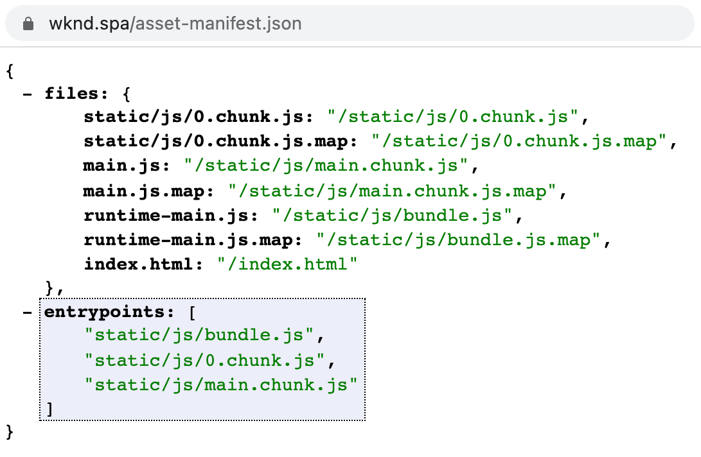

# RemotePage 구성 요소 {#remote-page-component}

외부 SPA과 AEM 간에 [어떤 수준의 통합을 원할지](/help/implementing/developing/headful-headless.md)를 결정할 때 AEM 내에서 SPA을 보고 편집할 수 있어야 하는 경우가 많습니다. RemotePage 구성 요소는 이를 위한 사용자 지정 페이지 구성 요소입니다.

## 개요 {#overview}

RemotePage 구성 요소는 응용 프로그램에서 생성된 `asset-manifest.json`에서 필요한 모든 자산을 가져와서 AEM 내에서 SPA을 렌더링하는 데 사용합니다.

* RemotePage를 사용하여 SPA의 스크립트와 스타일시트를 AEM 페이지 구성 요소의 본문에 삽입할 수 있습니다.
* 가상 프론트엔드 구성 요소를 사용하여 AEM SPA 편집기에서 편집 가능한 섹션으로 표시할 수 있습니다.
* 다른 도메인에 호스팅된 SPA을 함께 AEM에서 편집할 수 있습니다.

AEM에서 편집 가능한 외부 SPA에 대한 자세한 내용은 [AEM 내에서 외부 SPA 편집](editing-external-spa.md) 문서를 참조하십시오.

## 요구 사항 {#requirements}

* 개발 시 CORS 활성화
* 페이지 속성에서 원격 URL 구성
* AEM에서 SPA 렌더링
* 웹 응용 프로그램은 다음 중 하나와 같은 번들러 자산 매니페스트를 사용하고 `entrypoints property`에 로드할 모든 CSS 및 JS 파일을 나열하는 도메인 루트에 `asset-manifest.json` 파일을 노출해야 합니다.
   * https://github.com/shellscape/webpack-manifest-plugin
   * https://github.com/webdeveric/webpack-assets-manifest
   * https://github.com/mugi-uno/parcel-plugin-bundle-manifest
     
* 응용 프로그램은 `body` 요소 아래의 `

`에서 초기화할 수 있어야 합니다. 앱이 인스턴스화되기 위해 다른 마크업이 필요한 경우 `sling:resourceSuperType="spa-project-core/components/remotepage`이(가) 있는 프록시 구성 요소의 HTL 스크립트에서 이를 적절하게 조정해야 합니다.

## 제한 사항 {#limitations}

* RemotePage 구성 요소에서는 구현이 여기에 있는 [과(와) 같은 자산 매니페스트를 제공할 것으로 예상합니다.](https://github.com/shellscape/webpack-manifest-plugin) 그러나 RemotePage 구성 요소는 React 프레임워크(및 remote-page-next 구성 요소를 통한 Next.js)에서만 작동하도록 테스트되었으므로 Angular과 같은 다른 프레임워크에서 원격으로 응용 프로그램을 로드할 수 없습니다.
* 애플리케이션의 루트 HTML 파일에 정의된 내부 CSS 및 루트 DOM 노드의 인라인 CSS는 AEM에서 원격 렌더링을 수행할 때 사용할 수 없습니다.

## 기술 세부 정보 {#technical-details}

AEM SPA 프로젝트의 나머지 부분과 마찬가지로 RemotePage 구성 요소는 오픈 소스입니다. RemotePage 구성 요소에 대한 전체 기술 정보를 보려면 [GitHub 리포지토리를 참조하십시오.](https://github.com/adobe/aem-spa-project-core/tree/master/ui.apps/src/main/content/jcr_root/apps/spa-project-core/components/remotepage)
