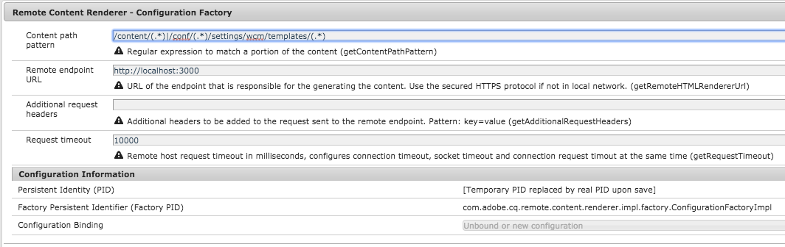

# SPA 및 서버측 렌더링{#spa-and-server-side-rendering}

단일 페이지 애플리케이션(SPA)은 종종 기본 애플리케이션처럼 익숙한 방식으로 반응하고 동작하는 풍부하고 다이내믹한 경험을 사용자에게 제공할 수 있습니다. [이는 클라이언트에 의존하여 콘텐츠를 맨 앞에 로드한 다음 사용자 상호 작용을 처리하는 까다로운 작업을 ](introduction.md#how-does-a-spa-work) 수행하여 클라이언트와 서버 간에 필요한 통신 양을 최소화하여 앱을 보다 재활성화할 수 있게 함으로써 이루어집니다.

그러나 SPA이 크고 컨텐츠가 풍부한 경우 초기 로드 시간이 길어질 수 있습니다. 로드 시간을 최적화하기 위해 일부 컨텐츠는 서버측에서 렌더링할 수 있습니다. SSR(서버측 렌더링)을 사용하면 페이지의 초기 로드를 가속화한 다음 클라이언트에 추가 렌더링을 전달할 수 있습니다.

## SSR {#when-to-use-ssr} 사용 시기

모든 프로젝트에 SSR이 필요하지 않습니다. AEM은 SPA용 JS SSR을 완벽하게 지원하지만, Adobe은 모든 프로젝트에 대해 체계적으로 구현하는 것은 권장하지 않습니다.

SSR을 구현하기로 결정할 때 먼저 SSR을 장기간 유지 보수하는 것을 포함하여 프로젝트에 대해 SSR을 보다 사실적으로 추가함으로써 얼마나 많은 복잡성, 노력, 비용이 추가되는지를 예상해야 합니다. SSR 아키텍처는 추가된 값이 예상 비용을 명확하게 초과하는 경우에만 선택해야 합니다.

SSR은 일반적으로 다음 질문 중 하나에 &quot;예&quot;가 분명한 경우 몇 가지 값을 제공합니다.

* **SEO:** 트래픽을 발생시키는 검색 엔진에서 사이트를 제대로 인덱싱하려면 SSR이 여전히 필요합니까? 이제 주 검색 엔진 크롤러가 JS를 평가한다는 것을 염두에 두십시오.
* **페이지 속도:** SSR은 실제 환경에서 측정 가능한 속도 개선을 제공하며 전반적인 사용자 경험에 추가할 수 있습니까?

이 두 질문 중 적어도 하나가 프로젝트에 대해 명확한 &quot;예&quot;를 대답하는 경우에만 Adobe에서 SSR 구현을 권장합니다. 다음 섹션에서는 Adobe I/O Runtime을 사용하여 이 작업을 수행하는 방법에 대해 설명합니다.

## Adobe I/O Runtime {#adobe-i-o-runtime}

[프로젝트에 SSR](#when-to-use-ssr)의 구현이 필요하다고 확신하는 경우 Adobe의 권장 솔루션은 Adobe I/O Runtime을 사용하는 것입니다.

Adobe I/O Runtime에 대한 자세한 내용은

* [https://www.adobe.io/apis/experienceplatform/runtime.html](https://www.adobe.io/apis/experienceplatform/runtime.html)  - 서비스 개요
* [https://www.adobe.io/apis/experienceplatform/runtime/docs.html](https://www.adobe.io/apis/experienceplatform/runtime/docs.html)  - 플랫폼에 대한 자세한 설명서

다음 섹션에서는 Adobe I/O Runtime을 사용하여 두 가지 서로 다른 모델에서 SPA용 SSR을 구현하는 방법을 자세히 설명합니다.

* [AEM 기반의 커뮤니케이션 흐름](#aem-driven-communication-flow)
* [Adobe I/O Runtime 기반의 커뮤니케이션 흐름](#adobe-i-o-runtime-driven-communication-flow)

>[!NOTE]
>
>Adobe에서는 모든 AEM 환경(작성자, 게시, 단계 등)에 대해 별도의 Adobe I/O Runtime 인스턴스를 권장합니다.

## 원격 렌더러 구성 {#remote-content-renderer-configuration}

AEM은 원격으로 렌더링된 컨텐츠를 검색할 수 있는 위치를 알아야 합니다. SSR에 대해 구현하도록 선택하는 모델 [에 관계없이 이 원격 렌더링 서비스에 액세스하는 방법을 AEM에 지정해야 합니다.](#adobe-i-o-runtime)

이 작업은 **RemoteContentRenderer - Configuration Factory OSGi 서비스**&#x200B;를 통해 수행됩니다. `http://<host>:<port>/system/console/configMgr`의 웹 콘솔 구성 콘솔에서 &quot;RemoteContentRenderer&quot; 문자열을 검색합니다.



구성에 대해 다음 필드를 사용할 수 있습니다.

* **컨텐츠 경로 패턴**  - 필요한 경우 컨텐츠의 일부를 일치시키기 위한 정규 표현식
* **원격 끝점 URL**  - 콘텐츠 생성을 담당하는 끝점의 URL
   * 로컬 네트워크에 있지 않은 경우 보안 HTTPS 프로토콜을 사용하십시오.
* **추가 요청 헤더**  - 원격 끝점으로 전송된 요청에 추가할 추가 헤더
   * 패턴:`key=value`
* **요청 시간 초과**  - 원격 호스트 요청 시간 초과(밀리초)

>[!NOTE]
>
>[AEM 기반 통신 흐름](#aem-driven-communication-flow) 또는 [Adobe I/O Runtime 기반 흐름을 구현하도록 선택하더라도](#adobe-i-o-runtime-driven-communication-flow)원격 컨텐츠 렌더러 구성을 정의해야 합니다.

>[!NOTE]
>
>이 구성에서는 사용 가능한 추가 확장 및 사용자 정의 옵션이 있는 [원격 콘텐츠 렌더러](#remote-content-renderer)를 활용합니다.

## AEM 기반 통신 흐름 {#aem-driven-communication-flow}

SSR을 사용할 때 AEM의 [구성 요소 상호 작용 워크플로](introduction.md#interaction-with-the-spa-editor)에는 앱의 초기 내용이 Adobe I/O Runtime에서 생성되는 단계가 포함됩니다.

1. 브라우저가 AEM에서 SSR 컨텐츠를 요청합니다.
1. AEM은 모델을 Adobe I/O Runtime에 게시합니다.
1. Adobe I/O Runtime은 생성된 컨텐트를 반환합니다.
1. AEM은 백엔드 페이지 구성 요소의 HTL 템플릿을 통해 Adobe I/O Runtime에서 반환되는 HTML을 제공합니다.


## Adobe I/O Runtime 기반 통신 흐름 {#adobe-i-o-runtime-driven-communication-flow}

이전 섹션에서는 AEM에서 부트스트래핑 및 컨텐츠 제공을 수행하는 AEM과 관련하여 서버측 렌더링의 표준 및 권장 구현에 대해 설명합니다.

또는 SSR을 구현하여 Adobe I/O Runtime이 부트스트랩을 책임지도록 하고 커뮤니케이션 흐름을 효과적으로 반전시킬 수 있습니다.

두 모델 모두 유효하며 AEM에서 지원합니다. 그러나 특정 모델을 구현하기 전에 각 모델의 장점과 단점을 고려해야 합니다.

<table>
 <tbody>
  <tr>
   <th><strong>부트스트랩</strong></th>
   <th><strong>이점</strong></th>
   <th><strong>단점</strong></th>
  </tr>
  <tr>
   <th><strong>aem</strong><br /> </th>
   <td>
    <ul>
     <li>AEM, 필요한 경우 라이브러리 삽입 관리</li>
     <li>AEM<br />에서만 리소스를 유지 관리하면 됩니다. </li>
    </ul> </td>
   <td>
    <ul>
     <li>SPA 개발자에게 친숙하지 않은 경우<br /> </li>
    </ul> </td>
  </tr>
  <tr>
   <th><strong>adobe i/o runtime<br /> </strong></th>
   <td>
    <ul>
     <li>SPA 개발자에게 보다 친숙한 <br /> </li>
    </ul> </td>
   <td>
    <ul>
     <li>CSS 및 JavaScript와 같은 응용 프로그램에 필요한 Clientlib 리소스는 AEM 개발자가 <code><a href="/help/implementing/developing/introduction/clientlibs.md">allowProxy</a></code> 속성<br />을 통해 사용할 수 있어야 합니다. </li>
     <li>리소스는 AEM과 Adobe I/O Runtime<br /> 간에 동기화되어야 합니다. </li>
     <li>SPA 저작을 활성화하려면 Adobe I/O Runtime용 프록시 서버가 필요할 수 있습니다.</li>
    </ul> </td>
  </tr>
 </tbody>
</table>

## SSR {#planning-for-ssr} 계획

일반적으로 응용 프로그램의 일부만을 서버측에서 렌더링해야 합니다. 일반적인 예는 페이지의 초기 로드 시 접힌 항목 위에 표시되는 컨텐트입니다. 이렇게 하면 이미 렌더링된 컨텐츠를 클라이언트에 전달하여 시간을 절약할 수 있습니다. 사용자가 SPA과 상호 작용하면 추가 컨텐츠가 클라이언트에 의해 렌더링됩니다.

SPA용 서버 측 렌더링을 구현하는 것을 고려하면서 앱의 어떤 부분이 필요한지 검토해야 합니다.

## SSR {#developing-an-spa-using-ssr}을(를) 사용하여 SPA 개발

SPA 구성 요소는 클라이언트(브라우저에서) 또는 서버측에서 렌더링할 수 있습니다. 서버측을 렌더링하면 윈도우 크기 및 위치와 같은 브라우저 속성이 없습니다. 따라서 SPA 구성 요소는 렌더링될 위치를 전혀 예측할 수 없으므로 그래픽이 되어야 합니다.

SSR을 활용하려면 코드를 AEM뿐만 아니라 서버측 렌더링을 담당하는 Adobe I/O Runtime에 배포해야 합니다. 대부분의 코드는 동일하지만 서버별 작업은 다릅니다.

## AEM {#ssr-for-spas-in-aem}의 SPA용 SSR

AEM의 SPA용 SSR을 사용하려면 Adobe I/O Runtime이 필요합니다. 이 SSR은 앱 콘텐츠 서버 쪽의 렌더링에 대해 호출됩니다. 앱의 HTL 내에서 콘텐츠를 렌더링하기 위해 Adobe I/O Runtime의 리소스가 호출됩니다.

AEM이 즉시 사용 가능한 Angular 및 React SPA 프레임워크을 지원하는 것과 마찬가지로 서버측 렌더링도 Angular 및 Reimate 앱에 대해 지원됩니다. 자세한 내용은 두 프레임워크에 대한 NPM 설명서를 참조하십시오.

## 원격 컨텐츠 렌더러 {#remote-content-renderer}

AEM에서 SPA과 함께 SSR을 사용하는 데 필요한 [원격 컨텐츠 렌더러 구성](#remote-content-renderer-configuration)은 보다 일반화된 렌더링 서비스로, 필요에 맞게 확장 및 사용자 정의할 수 있습니다.

### RemoteContentRenderingService {#remotecontentrenderingservice}

`RemoteContentRenderingService` 는 Adobe I/O과 같이 원격 서버에서 렌더링된 내용을 검색하기 위한 OSGi 서비스입니다.원격 서버로 보낸 내용은 전달된 요청 매개 변수를 기반으로 합니다.

`RemoteContentRenderingService` 추가 컨텐츠 조작이 필요할 때 종속성 전환을 통해 사용자 지정 Sling 모델이나 서블릿에 삽입할 수 있습니다.

이 서비스는 [RemoteContentRendererRequestHandlerServlet](#remotecontentrendererrequesthandlerservlet)에서 내부적으로 사용됩니다.

### RemoteContentRendererRequestHandlerServlet {#remotecontentrendererrequesthandlerservlet}

`RemoteContentRendererRequestHandlerServlet`을 사용하여 요청 구성을 프로그래밍 방식으로 설정할 수 있습니다. `DefaultRemoteContentRendererRequestHandlerImpl`, 제공된 기본 요청 핸들러 구현을 사용하면 컨텐츠 구조의 위치를 원격 끝점에 매핑하기 위해 여러 OSGi 구성을 만들 수 있습니다.

사용자 지정 요청 핸들러를 추가하려면 `RemoteContentRendererRequestHandler` 인터페이스를 구현합니다. `Constants.SERVICE_RANKING` 구성 요소 속성을 `DefaultRemoteContentRendererRequestHandlerImpl`의 등급인 100보다 높은 정수로 설정해야 합니다.

```javascript
@Component(immediate = true,
        service = RemoteContentRendererRequestHandler.class,
        property={
            Constants.SERVICE_RANKING +":Integer=1000"
        })
public class CustomRemoteContentRendererRequestHandlerImpl implements RemoteContentRendererRequestHandler {}
```

### 기본 처리기 {#configure-default-handler}의 OSGi 구성 구성

기본 핸들러의 구성은 [원격 컨텐츠 렌더러 구성](#remote-content-renderer-configuration) 섹션에 설명된 대로 구성해야 합니다.

### 원격 컨텐츠 렌더러 사용량 {#usage}

서블릿을 가져와 페이지에 삽입할 수 있는 일부 컨텐츠를 반환하려면:

1. 원격 서버에 액세스할 수 있는지 확인합니다.
1. 다음 코드 단편 중 하나를 AEM 구성 요소의 HTL 템플릿에 추가합니다.
1. 선택적으로 OSGi 구성을 만들거나 수정합니다.
1. 사이트 컨텐츠 찾아보기

일반적으로 페이지 구성 요소의 HTL 템플릿이 이러한 기능의 기본 수신자입니다.

```html
<sly data-sly-resource="${resource @ resourceType='cq/remote/content/renderer/request/handler'}" />
```

### 요구 사항 {#requirements}

이 서블릿은 Sling Model Exporter를 활용하여 구성 요소 데이터를 일련화합니다. 기본적으로 `com.adobe.cq.export.json.ContainerExporter` 및 `com.adobe.cq.export.json.ComponentExporter` 모두 Sling 모델 어댑터로 지원됩니다. 필요한 경우 `RemoteContentRendererServlet`을(를) 사용하고 `RemoteContentRendererRequestHandler#getSlingModelAdapterClasses`을(를) 구현하는 데 요청을 채택해야 하는 클래스를 추가할 수 있습니다. 추가 클래스는 `ComponentExporter`을(를) 확장해야 합니다.
