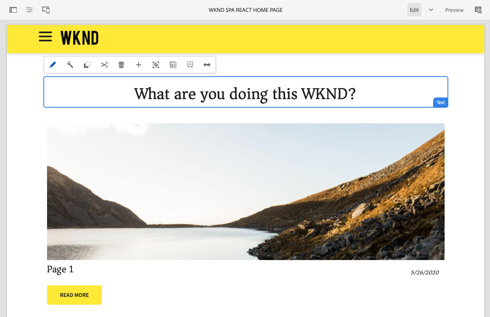

# WKND SPA 프로젝트 {#wknd-spa-project}

프로젝트 설정, 구성 요소 매핑, 프런트 엔드 개발 도구 및 애플리케이션 라우팅을 통해 SPA을 구현하도록 안내하는 이 여러 부분으로 구성된 자습서를 통해 SPA 개발에 몰두하십시오.

AEM WKND 자습서와 유사한 이 SPA 중심의 상대방은 애플리케이션 라우팅을 통해 프로젝트 설정을 시작으로 AEM에서 편집할 수 있는 고유한 단일 페이지 애플리케이션을 구축하는 종단간 예를 제공합니다.

* [AEM에서 첫 번째 Angular SPA 만들기](https://experienceleague.adobe.com/docs/experience-manager-learn/getting-started-with-aem-headless/spa-editor/angular/overview.html?lang=en)
* [AEM에서 첫 번째 React SPA 만들기](https://experienceleague.adobe.com/docs/experience-manager-learn/getting-started-with-aem-headless/spa-editor/react/overview.html?lang=en)

그러나 AEM용 SPA 프로젝트를 시작하기 전에 [SPA for AEM 개발](developing.md) 문서.
