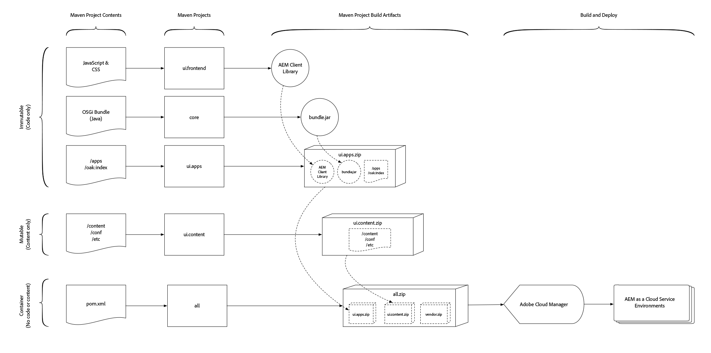

# AEM 프로젝트 구조

>[!TIP]
>
>이 문서가 이러한 학습 및 개념을 기반으로 빌드됨에 따라 기본 [AEM Project Archetype 사용](https://experienceleague.adobe.com/docs/experience-manager-core-components/using/developing/archetype/overview.html) 및 [FileVault Content Maven 플러그인](/help/implementing/developing/tools/maven-plugin.md)을 숙지하십시오.

이 문서에서는 변경 가능한 콘텐츠와 변경 불가능한 콘텐츠의 분할을 준수하도록 하여 Adobe Experience Manager Maven 프로젝트가 AEM as a Cloud Service과 호환되도록 하는 데 필요한 변경 사항에 대해 간략하게 설명합니다. 또한 종속성이 설정되어 충돌하지 않고 결정론적 배포를 만들고 배포 가능한 구조로 패키지됩니다.

AEM 애플리케이션 배포는 단일 AEM 패키지로 구성되어야 합니다. 이 패키지에는 코드, 구성 및 지원하는 모든 기본 콘텐츠를 포함하여 애플리케이션이 기능하는 데 필요한 모든 것을 구성하는 하위 패키지가 포함되어야 합니다.

AEM에서는 **content**&#x200B;과(와) **code**&#x200B;을(를) 분리해야 합니다. 이는 단일 콘텐츠 패키지가 저장소의 **7} `/apps` 및 런타임 쓰기 가능 영역(예: `/content`, `/conf`, `/home` 또는 `/apps`이(가) 아닌 모든 영역)에 배포될 수**&#x200B;없습니다&#x200B;**.** Instead, the application must separate code and content into discrete packages for deployment into AEM.

The package structure outlined in this document is compatible with **both** local development deployments and AEM Cloud Service deployments.

>[!TIP]
>
>이 문서에 설명된 구성은 [AEM Project Maven Archetype 24 이상](https://github.com/adobe/aem-project-archetype/releases)에서 제공됩니다.

## 저장소의 변경 가능한 영역과 변경 불가능한 영역 {#mutable-vs-immutable}

AEM의 `/apps` 및 `/libs` 영역은 AEM이 시작된 후(즉, 런타임 시) 변경(만들기, 업데이트, 삭제)할 수 없으므로 **변경할 수 없음**&#x200B;으로 간주됩니다. 런타임 시 변경할 수 없는 영역을 변경하려고 하면 실패합니다.

저장소의 다른 모든 `/content`, `/conf`, `/var`, `/etc`, `/oak:index`, `/system`, `/tmp` 등은 모두 **변경 가능** 영역입니다. 즉, 런타임 시 변경될 수 있습니다.

>[!WARNING]
>
>이전 버전의 AEM에서와 같이 `/libs`은(는) 수정하면 안 됩니다. AEM 제품 코드만 `/libs`에 배포할 수 있습니다.

### Oak 인덱스 {#oak-indexes}

Oak 인덱스(`/oak:index`)는 AEM as a Cloud Service 배포 프로세스에서 관리됩니다. Cloud Manager은 새 코드 이미지로 전환하기 전에 새 색인이 배포되고 완전히 다시 색인화될 때까지 기다려야 하기 때문입니다.

이러한 이유로 Oak 색인은 런타임 시 변경할 수 있지만, 변경 가능한 패키지를 설치하기 전에 설치할 수 있도록 코드로 배포해야 합니다. 따라서 `/oak:index` 구성은 코드 패키지의 일부이며 아래에 설명된 대로 [ 콘텐츠 패키지의 일부가 아닙니다](#recommended-package-structure).

>[!TIP]
>
>AEM as a Cloud Service 색인화에 대한 자세한 내용은 [콘텐츠 검색 및 색인화](/help/operations/indexing.md)를 참조하십시오.

## 권장 패키지 구조 {#recommended-package-structure}



이 다이어그램은 권장 프로젝트 구조 및 패키지 배포 아티팩트에 대한 개요를 제공합니다.

권장되는 애플리케이션 배포 구조는 다음과 같습니다.

### 코드 패키지/OSGi 번들

+ OSGi 번들 Jar 파일이 생성되며 모든 프로젝트에 직접 포함됩니다.

+ `ui.apps` 패키지에는 배포할 모든 코드가 포함되어 있으며 `/apps`에만 배포됩니다. `ui.apps` 패키지의 일반적인 요소는 다음을 포함하지만 이에 국한되지 않습니다.
   + [구성 요소 정의 및 HTL](https://experienceleague.adobe.com/docs/experience-manager-htl/content/overview.html) 스크립트
      + `/apps/my-app/components`
   + JavaScript 및 CSS([클라이언트 라이브러리](/help/implementing/developing/introduction/clientlibs.md)를 통해)
      + `/apps/my-app/clientlibs`
   + [오버레이](/help/implementing/developing/introduction/overlays.md)/`/libs`
      + `/apps/cq`, `/apps/dam/` 등.
   + 대체 컨텍스트 인식 구성
      + `/apps/settings`
   + ACL(권한)
      + `/apps` 아래의 모든 경로에 대한 모든 `rep:policy`
   + [미리 컴파일된 번들형 스크립트](https://experienceleague.adobe.com/docs/experience-manager-core-components/using/developing/archetype/precompiled-bundled-scripts.html)

>[!NOTE]
>
>모든 환경에 동일한 코드를 배포해야 합니다. 이 코드는 스테이지 환경의 유효성 검사도 프로덕션에 있다는 신뢰 수준을 보장합니다. 자세한 내용은 [실행 모드](/help/implementing/deploying/overview.md#runmodes)의 섹션을 참조하십시오.


### 컨텐츠 패키지

+ `ui.content` 패키지에 모든 콘텐츠와 구성이 포함되어 있습니다. 콘텐츠 패키지에 `ui.apps` 또는 `ui.config` 패키지에 없는 모든 노드 정의, 즉 `/apps` 또는 `/oak:index`에 없는 모든 노드 정의가 포함되어 있습니다. `ui.content` 패키지의 일반적인 요소는 다음을 포함하지만 이에 국한되지 않습니다.
   + 컨텍스트 인식 구성
      + `/conf`
   + 필요한 복잡한 콘텐츠 구조(즉, 저장소 초기화에 정의된 기준선 콘텐츠 구조를 기반으로 하고 이를 지나 확장하는 콘텐츠 빌드-아웃)입니다.
      + `/content`, `/content/dam` 등.
   + 관리되는 태그 지정 분류
      + `/content/cq:tags`
   + 레거시 etc 노드(이상적으로 이러한 노드를 비/etc 위치로 마이그레이션)
      + `/etc`

### 컨테이너 패키지

+ `all` 패키지는 배포 가능한 아티팩트, OSGI 번들 Jar 파일, `ui.apps`, `ui.config` 및 `ui.content` 패키지만 포함된 컨테이너 패키지입니다. `all` 패키지에는 자체 **콘텐츠 또는 코드**&#x200B;가 없어야 하며, 대신 모든 배포를 저장소에 하위 패키지 또는 OSGi 번들 Jar 파일로 위임해야 합니다.

  이제 패키지가 `<subPackages>` 구성이 아닌 Maven [FileVault 패키지 Maven 플러그인의 임베드된 구성](#embeddeds)을 사용하여 포함됩니다.

  복잡한 Experience Manager 배포의 경우 AEM의 특정 사이트 또는 테넌트를 나타내는 `ui.apps`, `ui.config` 및 `ui.content`개의 프로젝트/패키지를 여러 개 만드는 것이 좋습니다. 이 방법을 사용하는 경우 변경 가능한 콘텐츠와 변경 불가능한 콘텐츠 사이의 분할이 준수되는지, 필요한 콘텐츠 패키지와 OSGi 번들 Jar 파일이 `all` 컨테이너 콘텐츠 패키지에 하위 패키지로 포함되는지 확인하십시오.

  예를 들어 복잡한 배포 콘텐츠 패키지 구조는 다음과 같을 수 있습니다.

   + `all` 콘텐츠 패키지는 단일 배포 아티팩트를 만들기 위해 다음 패키지를 임베드합니다.
      + `common.ui.apps`이(가) **사이트 A와 사이트 B 모두에 필요한 코드를 배포합니다.**
      + 사이트 A에 필요한 `site-a.core` OSGi 번들 Jar
      + 사이트 A에 필요한 코드를 `site-a.ui.apps`에서 배포
      + `site-a.ui.config`에서 사이트 A에 필요한 OSGi 구성을 배포합니다.
      + `site-a.ui.content` 사이트 A에 필요한 콘텐츠 및 구성 배포
      + 사이트 B에 필요한 `site-b.core` OSGi 번들 Jar
      + `site-b.ui.apps` 사이트 B에 필요한 코드를 배포합니다.
      + `site-b.ui.config`에서 사이트 B에 필요한 OSGi 구성을 배포합니다.
      + `site-b.ui.content` 사이트 B에 필요한 콘텐츠 및 구성 배포

+ `ui.config` 패키지에 모든 [OSGi 구성](/help/implementing/deploying/configuring-osgi.md)이 포함되어 있습니다.
   + 코드로 간주되며 OSGi 번들에 속하지만 일반 콘텐츠 노드는 포함되지 않습니다. 따라서 컨테이너 패키지로 표시됩니다
   + 실행 모드별 OSGi 구성 정의가 포함된 조직 폴더
      + `/apps/my-app/osgiconfig`
   + 모든 대상 AEM as a Cloud Service 배포 대상에 적용되는 기본 OSGi 구성이 포함된 일반 OSGi 구성 폴더
      + `/apps/my-app/osgiconfig/config`
   + 모든 대상 AEM as a Cloud Service 배포 대상에 적용되는 기본 OSGi 구성이 포함된 모드별 OSGi 구성 폴더를 실행합니다
      + `/apps/my-app/osgiconfig/config.<author|publish>.<dev|stage|prod>`
   + 저장소 초기화 OSGi 구성 스크립트
      + [Repo Init](#repo-init)은(는) 논리적으로 AEM 응용 프로그램의 일부인 콘텐츠를 배포(변경 가능)하는 권장 방법입니다. Repo Init OSGi 구성은 위에 설명된 대로 적절한 `config.<runmode>` 폴더에 있어야 하며 다음을 정의하는 데 사용해야 합니다.
         + 기준선 콘텐츠 구조
         + 사용자
         + 서비스 사용자
         + 그룹
         + ACL(권한)

### 추가 응용 프로그램 패키지{#extra-application-packages}

자체 코드 및 콘텐츠 패키지로 구성된 다른 AEM 프로젝트를 AEM 배포에서 사용하는 경우 해당 컨테이너 패키지가 프로젝트의 `all` 패키지에 임베드되어야 합니다.

예를 들어 두 개의 공급업체 AEM 애플리케이션을 포함하는 AEM 프로젝트는 다음과 같을 수 있습니다.

+ `all` 콘텐츠 패키지는 단일 배포 아티팩트를 만들기 위해 다음 패키지를 임베드합니다.
   + AEM 응용 프로그램에 필요한 `core` OSGi 번들 Jar
   + `ui.apps`에서 AEM 응용 프로그램에 필요한 코드를 배포합니다.
   + `ui.config`에서 AEM 응용 프로그램에 필요한 OSGi 구성을 배포합니다.
   + `ui.content`에서 AEM 응용 프로그램에 필요한 콘텐츠 및 구성을 배포합니다.
   + `vendor-x.all`은(는) 공급업체 X 응용 프로그램에 필요한 모든 항목(코드 및 콘텐츠)을 배포합니다.
   + `vendor-y.all`은(는) 공급업체 Y 애플리케이션에 필요한 모든 항목(코드 및 콘텐츠)을 배포합니다.

## 패키지 유형 {#package-types}

패키지는 선언된 패키지 유형으로 표시됩니다. 패키지 유형은 패키지의 목적 및 배포를 명확하게 하는 데 도움이 됩니다.

+ 컨테이너 패키지는 `packageType`을(를) `container`(으)로 설정해야 합니다. 컨테이너 패키지에는 일반 노드가 없어야 합니다. OSGi 번들, 구성 및 하위 패키지만 허용됩니다. AEM as a Cloud Service의 컨테이너는 [설치 후크](https://jackrabbit.apache.org/filevault/installhooks.html)를 사용할 수 없습니다.
+ 코드(변경할 수 없음) 패키지는 해당 `packageType`을(를) `application`(으)로 설정해야 합니다.
+ 콘텐츠(변경 가능) 패키지는 `packageType`을(를) `content`(으)로 설정해야 합니다.


자세한 내용은 [Apache Jackrabbit FileVault - Package Maven Plugin 설명서](https://jackrabbit.apache.org/filevault-package-maven-plugin/package-mojo.html#packageType), [Apache Jackrabbit 패키지 유형](https://jackrabbit.apache.org/filevault/packagetypes.html) 및 [FileVault Maven 구성 코드 조각](#marking-packages-for-deployment-by-adoube-cloud-manager)을 참조하십시오.

>[!TIP]
>
>전체 코드 조각에 대해서는 아래의 [POM XML 코드 조각](#xml-package-types) 섹션을 참조하십시오.

## Adobe Cloud Manager에서 배포할 패키지 표시 {#marking-packages-for-deployment-by-adoube-cloud-manager}

기본적으로 Adobe Cloud Manager은 Maven 빌드에서 생성된 모든 패키지를 수집합니다. 그러나 컨테이너(`all`) 패키지는 모든 코드 및 콘텐츠 패키지를 포함하는 단일 배포 아티팩트이므로 컨테이너(`all`) 패키지가 **만**&#x200B;배포되었는지 확인해야 합니다. To ensure this, other Packages the Maven build generates must be marked with the FileVault Content Package Maven Plug-In configuration of `<properties><cloudManagerTarget>none</cloudManageTarget></properties>`.

>[!TIP]
>
>전체 코드 조각에 대해서는 아래의 [POM XML 코드 조각](#pom-xml-snippets) 섹션을 참조하십시오.

## 초기 보고서{#repo-init}

Repo Init는 폴더 트리와 같은 일반적인 노드 구조에서 사용자, 서비스 사용자, 그룹 및 ACL 정의에 이르기까지 JCR 구조를 정의하는 지침 또는 스크립트를 제공합니다.

Repo Init의 주요 이점은 스크립트가 정의한 모든 작업을 수행할 수 있는 암시적 권한이 있다는 것입니다. 또한 이러한 스크립트는 배포 라이프사이클 초기에 호출되어 모든 필수 JCR 구조가 시간 코드가 실행될 때까지 존재하도록 합니다.

Repo Init 스크립트 자체는 `ui.config` 프로젝트에서 스크립트로 존재하지만, 이를 사용하여 다음 변경 가능한 구조를 정의할 수 있으며 사용해야 합니다.

+ 기준선 콘텐츠 구조
+ 서비스 사용자
+ 사용자
+ 그룹
+ ACL

저장소 초기화 스크립트는 `RepositoryInitializer` OSGi 팩토리 구성의 `scripts` 항목으로 저장됩니다. 따라서 실행 모드에 의해 암시적으로 타겟팅되어 AEM 작성자와 AEM Publish 서비스의 Repo Init 스크립트 간 또는 환경(개발, 스테이지 및 프로덕션) 간의 차이점을 허용할 수 있습니다.

저장소 초기 OSGi 구성은 다중 라인을 지원하므로 [`.config` OSGi 구성 형식](https://sling.apache.org/documentation/bundles/configuration-installer-factory.html#configuration-files-config-1)로 가장 잘 작성되었습니다. 다중 라인은 [`.cfg.json`을(를) 사용하여 OSGi 구성을 정의하는 모범 사례](https://sling.apache.org/documentation/bundles/configuration-installer-factory.html#configuration-files-cfgjson-1)의 예외입니다.

사용자 및 그룹을 정의할 때 그룹만 응용 프로그램의 일부로 간주되며 그 기능에 필수적입니다. AEM에서 런타임 시 조직 사용자 및 그룹을 정의할 수 있습니다. 예를 들어 사용자 정의 워크플로우가 이름이 지정된 그룹에 작업을 할당하는 경우, AEM 애플리케이션에서 보고서 초기화를 통해 해당 그룹을 정의합니다. 그러나 그룹화가 &quot;Wendy&#39;s Team&quot; 및 &quot;Sean&#39;s Team&quot;과 같이 조직적인 것에 불과한 경우 이러한 그룹은 AEM에서 런타임에 가장 잘 정의되고 관리됩니다.

>[!TIP]
>
>인라인 `scripts` 필드에 저장소 초기화 스크립트 *must*&#x200B;이(가) 정의되어 있거나 `references` 구성이 작동하지 않습니다.

Repo Init 스크립트에 대한 전체 어휘는 [Apache Sling Repo Init 설명서](https://sling.apache.org/documentation/bundles/repository-initialization.html#the-repoinit-repository-initialization-language)에서 사용할 수 있습니다.

>[!TIP]
>
>전체 코드 조각에 대해서는 아래의 [Repo Init 코드 조각](#snippet-repo-init) 섹션을 참조하십시오.

## 저장소 구조 패키지 {#repository-structure-package}

코드 패키지를 사용하려면 구조적 종속 항목의 수정을 적용하는 `<repositoryStructurePackage>`을(를) 참조하도록 FileVault Maven 플러그인의 구성을 구성해야 합니다(한 코드 패키지가 다른 코드 패키지에 설치되지 않도록 함). [프로젝트에 대한 고유한 저장소 구조 패키지를 만들 수 있습니다](repository-structure-package.md).

코드 패키지에 대해 **필요한 항목만**&#x200B;입니다. 즉, `<packageType>application</packageType>`(으)로 표시된 모든 패키지를 의미합니다.

응용 프로그램의 저장소 구조 패키지를 만드는 방법에 대해 알아보려면 [저장소 구조 패키지 개발](repository-structure-package.md)을 참조하세요.

콘텐츠 패키지(`<packageType>content</packageType>`) **필요 없음**&#x200B;에는 이 저장소 구조 패키지가 필요합니다.

>[!TIP]
>
>전체 코드 조각에 대해서는 아래의 [POM XML 코드 조각](#xml-repository-structure-package) 섹션을 참조하십시오.

## 컨테이너 패키지에 하위 패키지 임베드{#embeddeds}

콘텐츠 또는 코드 패키지는 특별한 &quot;side-car&quot; 폴더에 배치되며 FileVault Maven 플러그인의 `<embeddeds>` 구성을 사용하여 AEM 작성자, AEM 게시 또는 둘 다에 설치할 대상을 지정할 수 있습니다. `<subPackages>` 구성을 사용하지 마십시오.

일반적인 사용 사례는 다음과 같습니다.

+ AEM 작성자 사용자와 AEM 게시 사용자 간에 다른 ACL/권한
+ AEM 작성자에서만 활동을 지원하는 데 사용되는 구성
+ 백오피스 시스템과의 통합과 같은 코드는 AEM 작성자에서만 실행해야 합니다.


AEM 작성자, AEM 게시 또는 두 가지 모두를 타겟팅하기 위해 패키지가 `all` 컨테이너 패키지에 다음과 같은 형식으로 특수 폴더 위치에 임베드됩니다.

`/apps/<app-name>-packages/(content|application|container)/install(.author|.publish)?`

이 폴더 구조를 분류합니다.

+ 첫 번째 수준 폴더 **은(는)** `/apps`이어야 합니다.
+ 두 번째 수준 폴더는 폴더 이름에 사후 수정된 `-packages`이(가) 있는 응용 프로그램을 나타냅니다. 대부분의 경우 모든 하위 패키지가 임베드된 하나의 두 번째 수준 폴더만 있지만 애플리케이션의 논리 구조를 가장 잘 표현하기 위해 원하는 수의 두 번째 수준 폴더를 만들 수 있습니다.
   + `/apps/my-app-packages`
   + `/apps/my-other-app-packages`
   + `/apps/vendor-packages`

  >[!WARNING]
  >
  >규칙에 따라 하위 패키지 포함 폴더의 이름은 `-packages` 접미사를 사용하여 지정됩니다. 이 이름을 지정하면 배포 코드 및 콘텐츠 패키지가 하위 패키지 `/apps/<app-name>/...`의 대상 폴더를 **배포하지**&#x200B;않도록 하여 파괴적이고 순환적인 설치 동작이 발생합니다.

+ 세 번째 수준 폴더는 다음 중 하나여야 합니다
  `application`, `content` 또는 `container`
   + `application` 폴더에 코드 패키지가 있습니다.
   + `content` 폴더에 콘텐츠 패키지가 있습니다.
   + `container` 폴더에는 AEM 응용 프로그램에 포함될 수 있는 [추가 응용 프로그램 패키지](#extra-application-packages)가 있습니다.
이 폴더 이름은 포함된 패키지의 [패키지 유형](#package-types)에 해당합니다.
+ 네 번째 수준 폴더는 하위 패키지를 포함하며 다음 중 하나여야 합니다.
   + `install`을(를) 설치했으므로 **AEM 작성자 및 AEM 게시에 모두**&#x200B;합니다.
   + `install.author` 따라서 AEM 작성자에 **only**&#x200B;을(를) 설치합니다.
   + `install.publish`을(를) 설치했으므로 AEM 게시에서 **only**을(를) 설치합니다.
`install.author` 및 `install.publish`만 지원되는 대상입니다. Other run modes **are not** supported.

예를 들어 AEM 작성자 및 게시 특정 패키지를 포함하는 배포는 다음과 같을 수 있습니다.

+ `all` 컨테이너 패키지는 단일 배포 아티팩트를 만들기 위해 다음 패키지를 임베드합니다.
   + `/apps/my-app-packages/application/install`에 포함된 `ui.apps`은(는) AEM 작성자 및 AEM 게시 모두에 코드를 배포합니다.
   + `/apps/my-app-packages/application/install.author`에 포함된 `ui.apps.author`은(는) AEM 작성자에게만 코드를 배포합니다.
   + `/apps/my-app-packages/content/install`에 포함된 `ui.content`은(는) AEM 작성자 및 AEM 게시 모두에 콘텐츠 및 구성을 배포합니다.
   + `/apps/my-app-packages/content/install.publish`에 포함된 `ui.content.publish`은(는) 콘텐츠 및 구성을 AEM 게시에만 배포합니다.

>[!TIP]
>
>전체 코드 조각에 대해서는 아래의 [POM XML 코드 조각](#xml-embeddeds) 섹션을 참조하십시오.

### 컨테이너 패키지의 필터 정의 {#container-package-filter-definition}

컨테이너 패키지에 포함된 코드 및 콘텐츠 하위 패키지로 인해 포함된 대상 경로를 컨테이너 프로젝트의 `filter.xml`에 추가해야 합니다. 이렇게 하면 빌드될 때 임베드된 패키지가 컨테이너 패키지에 포함됩니다.

배포할 하위 패키지가 있는 두 번째 수준 폴더의 `<filter root="/apps/<my-app>-packages"/>` 항목을 추가하면 됩니다.

>[!TIP]
>
>전체 코드 조각에 대해서는 아래의 [POM XML 코드 조각](#xml-container-package-filters) 섹션을 참조하십시오.

## 서드파티 패키지 포함 {#embedding-3rd-party-packages}

모든 패키지는 [Adobe의 공개 Maven 아티팩트 저장소](https://repo1.maven.org/maven2/com/adobe/) 또는 액세스 가능한 공개 참조 가능한 타사 Maven 아티팩트 저장소를 통해 사용할 수 있어야 합니다.

타사 패키지가 **Adobe의 공개 Maven 아티팩트 저장소**&#x200B;에 있는 경우 Cloud Manager Adobe이 아티팩트를 확인하도록 더 이상 구성할 필요가 없습니다.

서드파티 패키지가 **공개 서드파티 Maven 아티팩트 저장소**&#x200B;에 있는 경우 이 저장소는 프로젝트의 `pom.xml`에 등록되고 [위에 설명된](#embeddeds) 방법에 따라 포함되어야 합니다.

타사 응용 프로그램/커넥터는 해당 `all` 패키지를 프로젝트의 컨테이너(`all`) 패키지에 컨테이너로 사용하여 임베드되어야 합니다.

Maven 종속성을 추가하는 것은 표준 Maven 모범 사례를 따르며 타사 아티팩트(코드 및 콘텐츠 패키지) 포함은 [위에 요약되어 있습니다](#embedding-3rd-party-packages).

>[!TIP]
>
>전체 코드 조각에 대해서는 아래의 [POM XML 코드 조각](#xml-3rd-party-maven-repositories) 섹션을 참조하십시오.

## `ui.content` 패키지의 `ui.apps` 간 패키지 종속성 {#package-dependencies}

패키지를 제대로 설치하려면 패키지 간 종속성을 설정하는 것이 좋습니다.

일반적인 규칙은 변경 가능한 콘텐츠(`ui.content`)를 포함하는 패키지이며 변경 가능한 콘텐츠의 렌더링 및 사용을 지원하는 변경 불가능한 코드(`ui.apps`)에 따라 달라야 합니다.

이 일반 규칙의 주목할 만한 예외는 변경할 수 없는 코드 패키지(`ui.apps` 또는 기타)인 경우 __only__&#x200B;에 OSGi 번들이 포함된 경우입니다. 이 경우 어떤 AEM 패키지도 종속성을 선언해서는 안 됩니다. 그 이유는 __only__&#x200B;에 OSGi 번들이 포함된 변경 불가능한 코드 패키지가 AEM [패키지 관리자](/help/implementing/developing/tools/package-manager.md)에 등록되지 않았기 때문입니다. 따라서 종속된 모든 AEM 패키지에 충족되지 않은 종속성이 있으며 설치하지 못합니다.

>[!TIP]
>
>전체 코드 조각에 대해서는 아래의 [POM XML 코드 조각](#xml-package-dependencies) 섹션을 참조하십시오.

콘텐츠 패키지 종속성에 대한 일반적인 패턴은 다음과 같습니다.

### 간단한 배포 패키지 종속성 {#simple-deployment-package-dependencies}

간단한 경우 `ui.content` 변경 가능한 콘텐츠 패키지를 `ui.apps` 변경 불가능한 코드 패키지에 종속되도록 설정합니다.

+ `all`에 종속성이 없습니다.
   + `ui.apps`에 종속성이 없습니다.
   + `ui.content`은(는) `ui.apps`에 종속됩니다.

### 복잡한 배포 패키지 종속성 {#complex-deploxment-package-dependencies}

복잡한 배포는 간단한 사례에서 확장되며, 변경 가능한 해당 콘텐츠와 변경 불가능한 코드 패키지 간에 종속성을 설정합니다. 필요에 따라 변경할 수 없는 코드 패키지 간에도 종속성을 설정할 수 있습니다.

+ `all`에 종속성이 없습니다.
   + `common.ui.apps.common`에 종속성이 없습니다.
   + `site-a.ui.apps`은(는) `common.ui.apps`에 종속됩니다.
   + `site-a.ui.content`은(는) `site-a.ui.apps`에 종속됩니다.
   + `site-b.ui.apps`은(는) `common.ui.apps`에 종속됩니다.
   + `site-b.ui.content`은(는) `site-b.ui.apps`에 종속됩니다.

## 로컬 개발 및 배포 {#local-development-and-deployment}

이 문서에 설명된 프로젝트 구조 및 조직은 로컬 개발 AEM 인스턴스와 **완전히 호환**&#x200B;됩니다.

## POM XML 조각 {#pom-xml-snippets}

다음은 위의 권장 사항에 맞게 Maven 프로젝트에 추가할 수 있는 Maven `pom.xml` 구성 조각입니다.

### 패키지 유형 {#xml-package-types}

하위 패키지로 배포된 코드 및 콘텐츠 패키지는 포함된 내용에 따라 **application** 또는 **content**&#x200B;의 패키지 형식을 선언해야 합니다.

#### 컨테이너 패키지 유형 {#container-package-types}

컨테이너 `all/pom.xml` 프로젝트 **은(는) `<packageType>`을(를) 선언하지 않습니다**.

#### 코드(변경할 수 없음) 패키지 유형 {#immutable-package-types}

코드 패키지는 `packageType`을(를) `application`(으)로 설정해야 합니다.

`ui.apps/pom.xml`에서 `filevault-package-maven-plugin` 플러그 인 선언의 `<packageType>application</packageType>` 빌드 구성 지시문은 패키지 형식을 선언합니다.

```xml
...
<build>
  <plugins>
    <plugin>
      <groupId>org.apache.jackrabbit</groupId>
      <artifactId>filevault-package-maven-plugin</artifactId>
      <extensions>true</extensions>
      <configuration>
        <group>${project.groupId}</group>
        <name>my-app.ui.apps</name>
        <packageType>application</packageType>
        <accessControlHandling>merge</accessControlHandling>
        <properties>
          <cloudManagerTarget>none</cloudManagerTarget>
        </properties>
      </configuration>
    </plugin>
    ...
```

#### 콘텐츠(변경 가능) 패키지 유형 {#mutable-package-types}

콘텐츠 패키지는 `packageType`을(를) `content`(으)로 설정해야 합니다.

`ui.content/pom.xml`에서 `filevault-package-maven-plugin` 플러그 인 선언의 `<packageType>content</packageType>` build 구성 지시문은 패키지 형식을 선언합니다.

```xml
...
<build>
  <plugins>
    <plugin>
      <groupId>org.apache.jackrabbit</groupId>
      <artifactId>filevault-package-maven-plugin</artifactId>
      <extensions>true</extensions>
      <configuration>
        <group>${project.groupId}</group>
        <name>my-app.ui.content</name>
        <packageType>content</packageType>
        <accessControlHandling>merge</accessControlHandling>
        <properties>
          <cloudManagerTarget>none</cloudManagerTarget>
        </properties>
      </configuration>
    </plugin>
    ...
```

### Cloud Manager 배포 Adobe을 위한 패키지 표시 {#cloud-manager-target}

In every project generating a Package, **except** for the container (`all`) project, add `<cloudManagerTarget>none</cloudManagerTarget>` to the `<properties>` configuration of the `filevault-package-maven-plugin` plug-in declaration to ensure they **are not** deployed by Adobe Cloud Manager. 컨테이너(`all`) 패키지는 Cloud Manager을 통해 배포된 단일 패키지여야 하며, 이렇게 되면 필요한 모든 코드 및 콘텐츠 패키지가 임베드됩니다.

```xml
...
<build>
  <plugins>
    <plugin>
      <groupId>org.apache.jackrabbit</groupId>
      <artifactId>filevault-package-maven-plugin</artifactId>
      <extensions>true</extensions>
      <configuration>
        ...
        <properties>
          <cloudManagerTarget>none</cloudManagerTarget>
        </properties>
      </configuration>
    </plugin>
    ...
```

### 초기 보고서{#snippet-repo-init}

Repo Init 스크립트가 포함된 Repo Init 스크립트는 `scripts` 속성을 통해 `RepositoryInitializer` OSGi 팩터리 구성에 정의되어 있습니다. 이러한 스크립트는 OSGi 구성 내에서 정의되므로 일반적인 `../config.<runmode>` 폴더 의미 체계를 사용하여 실행 모드로 쉽게 범위를 지정할 수 있습니다.

스크립트는 일반적으로 여러 줄 선언이므로 JSON 기반 `.cfg.json` 형식보다 `.config` 파일에서 정의하는 것이 더 쉽습니다.

`/apps/my-app/config.author/org.apache.sling.jcr.repoinit.RepositoryInitializer-author.config`

```plain
scripts=["
    create service user my-data-reader-service

    set ACL on /var/my-data
        allow jcr:read for my-data-reader-service
    end

    create path (sling:Folder) /conf/my-app/settings
"]
```

`scripts` OSGi 속성에는 [Apache Sling의 Repo Init 언어](https://sling.apache.org/documentation/bundles/repository-initialization.html#the-repoinit-repository-initialization-language)에 정의된 지시문이 포함되어 있습니다.

### 저장소 구조 패키지 {#xml-repository-structure-package}

`ui.apps/pom.xml` 및 코드 패키지(`<packageType>application</packageType>`)를 선언하는 다른 `pom.xml`에서 FileVault Maven 플러그인에 다음 저장소 구조 패키지 구성을 추가합니다. [프로젝트에 대한 고유한 저장소 구조 패키지를 만들 수 있습니다](repository-structure-package.md).

```xml
...
<build>
  <plugins>
    <plugin>
      <groupId>org.apache.jackrabbit</groupId>
      <artifactId>filevault-package-maven-plugin</artifactId>
      <extensions>true</extensions>
      <configuration>
        ...
        <repositoryStructurePackages>
          <repositoryStructurePackage>
              <groupId>${project.groupId}</groupId>
              <artifactId>ui.apps.structure</artifactId>
              <version>${project.version}</version>
          </repositoryStructurePackage>
        </repositoryStructurePackages>
      </configuration>
    </plugin>
    ...
```

### 컨테이너 패키지에 하위 패키지 임베드 {#xml-embeddeds}

`all/pom.xml`에서 `filevault-package-maven-plugin` 플러그 인 선언에 다음 `<embeddeds>` 지시문을 추가합니다. **하지 않음**&#x200B;은(는) `<subPackages>` 구성을 사용합니다. 그 이유는 하위 패키지가 `/apps/my-app-packages/<application|content|container>/install(.author|.publish)?`이(가) 아닌 `/etc/packages`에 포함되기 때문입니다.

```xml
...
<plugin>
  <groupId>org.apache.jackrabbit</groupId>
  <artifactId>filevault-package-maven-plugin</artifactId>
  <extensions>true</extensions>
  <configuration>
      ...
      <embeddeds>

          <!-- Include the application's ui.apps and ui.content packages -->
          <!-- Ensure the artifactIds are correct -->

          <!-- OSGi Bundle Jar file that deploys to BOTH AEM Author and AEM Publish -->
          <embedded>
              <groupId>${project.groupId}</groupId>
              <artifactId>my-app.core</artifactId>
              <type>jar</type>
              <target>/apps/my-app-packages/application/install</target>
          </embedded>

          <!-- Code package that deploys to BOTH AEM Author and AEM Publish -->
          <embedded>
              <groupId>${project.groupId}</groupId>
              <artifactId>my-app.ui.apps</artifactId>
              <type>zip</type>
              <target>/apps/my-app-packages/application/install</target>
          </embedded>

           <!-- OSGi configuration code package that deploys to BOTH AEM Author and AEM Publish -->
          <embedded>
              <groupId>${project.groupId}</groupId>
              <artifactId>my-app.ui.config</artifactId>
              <type>zip</type>
              <target>/apps/my-app-packages/application/install</target>
          </embedded>

          <!-- Code package that deploys ONLY to AEM Author -->
          <embedded>
              <groupId>${project.groupId}</groupId>
              <artifactId>my-app.ui.apps.author</artifactId>
              <type>zip</type>
              <target>/apps/my-app-packages/application/install.author</target>
          </embedded>

          <!-- Content package that deploys to BOTH AEM Author and AEM Publish -->
          <embedded>
              <groupId>${project.groupId}</groupId>
              <artifactId>my-app.ui.content</artifactId>
              <type>zip</type>
              <target>/apps/my-app-packages/content/install</target>
          </embedded>

          <!-- Content package that deploys ONLY to AEM Publish -->
          <embedded>
              <groupId>${project.groupId}</groupId>
              <artifactId>my-app.ui.content.publish-only</artifactId>
              <type>zip</type>
              <target>/apps/my-app-packages/content/install.publish</target>
          </embedded>

          <!-- Include any other extra packages  -->
          <embedded>
              <groupId>com.vendor.x</groupId>
              <artifactId>vendor.plug-in.all</artifactId>
              <type>zip</type>
              <target>/apps/vendor-packages/container/install</target>
          </embedded>
      <embeddeds>
  </configuration>
</plugin>
...
```

### 컨테이너 패키지의 필터 정의 {#xml-container-package-filters}

`all` 프로젝트의 `filter.xml`(`all/src/main/content/jcr_root/META-INF/vault/definition/filter.xml`)에서 배포할 하위 패키지가 포함된 `-packages` 폴더를 **포함**&#x200B;합니다.

```xml
<filter root="/apps/my-app-packages"/>
```

포함된 대상에서 여러 `/apps/*-packages`을(를) 사용하는 경우 여기에서 모두 열거해야 합니다.

### 타사 Maven 저장소 {#xml-3rd-party-maven-repositories}

>[!WARNING]
>
>추가적인 Maven 저장소에서 종속성을 확인하므로 Maven 저장소를 추가하면 Maven 빌드 시간이 연장될 수 있습니다.

리액터 프로젝트 `pom.xml`에서 필요한 타사 공용 Maven 저장소 지시문을 추가합니다. 전체 `<repository>` 구성은 서드파티 저장소 공급자에서 사용할 수 있어야 합니다.

```xml
<repositories>
  ...
  <repository>
      <id>3rd-party-repository</id>
      <name>Public Third-Party Repository</name>
      <url>https://repo.3rdparty.example.com/...</url>
      <releases>
          <enabled>true</enabled>
          <updatePolicy>never</updatePolicy>
      </releases>
      <snapshots>
          <enabled>false</enabled>
      </snapshots>
  </repository>
  ...
</repositories>
```

### `ui.content` 패키지의 `ui.apps` 간 패키지 종속성 {#xml-package-dependencies}

`ui.content/pom.xml`에서 `filevault-package-maven-plugin` 플러그 인 선언에 다음 `<dependencies>` 지시문을 추가합니다.

```xml
...
<plugin>
  <groupId>org.apache.jackrabbit</groupId>
  <artifactId>filevault-package-maven-plugin</artifactId>
  <extensions>true</extensions>
  <configuration>
      ...
      <dependencies>
        <!-- Declare the content package dependency in the ui.content/pom.xml on the ui.apps project -->
        <dependency>
            <groupId${project.groupId}</groupId>
            <artifactId>my-app.ui.apps</artifactId>
            <version>${project.version}</version>
        </dependency>
      </dependencies>
    ...
  </configuration>
</plugin>
...
```

### 컨테이너 프로젝트의 대상 폴더 정리 {#xml-clean-container-package}

`all/pom.xml`에서 Maven 빌드 전에 대상 디렉터리를 정리하는 `maven-clean-plugin` 플러그인을 추가합니다.

```xml
<plugins>
  ...
  <plugin>
    <artifactId>maven-clean-plugin</artifactId>
    <executions>
      <execution>
        <id>auto-clean</id>
        <!-- Run at the beginning of the build rather than the default, which is after the build is done -->
        <phase>initialize</phase>
        <goals>
          <goal>clean</goal>
        </goals>
      </execution>
    </executions>
  </plugin>
  ...
</plugins>
```

## 추가 리소스 {#additional-resources}

+ [Maven을 사용한 패키지 관리](/help/implementing/developing/tools/maven-plugin.md)
+ [FileVault Content Package Maven 플러그인](https://jackrabbit.apache.org/filevault-package-maven-plugin/)
