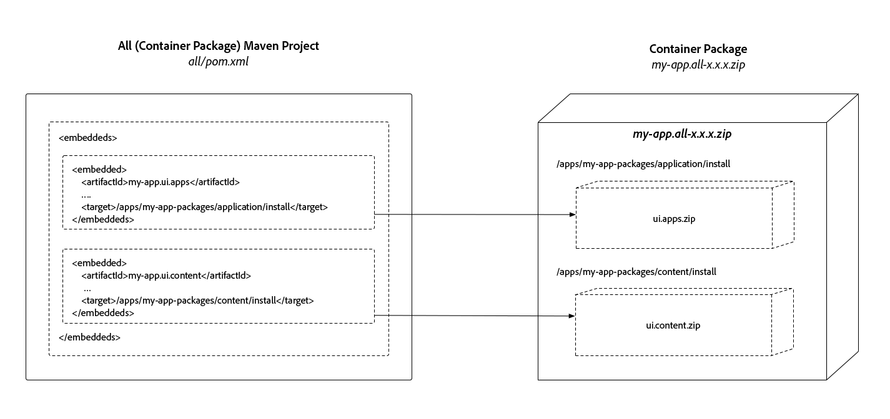

# AEM 프로젝트 구조

>[!TIP]
>
>기본 사항 숙지하기 [AEM 프로젝트 원형 사용](https://experienceleague.adobe.com/docs/experience-manager-core-components/using/developing/archetype/overview.html), 및 [FileVault Content Maven 플러그인](/help/implementing/developing/tools/maven-plugin.md) 이 문서에서는 이러한 학습 및 개념을 기반으로 합니다.

이 문서에서는 변경 가능한 컨텐츠와 변경할 수 없는 컨텐츠 분리를 사용하여 Adobe Experience Manager Maven 프로젝트에 필요한 변경 사항을 AEM as a Cloud Service 호환으로 설명하고, 상충되는 배포가 없도록 종속성을 설정하고, 배포 가능한 구조로 패키지되어 있다는 점을 설명합니다.

AEM 애플리케이션 배포는 단일 AEM 패키지로 구성되어야 합니다. 따라서 이 패키지에는 코드, 구성 및 지원 기준선 컨텐츠를 포함하여 응용 프로그램이 작동하는 데 필요한 모든 것을 구성하는 하위 패키지가 들어 있어야 합니다.

AEM을 사용하려면 **콘텐츠** 및 **코드**: 단일 컨텐츠 패키지를 의미합니다 **사용할 수 없음** 배포 대상 **둘 다** `/apps` 및 런타임 쓰기 가능 영역(예: `/content`, `/conf`, `/home`또는 어떤 것도 `/apps`) 내의 아무 곳에나 삽입할 수 있습니다. Instead, the application must separate code and content into discrete packages for deployment into AEM.

The package structure outlined in this document is compatible with **both** local development deployments and AEM Cloud Service deployments.

>[!TIP]
>
>이 문서에 설명된 구성은 [AEM Project Maven Archetype 24 이상](https://github.com/adobe/aem-project-archetype/releases).

## 변경 가능한 영역과 저장소의 변경할 수 없는 영역 {#mutable-vs-immutable}

`/apps` 및 `/libs`**는 AEM이 시작된 후(예: 런타임 시) 변경(만들기, 업데이트, 삭제)할 수 없으므로 AEM에서 변경할 수 없는 영역으로 간주됩니다.** 런타임 시 변경할 수 없는 영역을 변경하려고 하면 오류가 발생합니다.

저장소의 다른 모든 것, `/content`, `/conf`, `/var`, `/etc`, `/oak:index`, `/system`, `/tmp`등 모두 **가변 가능** 영역, 즉 런타임 시 변경될 수 있습니다.

>[!WARNING]
>
>이전 버전의 AEM에서와 마찬가지로, `/libs` 수정해서는 안 됩니다. AEM 제품 코드만 다음 위치에 배포할 수 있습니다. `/libs`.

### Oak 인덱스 {#oak-indexes}

Oak 인덱스(`/oak:index`)은 특히 AEM as a Cloud Service 배포 프로세스에서 관리됩니다. 새 코드 이미지로 전환하기 전에 Cloud Manager가 새 색인이 배포되고 완전히 다시 색인화될 때까지 기다려야 하기 때문입니다.

이러한 이유로 런타임 시 Oak 인덱스를 변경할 수 있지만 변경 가능한 패키지를 설치하기 전에 설치할 수 있도록 코드를 배포해야 합니다. 따라서 `/oak:index` 구성은 코드 패키지의 일부이며 컨텐츠 패키지에 포함되지 않습니다 [아래에 설명된 대로](#recommended-package-structure).

>[!TIP]
>
>AEM as a Cloud Service의 색인화에 대한 자세한 내용은 문서를 참조하십시오 [컨텐츠 검색 및 색인 지정](/help/operations/indexing.md).

## 권장 패키지 구조 {#recommended-package-structure}


이 다이어그램은 권장되는 프로젝트 구조 및 패키지 배포 아티팩트에 대한 개요를 제공합니다.

권장되는 애플리케이션 배포 구조는 다음과 같습니다.

### 코드 패키지/OSGi 번들

+ OSGi 번들 Jar 파일이 생성되어 모든 프로젝트에 직접 포함됩니다.

+ 다음 `ui.apps` 패키지에는 배포할 모든 코드가 포함되어 있으며 배포 대상 `/apps`. 의 공통 요소 `ui.apps` 패키지에는 다음이 포함되지만 이에 국한되지 않습니다.
   + [구성 요소 정의 및 HTL](https://experienceleague.adobe.com/docs/experience-manager-htl/using/overview.html?lang=ko-KR) 스크립트
      + `/apps/my-app/components`
   + JavaScript 및 CSS(를 통해) [클라이언트 라이브러리](/help/implementing/developing/introduction/clientlibs.md))
      + `/apps/my-app/clientlibs`
   + [오버레이](/help/implementing/developing/introduction/overlays.md) 의 `/libs`
      + `/apps/cq`, `/apps/dam/`, 등이 됩니다.
   + 대체 컨텍스트 인식 구성
      + `/apps/settings`
   + ACL(권한)
      + 임의 `rep:policy` 아래의 경로 `/apps`
   + [사전 컴파일된 번들 스크립트](https://experienceleague.adobe.com/docs/experience-manager-core-components/using/developing/archetype/precompiled-bundled-scripts.html)

>[!NOTE]
>
>동일한 코드를 모든 환경에 배포해야 합니다. 스테이지 환경에서도 신뢰 검증 수준을 프로덕션에 유지하기 위해 필요합니다. 자세한 내용은 [런타임 모드](/help/implementing/deploying/overview.md#runmodes).


### 컨텐츠 패키지

+ 다음 `ui.content` 패키지에 모든 컨텐츠 및 구성이 포함되어 있습니다. 컨텐츠 패키지에 `ui.apps` 또는 `ui.config` 패키지 또는, 즉 `/apps` 또는 `/oak:index`. 의 공통 요소 `ui.content` 패키지에는 다음이 포함되지만 이에 국한되지 않습니다.
   + 컨텍스트 인식 구성
      + `/conf`
   + 필수, 복잡한 컨텐츠 구조(예: Repo Init에 정의된 이전 Baseline 컨텐츠 구조를 기반으로 빌드하고 확장하는 컨텐츠 작성입니다.)
      + `/content`, `/content/dam`, 등이 됩니다.
   + 관리되는 태깅 분류
      + `/content/cq:tags`
   + 레거시 etc 노드(이상적으로는 비/etc 위치로 마이그레이션)
      + `/etc`

### 컨테이너 패키지

+ 다음 `all` package는 배포 가능한 아티팩트와 OSGI 번들 Jar 파일만 포함하는 컨테이너 패키지입니다. `ui.apps`, `ui.config` 및 `ui.content` 패키지를 embed로 포함합니다. 다음 `all` 패키지가 아니어야 합니다. **모든 콘텐츠 또는 코드** 대신 하위 패키지 또는 OSGi 번들 Jar 파일에 모든 배포를 리포지토리에 위임합니다.

   이제 Maven을 사용하여 패키지가 포함됩니다 [FileVault Package Maven 플러그인의 포함된 ds 구성](#embeddeds), 대신 `<subPackages>` 구성.

   복잡한 Experience Manager 배포의 경우 여러 페이지를 작성하는 것이 좋습니다 `ui.apps`, `ui.config` 및 `ui.content` AEM의 특정 사이트 또는 테넌트를 나타내는 프로젝트/패키지 이 작업이 수행되면 변경 가능한 컨텐츠와 변경할 수 없는 컨텐츠 간의 분할이 준수되도록 하고 필요한 컨텐츠 패키지 및 OSGi 번들 Jar 파일은 의 하위 패키지로 포함됩니다 `all` 컨테이너 컨텐츠 패키지

   예를 들어 다음과 같은 복잡한 배포 컨텐츠 패키지 구조가 있을 수 있습니다.

   + `all` 컨텐츠 패키지에는 단일 배포 아티팩트를 만들기 위해 다음 패키지가 포함됩니다
      + `common.ui.apps` 배포 코드 **둘 다** 사이트 A 및 사이트 B
      + `site-a.core` 사이트 A에 필요한 OSGi 번들 Jar
      + `site-a.ui.apps` 사이트 A에 필요한 코드를 배포합니다.
      + `site-a.ui.config` 사이트 A에 필요한 OSGi 구성을 배포합니다.
      + `site-a.ui.content` 사이트 A에 필요한 컨텐츠 및 구성을 배포합니다.
      + `site-b.core` 사이트 B에 필요한 OSGi 번들 Jar
      + `site-b.ui.apps` 사이트 B에 필요한 코드를 배포합니다.
      + `site-b.ui.config` 사이트 B에 필요한 OSGi 구성을 배포합니다.
      + `site-b.ui.content` 사이트 B에 필요한 컨텐츠 및 구성 배포

+ 다음 `ui.config` 패키지 포함 [OSGi 구성](/help/implementing/deploying/configuring-osgi.md):
   + 를 고려하며 OSGi 번들에 속하지만 정규 컨텐츠 노드를 포함하지 않습니다. 따라서 컨테이너 패키지로 표시됩니다
   + 실행 모드별 OSGi 구성 정의를 포함하는 조직 폴더
      + `/apps/my-app/osgiconfig`
   + 모든 AEM as a Cloud Service 배포 대상에 적용되는 기본 OSGi 구성이 들어 있는 공통 OSGi 구성 폴더
      + `/apps/my-app/osgiconfig/config`
   + 모든 AEM as a Cloud Service 배포 대상에 적용되는 기본 OSGi 구성을 포함하는 모드별 OSGi 구성 폴더를 실행합니다
      + `/apps/my-app/osgiconfig/config.<author|publish>.<dev|stage|prod>`
   + Repo 초기화 OSGi 구성 스크립트
      + [보고서 초기화](#repo-init) 는 AEM 응용 프로그램의 논리적 일부인 (가변) 컨텐츠를 배포하는 데 권장되는 방법입니다. Repo Init OSGi 구성은 적절한 위치에 있어야 합니다 `config.<runmode>` 위에 설명된 대로 폴더를 정의하고 다음을 정의하는 데 사용됩니다.
         + 기준선 컨텐츠 구조
         + 사용자
         + 서비스 사용자
         + 그룹
         + ACL(권한)

### 추가 애플리케이션 패키지{#extra-application-packages}

자체 코드 및 컨텐츠 패키지로 구성된 다른 AEM 프로젝트를 AEM 배포에서 사용하는 경우 해당 컨테이너 패키지를 프로젝트의 `all` 패키지.

예를 들어 2개의 공급업체 AEM 애플리케이션을 포함하는 AEM 프로젝트는 다음과 같을 수 있습니다.

+ `all` 컨텐츠 패키지에는 단일 배포 아티팩트를 만들기 위해 다음 패키지가 포함됩니다
   + `core` AEM 애플리케이션에 필요한 OSGi 번들 Jar
   + `ui.apps` AEM 응용 프로그램에 필요한 코드를 배포합니다.
   + `ui.config` AEM 애플리케이션에 필요한 OSGi 구성을 배포합니다.
   + `ui.content` AEM 애플리케이션에서 필요한 컨텐츠 및 구성을 배포합니다.
   + `vendor-x.all` 공급업체 X 애플리케이션에 필요한 모든 것(코드 및 컨텐츠)을 배포합니다.
   + `vendor-y.all` 공급업체 Y 애플리케이션에 필요한 모든 것(코드 및 컨텐츠)을 배포합니다.

## 패키지 유형 {#package-types}

패키지는 선언된 패키지 유형으로 표시됩니다. 패키지 유형은 패키지의 목적과 배포를 확인하는 데 도움이 됩니다.

+ 컨테이너 패키지는 `packageType` to `container`. 컨테이너 패키지에는 일반 노드가 들어 있지 않아야 합니다. OSGi 번들, 구성 및 하위 패키지만 사용할 수 있습니다. AEM as a Cloud Service의 컨테이너는 사용할 수 없습니다 [후크 설치](https://jackrabbit.apache.org/filevault/installhooks.html).
+ 코드(변경할 수 없는) 패키지는 `packageType` to `application`.
+ 콘텐츠(가변) 패키지는 `packageType` to `content`.


자세한 내용은 [Apache Jackrabbit FileVault - Package Maven 플러그인 설명서](https://jackrabbit.apache.org/filevault-package-maven-plugin/package-mojo.html#packageType), [Apache Jackrabbit 패키지 유형](https://jackrabbit.apache.org/filevault/packagetypes.html), 및 [FileVault Maven 구성 코드 조각](#marking-packages-for-deployment-by-adoube-cloud-manager) 아래의 제품에서 사용할 수 있습니다.

>[!TIP]
>
>자세한 내용은 [POM XML 코드 조각](#xml-package-types) 아래의 섹션 을 참조하십시오.

## Cloud Manager의 배포를 위한 패키지 표시 {#marking-packages-for-deployment-by-adoube-cloud-manager}

By default, Adobe Cloud Manager harvests all packages produced by the Maven build, however since the container (`all`) package is the singular deployment artifact that contains all code and content packages, we must ensure **only** the  container (`all`) package is deployed. To ensure this, other Packages the Maven build generates must be marked with the FileVault Content Package Maven Plug-In configuration of `<properties><cloudManagerTarget>none</cloudManageTarget></properties>`.

>[!TIP]
>
>자세한 내용은 [POM XML 코드 조각](#pom-xml-snippets) 아래의 섹션 을 참조하십시오.

## 보고서 초기화{#repo-init}

Repo Init는 폴더 트리와 같은 공통 노드 구조에서 사용자, 서비스 사용자, 그룹 및 ACL 정의에 이르기까지 JCR 구조를 정의하는 지침 또는 스크립트를 제공합니다.

Repo Init의 주요 이점은 스크립트로 정의된 모든 작업을 수행할 수 있는 암시적 권한이 있으며 배포 주기 초기에 호출되어 시간 코드가 실행될 때까지 모든 필수 JCR 구조가 존재함을 보장합니다.

Repo Init 스크립트는 `ui.config` project를 스크립트로 사용하면 다음과 같은 가변 구조를 정의할 수 있으며 사용해야 합니다.

+ 기준선 컨텐츠 구조
+ 서비스 사용자
+ 사용자
+ 그룹
+ ACL

Repo Init 스크립트는 `scripts` 항목 `RepositoryInitializer` 따라서 OSGi 출하 시 구성을 실행 모드로 암시적으로 타깃팅할 수 있으므로 AEM Author와 AEM Publish Services의 Repo Init 스크립트 또는 환경(개발, 스테이지 및 제품) 간의 차이가 있습니다.

Repo Init OSGi 구성은 [`.config` OSGi 구성 형식](https://sling.apache.org/documentation/bundles/configuration-installer-factory.html#configuration-files-config-1) 여러 줄을 지원할 때, 이는 사용 우수 사례의 예외입니다 [`.cfg.json` OSGi 구성을 정의하려면](https://sling.apache.org/documentation/bundles/configuration-installer-factory.html#configuration-files-cfgjson-1).

사용자 및 그룹을 정의할 때 그룹만 애플리케이션의 일부로 간주되며, 기능에 필수 불가결한 요소만 여기에서 정의해야 합니다. 조직 사용자 및 그룹은 여전히 AEM에서 런타임 시 정의되어야 합니다. 예를 들어, 사용자 지정 워크플로우가 이름이 지정된 그룹에 작업을 할당하는 경우 해당 그룹은 AEM 애플리케이션에서 Repo Init를 통해 정의해야 하지만 그룹화가 &quot;Wendy&#39;s Team&quot; 및 &quot;Sean&#39;s Team&quot;과 같은 조직적 구성일 경우 AEM에서 런타임 시 가장 잘 정의되고 관리됩니다.

>[!TIP]
>
>Repo Init 스크립트 *반드시* 인라인으로 정의됨 `scripts` 필드 및 `references` 구성이 작동하지 않습니다.

Repo Init 스크립트에 대한 전체 어휘는 [Apache Sling Repo Init 설명서](https://sling.apache.org/documentation/bundles/repository-initialization.html#the-repoinit-repository-initialization-language).

>[!TIP]
>
>자세한 내용은 [Repo 초기화 코드 조각](#snippet-repo-init) 아래의 섹션 을 참조하십시오.

## 저장소 구조 패키지 {#repository-structure-package}

코드 패키지를 참조하려면 FileVault Maven 플러그인의 구성을 구성해야 합니다. `<repositoryStructurePackage>` 강제로 구조적 종속성을 적용합니다(한 코드 패키지가 다른 코드 패키지에 설치하지 않도록 함). 다음을 수행할 수 있습니다 [프로젝트에 대해 고유한 저장소 구조 패키지 만들기](repository-structure-package.md).

This is **only required** for Code packages, meaning any Package marked with `<packageType>application</packageType>`.

응용 프로그램에 대한 저장소 구조 패키지를 만드는 방법에 대해 알아보려면 [저장소 구조 패키지 개발](repository-structure-package.md).

컨텐츠 패키지(`<packageType>content</packageType>`) **포함하지 않음** 이 저장소 구조 패키지가 필요합니다.

>[!TIP]
>
>자세한 내용은 [POM XML 코드 조각](#xml-repository-structure-package) 아래의 섹션 을 참조하십시오.

## 컨테이너 패키지에 하위 패키지 임베드{#embeddeds}

컨텐츠 또는 코드 패키지는 특수 &quot;사이드 카&quot; 폴더에 배치되며 FileVault Maven 플러그인을 사용하여 AEM 작성자, AEM 게시 또는 둘 다에 설치할 수 있습니다 `<embeddeds>` 구성. 다음 사항에 유의하십시오. `<subPackages>` 구성은 사용하지 않아야 합니다.

일반적인 사용 사례는 다음과 같습니다.

+ AEM 작성자 사용자와 AEM 게시 사용자 간에 다른 ACL/권한
+ AEM 작성자의 활동만 지원하는 데 사용되는 구성
+ 백 오피스 시스템과의 통합과 같은 코드는 AEM 작성자에서만 실행하는 데 필요합니다



AEM 작성자, AEM 게시 또는 둘 다를 타깃팅하려면 패키지가 `all` 특수 폴더-위치에 있는 컨테이너 패키지(다음 형식):

`/apps/<app-name>-packages/(content|application|container)/install(.author|.publish)?`

이 폴더 구조 분류:

+ 첫 번째 수준 폴더 **반드시** `/apps`.
+ 두 번째 수준 폴더는 `-packages` 폴더 이름에 대한 후 고정됩니다. 모든 하위 패키지가 포함된 단일 2차 수준 폴더만 있는 경우가 많지만, 애플리케이션의 논리 구조를 가장 잘 나타내도록 두 번째 수준 폴더를 만들 수 있습니다.
   + `/apps/my-app-packages`
   + `/apps/my-other-app-packages`
   + `/apps/vendor-packages`

   >[!WARNING]
   >
   >By convention, sub-package embedded folders are named with the suffix of `-packages`. This ensures that the deployment code and content packages are **not** deployed the target folder(s) of any sub-package `/apps/<app-name>/...`  which results in destructive and cyclic installation behavior.

+ 세 번째 수준 폴더는 다음 중 하나여야 합니다.
   `application`, `content` 또는 `container`
   + 다음 `application` 폴더에 코드 패키지 저장
   + 다음 `content` 폴더에 컨텐츠 패키지 저장
   + 다음 `container` 폴더가 [추가 애플리케이션 패키지](#extra-application-packages) AEM 애플리케이션에서 포함할 수 있습니다.
이 폴더 이름은 [패키지 유형](#package-types) 포함된 패키지 중 하나입니다.
+ The 4th-level folder contains the sub-packages, and must be one of:
   + `install` to install on **both** AEM author and AEM publish
   + `install.author` to **only** install on AEM author
   + `install.publish` to **전용** AEM 게시 설치 참고: `install.author` 및 `install.publish` 은 지원되는 대상입니다. Other run modes **are not** supported.

예를 들어 AEM 작성자 및 게시 특정 패키지가 들어 있는 배포는 다음과 같을 수 있습니다.

+ `all` 컨테이너 패키지에는 단일 배포 아티팩트를 만들기 위해 다음 패키지가 포함됩니다
   + `ui.apps` 내장 `/apps/my-app-packages/application/install` AEM 작성자 및 AEM 게시 둘 다에 배포되는 코드
   + `ui.apps.author` 내장 `/apps/my-app-packages/application/install.author` AEM 작성자만 배포하는 코드
   + `ui.content` 내장 `/apps/my-app-packages/content/install` 컨텐츠 배포 및 구성을 AEM 작성자 및 AEM 게시 둘 다에 배포합니다.
   + `ui.content.publish` 내장 `/apps/my-app-packages/content/install.publish` 컨텐츠 및 구성을 AEM Publish에만 배포합니다.

>[!TIP]
>
>자세한 내용은 [POM XML 코드 조각](#xml-embeddeds) 아래의 섹션 을 참조하십시오.

### 컨테이너 패키지의 필터 정의 {#container-package-filter-definition}

컨테이너 패키지에 코드 및 컨텐츠 하위 패키지가 포함되므로 포함된 대상 경로를 컨테이너 프로젝트의 `filter.xml` 를 빌드할 때 포함된 패키지가 컨테이너 패키지에 포함되도록 합니다.

간단히 을(를) 추가합니다 `<filter root="/apps/<my-app>-packages"/>` 배포할 하위 패키지를 포함하는 두 번째 수준 폴더의 항목입니다.

>[!TIP]
>
>자세한 내용은 [POM XML 코드 조각](#xml-container-package-filters) 아래의 섹션 을 참조하십시오.

## 타사 패키지 포함 {#embedding-3rd-party-packages}

모든 패키지는 [Adobe의 공용 Maven 객체 저장소](https://repo1.maven.org/maven2/com/adobe/) 또는 액세스 가능한 공용 참조 가능한 타사 Maven 객체 저장소입니다.

If the 3rd party packages are in **Adobe&#39;s public Maven artifact repository**, no further configuration is needed for Adobe Cloud Manager to resolve the artifacts.

If the 3rd party packages are in a **public 3rd party Maven artifact repository**, this repository must be registered in the project&#39;s `pom.xml` and embedded following the method [outlined above](#embeddeds).

타사 애플리케이션/커넥터를 `all` 패키지 를 프로젝트 컨테이너의 컨테이너로(`all`) 패키지 를 참조하십시오.

Maven 종속성 추가는 표준 Maven 사례에 따라 수행되며 타사 객체(코드 및 컨텐츠 패키지)를 포함합니다 [위에 설명](#embedding-3rd-party-packages).

>[!TIP]
>
>자세한 내용은 [POM XML 코드 조각](#xml-3rd-party-maven-repositories) 아래의 섹션 을 참조하십시오.

## 패키지 종속성 `ui.apps` 변환 전: `ui.content` 패키지 {#package-dependencies}

패키지를 제대로 설치하려면 패키지 간 종속성을 설정하는 것이 좋습니다.

일반 규칙은 가변 콘텐츠()를 포함하는 패키지입니다.`ui.content`)은 변경할 수 없는 코드(`ui.apps`)을 클릭하여 가변 콘텐츠를 렌더링하고 사용할 수 있습니다.

이 일반 규칙의 주목할 만한 예외는 변경할 수 없는 코드 패키지(`ui.apps` 또는 기타) __전용__ 에 OSGi 번들이 포함되어 있습니다. 그럴 경우 AEM 패키지가 종속성을 선언하지 않아야 합니다. 변경할 수 없는 코드 패키지 때문입니다 __전용__ 포함 OSGi 번들이 AEM에 등록되어 있지 않습니다 [패키지 관리자,](/help/implementing/developing/tools/package-manager.md) 따라서 그에 따라 AEM 패키지가 충족되지 않고 설치하지 못합니다.

>[!TIP]
>
>자세한 내용은 [POM XML 코드 조각](#xml-package-dependencies) 아래의 섹션 을 참조하십시오.

컨텐츠 패키지 종속성에 대한 일반적인 패턴은 다음과 같습니다.

### 단순 배포 패키지 종속성 {#simple-deployment-package-dependencies}

단순 케이스는 `ui.content` 종속될 가변 컨텐츠 패키지 `ui.apps` 변경할 수 없는 코드 패키지입니다.

+ `all` 종속성이 없습니다.
   + `ui.apps` 종속성이 없습니다.
   + `ui.content` 종속됨 `ui.apps`

### 복잡한 배포 패키지 종속성 {#complex-deploxment-package-dependencies}

복잡한 배포는 간단한 사례에 따라 확장되며 해당 가변 콘텐츠와 변경할 수 없는 코드 패키지 간에 종속성을 설정합니다. 필요에 따라 변경할 수 없는 코드 패키지 간에 종속성을 설정할 수도 있습니다.

+ `all` 종속성이 없습니다.
   + `common.ui.apps.common` 종속성이 없습니다.
   + `site-a.ui.apps` 종속됨 `common.ui.apps`
   + `site-a.ui.content` 종속됨 `site-a.ui.apps`
   + `site-b.ui.apps` 종속됨 `common.ui.apps`
   + `site-b.ui.content` 종속됨 `site-b.ui.apps`

## 로컬 개발 및 배포 {#local-development-and-deployment}

이 문서에 설명된 프로젝트 구조 및 조직은 다음과 같습니다 **완벽하게 호환** 로컬 개발 AEM 인스턴스.

## POM XML 코드 조각 {#pom-xml-snippets}

다음은 Maven입니다 `pom.xml` 위의 권장 사항에 맞게 Maven 프로젝트에 추가할 수 있는 구성 조각입니다.

### 패키지 유형 {#xml-package-types}

Code and content packages, which are deployed as sub-packages, must declare a package type of **application** or **content**, depending on what they contain.

#### 컨테이너 패키지 유형 {#container-package-types}

컨테이너 `all/pom.xml` 프로젝트 **포함하지 않음** 선언 `<packageType>`.

#### 코드(변경할 수 없음) 패키지 유형 {#immutable-package-types}

코드 패키지는 `packageType` to `application`.

에서 `ui.apps/pom.xml`, `<packageType>application</packageType>` 구성 디렉티브 작성 `filevault-package-maven-plugin` 플러그인 선언에는 해당 패키지 유형이 선언됩니다.

```xml
...
<build>
  <plugins>
    <plugin>
      <groupId>org.apache.jackrabbit</groupId>
      <artifactId>filevault-package-maven-plugin</artifactId>
      <extensions>true</extensions>
      <configuration>
        <group>${project.groupId}</group>
        <name>my-app.ui.apps</name>
        <packageType>application</packageType>
        <accessControlHandling>merge</accessControlHandling>
        <properties>
          <cloudManagerTarget>none</cloudManagerTarget>
        </properties>
      </configuration>
    </plugin>
    ...
```

#### 콘텐츠(가변) 패키지 유형 {#mutable-package-types}

컨텐츠 패키지는 `packageType` to `content`.

에서 `ui.content/pom.xml`, `<packageType>content</packageType>` 의 빌드 구성 지시문 `filevault-package-maven-plugin` 플러그인 선언에는 해당 패키지 유형이 선언됩니다.

```xml
...
<build>
  <plugins>
    <plugin>
      <groupId>org.apache.jackrabbit</groupId>
      <artifactId>filevault-package-maven-plugin</artifactId>
      <extensions>true</extensions>
      <configuration>
        <group>${project.groupId}</group>
        <name>my-app.ui.content</name>
        <packageType>content</packageType>
        <accessControlHandling>merge</accessControlHandling>
        <properties>
          <cloudManagerTarget>none</cloudManagerTarget>
        </properties>
      </configuration>
    </plugin>
    ...
```

### Cloud Manager 배포를 위한 패키지 표시 {#cloud-manager-target}

In every project generating a Package, **except** for the container (`all`) project, add `<cloudManagerTarget>none</cloudManagerTarget>` to the `<properties>` configuration of the `filevault-package-maven-plugin` plug-in declaration to ensure they **are not** deployed by Adobe Cloud Manager. 컨테이너(`all`) 패키지는 Cloud Manager를 통해 배포되는 단일 패키지로, 모든 필수 코드 및 컨텐츠 패키지를 제공합니다.

```xml
...
<build>
  <plugins>
    <plugin>
      <groupId>org.apache.jackrabbit</groupId>
      <artifactId>filevault-package-maven-plugin</artifactId>
      <extensions>true</extensions>
      <configuration>
        ...
        <properties>
          <cloudManagerTarget>none</cloudManagerTarget>
        </properties>
      </configuration>
    </plugin>
    ...
```

### 보고서 초기화{#snippet-repo-init}

Repo Init 스크립트가 포함된 Repo Init 스크립트는 `RepositoryInitializer` 를 통한 OSGi 공장 구성 `scripts` 속성을 사용합니다. OSGi 구성 내에 정의된 이러한 스크립트는 일반적인 `../config.<runmode>` 폴더 의미 체계

스크립트는 일반적으로 여러 줄 선언이므로 `.config` JSON 기반 파일보다 `.cfg.json` 형식 지정

`/apps/my-app/config.author/org.apache.sling.jcr.repoinit.RepositoryInitializer-author.config`

```plain
scripts=["
    create service user my-data-reader-service

    set ACL on /var/my-data
        allow jcr:read for my-data-reader-service
    end

    create path (sling:Folder) /conf/my-app/settings
"]
```

다음 `scripts` OSGi 속성에는 [Apache Sling의 Repo Init 언어](https://sling.apache.org/documentation/bundles/repository-initialization.html#the-repoinit-repository-initialization-language).

### 저장소 구조 패키지 {#xml-repository-structure-package}

에서 `ui.apps/pom.xml` 및 기타 `pom.xml` 는 코드 패키지(`<packageType>application</packageType>`). FileVault Maven 플러그인에 다음 저장소 구조 패키지 구성을 추가합니다. 다음을 수행할 수 있습니다 [프로젝트에 대해 고유한 저장소 구조 패키지 만들기](repository-structure-package.md).

```xml
...
<build>
  <plugins>
    <plugin>
      <groupId>org.apache.jackrabbit</groupId>
      <artifactId>filevault-package-maven-plugin</artifactId>
      <extensions>true</extensions>
      <configuration>
        ...
        <repositoryStructurePackages>
          <repositoryStructurePackage>
              <groupId>${project.groupId}</groupId>
              <artifactId>ui.apps.structure</artifactId>
              <version>${project.version}</version>
          </repositoryStructurePackage>
        </repositoryStructurePackages>
      </configuration>
    </plugin>
    ...
```

### 컨테이너 패키지에 하위 패키지 임베드 {#xml-embeddeds}

에서 `all/pom.xml`를 추가하고 다음을 추가합니다 `<embeddeds>` 지시문 `filevault-package-maven-plugin` 플러그인 선언입니다. 기억해 **포함하지 않음** 사용 `<subPackages>` 구성이며 여기에 하위 패키지가 포함되므로 `/etc/packages` 보다는 `/apps/my-app-packages/<application|content|container>/install(.author|.publish)?`.

```xml
...
<plugin>
  <groupId>org.apache.jackrabbit</groupId>
  <artifactId>filevault-package-maven-plugin</artifactId>
  <extensions>true</extensions>
  <configuration>
      ...
      <embeddeds>

          <!-- Include the application's ui.apps and ui.content packages -->
          <!-- Ensure the artifactIds are correct -->

          <!-- OSGi Bundle Jar file that deploys to BOTH AEM Author and AEM Publish -->
          <embedded>
              <groupId>${project.groupId}</groupId>
              <artifactId>my-app.core</artifactId>
              <type>jar</type>
              <target>/apps/my-app-packages/application/install</target>
          </embedded>

          <!-- Code package that deploys to BOTH AEM Author and AEM Publish -->
          <embedded>
              <groupId>${project.groupId}</groupId>
              <artifactId>my-app.ui.apps</artifactId>
              <type>zip</type>
              <target>/apps/my-app-packages/application/install</target>
          </embedded>

           <!-- OSGi configuration code package that deploys to BOTH AEM Author and AEM Publish -->
          <embedded>
              <groupId>${project.groupId}</groupId>
              <artifactId>my-app.ui.config</artifactId>
              <type>zip</type>
              <target>/apps/my-app-packages/application/install</target>
          </embedded>

          <!-- Code package that deploys ONLY to AEM Author -->
          <embedded>
              <groupId>${project.groupId}</groupId>
              <artifactId>my-app.ui.apps.author</artifactId>
              <type>zip</type>
              <target>/apps/my-app-packages/application/install.author</target>
          </embedded>

          <!-- Content package that deploys to BOTH AEM Author and AEM Publish -->
          <embedded>
              <groupId>${project.groupId}</groupId>
              <artifactId>my-app.ui.content</artifactId>
              <type>zip</type>
              <target>/apps/my-app-packages/content/install</target>
          </embedded>

          <!-- Content package that deploys ONLY to AEM Publish -->
          <embedded>
              <groupId>${project.groupId}</groupId>
              <artifactId>my-app.ui.content.publish-only</artifactId>
              <type>zip</type>
              <target>/apps/my-app-packages/content/install.publish</target>
          </embedded>

          <!-- Include any other extra packages  -->
          <embedded>
              <groupId>com.vendor.x</groupId>
              <artifactId>vendor.plug-in.all</artifactId>
              <type>zip</type>
              <target>/apps/vendor-packages/container/install</target>
          </embedded>
      <embeddeds>
  </configuration>
</plugin>
...
```

### 컨테이너 패키지의 필터 정의 {#xml-container-package-filters}

In the `all` project&#39;s `filter.xml` (`all/src/main/content/jcr_root/META-INF/vault/definition/filter.xml`), **include** any `-packages` folders that contain sub-packages to deploy:

```xml
<filter root="/apps/my-app-packages"/>
```

여러 개일 경우 `/apps/*-packages` 포함된 대상에서 사용되면 모두 여기에서 열거되어야 합니다.

### 타사 Maven 저장소 {#xml-3rd-party-maven-repositories}

>[!WARNING]
>
>추가 Maven 리포지토리가 종속성을 확인하므로 추가 Maven 저장소를 추가하면 maven 빌드 시간을 연장할 수 있습니다.

원자로 프로젝트의 `pom.xml`필요한 타사 public Maven 저장소 지시어를 추가합니다. 전체 `<repository>` 구성은 타사 저장소 공급자에서 사용할 수 있어야 합니다.

```xml
<repositories>
  ...
  <repository>
      <id>3rd-party-repository</id>
      <name>Public 3rd Party Repository</name>
      <url>https://repo.3rdparty.example.com/...</url>
      <releases>
          <enabled>true</enabled>
          <updatePolicy>never</updatePolicy>
      </releases>
      <snapshots>
          <enabled>false</enabled>
      </snapshots>
  </repository>
  ...
</repositories>
```

### 패키지 종속성 `ui.apps` 변환 전: `ui.content` 패키지 {#xml-package-dependencies}

에서 `ui.content/pom.xml`를 추가하고 다음을 추가합니다 `<dependencies>` 지시문 `filevault-package-maven-plugin` 플러그인 선언입니다.

```xml
...
<plugin>
  <groupId>org.apache.jackrabbit</groupId>
  <artifactId>filevault-package-maven-plugin</artifactId>
  <extensions>true</extensions>
  <configuration>
      ...
      <dependencies>
        <!-- Declare the content package dependency in the ui.content/pom.xml on the ui.apps project -->
        <dependency>
            <groupId${project.groupId}</groupId>
            <artifactId>my-app.ui.apps</artifactId>
            <version>${project.version}</version>
        </dependency>
      </dependencies>
    ...
  </configuration>
</plugin>
...
```

### 컨테이너 프로젝트의 Target 폴더를 정리하는 중 {#xml-clean-container-package}

에서 `all/pom.xml` 추가 `maven-clean-plugin` Maven 빌드 전에 target 디렉터리를 삭제하는 플러그인입니다.

```xml
<plugins>
  ...
  <plugin>
    <artifactId>maven-clean-plugin</artifactId>
    <executions>
      <execution>
        <id>auto-clean</id>
        <!-- Run at the beginning of the build rather than the default, which is after the build is done -->
        <phase>initialize</phase>
        <goals>
          <goal>clean</goal>
        </goals>
      </execution>
    </executions>
  </plugin>
  ...
</plugins>
```

## 추가 리소스 {#additional-resources}

+ [Maven을 사용한 패키지 관리](/help/implementing/developing/tools/maven-plugin.md)
+ [FileVault 콘텐츠 패키지 Maven 플러그인](https://jackrabbit.apache.org/filevault-package-maven-plugin/)
