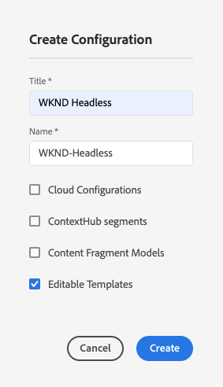

# 구성 및 구성 브라우저 {#configuration-browser}

Adobe Experience Manager(AEM) 구성은 AEM에서 설정을 관리하고 작업 공간으로 사용됩니다.

## 구성이란? {#what-is-a-configuration}

구성은 두 가지 다른 관점에서 고려될 수 있다.

* [관리자](#configurations-administrator)는 AEM 내의 작업 영역으로 구성을 사용하여 설정 그룹을 정의하고 관리합니다.
* [개발자](#configurations-developer)는 AEM에서 설정을 유지하고 찾는 구성을 구현하는 기본 구성 메커니즘을 사용합니다.

요약: 관리자의 관점에서 구성은 AEM에서 설정을 관리하는 작업 영역을 만드는 방법이지만 개발자는 AEM이 저장소 내에서 이러한 구성을 사용하고 관리하는 방법을 이해해야 합니다.

사용자의 관점에서 볼 때 구성은 AEM에서 두 가지 주요 목적을 제공합니다.

* 구성은 특정 사용자 그룹에 대해 특정 기능을 사용할 수 있도록 합니다.
* 구성은 이러한 기능에 대한 액세스 권한을 정의합니다.

## 관리자로서의 구성 {#configurations-administrator}

AEM 관리자 및 작성자는 구성을 작업 공간으로 고려할 수 있습니다. 이러한 작업 공간은 이러한 기능에 대한 액세스 권한을 구현하여 조직 목적으로 설정 그룹 및 관련 콘텐츠를 수집하는 데 사용할 수 있습니다.

AEM 내의 다양한 기능에 대해 구성을 만들 수 있습니다.

* [Context Hub 세그먼트](/help/sites-cloud/authoring/personalization/contexthub-segmentation.md)
* [콘텐츠 조각 모델](/help/sites-cloud/administering/content-fragments/content-fragment-models.md)
* [편집 가능한 템플릿](/help/sites-cloud/authoring/page-editor/templates.md)
* 다양한 클라우드 구성

### 예 {#administrator-example}

예를 들어, 관리자는 편집 가능한 템플릿에 대해 두 가지 구성을 만들 수 있습니다.

* WKND 일반
* 매거진

그런 다음 관리자는 WKND 일반 구성을 사용하여 일반 페이지 템플릿을 만든 다음 WKND-Magazine 아래에 있는 매거진 관련 템플릿을 만들 수 있습니다.

그런 다음 관리자는 WKND-General을 WKND 사이트의 모든 콘텐츠와 연결할 수 있습니다. 그러나 WKND-Magazine 구성은 매거진 사이트와만 연결됩니다.

다음을 수행합니다.

* 콘텐츠 작성자는 매거진 페이지를 만들 때 일반 템플릿(WKND-General) 또는 매거진 템플릿(WKND-Magazine) 중에서 선택할 수 있습니다.
* 콘텐츠 작성자가 매거진이 아닌 사이트의 다른 부분에 대한 페이지를 만들 때 일반 템플릿(WKND-General) 중에서 선택할 수만 있습니다.

편집 가능한 템플릿뿐만 아니라 클라우드 구성, ContextHub 세그먼트 및 콘텐츠 조각 모델에도 유사한 설정이 가능합니다.

### 구성 브라우저 사용 {#using-configuration-browser}

관리자는 구성 브라우저를 사용하여 AEM에서 구성에 대한 액세스 권한을 쉽게 만들고, 관리하고, 구성할 수 있습니다.

>[!NOTE]
>
>사용자에게 `admin` 권한이 있는 경우에만 구성 브라우저를 사용하여 구성을 만들 수 있습니다. 이러한 `admin` 권한은 구성에 액세스 권한을 할당하거나 구성을 수정하는 데에도 필요합니다.

#### 구성 만들기 {#creating-a-configuration}

구성 브라우저를 사용하여 AEM에서 구성을 간단하게 만들 수 있습니다.

1. AEM as a Cloud Service에 로그인하고 메인 메뉴에서 **도구** > **일반** > **구성 브라우저**&#x200B;를 선택합니다.
1. **만들기**&#x200B;를 선택합니다.
1. 구성의 **제목** 및 **이름**&#x200B;을 입력합니다.

   

   * **제목**&#x200B;은 설명적이어야 합니다.
   * **이름**&#x200B;은 저장소의 노드 이름이 됩니다.
      * 제목을 기반으로 자동 생성되고 [AEM 명명 규칙](naming-conventions.md)에 따라 조정됩니다.
      * 필요한 경우 조정할 수 있습니다.
1. 허용하려는 구성 유형을 확인합니다.
   * [Context Hub 세그먼트](/help/sites-cloud/authoring/personalization/contexthub-segmentation.md)
   * [콘텐츠 조각 모델](/help/sites-cloud/administering/content-fragments/content-fragment-models.md)
   * [편집 가능한 템플릿](/help/sites-cloud/authoring/page-editor/templates.md)
   * 다양한 클라우드 구성
1. **만들기**&#x200B;를 선택합니다.

>[!TIP]
>
>구성이 중첩될 수 있습니다.

#### 구성 및 해당 액세스 권한 편집 {#access-rights}

구성을 작업 영역으로 생각하면 해당 구성에 액세스 권한을 설정하여 누가 해당 작업 영역에 액세스할 수 있고 액세스할 수 없는지 적용할 수 있습니다.

1. AEM as a Cloud Service에 로그인하고 메인 메뉴에서 **도구** > **일반** > **구성 브라우저**&#x200B;를 선택합니다.
1. 편집할 구성을 선택한 다음 도구 모음에서 **속성**&#x200B;을 선택합니다.
1. 구성에 추가할 추가 기능을 선택합니다.

   >[!NOTE]
   >
   >구성이 생성되면 기능을 선택 취소할 수 없습니다.

1. **유효 권한** 단추를 사용하여 역할 매트릭스와 현재 구성에 부여된 권한을 확인합니다.
   
1. 새 권한을 할당하려면 **새 권한 추가** 섹션의 **사용자 또는 그룹 선택** 필드에 사용자 또는 그룹 이름을 입력하십시오.
   * **사용자 또는 그룹 선택** 필드는 기존 사용자 및 역할을 기반으로 자동 완성을 제공합니다.
1. 자동 완성 결과에서 적절한 사용자 또는 역할을 선택합니다.
   * 사용자 또는 역할을 두 개 이상 선택할 수 있습니다.
1. 하나 이상의 선택한 사용자 또는 역할에 필요한 액세스 옵션을 확인하고 **추가**를 클릭합니다.
   
1. 단계를 반복하여 사용자 또는 역할을 선택하고 필요에 따라 추가 액세스 권한을 할당할 수 있습니다.
1. 완료되면 **저장 및 닫기**&#x200B;를 선택합니다.

## 개발자로서의 구성 {#configurations-developer}

개발자로서 AEM as a Cloud Service이 구성에서 작동하는 방식과 구성 해결을 처리하는 방법을 아는 것이 중요합니다.

### 구성 및 컨텐츠 분리 {#separation-of-config-and-content}

[관리자와 사용자는 서로 다른 설정 및 콘텐츠를 관리하기 위해 구성을 작업 공간](#configurations-administrator)(으)로 생각할 수 있지만, 구성 및 콘텐츠는 저장소의 AEM에 의해 별도로 저장되고 관리된다는 것을 이해하는 것이 중요합니다.

* `/content`은(는) 모든 컨텐츠의 홈입니다.
* `/conf`은(는) 모든 구성의 홈입니다.

콘텐츠는 `cq:conf` 속성을 통해 연결된 구성을 참조합니다. AEM은 콘텐츠 및 해당 컨텍스트 `cq:conf` 속성을 기반으로 조회를 수행하여 적절한 구성을 찾습니다.

### 예 {#developer-example}

이 예에서는 DAM 설정에 관심이 있는 응용 프로그램 코드가 있다고 가정해 보겠습니다.

```java
Conf conf = resource.adaptTo(Conf.class);
ValueMap imageServerSettings = conf.getItem("dam/imageserver");
String bgkcolor = imageServerSettings.get("bgkcolor", "FFFFFF");
```

모든 구성 조회의 시작점은 `/content` 아래에 있는 콘텐츠 리소스입니다. 페이지, 페이지 내의 구성 요소, 에셋 또는 DAM 폴더일 수 있습니다. 이 컨텍스트에서 적용되는 올바른 구성을 찾고 있는 실제 콘텐츠입니다.

이제 `Conf` 개체를 통해 관심 있는 특정 구성 항목을 검색할 수 있습니다. 이 경우 `imageserver`과(와) 관련된 설정의 컬렉션인 `dam/imageserver`입니다. `getItem` 호출이 `ValueMap`을(를) 반환합니다. 그런 다음 `bgkcolor` 문자열 속성을 읽고 속성(또는 전체 구성 항목)이 없는 경우 &quot;FFFFFF&quot;의 기본값을 제공합니다.

이제 해당 JCR 콘텐츠를 살펴보겠습니다.

```text
/content/dam/wknd
    + jcr:content
      - cq:conf = "/conf/wknd"
    + image.png [dam:Asset]

/conf/wknd
    + settings
      + dam
        + imageserver [cq:Page]
          + jcr:content
            - bgkcolor = "FF0000"
```

이 예에서는 여기에서 WKND별 DAM 폴더와 해당 구성을 가정할 수 있습니다. 해당 폴더 `/content/dam/wknd`부터 하위 트리에 적용되는 구성을 참조하는 이름이 `cq:conf`인 문자열 속성이 있음을 확인할 수 있습니다. 속성이 자산 폴더 또는 페이지의 `jcr:content`에 설정되어 있습니다. 이러한 `conf` 링크는 명시적이므로 CRXDE의 콘텐츠만 보면 쉽게 따라갈 수 있습니다.

`/conf` 내에서 건너뛰고 참조를 따라 `/conf/wknd` 노드가 있는지 확인합니다. 이는 구성입니다. 조회는 애플리케이션 코드를 통과시킵니다. 예제 코드에는 전용 참조가 없습니다. `Conf` 개체 뒤에 숨겨져 있습니다. 적용되는 구성은 JCR 콘텐츠를 통해 제어됩니다.

구성에 이 경우에 필요한 `dam/imageserver`을(를) 포함하여 실제 항목을 포함하는 고정 이름의 `settings` 노드가 포함되어 있습니다. 이러한 항목은 &quot;설정 문서&quot;로 생각할 수 있으며 실제 콘텐츠를 포함하는 `jcr:content`을(를) 포함하는 `cq:Page`로 표시됩니다.

마지막으로 이 샘플 코드에 필요한 속성 `bgkcolor`이(가) 표시됩니다. `getItem`에서 다시 가져온 `ValueMap`은(는) 페이지의 `jcr:content` 노드를 기반으로 합니다.

### 구성 해결 방법 {#configuration-resolution}

위의 기본 예에서는 단일 구성을 보여 주었습니다. 그러나 기본 전역 구성, 각 브랜드마다 다른 구성 및 하위 프로젝트별로 특정 구성과 같은 다른 구성을 원하는 경우가 많습니다.

이 구성 조회를 지원하기 위해 AEM에는 다음과 같은 기본 설정 순서로 상속 및 폴백 메커니즘이 있습니다.

1. `/conf/<siteconfig>/<parentconfig>/<myconfig>`
   * `cq:conf`에서 `/content`의 어딘가에서 참조된 특정 구성
   * 계층은 임의적이며 사이트 구조처럼 디자인될 수 있으며, 이를 아는 것은 애플리케이션 코드의 일이 아닙니다
   * 구성 권한이 있는 사용자가 런타임에 변경 가능
1. `/conf/<siteconfig>/<parentconfig>`
   * 폴백 구성을 위한 상위 트래버스
   * 구성 권한이 있는 사용자가 런타임에 변경 가능
1. `/conf/<siteconfig>`
   * 폴백 구성을 위한 상위 트래버스
   * 구성 권한이 있는 사용자가 런타임에 변경 가능
1. `/conf/global`
   * 시스템 전역 설정
   * 설치에 대한 글로벌 기본값
   * `admin` 역할에 의해 설정됨
   * 구성 권한이 있는 사용자가 런타임에 변경 가능
1. `/apps`
   * 응용 프로그램 기본값
   * 애플리케이션 배포로 수정됨
   * 런타임 시 읽기 전용
1. `/libs`
   * AEM 제품 기본값
   * Adobe에 의해서만 변경 가능하며, 프로젝트 액세스는 허용되지 않습니다.
   * 애플리케이션 배포로 수정됨
   * 런타임 시 읽기 전용

### 구성 사용 {#using-configurations}

AEM의 구성은 슬링 컨텍스트 인식 구성을 기반으로 합니다. Sling 번들은 컨텍스트 인식 구성을 가져오는 데 사용할 수 있는 서비스 API를 제공합니다. 컨텍스트 인식 구성은 이전 예에서 [설명한 대로 콘텐츠 리소스 또는 리소스 트리와 관련된 구성입니다](#developer-example).

컨텍스트 인식 구성, 예제 및 사용 방법에 대한 자세한 내용은 [Sling 설명서](https://sling.apache.org/documentation/bundles/context-aware-configuration/context-aware-configuration.html)를 참조하십시오.

### ConfMgr 웹 콘솔 {#confmgr-web-console}

디버깅 및 테스트 목적으로 `https://<host>:<port>/system/console/conf`에 지정된 경로/항목에 대한 구성을 표시할 수 있는 **ConfMgr** 웹 콘솔이 있습니다.


간단히 다음을 제공합니다.

* **콘텐츠 경로**
* **항목**
* **사용자**

**해결**&#x200B;을 클릭하면 해결된 구성을 확인하고 해당 구성을 확인하는 데 도움이 되는 코드 샘플을 가져올 수 있습니다.

### 컨텍스트 인식 구성 웹 콘솔 {#context-aware-web-console}

디버깅 및 테스트 목적으로 `https://<host>:<port>/system/console/slingcaconfig`에 **컨텍스트 인식 구성** 웹 콘솔이 있으며, 이를 통해 저장소의 컨텍스트 인식 구성을 쿼리하고 해당 속성을 볼 수 있습니다.


간단히 다음을 제공합니다.

* **콘텐츠 경로**
* **구성 이름**

선택한 구성에 대해 연결된 컨텍스트 경로 및 속성을 검색할 수 있도록 **확인**&#x200B;을 클릭합니다.
