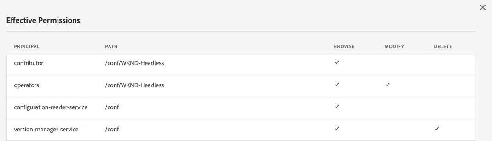

# 구성 및 구성 브라우저 {#configuration-browser}

AEM 구성은 AEM에서 설정을 관리하고 작업 영역으로 사용할 수 있습니다.

## 구성이란 무엇입니까?{#what-is-a-configuration}

구성은 두 가지 서로 다른 관점에서 고려될 수 있습니다.

* [관리자](#configurations-administrator) 는 구성을 AEM의 작업 영역으로 사용하여 설정 그룹을 정의하고 관리합니다.
* [개발자는 ](#configurations-developer) AEM에서 설정을 유지하고 검색할 구성을 구현하는 기본 구성 메커니즘을 사용합니다.

요약:관리자의 관점에서 구성은 작업 영역을 만들어 AEM에서 설정을 관리하는 방식이지만, 개발자는 저장소 내에서 이러한 구성을 사용하고 관리하는 방법을 이해해야 합니다.

사용자의 관점에서 볼 때 구성은 AEM에서 두 가지 주요 목적을 지원합니다.

* 구성은 특정 사용자 그룹에 대해 특정 기능을 활성화합니다.
* 구성은 이러한 기능에 대한 액세스 권한을 정의합니다.

## {#configurations-administrator} 관리자로 구성

작성자는 물론 AEM 관리자도 구성을 작업 영역으로 간주할 수 있습니다. 이러한 작업 영역은 해당 기능에 대한 액세스 권한을 구현하여 조직상의 목적으로 관련 컨텐츠뿐만 아니라 설정 그룹을 함께 수집하는 데 사용할 수 있습니다.

AEM 내의 다양한 기능에 대한 구성을 만들 수 있습니다.

* [클라우드 구성](/help/implementing/developing/introduction/configurations.md)
* [Context Hub 세그먼트](/help/sites-cloud/authoring/personalization/contexthub-segmentation.md)
* [콘텐츠 조각 모델](/help/assets/content-fragments/content-fragments-models.md)
* [편집 가능한 템플릿](/help/sites-cloud/authoring/features/templates.md)

### 예 {#administrator-example}

예를 들어, 관리자는 편집 가능한 템플릿에 대해 2개의 구성을 만들 수 있습니다.

* WKND-General
* WKND-Magazine

그런 다음 관리자는 WKND-General 구성을 사용하여 일반 페이지 템플릿을 만든 다음 WKND-Magazine 아래에 있는 해당 매거진에만 해당하는 템플릿을 만들 수 있습니다.

그런 다음 관리자는 WKND-General를 WKND 사이트의 모든 컨텐츠와 연결할 수 있습니다. 그러나 WKND-Magazine 구성은 잡지 사이트와만 연관됩니다.

다음을 수행합니다.

* 컨텐츠 작성자가 해당 잡지의 새 페이지를 만들면 일반 템플릿(WKND-General) 또는 잡지 템플릿(WKND-Magazine)을 선택할 수 있습니다.
* 컨텐츠 작성자가 잡지 이외의 사이트 다른 부분에 대한 새 페이지를 만들면 작성자는 일반 템플릿(WKND-General)에서만 선택할 수 있습니다.

비슷한 설정은 편집 가능한 템플릿뿐만 아니라 클라우드 구성, ContextHub 세그먼트 및 컨텐츠 조각 모델에 대해서도 가능합니다.

### 구성 브라우저 {#using-configuration-browser} 사용

관리자는 구성 브라우저를 사용하여 AEM의 구성에 대한 액세스 권한을 쉽게 만들고, 관리하고, 구성할 수 있습니다.

>[!NOTE]
>
>사용자에게 `admin` 권한이 있는 경우에만 구성 브라우저를 사용하여 구성을 만들 수 있습니다. `admin` 구성에 액세스 권한을 할당하거나 구성을 수정하려면 권한이 필요합니다.

#### 구성 {#creating-a-configuration} 만들기

구성 브라우저를 사용하여 AEM에서 새 구성을 간단하게 만들 수 있습니다.

1. AEM에 Cloud Service으로 로그인하고 주 메뉴에서 **도구** -> **일반** -> **구성 브라우저**&#x200B;를 선택합니다.
1. **만들기**&#x200B;를 탭하거나 클릭합니다.
1. 구성에 **제목** 및 **이름**&#x200B;을 입력합니다.

   

   * **제목**&#x200B;은 설명적이어야 합니다.
   * **이름**&#x200B;은 저장소의 노드 이름이 됩니다.
      * 제목 기반으로 자동으로 생성되고 [AEM 이름 지정 규칙에 따라 조정됩니다.](naming-conventions.md)
      * 필요한 경우 조정할 수 있습니다.
1. 허용할 구성 유형을 확인합니다.
   * [클라우드 구성](/help/implementing/developing/introduction/configurations.md)
   * [Context Hub 세그먼트](/help/sites-cloud/authoring/personalization/contexthub-segmentation.md)
   * [콘텐츠 조각 모델](/help/assets/content-fragments/content-fragments-models.md)
   * [편집 가능한 템플릿](/help/sites-cloud/authoring/features/templates.md)
1. **만들기**&#x200B;를 탭하거나 클릭합니다.

>[!TIP]
>
>구성이 중첩될 수 있습니다.

#### 구성 편집 및 해당 액세스 권한 {#access-rights}

구성을 작업 영역으로 간주하는 경우 해당 작업 영역에 액세스할 수 있는 사용자와 액세스할 수 없는 사용자를 적용하기 위해 해당 구성에 대한 액세스 권한을 설정할 수 있습니다.

1. AEM에 Cloud Service으로 로그인하고 주 메뉴에서 **도구** -> **일반** -> **구성 브라우저**&#x200B;를 선택합니다.
1. 수정할 구성을 선택한 다음 도구 모음에서 **속성**&#x200B;을 탭하거나 클릭합니다.
1. 구성에 추가할 추가 기능 선택
   >[!NOTE]
   >
   >구성이 생성되면 기능 선택을 취소할 수 없습니다.
1. **유효 권한** 단추를 사용하여 역할 행렬과 현재 구성에 부여된 권한을 확인합니다.
   
1. 새 권한을 할당하려면 **새 권한 추가** 섹션의 **사용자 또는 그룹 선택** 필드에 사용자 또는 그룹 이름을 입력합니다.
   * **사용자 또는 그룹 선택** 필드는 기존 사용자 및 역할에 따라 자동 완성 기능을 제공합니다.
1. 자동 완료 결과에서 적절한 사용자 또는 역할을 선택합니다.
   * 둘 이상의 사용자 또는 역할을 선택할 수 있습니다.
1. 선택한 사용자 또는 역할이 가져야 하는 액세스 옵션을 확인하고 **추가**를 클릭합니다.
   
1. 이 단계를 반복하여 사용자 또는 역할을 선택하고 필요에 따라 추가 액세스 권한을 지정합니다.
1. 완료되면 **저장 및 닫기**&#x200B;를 탭하거나 클릭합니다.

## {#configurations-developer} 개발자로 구성

개발자는 Cloud Service의 AEM이 구성에서 작동하는 방식과 구성 해상도를 처리하는 방법을 파악하는 것이 중요합니다.

### 구성 및 컨텐츠 분리 {#separation-of-config-and-content}

[관리자 및 사용자는 다양한 설정 및 컨텐츠를 관리하기 위해 구성을 직장](#configurations-administrator)으로 생각할 수 있지만, 구성 및 컨텐츠가 저장소의 AEM에 의해 별도로 저장되고 관리되는지 이해하는 것이 중요합니다.

* `/content` 는 모든 컨텐츠의 홈입니다.
* `/conf` 은 모든 구성의 홈입니다.

콘텐츠는 `cq:conf` 속성을 통해 관련 구성을 참조합니다. AEM은 컨텐츠를 기반으로 조회를 수행하며 적절한 구성을 찾기 위해 컨텍스트 `cq:conf` 속성을 찾습니다.

### 예 {#developer-example}

이 예를 들어 DAM 설정에 관심이 있는 일부 애플리케이션 코드가 있다고 가정합니다.

```java
Conf conf = resource.adaptTo(Conf.class);
ValueMap imageServerSettings = conf.getItem("dam/imageserver");
String bgkcolor = imageServerSettings.get("bgkcolor", "FFFFFF");
```

모든 구성 조회의 시작 지점은 컨텐츠 리소스입니다. 일반적으로 `/content` 아래에 있습니다. 페이지, 페이지 내의 구성 요소, 자산 또는 DAM 폴더일 수 있습니다. 이 컨텍스트에서 적용되는 올바른 구성을 찾는 실제 컨텐츠입니다.

이제 `Conf` 개체를 사용하여 원하는 특정 구성 항목을 검색할 수 있습니다. 이 경우 `dam/imageserver`은(는) `imageserver`과 관련된 설정 모음입니다. `getItem` 호출은 `ValueMap`을 반환합니다. 그런 다음 `bgkcolor` 문자열 속성을 읽고 속성(또는 전체 구성 항목)이 없을 경우 &quot;FFFFFF&quot;의 기본값을 제공합니다.

이제 해당 JCR 컨텐츠를 살펴보겠습니다.

```text
/content/dam/wknd
    + jcr:content
      - cq:conf = "/conf/wknd"
    + image.png [dam:Asset]

/conf/wkns
    + settings
      + dam
        + imageserver [cq:Page]
          + jcr:content
            - bgkcolor = "FF0000"
```

이 예에서는 여기에 WKND 특정 DAM 폴더와 해당 구성을 가정합니다. `/content/dam/wknd` 폴더에서 시작하여 하위 트리에 적용할 구성을 참조하는 `cq:conf` 문자열 속성이 있습니다. 속성은 대개 자산 폴더 또는 페이지의 `jcr:content`에서 설정됩니다. 이러한 `conf` 링크는 명시적 링크이므로 CRXDE의 컨텐츠를 살펴봄으로써 해당 링크를 손쉽게 추적할 수 있습니다.

`/conf` 안으로 이동하는 경우 참조를 따르고 `/conf/wknd` 노드가 있음을 확인합니다. 구성입니다. 해당 조회는 응용 프로그램 코드에 완전히 투명합니다. 예제 코드에는 이 코드에 대한 전용 참조가 없습니다. 이 코드는 `Conf` 개체 뒤에 숨겨져 있습니다. 적용되는 구성은 JCR 컨텐츠를 통해 완전히 제어됩니다.

이 구성에는 실제 항목이 포함된 고정 이름 `settings` 노드가 포함되어 있습니다(이 경우 필요한 `dam/imageserver` 포함). 이러한 항목은 &quot;설정 문서&quot;로 간주할 수 있으며 일반적으로 실제 내용을 포함하는 `jcr:content`을 포함하는 `cq:Page`으로 표현됩니다.

마지막으로 샘플 코드에 필요한 속성 `bgkcolor`이 표시됩니다. `getItem`에서 돌아오는 `ValueMap`은 페이지의 `jcr:content` 노드를 기반으로 합니다.

### 구성 해상도 {#configuration-resolution}

위의 기본 예는 단일 구성을 보여 줍니다. 하지만 기본 전역 구성, 각 브랜드에 대해 다른 구성, 하위 프로젝트에 대한 특정 구성 등 다양한 구성을 원하는 경우가 많습니다.

이를 지원하기 위해 AEM에서 구성 조회에 상속과 폴백 메커니즘이 다음과 같은 환경 설정 순서로 있습니다.

1. `/conf/<siteconfig>/<parentconfig>/<myconfig>`
   * `cq:conf`에서 참조되는 특정 구성: `/content`
   * 계층 구조는 임의의 항목이며 사이트 구조와 마찬가지로 디자인될 수 있으며 애플리케이션 코드의 비즈니스 사항이 아닙니다
   * 구성 권한이 있는 사용자가 런타임에 변경 가능
1. `/conf/<siteconfig>/<parentconfig>`
   * 폴백 구성을 위해 부모 트래버스
   * 구성 권한이 있는 사용자가 런타임에 변경 가능
1. `/conf/<siteconfig>`
   * 폴백 구성을 위해 부모 트래버스
   * 구성 권한이 있는 사용자가 런타임에 변경 가능
1. `/conf/global`
   * 시스템 전역 설정
   * 일반적으로 설치에 대한 전역 기본값
   * `admin` 역할로 설정
   * 구성 권한이 있는 사용자가 런타임에 변경 가능
1. `/apps`
   * 애플리케이션 기본값
   * 애플리케이션 배포 시 수정됨
   * 런타임 시 읽기 전용
1. `/libs`
   * AEM 제품 기본값
   * Adobe로만 변경 가능하지만 프로젝트 액세스는 허용되지 않습니다.
   * 애플리케이션 배포 시 수정됨
   * 런타임 시 읽기 전용

### 구성 사용 {#using-configurations}

AEM의 구성은 Sling 컨텍스트 인식 구성을 기반으로 합니다. Sling 번들은 컨텍스트 인식 구성을 가져오는 데 사용할 수 있는 서비스 API를 제공합니다. 컨텍스트 인식 구성은 이전 예에서 설명한 [과 같이 컨텐츠 리소스 또는 리소스 트리와 관련된 구성입니다.](#developer-example)

컨텍스트 인식 구성, 예 및 사용 방법에 대한 자세한 내용은 [Sling 설명서를 참조하십시오.](https://sling.apache.org/documentation/bundles/context-aware-configuration/context-aware-configuration.html)

### ConfMgr 웹 콘솔 {#confmgr-web-console}

디버깅 및 테스트 목적으로 **ConfMgr** 웹 콘솔이 `https://<host>:<port>/system/console/conf`에 있으며 이 콘솔은 지정된 경로/항목에 대한 구성을 표시할 수 있습니다.


간단하게 다음을 제공합니다.

* **컨텐츠 경로**
* **항목**
* **사용자**

**Resolve**&#x200B;을 클릭하여 어느 구성이 확인되었는지 확인하고 이러한 구성을 해결할 샘플 코드를 받습니다.

### 컨텍스트 인식 구성 웹 콘솔 {#context-aware-web-console}

디버깅 및 테스트를 위해 **컨텍스트 인식 구성** 웹 콘솔이 `https://<host>:<port>/system/console/slingcaconfig`에 있습니다. 이 콘솔에서는 저장소에서 컨텍스트 인식 구성을 쿼리하고 해당 속성을 볼 수 있습니다.


간단하게 다음을 제공합니다.

* **컨텐츠 경로**
* **구성 이름**

**해결**&#x200B;을 클릭하여 선택한 구성에 대한 연관된 컨텍스트 경로 및 속성을 검색합니다.
