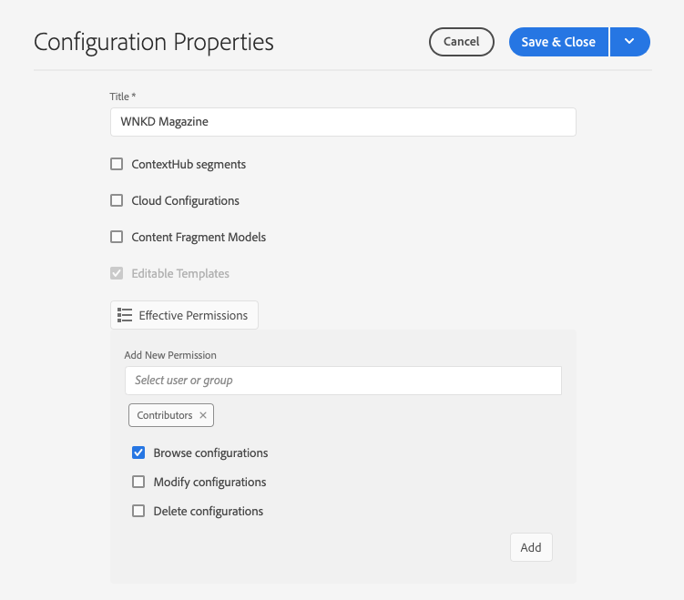

# 구성 및 구성 브라우저 {#configuration-browser}

AEM 구성은 AEM의 설정을 관리하고 작업 영역으로 사용할 수 있습니다.

## 구성이란? {#what-is-a-configuration}

구성은 두 가지 다른 관점에서 고려될 수 있다.

* [관리자는](#configurations-administrator) 구성을 AEM 내의 작업 영역으로 사용하여 설정 그룹을 정의하고 관리합니다.
* [개발자는](#configurations-developer) Sling 컨텍스트 인식 구성을 구현하여 AEM에서 설정을 유지하고 조회하는 기본 구성 메커니즘을 사용합니다.

간단히 말해, 관리자의 관점에서 구성은 작업 영역을 만들어 AEM에서 설정을 관리하는 방법이지만, 개발자는 AEM이 저장소 내에서 이러한 구성을 어떻게 지속하고 조회하는지 이해해야 합니다.

사용자의 관점에서 볼 때 구성은 AEM의 두 가지 주요 목적을 따릅니다.

* 구성은 사용자 그룹에 대해 특정 기능을 활성화합니다.
* 구성은 해당 기능에 대한 액세스 권한을 정의합니다.

## 관리자로서의 구성 {#configurations-administrator}

작성자와 AEM 관리자는 구성을 작업 영역으로 간주할 수 있습니다. 이러한 작업 영역은 해당 기능에 대한 액세스 권한을 구현하여 조직용으로 관련 컨텐츠뿐만 아니라 설정 그룹도 수집하는 데 사용할 수 있습니다.

AEM 내의 다양한 기능에 대한 구성을 만들 수 있습니다.

* [클라우드 구성](/help/implementing/developing/introduction/configurations.md)
* [컨텍스트 허브 세그먼트](/help/sites-cloud/authoring/personalization/contexthub-segmentation.md)
* [콘텐츠 조각 모델](/help/assets/content-fragments/content-fragments-models.md)
* [편집 가능한 템플릿](/help/sites-cloud/authoring/features/templates.md)

예를 들어, 관리자는 편집 가능한 템플릿에 대해 두 개의 구성을 만들 수 있습니다.

* WKND-General
* WKND-Magazine

그런 다음 관리자는 WKND-General 구성을 사용하여 일반 페이지 템플릿을 만든 다음 WKND-Magazine 아래에 있는 해당 잡지의 템플릿을 만들 수 있습니다.

그런 다음 관리자는 WKND-General를 WKND 사이트의 모든 컨텐츠와 연결할 수 있습니다. 그러나 WKND-Magazine 구성은 잡지 사이트와만 연관됩니다.

다음을 수행하여:

* 컨텐츠 작성자가 잡지의 새 페이지를 만들면 일반 템플릿(WKND-General) 또는 잡지 템플릿(WKND-Magazine)에서 선택할 수 있습니다.
* 컨텐츠 작성자가 잡지의 다른 부분이 아닌 사이트의 다른 부분에 대한 새 페이지를 만들면 작성자는 일반 템플릿(WKND-General)에서만 선택할 수 있습니다.

편집 가능한 템플릿뿐만 아니라 클라우드 구성, ContextHub 세그먼트 및 컨텐츠 조각 모델에 대해서도 유사한 설정을 수행할 수 있습니다.

### 구성 브라우저 사용 {#using-configuration-browser}

관리자는 구성 브라우저를 사용하여 AEM에서 구성에 대한 액세스 권한을 쉽게 생성, 관리 및 구성할 수 있습니다.

>[!NOTE]
>
>사용자에게 권한이 있는 경우에만 구성 브라우저를 사용하여 구성을 만들 수 `admin` 있습니다. `admin` 구성에 액세스 권한을 할당하거나 구성을 수정하려면 권한이 필요합니다.

#### 구성 만들기 {#creating-a-configuration}

구성 브라우저를 사용하여 AEM에서 새 구성을 만드는 것은 매우 간단합니다.

1. AEM에 Cloud Service으로 로그인하고 주 메뉴에서 **도구** -> **일반** -> **구성 브라우저**&#x200B;를 선택합니다.
1. **만들기**&#x200B;를 탭하거나 클릭합니다.
1. 구성에 대한 **제목** 및 **이름을** 제공합니다.

   

   * 제목은 **설명적이어야** 합니다.
   * 이름 **은** 저장소의 노드 이름이 됩니다.
      * 제목 기반으로 자동으로 생성되고 [AEM 이름 지정 규칙에 따라 조정됩니다.](naming-conventions.md)
      * 필요한 경우 조정할 수 있습니다.
1. 허용할 구성 유형을 확인합니다.
   * [클라우드 구성](/help/implementing/developing/introduction/configurations.md)
   * [컨텍스트 허브 세그먼트](/help/sites-cloud/authoring/personalization/contexthub-segmentation.md)
   * [콘텐츠 조각 모델](/help/assets/content-fragments/content-fragments-models.md)
   * [편집 가능한 템플릿](/help/sites-cloud/authoring/features/templates.md)
1. **만들기**&#x200B;를 탭하거나 클릭합니다.

>[!TIP]
>
>구성이 중첩될 수 있습니다.

#### 구성 및 액세스 권한 편집 {#access-rights}

구성을 작업 영역으로 간주하는 경우 해당 구성에 액세스 권한을 설정하여 해당 작업 영역에 액세스할 수 있는 사용자와 그렇지 않은 사용자를 강제 적용할 수 있습니다.

1. AEM에 Cloud Service으로 로그인하고 주 메뉴에서 **도구** -> **일반** -> **구성 브라우저**&#x200B;를 선택합니다.
1. 수정할 구성을 선택한 다음 도구 모음에서 **속성** 을 탭하거나 클릭합니다.
1. 구성에 추가할 추가 기능 선택
   >[!NOTE]
   >
   >구성이 생성되면 피쳐 선택을 취소할 수 없습니다.
1. [ **유효 권한** ] 단추를 사용하여 역할 및 현재 구성에 부여된 권한을 확인합니다.
   
1. 새 권한을 할당하려면 [새 권한 **추가] 섹션의 [사용자 또는 그룹** 선택] 필드에 사용자 또는 그룹 **이름을** 입력합니다.
   * 사용자 **또는 그룹** 선택 필드는 기존 사용자 및 역할에 따라 자동 완성 기능을 제공합니다.
1. 자동 완성 결과에서 적절한 사용자 또는 역할을 선택합니다.
   * 둘 이상의 사용자 또는 역할을 선택할 수 있습니다.
1. 선택한 사용자 또는 역할이 가져야 하는 액세스 옵션을 확인하고 **추가를 클릭합니다**.
   
1. 이 단계를 반복하여 사용자 또는 역할을 선택하고 필요에 따라 추가 액세스 권한을 지정합니다.
1. 완료되면 저장 **및 닫기를 탭하거나** 클릭합니다.

## 개발자로서 구성 {#configurations-developer}

개발자는 AEM이 구성 및 Cloud Service에서 작동하는 방식과 구성 해상도를 처리하는 방식을 알아야 합니다.

### 구성 및 컨텐츠 분리 {#separation-of-config-and-content}

관리자와 [사용자는 다양한 설정 및 컨텐츠를 관리하기 위해 구성을 작업장으로](#configurations-administrator) 생각할 수 있지만, 구성 및 컨텐츠는 저장소의 AEM에 의해 별도로 저장되고 관리된다는 점을 이해하는 것이 중요합니다.

* `/content` 는 모든 컨텐츠의 홈입니다.
* `/conf` 은 모든 구성의 본문입니다.

콘텐츠는 속성을 통해 관련 구성을 `cq:conf` 참조합니다. AEM은 컨텐츠를 기반으로 조회를 수행하고 컨텍스트 `cq:conf` 속성을 사용하여 적절한 구성을 찾습니다.

### 간단한 예 {#example}

이 예에서는 DAM 설정에 관심이 있는 일부 애플리케이션 코드가 있다고 가정합니다.

```java
Conf conf = resource.adaptTo(Conf.class);
ValueMap imageServerSettings = conf.getItem("dam/imageserver");
String bgkcolor = imageServerSettings.get("bgkcolor", "FFFFFF");
```

모든 구성 조회의 시작 지점은 컨텐츠 리소스이며 일반적으로 하위 `/content`위치입니다. 페이지, 페이지 내의 구성 요소, 자산 또는 DAM 폴더일 수 있습니다. 이 내용은 이 컨텍스트에서 적용되는 올바른 구성을 찾는 실제 컨텐츠입니다.

이제 `Conf` 객체를 사용하여 원하는 특정 구성 항목을 검색할 수 있습니다. 이 경우 `dam/imageserver`와 관련된 설정 컬렉션입니다 `imageserver`. 호출은 `getItem` a를 반환합니다 `ValueMap`. 그런 다음 `bgkcolor` 문자열 속성을 읽고 속성(또는 전체 구성 항목)이 없을 경우 기본값 &quot;FFFF&quot;를 제공합니다.

이제 해당 JCR 컨텐츠를 살펴보겠습니다.

```text
/content/dam/wknd
    + jcr:content
      - cq:conf = "/conf/wknd"
    + image.png [dam:Asset]

/conf/wkns
    + settings
      + dam
        + imageserver [cq:Page]
          + jcr:content
            - bgkcolor = "FF0000"
```

이 예에서는 여기에 WKND 특정 DAM 폴더와 해당 구성을 가정해 보겠습니다. 해당 폴더에서 `/content/dam/wknd`시작하여 하위 트리에 적용할 구성을 참조하는 문자열 속성 `cq:conf` 이 있음을 확인할 수 있습니다. 이 속성은 대개 자산 폴더 또는 페이지 `jcr:content` 에서 설정됩니다. 이러한 `conf` 링크는 명시적 링크이므로 CRXDE의 컨텐츠만 보면 손쉽게 링크를 추적할 수 있습니다.

안으로 `/conf`뛰어들어, 우리는 참조를 따르고 하나의 `/conf/wknd` 노드가 있음을 봅니다. 구성입니다. 해당 조회는 응용 프로그램 코드에 완전히 투명합니다. 예제 코드에는 전용 참조가 없으며 `Conf` 개체 뒤에 숨겨집니다. 적용되는 구성은 JCR 컨텐츠를 통해 완전히 제어됩니다.

이 구성에는 실제 항목이 포함된 고정 이름 `settings` 의 노드가 포함되어 있으며, 이 경우 필요한 항목이 `dam/imageserver` 포함됩니다. 이러한 항목은 &quot;설정 문서&quot;로 간주될 수 있으며 일반적으로 실제 컨텐츠를 포함하는 것으로 `cq:Page` `jcr:content` 표현됩니다.

마지막으로 샘플 코드에 필요한 속성 `bgkcolor` 이 표시됩니다. The `ValueMap` get back from `getItem` is based on the page&#39;s `jcr:content` node.

### 구성 해상도 {#configuration-resolution}

위의 기본 예는 단일 구성을 보여 줍니다. 하지만 기본 전역 구성, 각 브랜드에 대해 다른 구성, 하위 프로젝트에 특정 구성 등 다양한 구성을 원하는 경우가 많습니다.

이를 지원하기 위해 AEM의 구성 조회는 다음과 같은 환경 설정의 순서에 따라 상속 및 폴백 메커니즘을 가집니다.

1. `/conf/<siteconfig>/<parentconfig>/<myconfig>`
   * 특정 구성이 `cq:conf` `/content`
   * 계층 구조는 임의의 요소이며 사이트 구조와 마찬가지로 디자인될 수 있으며, 애플리케이션 코드의 일만이 아닙니다
   * 구성 권한이 있는 사용자가 런타임 시 변경 가능
1. `/conf/<siteconfig>/<parentconfig>`
   * 폴백 구성을 위해 부모 트래버스
   * 구성 권한이 있는 사용자가 런타임 시 변경 가능
1. `/conf/<siteconfig>`
   * 폴백 구성을 위해 부모 트래버스
   * 구성 권한이 있는 사용자가 런타임 시 변경 가능
1. `/conf/global`
   * 시스템 전역 설정
   * 일반적으로 설치에 대한 전역 기본값
   * 역할별 `admin` 설정
   * 구성 권한이 있는 사용자가 런타임 시 변경 가능
1. `/apps`
   * 애플리케이션 기본값
   * 애플리케이션 배포 시 해결됨
   * 런타임 시 읽기 전용
1. `/libs`
   * AEM 제품 기본값
   * Adobe로만 변경가능하지만 프로젝트 액세스는 허용되지 않습니다.
   * 애플리케이션 배포 시 해결됨
   * 런타임 시 읽기 전용

### 구성 사용 {#using-configurations}

AEM의 구성은 Sling 컨텍스트 인식 구성을 기반으로 합니다. Sling 번들은 컨텍스트 인식 구성을 가져오는 데 사용할 수 있는 서비스 API를 제공합니다. 컨텍스트 인식 구성은 이전 예제에 [설명된 대로 컨텐츠 리소스 또는 리소스 트리와 관련된 구성입니다.](#example)

컨텍스트 인식 구성, 예제 및 사용 방법에 대한 자세한 내용은 Sling 설명서를 [참조하십시오.](https://sling.apache.org/documentation/bundles/context-aware-configuration/context-aware-configuration.html)

### ConfMgr 웹 콘솔 {#confmgr-web-console}

디버깅 및 테스트를 위해 에 **ConfMgr** 웹 콘솔 `https://<host>:<port>/system/console/conf`이 있으며 이 콘솔은 지정된 경로/항목에 대한 구성을 표시할 수 있습니다.


다음과 같은 이점을 제공합니다.

* **컨텐츠 경로**
* **항목**
* **사용자**

해결 **을** 클릭하여 해결된 구성을 확인하고 이러한 구성을 해결할 샘플 코드를 받습니다.

### 컨텍스트 인식 구성 웹 콘솔 {#context-aware-web-console}

디버깅 및 테스트를 위해 에 있는 **컨텍스트 인식 구성** 웹 콘솔이 `https://<host>:<port>/system/console/slingcaconfig`있으므로 저장소에서 컨텍스트 인식 구성을 쿼리하고 해당 속성을 볼 수 있습니다.


다음과 같은 이점을 제공합니다.

* **컨텐츠 경로**
* **구성 이름**

선택한 **구성에** 대해 연관된 컨텍스트 경로 및 속성을 검색하려면 확인을 클릭합니다.
