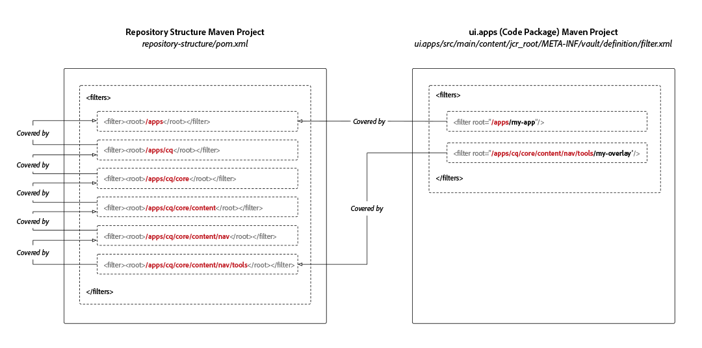

# AEM 프로젝트 저장소 구조 패키지

Adobe Experience Manager as a Cloud Service용 Maven 프로젝트에는 프로젝트의 코드 하위 패키지가 배포되는 JCR 저장소 루트를 정의하는 것이 유일한 목적인 저장소 구조 하위 패키지 정의가 필요합니다. 이렇게 하면 Experience Manager as a Cloud Service으로 패키지 설치가 JCR 리소스 종속성에 의해 자동으로 순서가 지정됩니다. 종속성이 없으면 하위 구조가 상위 구조보다 먼저 설치되고 예기치 않게 제거되어 배포가 중단되는 시나리오가 발생할 수 있습니다.

If your code package deploys into a location **not covered** by the code package, then any ancestor resources (JCR resources closer to the JCR root) must be enumerated in the repository structure package to establish these dependencies.



저장소 구조 패키지는 의 예상 공통 상태를 정의합니다. `/apps` 패키지 유효성 검사기가 를 사용하여 &quot;잠재적인 충돌로부터 안전한&quot; 영역을 표준 루트로 결정합니다.

저장소 구조 패키지에 포함할 가장 일반적인 경로는 다음과 같습니다.

+ `/apps` 시스템 제공 노드입니다
+ `/apps/cq/...`, `/apps/dam/...`, `/apps/wcm/...`, 및 `/apps/sling/...` 다음에 대한 공통 오버레이를 제공합니다. `/libs`.
+ `/apps/settings` 공유 컨텍스트 인식 구성 루트 경로입니다

이 하위 패키지는 **이(가) 다음을 포함하지 않음** 모든 콘텐츠가 `pom.xml` 필터 루트 정의.

## 저장소 구조 패키지 생성

Maven 프로젝트에 대한 저장소 구조 패키지를 생성하려면 다음을 사용하여 빈 Maven 하위 프로젝트를 새로 만듭니다 `pom.xml`: 상위 Maven 프로젝트와 일치하도록 프로젝트 메타데이터 업데이트

업데이트 `<filters>` 로 배포하는 코드 패키지의 모든 JCR 저장소 경로 루트를 포함합니다.

이 새 Maven 하위 프로젝트를 상위 프로젝트에 추가해야 합니다. `<modules>` 목록을 표시합니다.

```xml
<?xml version="1.0" encoding="UTF-8"?>
<project xmlns="https://maven.apache.org/POM/4.0.0" xmlns:xsi="https://www.w3.org/2001/XMLSchema-instance" xsi:schemaLocation="https://maven.apache.org/POM/4.0.0 https://maven.apache.org/maven-v4_0_0.xsd">
    <modelVersion>4.0.0</modelVersion>

    <!-- ====================================================================== -->
    <!-- P A R E N T  P R O J E C T  D E S C R I P T I O N                      -->
    <!-- ====================================================================== -->
    <parent>
        <groupId>com.my-company</groupId>
        <artifactId>my-app</artifactId>
        <version>x.x.x</version>
        <relativePath>../pom.xml</relativePath>
    </parent>

    <!-- ====================================================================== -->
    <!-- P R O J E C T  D E S C R I P T I O N                                   -->
    <!-- ====================================================================== -->
    <artifactId>ui.apps.structure</artifactId>
    <packaging>content-package</packaging>
    <name>UI Apps Structure - Repository Structure Package for /apps</name>

    <description>
        Empty package that defines the structure of the Adobe Experience Manager repository the code packages in this project deploy into.
        Any roots in the code packages of this project should have their parent enumerated in the filters list below.
    </description>

    <build>
        <plugins>
            <plugin>
                <groupId>org.apache.jackrabbit</groupId>
                <artifactId>filevault-package-maven-plugin</artifactId>
                <extensions>true</extensions>
                <properties>
                    <!-- Set Cloud Manager Target to none, else this package will be deployed and remove all defined filter roots -->
                    <cloudManagerTarget>none</cloudManagerTarget>
                </properties>
                <configuration>
                    <properties>
                        <!-- Set Cloud Manager Target to none, else this package will be deployed and remove all defined filter roots -->
                        <cloudManagerTarget>none</cloudManagerTarget>
                    </properties>
                    <filters>

                        <!-- /apps root -->
                        <filter><root>/apps</root></filter>

                        <!--
                        Examples of complex roots


                        Overlays of /libs typically require defining the overlayed structure, at each level here.

                        For example, adding a new section to the main AEM Tools navigation, necessitates the following rules:

                        <filter><root>/apps/cq</root></filter>
                        <filter><root>/apps/cq/core</root></filter>
                        <filter><root>/apps/cq/core/content</root></filter>
                        <filter><root>/apps/cq/core/content/nav/</root></filter>
                        <filter><root>/apps/cq/core/content/nav/tools</root></filter>


                        Any /apps level Context-aware configurations need to enumerated here. 
                        
                        For example, providing email templates under `/apps/settings/notification-templates/com.day.cq.replication` necessitates the following rules:

                        <filter><root>/apps/settings</root></filter>
                        <filter><root>/apps/settings/notification-templates</root></filter>
                        <filter><root>/apps/settings/notification-templates/com.day.cq.replication</root></filter>
                        -->

                    </filters>
                </configuration>
            </plugin>
        </plugins>
    </build>
</project>
```

## 저장소 구조 패키지 참조

저장소 구조 패키지를 사용하려면 모든 코드 패키지(배포되는 하위 패키지)를 통해 이를 참조하십시오 `/apps`) FileVault 콘텐츠 패키지 Maven 플러그인을 통한 Maven 프로젝트 `<repositoryStructurePackage>` 구성.

다음에서 `ui.apps/pom.xml`및 기타 코드 패키지 `pom.xml`프로젝트의 저장소 구조 패키지(#repository-structure-package) 구성에 대한 참조를 FileVault 패키지 Maven 플러그인에 추가합니다.

```xml
...
<build>
  <plugins>
    <plugin>
      <groupId>org.apache.jackrabbit</groupId>
      <artifactId>filevault-package-maven-plugin</artifactId>
      <extensions>true</extensions>
      <configuration>
        ...
        <repositoryStructurePackages>
          <repositoryStructurePackage>
              <groupId>${project.groupId}</groupId>
              <artifactId>ui.apps.structure</artifactId>
              <version>${project.version}</version>
          </repositoryStructurePackage>
        </repositoryStructurePackages>
      </configuration>
    </plugin>
    ...
</build>
<dependencies>
    <!-- Add the dependency for the repository structure package so it resolves -->
    <dependency>
        <groupId>${project.groupId}</groupId>
        <artifactId>ui.apps.structure</artifactId>
        <version>${project.version}</version>
        <type>zip</type>
    </dependency>
    ...
</dependencies>
```

## 다중 코드 패키지 사용 사례

덜 일반적이고 복잡한 사용 사례는 JCR 저장소의 동일한 영역에 설치하는 여러 코드 패키지의 배포를 지원합니다.

예:

+ 코드 패키지 A가에 배포 `/apps/a`
+ 코드 패키지 B가에 배포 `/apps/a/b`

코드 패키지 A의 코드 패키지 B에서 패키지 수준 종속성이 설정되지 않은 경우 코드 패키지 B가 먼저 로 배포될 수 있습니다. `/apps/a`뒤에 코드 패키지 B가 나오는데, 이 패키지는에 배포됩니다. `/apps/a`를 활성화하면 이전에 설치된 가 제거됩니다 `/apps/a/b`.

이 경우:

+ 코드 패키지 A는 `<repositoryStructurePackage>` 프로젝트의 저장소 구조 패키지(에 대한 필터가 있어야 함) `/apps`).
+ 코드 패키지 B는 `<repositoryStructurePackage>` 코드 패키지 A에서 코드 패키지 B는 코드 패키지 A에 의해 공유되는 공간에 배포되기 때문입니다.

## 오류 및 디버깅

저장소 구조 패키지가 올바르게 설정되지 않은 경우 Maven 빌드 시 오류가 보고됩니다.

```
1 error(s) detected during dependency analysis.
Filter root's ancestor '/apps/some/path' is not covered by any of the specified dependencies.
```

이는 브레이킹 코드 패키지에 `<repositoryStructurePackage>` 목록 `/apps/some/path` 필터 목록에 있습니다.

## 추가 리소스

+ [FileVault Content Package Maven 플러그인](https://jackrabbit.apache.org/filevault-package-maven-plugin/)
