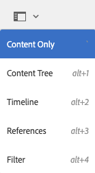
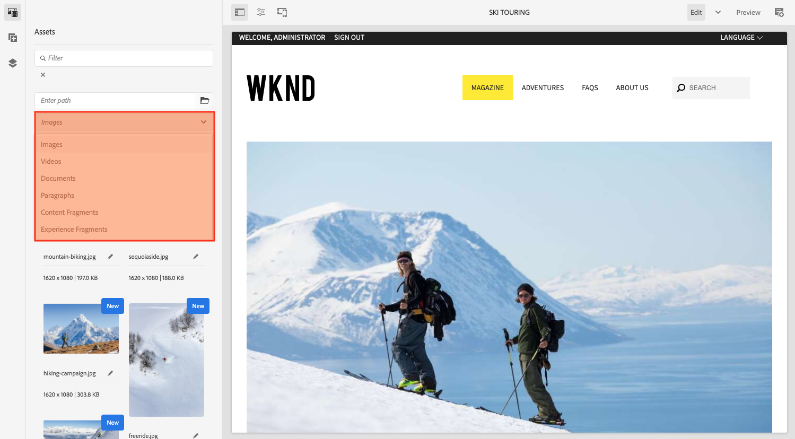
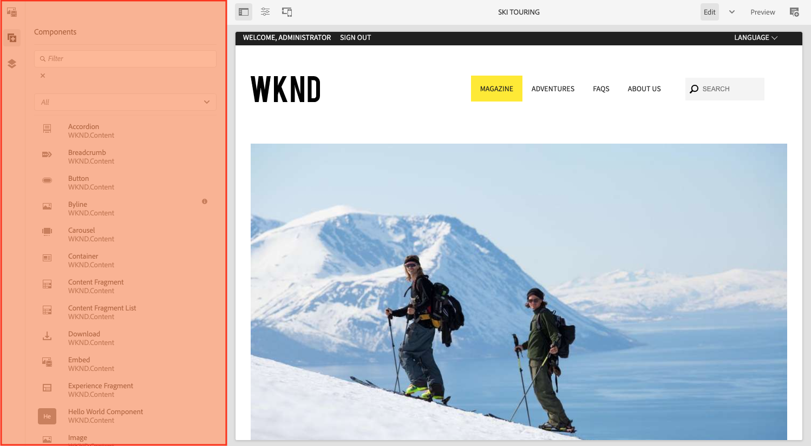

# AEM UI 구조 {#structure-of-the-aem-ui}

AEM UI에는 몇 가지 기본 원칙이 있으며 몇 가지 주요 요소로 구성됩니다.

## 콘솔 {#consoles}

### 기본 레이아웃 및 크기 조정 {#basic-layout-and-resizing}

UI는 모바일 장치와 데스크탑 장치 모두에 대해 만족하지만, 두 가지 스타일을 만들지 않고 AEM에서 모든 화면과 장치에 대해 작동하는 하나의 스타일을 사용합니다.

모든 모듈은 동일한 기본 레이아웃을 사용합니다.

레이아웃은 응답형 디자인 스타일을 준수하며 사용 중인 장치나 창 또는 두 가지 모두의 크기에 맞게 레이아웃이 포함됩니다.

예를 들어 해상도가 1024픽셀 미만이면(모바일 디바이스에서와 같이) 디스플레이가 적절하게 조정됩니다.

### 헤더 막대 {#header-bar}

헤더 표시줄에는 다음을 포함한 전역 요소가 표시됩니다.

* 로고 및 현재 사용 중인 특정 제품/솔루션. AEM의 경우 이 요소는 전역 탐색에 대한 링크도 형성합니다
* 검색
* 도움말 리소스 액세스 아이콘
* 다른 솔루션에 액세스하기 위한 아이콘
* 대기 중인 모든 경고 또는 받은 편지함 항목의 표시기 및 액세스 권한
* 프로필 관리에 대한 링크와 함께 사용자 아이콘

### 도구 모음 {#toolbar}

도구 모음은 아래 페이지에서 보기 또는 에셋 제어와 관련된 위치 및 표면 도구의 컨텍스트에 따라 표시됩니다. 도구 모음은 제품별로 다르지만 요소에 공통점이 있습니다.

도구 모음에는 모든 위치에서 현재 사용 가능한 작업이 표시됩니다.

또한 리소스 선택 여부에 따라 달라집니다.

### 왼쪽 레일 {#left-rail}

필요에 따라 왼쪽 레일을 열거나 숨길 수 있습니다.

* **콘텐츠만**
* **콘텐츠 트리**
* **타임라인**
* **참조**
* **필터**

기본값은 입니다 **콘텐츠만** (레일 숨김).

## 페이지 작성 {#page-authoring}

페이지를 작성할 때 구조적 영역은 다음과 같습니다.

### 콘텐츠 프레임 {#content-frame}

페이지 콘텐츠는 콘텐츠 프레임에 렌더링됩니다. 콘텐츠 프레임은 편집기와 독립적입니다. 이렇게 하면 CSS 또는 JavaScript로 인해 충돌이 발생하지 않습니다.

콘텐츠 프레임은 창의 오른쪽 섹션에 있으며 도구 모음 아래에 있습니다.

### 편집기 프레임 {#editor-frame}

편집기 프레임에서는 편집 기능을 사용할 수 있습니다.

편집기 프레임은 모든 페이지 작성 요소에 대한 컨테이너(요약)입니다. 콘텐츠 프레임의 맨 위에 있으며 다음을 포함합니다.

* 상단 도구 모음
* 사이드 패널
* 모든 오버레이
* 기타 페이지 작성 요소(예: 구성 요소 도구 모음)

### 사이드 패널 {#side-panel}

세 개의 기본 탭을 포함합니다. 다음 **에셋** 및 **구성 요소** 탭에서는 이러한 요소를 선택하고 패널에서 드래그하여 페이지에 놓을 수 있습니다. 다음 **컨텐츠 트리** 탭에서는 페이지의 콘텐츠 계층을 검사할 수 있습니다.

기본적으로 사이드 패널은 숨겨져 있습니다. 이 옵션을 선택하면 왼쪽에 표시되거나 창 너비가 1024픽셀 미만인 경우 모바일 장치에서 처럼 전체 창을 덮도록 미끄러져 가로로 표시됩니다.

### 사이드 패널 - 에셋 {#side-panel-assets}

에셋 탭에서 에셋 범위에서 선택할 수 있습니다. 특정 용어를 필터링하거나 그룹을 선택할 수도 있습니다.

### 사이드 패널 - 자산 그룹 {#side-panel-asset-groups}

에셋 탭에는 특정 에셋 그룹을 선택하는 데 사용할 수 있는 드롭다운이 있습니다.

### 사이드 패널 - 구성 요소 {#side-panel-components}

구성 요소 탭에서 구성 요소 범위를 선택할 수 있습니다. 특정 용어를 필터링하거나 그룹을 선택할 수도 있습니다.

### 사이드 패널 - 콘텐츠 트리 {#side-panel-content-tree}

콘텐츠 트리 탭에서 페이지에 있는 콘텐츠의 계층을 볼 수 있습니다. 탭에서 항목을 클릭하면 편집기 내에서 페이지의 항목으로 이동하여 선택합니다.

### 오버레이 {#overlays}

컨텐츠 프레임을 오버레이하고 에서 사용합니다. [레이어](#layer) 구성 요소 및 해당 컨텐츠와 투명하게 상호 작용하는 방법을 실현하기 위해

오버레이는 실제로 컨텐츠 프레임에 적절한 구성 요소를 오버레이하지만 편집기 프레임(다른 모든 페이지 작성 요소와 함께)에 있습니다.

### 레이어 {#layer}

레이어는 활성화할 수 있는 독립적인 기능 번들입니다.

* 페이지의 다른 보기 제공
* 페이지를 조작하거나 페이지와 상호 작용할 수 있습니다.

레이어는 개별 구성 요소에 대한 특정 작업과 달리 전체 페이지에 정교한 기능을 제공합니다.

AEM에는 편집, 미리 보기, 주석 레이어 등 페이지 작성을 위해 이미 구현된 여러 레이어가 포함되어 있습니다.

>[!NOTE]
>
>레이어는 사용자의 페이지 컨텐츠 보기 및 상호 작용에 영향을 주는 강력한 개념입니다. 자체 레이어를 개발할 때는 레이어가 종료될 때 레이어가 정리되도록 하십시오.

### 레이어 전환기 {#layer-switcher}

레이어 전환기를 사용하면 사용할 레이어를 선택할 수 있습니다. 닫혀 있으면 현재 사용 중인 레이어를 나타냅니다.

레이어 전환기는 도구 모음(창 상단의 편집기 프레임 내)에서 드롭다운으로 사용할 수 있습니다.

### 구성 요소 도구 모음 {#component-toolbar}

구성 요소의 각 인스턴스를 클릭하면 도구 모음이 표시됩니다(한 번 또는 천천히 두 번 클릭). 도구 모음에는 페이지의 구성 요소 인스턴스에 사용할 수 있는 특정 작업(예: 복사, 붙여넣기, 편집기 열기)이 포함되어 있습니다.

사용 가능한 공간에 따라 구성 요소 도구 모음은 해당 구성 요소의 상단 또는 하단 오른쪽 모서리에 배치됩니다.

## 추가 정보 {#further-information}

<!--For more details about the concepts around the touch-enabled UI, continue to the article [Concepts of the AEM Touch-Enabled UI](/help/sites-developing/touch-ui-concepts.md).-->

자세한 기술 정보는 [JS 설명서 세트](https://developer.adobe.com/experience-manager/reference-materials/6-5/jsdoc/ui-touch/editor-core/index.html) 페이지 편집기용
