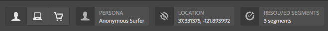

# ContextHub 구성 {#configuring-contexthub}

ContextHub는 컨텍스트 데이터를 저장, 조작 및 표시하기 위한 프레임워크입니다. ContextHub에 대한 자세한 내용은 [ContextHub 개발자 개요](contexthub.md).

ContextHub 도구 모음을 구성하여 미리보기 모드에 표시할지 여부를 제어하고 ContextHub 저장소를 생성하고 UI 모듈을 추가할 수 있습니다.

## ContextHub UI 표시 및 숨기기 {#showing-and-hiding-the-contexthub-ui}

다음을 표시하거나 숨기도록 Adobe Granite ContextHub OSGi 서비스 구성 [ContextHub UI](/help/sites-cloud/authoring/personalization/targeted-content.md) 페이지에서 확인할 수 있습니다. 이 서비스의 PID는 `com.adobe.granite.contexthub.impl.ContextHubImpl.`

서비스를 구성하려면 다음 중 하나를 사용합니다. [웹 콘솔](/help/implementing/deploying/configuring-osgi.md) 또는 저장소에서 JCR 노드 사용:

* **웹 콘솔:** UI를 표시하려면 UI 표시 속성을 선택합니다. UI를 숨기려면 UI 숨기기 속성을 지웁니다.
* **JCR 노드:** UI를 표시하려면 부울을 설정합니다. `com.adobe.granite.contexthub.show_ui` 다음으로 속성: `true`. UI를 숨기려면 속성을 다음으로 설정합니다. `false`.

ContextHub UI를 표시할 때 AEM 작성자 인스턴스의 페이지에만 표시됩니다. UI는 게시 인스턴스의 페이지에 표시되지 않습니다.

## ContextHub UI 모드 및 모듈 추가 {#adding-contexthub-ui-modes-and-modules}

미리보기 모드에서 ContextHub 도구 모음에 표시되는 UI 모드 및 모듈을 구성합니다.

* UI 모드: 관련 모듈 그룹
* 모듈: 스토어의 컨텍스트 데이터를 노출하고 작성자가 컨텍스트를 조작할 수 있도록 하는 위젯

UI 모드는 도구 모음의 왼쪽에 일련의 아이콘으로 표시됩니다. 선택하면 UI 모드의 모듈이 오른쪽에 나타납니다.



아이콘은 [Coral UI 아이콘 라이브러리](https://helpx.adobe.com/experience-manager/6-4/sites/developing/using/reference-materials/coral-ui/coralui3/Coral.Icon.html#availableIcons).

### UI 모드 추가 {#adding-a-ui-mode}

UI 모드를 관련 ContextHub 모듈 그룹에 추가합니다. UI 모드를 만들면 ContextHub 도구 모음에 나타나는 제목과 아이콘을 제공합니다.

1. Experience Manager 레일에서 도구 > 사이트 > Context Hub를 선택합니다.
1. 기본 구성 컨테이너를 선택합니다.
1. Context Hub 구성을 선택합니다.
1. 만들기 버튼을 선택한 다음 Context Hub UI 모드 를 선택합니다.

   

1. 다음 속성에 대한 값을 제공합니다.

   * UI 모드 제목: UI 모드를 식별하는 제목
   * 모드 아이콘: 의 선택기 [Coral UI 아이콘](https://helpx.adobe.com/experience-manager/6-4/sites/developing/using/reference-materials/coral-ui/coralui3/Coral.Icon.html#availableIcons) 사용할 항목(예: ) `coral-Icon--user`
   * 활성화됨: ContextHub 도구 모음에 UI 모드를 표시하려면 선택하십시오.

1. 저장을 선택합니다.

### UI 모듈 추가 {#adding-a-ui-module}

페이지 콘텐츠를 미리 볼 수 있도록 ContextHub 도구 모음에 표시되도록 ContextHub UI 모듈을 UI 모드에 추가합니다. UI 모듈을 추가하면 ContextHub에 등록된 모듈 유형의 인스턴스가 만들어집니다. UI 모듈을 추가하려면 연결된 모듈 유형의 이름을 알고 있어야 합니다.

AEM은 UI 모듈의 기반이 될 수 있는 몇 가지 샘플 UI 모듈 유형뿐만 아니라 기본 UI 모듈 유형을 제공합니다. 다음 표는 각 요소에 대한 간단한 설명을 제공합니다. 사용자 지정 UI 모듈 개발에 대한 자세한 내용은 [ContextHub UI 모듈 만들기](extending-contexthub.md#creating-contexthub-ui-module-types).

UI 모듈 속성에는 모듈별 속성에 대한 값을 제공할 수 있는 세부 구성이 포함됩니다. JSON 형식으로 세부 구성을 제공합니다. 표의 모듈 유형 열에는 각 UI 모듈 유형에 필요한 JSON 코드에 대한 정보 링크가 제공됩니다.

| 모듈 유형 | 설명 | 저장소 |
|---|---|---|
| [contexthub.base](sample-modules.md#contexthub-base-ui-module-type) | 범용 UI 모듈 유형 | UI 모듈 속성에 구성됨 |
| [contexthub.browserinfo](sample-modules.md#contexthub-browserinfo-ui-module-type) | 브라우저에 대한 정보를 표시합니다. | `surferinfo` |
| [contexthub.datetime](sample-modules.md#contexthub-datetime-ui-module-type) | 날짜 및 시간 정보 표시 | `datetime` |
| [contexthub.location](sample-modules.md#contexthub-location-ui-module-type) | 클라이언트의 위도와 경도 및 맵 상의 위치를 표시합니다. 위치를 변경할 수 있습니다. | `geolocation` |
| [contexthub.screen-orientation](sample-modules.md#contexthub-screen-orientation-ui-module-type) | 장치의 화면 방향(가로 또는 세로)을 표시합니다. | `emulators` |
| [contexthub.tagcloud](sample-modules.md#contexthub-tagcloud-ui-module-type) | 페이지 태그에 대한 통계를 표시합니다. | `tagcloud` |
| [granite.profile](sample-modules.md#granite-profile-ui-module-type) | 다음을 포함한 현재 사용자의 프로필 정보를 표시합니다. `authorizableID`, `displayName` 및 `familyName`. 값을 변경할 수 있습니다. `displayName` 및 `familyName`. | `profile` |

1. Experience Manager 레일에서 도구 > 사이트 > ContextHub를 선택합니다.
1. UI 모듈을 추가할 구성 컨테이너를 선택합니다.
1. UI 모듈을 추가할 ContextHub 구성을 선택하거나 입력합니다.
1. UI 모듈을 추가할 UI 모드를 선택합니다.
1. 만들기 버튼을 선택한 다음 ContextHub UI 모듈(일반)을 선택합니다.

   

1. 다음 속성에 대한 값을 제공합니다.

   * UI 모듈 제목: UI 모듈을 식별하는 제목입니다
   * 모듈 유형: 모듈 유형
   * 활성화됨: ContextHub 도구 모음에 UI 모듈을 표시하려면 선택하십시오.

1. (선택 사항) 기본 저장소 구성을 무시하려면 UI 모듈을 구성할 JSON 개체를 입력합니다.
1. 저장을 선택합니다.

## ContextHub 저장소 만들기 {#creating-a-contexthub-store}

사용자 데이터를 유지하고 필요에 따라 데이터에 액세스할 수 있는 Context Hub 저장소를 만듭니다. ContextHub 스토어는 등록된 스토어 후보를 기반으로 합니다. 스토어를 만들 때는 스토어 후보가 등록된 storeType 값이 필요합니다. (참조: [사용자 지정 스토어 후보 생성](extending-contexthub.md#creating-custom-store-candidates).)

### 세부 저장소 구성 {#detailed-store-configuration}

저장소를 구성할 때 세부 사항 구성 속성을 사용하여 저장소별 속성에 대한 값을 제공할 수 있습니다. 값은 다음을 기반으로 합니다 `config` 스토어 매개변수 `init` 함수. 따라서 이 값을 제공해야 하는지 여부와 값의 형식은 저장소에 따라 다릅니다.

Detail Configuration 속성 값은 `config` json 형식의 객체입니다.

### 샘플 스토어 후보 {#sample-store-candidates}

AEM은 스토어의 기반이 될 수 있는 다음 샘플 스토어 후보를 제공합니다.

| 저장소 유형 | 설명 |
|---|---|
| [aem.segmentation](sample-stores.md#aem-segmentation-sample-store-candidate) | 해결되거나 해결되지 않은 ContextHub 세그먼트를 저장합니다. ContextHub SegmentManager에서 세그먼트를 자동으로 검색합니다 |
| [contexthub.geolocation](sample-stores.md#contexthub-geolocation-sample-store-candidate) | 브라우저 위치의 위도와 경도를 저장합니다. |
| [granite.emulators](sample-stores.md#granite-emulators-sample-store-candidate) | 여러 장치에 대한 속성 및 기능을 정의하고 현재 클라이언트 장치를 감지합니다. |
| [granite.profile](sample-stores.md#granite-profile-sample-store-candidate) | 현재 사용자의 프로필 데이터 저장 |
| [contexthub.surferinfo](sample-stores.md#contexthub-surferinfo-sample-store-candidate) | 장치 정보, 브라우저 유형 및 창 방향과 같은 클라이언트에 대한 정보를 저장합니다 |

1. Experience Manager 레일에서 도구 > 사이트 > ContextHub를 선택합니다.
1. 기본 구성 컨테이너를 선택합니다.
1. Contexthub 구성 선택
1. 저장소를 추가하려면 만들기 아이콘을 선택한 다음 ContextHub 저장소 구성을 선택합니다.

   

1. 기본 구성 속성에 대한 값을 입력한 후 다음을 선택합니다.

   * **구성 제목:** 스토어를 식별하는 제목
   * **저장소 유형:** 스토어의 기반이 되는 스토어 후보의 storeType 속성 값
   * **필수 여부:** 선택
   * **활성화됨:** 스토어를 활성화하려면 선택

1. (선택 사항) 기본 저장소 구성을 재정의하려면 세부 정보 구성(JSON) 상자에 JSON 개체를 입력합니다.
1. 저장을 선택합니다.

## 예: JSONP 서비스 사용  {#example-using-a-jsonp-service}

이 예에서는 저장소를 구성하고 UI 모듈에 데이터를 표시하는 방법을 보여 줍니다. 이 예에서는 jsontest.com 사이트의 MD5 서비스가 스토어의 데이터 소스로 사용됩니다. 이 서비스는 지정된 문자열의 MD5 해시 코드를 JSON 형식으로 반환합니다.

서비스 호출에 대한 데이터를 저장하도록 contexthub.generic-jsonp 저장소가 구성되어 있습니다 `https://md5.jsontest.com/?text=%22text%20to%20md5%22`. 이 서비스는 UI 모듈에 표시되는 다음 데이터를 반환합니다.

```javascript
{
   "md5": "919a56ab62b6d5e1219fe1d95248a2c5",
   "original": "\"text to md5\""
}
```

### contexthub.generic-jsonp 저장소 만들기 {#creating-a-contexthub-generic-jsonp-store}

contexthub.generic-jsonp 샘플 저장소 후보를 사용하면 JSON 데이터를 반환하는 웹 서비스 또는 JSONP 서비스에서 데이터를 검색할 수 있습니다. 이 저장소 후보의 경우 저장소 구성을 사용하여 사용할 JSONP 서비스에 대한 세부 정보를 제공합니다.

다음 [init](contexthub-api.md#init-name-config) 의 함수 `ContextHub.Store.JSONPStore` JavaScript 클래스는 `config` 이 저장소 후보를 초기화하는 개체입니다. 다음 `config` 오브젝트에 다음 포함: `service` jsonp 서비스에 대한 세부 정보를 포함하는 객체입니다. 저장소를 구성하려면 다음을 제공합니다. `service` 세부 구성 속성에 대한 값으로 JSON 형식의 객체입니다.

jsontest.com 사이트의 MD5 서비스에서 데이터를 저장하려면 [ContextHub 저장소 만들기](#creating-a-contexthub-store) 다음 속성 사용:

* **구성 제목:** md5
* **저장소 유형:** contexthub.generic-jsonp
* **필수 여부:** 선택
* **활성화됨:** 선택
* **세부 정보 구성(JSON):**

  ```javascript
  {
   "service": {
   "jsonp": false,
   "timeout": 1000,
   "ttl": 1800000,
   "secure": false,
   "host": "md5.jsontest.com",
   "port": 80,
   "params":{
   "text":"text to md5"
       }
     }
   }
  ```

### md5 데이터에 대한 UI 모듈 추가 {#adding-a-ui-module-for-the-md-data}

ContextHub 도구 모음에 UI 모듈을 추가하여 예제 md5 저장소에 저장된 데이터를 표시합니다. 이 예에서는 contexthub.base 모듈을 사용하여 다음 UI 모듈을 생성합니다.


에서 절차 사용 [UI 모듈 추가](#adding-a-ui-module) 샘플 사용자 UI 모드 와 같은 기존 UI 모드에 UI 모듈을 추가합니다. UI 모듈의 경우 다음 속성 값을 사용합니다.

* **UI 모듈 제목:** MD5
* **모듈 유형:** contexthub.base
* **세부 정보 구성(JSON):**

  ```javascript
  {
   "icon": "coral-Icon--data",
   "title": "MD5 Conversion",
   "storeMapping": { "md5": "md5" },
   "template": "<p> {{md5.original}}</p>;
                <p>{{md5.md5}}</p>"
  }
  ```

## ContextHub 디버깅 {#debugging-contexthub}

ContextHub에 대한 디버깅 모드를 활성화하여 문제를 해결할 수 있습니다. 디버그 모드는 ContextHub 구성 또는 CRXDE를 통해 활성화할 수 있습니다.

### 구성을 통해 {#via-the-configuration}

ContextHub의 구성을 편집하고 옵션을 선택합니다. **디버그**

1. 레일에서 을 선택합니다. **도구 > 사이트 > ContextHub**
1. 기본값 선택 **구성 컨테이너**
1. 다음 항목 선택 **ContextHub 구성** 및 선택 **선택한 요소 편집**
1. 선택 **디버그** 및 선택 **저장**

### CRXDE를 통해 {#via-crxde}

CRXDE Lite을 사용하여 속성 설정 `debug` 끝 **true** 아래:

* `/conf/global/settings/cloudsettings` 또는
* `/conf/<site>/settings/cloudsettings`

### ContextHub에 대한 디버그 메시지 로깅 {#logging-debug-messages-for-contexthub}

Adobe Granite ContextHub OSGi 서비스 구성(PID = `com.adobe.granite.contexthub.impl.ContextHubImpl`)을 클릭하여 개발 시 유용한 세부 디버그 메시지를 기록합니다.

서비스를 구성하려면 다음 중 하나를 사용합니다. [웹 콘솔](/help/implementing/deploying/configuring-osgi.md) 또는 저장소에서 JCR 노드 사용:

* 웹 콘솔: 디버그 메시지를 기록하려면 디버그 속성을 선택합니다.
* JCR 노드: 디버그 메시지를 기록하려면 부울을 설정합니다. `com.adobe.granite.contexthub.debug` 다음으로 속성: `true`.

### 자동 모드 {#silent-mode}

자동 모드에서는 모든 디버그 정보가 표시되지 않습니다. 각 ContextHub 구성에 대해 독립적으로 설정할 수 있는 일반 디버그 옵션과 달리, 자동 모드는 ContextHub 구성 수준의 디버그 설정에 우선하는 전역 설정입니다.

이 기능은 디버그 정보를 전혀 원하지 않는 게시 인스턴스에 유용합니다. 전역 설정이므로 OSGi를 통해 활성화됩니다.

1. 를 엽니다. **Adobe Experience Manager 웹 콘솔 구성** 위치: `http://<host>:<port>/system/console/configMgr`
1. 검색 대상 **Adobe Granite ContextHub**
1. 구성 클릭 **Adobe Granite ContextHub** 속성을 편집하려면
1. 옵션을 선택합니다. **자동 모드** 및 클릭 **저장**

## ContextHub 비활성화 {#disabling-contexthub}

ContextHub를 비활성화하여 js/css를 로드하고 초기화하지 못하도록 할 수 있습니다. ContextHub를 비활성화하는 두 가지 옵션이 있습니다.

* ContextHub의 구성을 편집하고 옵션을 선택합니다. **ContextHub 비활성화**

   1. 레일에서 을 선택합니다. **도구 > 사이트 > ContextHub**
   1. 기본값 선택 **구성 컨테이너**
   1. 다음 항목 선택 **ContextHub 구성** 및 선택 **선택한 요소 편집**
   1. 선택 **ContextHub 비활성화** 및 선택 **저장**

또는

* CRXDE Lite을 사용하여 속성 설정 `disabled` 끝 **true** 아래에 `/conf/global/settings/cloudsettings/<configName>/contexthub`
