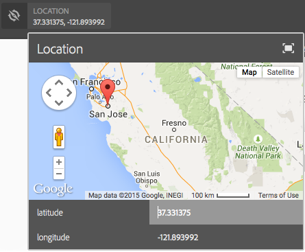

# 샘플 ContextHub UI 모듈 유형 {#sample-contexthub-ui-module-types}

ContextHub는 솔루션에서 사용할 수 있는 몇 가지 샘플 UI 모듈을 제공합니다. 제공되는 정보는 다음과 같습니다.

* UI 모듈의 주요 기능입니다.
* 학습 목적으로 열 수 있도록 소스 코드를 찾을 위치.
* UI 모듈 구성 방법

ContextHub에 UI 모듈을 추가하는 방법에 대한 자세한 내용은 [UI 모듈 추가](configuring-contexthub.md#adding-a-ui-module). UI 모듈 개발에 대한 자세한 내용은 [ContextHub UI 모듈 유형 작성](extending-contexthub.md#creating-contexthub-ui-module-types).

## contexthub.base UI 모듈 유형 {#contexthub-base-ui-module-type}

contexthub.base UI 모듈 유형은 다른 모든 UI 모듈 유형의 기본 유형입니다. 따라서 저장소 데이터를 렌더링하기 위한 일반 기능을 제공합니다.

다음 기능을 사용할 수 있습니다.

* **제목 및 아이콘:** UI 모듈의 제목 및 아이콘을 지정합니다. 아이콘은 URL을 사용하거나 Coral UI 아이콘 라이브러리에서 참조할 수 있습니다.
* **데이터 저장:** 데이터를 검색할 하나 이상의 스토어를 식별합니다.
* **컨텐츠:** ContextHub 도구 모음에 나타나는 대로 UI 모듈에 표시되는 콘텐츠를 지정합니다.
* **팝오버 콘텐츠:** UI 모듈을 클릭하거나 탭할 때 팝오버에 표시되는 콘텐츠를 지정합니다.
* **전체 화면 모드:** 전체 화면 모드를 허용할지 여부를 제어합니다.

소스 코드는 다음 위치에 있습니다. `/libs/granite/contexthub/code/ui/container/js/ContextHub.UI.BaseModuleRenderer.js`.

### 구성 {#configuration}

JSON 형식의 JavaScript 개체를 사용하여 contexthub.base UI 모듈을 구성합니다. 다음 속성 중 하나를 포함하여 UI 모듈 기능을 구성합니다.

* **이미지:** 아이콘으로 표시할 이미지의 URL입니다.
* **아이콘:** 의 이름 [Coral UI 아이콘](https://helpx.adobe.com/experience-manager/6-4/sites/developing/using/reference-materials/coral-ui/coralui3/Coral.Icon.html) 클래스. 아이콘과 이미지 속성 모두에 대한 값을 지정하면 이미지가 사용됩니다.
* **제목:** UI 모듈의 제목입니다. UI 모듈 아이콘 위에 포인터가 일시 중지되면 제목이 표시됩니다.
* **전체 화면:** UI 모듈에서 전체 화면 모드를 지원하는지 여부를 나타내는 부울 값입니다. 사용 `true` 전체 화면 및 `false` 전체 화면 모드를 방지합니다.
* **템플릿:** A [핸들바](https://handlebarsjs.com/) ContextHub 도구 모음에서 렌더링할 콘텐츠를 지정하는 템플릿입니다. 최대 2개 사용 `<p>` 태그 사이에 코드를 삽입하지 마십시오.
* **storeMapping:** 키/저장소 매핑. Handlebar 템플릿의 키를 사용하여 연결된 ContextHub 저장소 데이터에 액세스합니다.
* **목록:** UI 모듈을 클릭할 때 팝오버에 목록으로 표시할 항목의 배열입니다. 이 항목을 포함하는 경우 popoverTemplate을 포함하지 마십시오. 값은 다음 키가 있는 오브젝트 배열입니다.
   * 제목: 이 항목에 대해 표시할 텍스트입니다
   * image: (선택 사항) 왼쪽에 표시해야 하는 이미지의 URL입니다
   * icon: (선택 사항) 왼쪽에 표시해야 하는 CUI 아이콘 클래스입니다. 이미지가 지정된 경우에는 무시됩니다
   * selected: (선택 사항) 이 항목을 selected(true=selected)로 표시할지 여부를 지정하는 부울 값입니다. 기본적으로 선택한 항목은 굵은 글꼴을 사용하여 나타납니다. 사용 `listType` 속성을 사용하여 다른 모양을 구성합니다(아래 참조).
* **listType:** 팝오버 목록 항목에 사용할 스타일입니다. 다음 값 중 하나를 사용합니다.
   * 확인 표시
   * 확인란
   * 라디오
* **popoverTemplate:** UI 모듈을 클릭할 때 팝오버에서 렌더링할 콘텐츠를 지정하는 Handlebars 템플릿입니다. 이 항목을 포함하는 경우 `list` 항목.

### 예 {#example}

다음 예제에서는 c를 구성합니다`ontexthub.base` 의 정보를 표시하는 UI 모듈 [contexthub.emulators](sample-stores.md#granite-emulators-sample-store-candidate) 저장. 다음 `template` 이 항목에서는 `storeMapping` 항목이 설정됩니다.

```javascript
{
   "icon": "coral-Icon--move",
    "title": "Screen Resolution",
    "storeMapping": {
      "emulator": "emulators"
    },
    "template": "<p>{{{ i18n \"Resolution\"}}}</p><p>{{{emulator.currentDevice.width}}} x {{{emulator.currentDevice.height}}}</p>"
}
```


## contexthub.browserinfo UI 모듈 유형 {#contexthub-browserinfo-ui-module-type}

다음 `contexthub.browserinfo` UI 모듈은 클라이언트 웹 브라우저 및 운영 체제에 대한 정보를 표시합니다. Surferinfo 스토어에서 정보를 얻습니다. [contexthub.surferinfo](sample-stores.md#contexthub-surferinfo-sample-store-candidate) 후보 저장.


UI 모듈의 소스 코드는에 있습니다. `/libs/granite/contexthub/components/modules/browserinfo`. 그러나 `contexthub.browserinfo` 다음을 확장합니다. `contexthub.base` UI 모듈이며, 추가 기능을 무시하거나 제공하지 않습니다. 이 구현은 브라우저 정보를 렌더링하기 위한 기본 구성을 제공합니다.

### 구성 {#configuration-1}

contexthub.browserinfo UI 모듈의 인스턴스에는 세부 구성에 대한 값이 필요하지 않습니다. 다음 JSON 텍스트는 모듈의 기본 구성을 나타냅니다.

```javascript
{
   "icon":"coral-Icon--globe",
   "title":"Browser/OS Information",
   "storeMapping":{"surferinfo":"surferinfo"},
   "template":"<p>{{surferinfo.browser.family}} {{surferinfo.browser.version}}</p><p>{{surferinfo.os.name}} {{surferinfo.os.version}}</p>"
}
```

## contexthub.datetime UI 모듈 유형 {#contexthub-datetime-ui-module-type}

다음 `contexthub.datetime` UI 모듈은 를 기반으로 하는 datetime이라는 저장소에 저장된 날짜 및 시간을 표시합니다. `contexthub.datetime` 후보 저장.


모듈은 스토어에서 날짜 및 시간을 변경할 수 있는 팝오버 양식을 제공합니다.

의 소스 `contexthub.datetime` UI 모듈 위치: `/libs/granite/contexthub/components/modules/datetime`.

### 구성 {#configuration-2}

contexthub.datetime UI 모듈의 인스턴스에는 세부 구성에 대한 값이 필요하지 않습니다. 다음 JSON 텍스트는 모듈의 기본 구성을 나타냅니다.

```javascript
{
   "icon":"coral-Icon--clock",
   "title":"DATE&TIME",
   "clickable":true,
   "storeMapping":{"d":"datetime"},
   "template":"<p class=\"contexthub-module-line1\">{{i18n \"Date&Time\"}}</p><p class=\"contexthub-module-line2\">{{d.formatted.locale.date}} {{d.formatted.locale.time}}</p>",
   "popoverTemplate":"<div class=\"datetime center\"><div class=\"coral-DatePicker-calendar\" data-init=\"datepicker\"><input class=\"coral-Textfield\" type=\"datetime\" value=\"{{d.formatted.iso}}\"><button class=\"coral-Button coral-Button--secondary coral-Button--square\" title=\"{{i18n \"Datetime picker\"}}\"><i class=\"coral-Icon coral-Icon--calendar coral-Icon--sizeS\"></i></button></div></div>"
}
```

## contexthub.location UI 모듈 유형 {#contexthub-location-ui-module-type}

다음 `contexthub.location` UI 모듈은 클라이언트의 경도 및 위도를 표시합니다. 모듈은 현재 위치를 변경하기 위해 클릭할 수 있는 Google 맵을 표시하는 팝오버를 제공합니다. 모듈은 를 기반으로 하는 geolocation이라는 ContextHub 저장소에서 정보를 가져옵니다. [contexthub.geolocation](sample-stores.md#contexthub-geolocation-sample-store-candidate) 후보 저장.



UI 모듈의 소스는 `/etc/cloudsettings/default/contexthub/geolocation`.

### 구성 {#configuration-4}

contexthub.location UI 모듈의 인스턴스에는 세부 구성에 대한 값이 필요하지 않습니다. 다음 JSON 텍스트는 모듈의 기본 구성을 나타냅니다.

```javascript
{
 "icon":"coral-Icon--compass",
 "title":"Location",
 "clickable":true,
 "editable":{"key":"/geolocation","disabled":[],"hidden":["/geolocation/generatedThumbnail","/geolocation/city","/geolocation/country"]},
 "fullscreen":true,
 "storeMapping":{"g":"geolocation"},
 "template":"<p>{{i18n \"Location\"}}</p><p>{{g.address.postalCode}} {{g.address.city}}{{#if g.address.city}}{{#if g.address.region}},{{/if}}{{/if}} {{g.address.region}}</p>",
 "list":[
  {"title":"Basel, Switzerland",
  "data":{"longitude":7.58929,"latitude":47.554746,"city":"Basel","country":"Switzerland"}},
  {"title":"Melbourne, Australia",
  "data":{"longitude":144.96328,"latitude":-37.814107,"city":"Melbourne","country":"Australia"}},
  {"title":"Beijing, China",
  "data":{"longitude":116.407526,"latitude":39.90403,"city":"Beijing","country":"China"}},
  {"title":"New York, NY, USA",
  "data":{"longitude":-74.005973,"latitude":40.714353,"city":"New York","country":"United States"}},
  {"title":"Paris, France",
  "data":{"longitude":2.352222,"latitude":48.856614,"city":"Paris","country":"France"}},
  {"title":"Rio de Janeiro, Brazil",
  "data":{"longitude":-43.20071,"latitude":-22.913395,"city":"Rio","country":"Brazil"}},
  {"title":"San Jose, CA, USA",
  "data":{"longitude":-121.894955,"latitude":37.339386,"city":"San Jose","country":"United States"}},
  {"title":"Tokyo, Japan",
  "data":{"longitude":139.691706,"latitude":35.689487,"city":"Shinjuku","country":"Japan"}}
 ],
 "listType":"checkmark"
}
```

## contexthub.screen-orientation UI 모듈 유형 {#contexthub-screen-orientation-ui-module-type}

다음 `contexthub.screen-orientation` UI 모듈은 클라이언트의 현재 화면 방향을 표시합니다. 모듈은 기본적으로 비활성화되어 있지만 방향을 선택할 수 있는 팝오버를 제공합니다. 모듈은 를 기반으로 하는 에뮬레이터라는 ContextHub 저장소에서 정보를 가져옵니다. [granite.emulators](sample-stores.md#granite-emulators-sample-store-candidate) 후보 저장.


UI 모듈의 소스는 `/libs/granite/contexthub/components/modules/screen-orientation`.

### 구성 {#configuration-5}

의 인스턴스 `contexthub.screen-orientation` UI 모듈에는 세부 구성 값이 필요하지 않습니다. 다음 JSON 텍스트는 모듈의 기본 구성을 나타냅니다. 다음 `clickable` 속성은 입니다. `false` 기본적으로. 설정할 기본 구성을 재정의하는 경우 `clickable` 끝 `true`을 클릭하면 방향을 선택할 수 있는 팝업이 표시됩니다.

```javascript
{
   "icon":"coral-Icon--rotateRight",
   "title":"Screen Orientation",
   "clickable":false,
   "storeMapping":{"emulator":"emulators"},
   "template":"<p>{{{ i18n \"Screen Orientation\" }}}</p><p>{{{ emulator.currentDevice.orientation }}}",
   "listReference":"/emulators/orientations",
   "listType":"checkmark"
}
```

## contexthub.tagcloud UI 모듈 유형 {#contexthub-tagcloud-ui-module-type}

다음 `contexthub.tagcloud` UI 모듈에 태그에 대한 정보가 표시됩니다. 도구 모음의 UI 모듈에 태그 수가 표시됩니다. 팝업에 새 태그를 추가하기 위한 tagcloud 및 texbox가 표시됩니다. UI 모듈은 를 기반으로 하는 tagcloud라는 ContextHub 저장소에서 정보를 가져옵니다. `contexthub.tagcloud` 후보 저장.


UI 모듈의 소스는 `/libs/granite/contexthub/components/modules/tagcloud`.

### 구성 {#configuration-6}

의 인스턴스 `contexthub.tagcloud` UI 모듈에는 세부 구성 값이 필요하지 않습니다. 다음 JSON 텍스트는 모듈의 기본 구성을 나타냅니다.

```javascript
{
   "icon":"coral-Icon--tag",
   "title":"TagCloud",
   "clickable":true,
   "storeMapping":{"t":"tagcloud"},
   "maxTags":20,
   "template":"<p class=\"contexthub-module-line1\">{{i18n \"TagCloud\"}}</p><p class=\"contexthub-module-line2\">{{stats.total}} {{i18n \"Tags\"}}</p>",
   "popoverTemplate":"<div class=\"contexthub-popover-content center\"><p class=\"stats\">{{stats.total}} {{i18n \"Tags\"}} | {{stats.hits}} {{i18n \"Hits\"}} | {{i18n \"Last tag\"}}: {{#if stats.recent}}{{stats.recent}}{{else}}{{i18n \"Unknown\"}}{{/if}}</p><p class=\"tagcloud\">{{#each tags}}<span class=\"tag{{this.weight}}\">{{this.name}}</span> {{/each}}</p><div class=\"coral-InputGroup\"><input type=\"text\" class=\"coral-InputGroup-input coral-Textfield tag-name\" placeholder=\"{{i18n \"Add a namespace:my/tag\"}}\" pattern=\"^[A-Za-z0-9_\\-]+(:[A-Za-z0-9_\\-\\/]+)?$\" title=\"{{i18n \"namespace:my/tag\"}}\"><span class=\"coral-InputGroup-button\"><button class=\"coral-Button coral-Button--secondary coral-Button--square contexthub-new-tag\" type=\"button\" title=\"{{i18n \"increment\"}}\"><i class=\"coral-Icon coral-Icon--sizeS coral-Icon--add\"></i></button></span></div></div>"
}
```

## granite.profile UI 모듈 유형 {#granite-profile-ui-module-type}

다음 `granite.profile` ContextHub UI 모듈은 현재 사용자의 표시 이름을 표시합니다. 팝업에 사용자의 로그인 이름이 표시되고 디스플레이 이름의 값을 변경할 수 있습니다. UI 모듈은 를 기반으로 하는 ContextHub 스토어 명명 프로필에서 정보를 가져옵니다. [granite.profile](sample-stores.md#granite-profile-sample-store-candidate) 후보 저장.


UI 모듈의 소스는 `/libs/granite/contexthub/components/modules/profile`.

### 구성 {#configuration-7}

의 인스턴스 `granite.profile` UI 모듈에는 세부 구성 값이 필요하지 않습니다. 다음 JSON 텍스트는 모듈의 기본 구성을 나타냅니다.

```javascript
{
   "icon":"coral-Icon--user",
   "title":"Profile",
   "clickable":true,
   "editable":{
      "key":"/profile",
      "disabled":["/profile/authorizableId"],
      "hidden":["/profile/avatar","/profile/path"]},
   "storeMapping":{"p":"profile"},
   "template":"<p class=\"contexthub-module-line1\">{{i18n \"Persona\"}}</p><p class=\"contexthub-module-line2\">{{p.displayName}}</p>",
   "listType":"checkmark"
}
```
