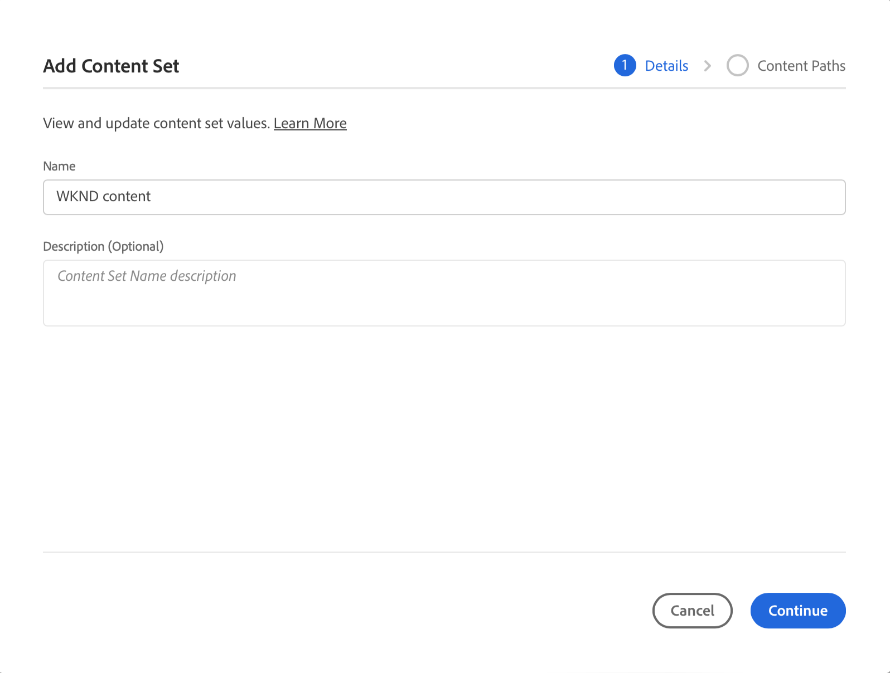

# 콘텐츠 복사 도구 {#content-copy}

콘텐츠 복사 도구를 사용하면 사용자가 필요에 따라 AEM as a Cloud Service 프로덕션 환경에서 더 낮은 환경으로 테스트 목적으로 변경 가능한 콘텐츠를 복사할 수 있습니다.

## 소개 {#introduction}

현재의 실제 데이터는 테스트, 검증 및 사용자 승인 목적에 유용합니다. 콘텐츠 복사 도구를 사용하면 프로덕션 AEM 환경에서 스테이징, 개발 또는 [신속한 개발 환경(RDE)](/help/implementing/developing/introduction/rapid-development-environments.md) 이러한 테스트를 위한 환경입니다.

복사할 콘텐츠는 콘텐츠 세트에 의해 정의됩니다. 콘텐츠 세트는 동일한 Cloud Manager 프로그램 내에서 소스 작성 서비스 환경에서 타겟 작성 서비스 환경으로 복사할 수 있는 변경 가능한 콘텐츠가 포함된 JCR 경로 목록으로 구성됩니다. 콘텐츠 세트에서 허용되는 경로는 다음과 같습니다.

```text
/content
/conf/**/settings/wcm
/conf/**/settings/dam/cfm/models
/conf/**/settings/graphql/persistentQueries
/etc/clientlibs/fd/themes
```

콘텐츠를 복사할 때 소스 환경은 신뢰할 수 있는 소스입니다.

* 대상 환경에서 콘텐츠가 수정된 경우, 경로가 동일한 경우 소스의 콘텐츠로 덮어쓰기됩니다.
* 경로가 서로 다른 경우 소스의 콘텐츠가 대상의 콘텐츠와 병합됩니다.

## 권한 {#permissions}

콘텐츠 복사 도구를 사용하려면 소스 및 타겟 환경 모두에서 특정 권한이 필요합니다.

| 콘텐츠 복사 기능 | AEM 관리자 그룹 | 배포 관리자 역할 |
|---|---|---|
| [콘텐츠 세트](#create-content-set) 만들기 및 수정 | 필수 | 필요 없음 |
| [콘텐츠 복사 프로세스](#copy-content) 시작 또는 취소 | 필수 | 필수 |

## 콘텐츠 세트 만들기 {#create-content-set}

콘텐츠를 복사하려면 먼저 콘텐츠 세트를 정의해야 합니다. 정의되면 콘텐츠 세트를 재사용하여 콘텐츠를 복사할 수 있습니다. 콘텐츠 세트를 만들려면 다음 단계를 따르십시오.

1. [my.cloudmanager.adobe.com](https://my.cloudmanager.adobe.com/)에서 Cloud Manager에 로그인한 다음 적절한 조직과 프로그램을 선택합니다.

1. **개요** 페이지에서 **환경** 화면으로 이동합니다.

1. **환경** 화면에서 **콘텐츠 세트** 페이지로 이동합니다.

1. 화면의 오른쪽 상단에서 **콘텐츠 세트 추가** 버튼을 탭하거나 클릭합니다.

   

1. 마법사의 **세부 정보** 탭에서 콘텐츠 세트의 이름과 설명을 입력하고 **계속**&#x200B;을 탭하거나 클릭합니다.

   

1. 마법사의 콘텐츠 경로 탭에서 콘텐츠 세트에 포함할 변경 가능한 **콘텐츠 경로**&#x200B;를 지정합니다.

   1. **경로 포함 추가** 필드에 경로를 입력합니다.
   1. **경로 추가** 버튼을 탭하거나 클릭하여 콘텐츠 세트에 경로를 추가합니다.
   1. 필요에 따라 **경로 추가** 버튼을 다시 탭하거나 클릭합니다.
      * 최대 50개의 경로가 허용됩니다.

   

1. 콘텐츠 세트를 구체화하거나 제한해야 하는 경우 하위 경로를 제외할 수 있습니다.

   1. 포함된 경로 목록에서 제한해야 할 경로 옆에 있는 제외 **하위 경로 제외 추가** 아이콘을 탭하거나 클릭합니다.
   1. 선택한 경로 아래에서 제외할 하위 경로를 입력합니다.
   1. **경로 제외**&#x200B;를 탭하거나 클릭합니다.
   1. 필요에 따라 제외할 경로를 추가하려면 **하위 경로 제외 추가**&#x200B;를 다시 탭하거나 클릭합니다.
      * 제외된 경로는 포함된 경로를 기준으로 해야 합니다.
      * 제외된 경로의 수에는 제한이 없습니다.

   

1. 필요에 따라 지정한 경로를 변경할 수 있습니다.

   1. 제외된 하위 경로 옆에 있는 X를 탭하거나 클릭하여 삭제합니다.
   1. **편집** 및 **삭제** 옵션을 표시하려면 경로 옆에 있는 줄임표 버튼을 탭하거나 클릭합니다.

   

1. 콘텐츠 세트를 만들려면 **만들기**&#x200B;를 탭하거나 클릭합니다.

이제 콘텐츠 세트를 사용하여 환경 간에 콘텐츠를 복사할 수 있습니다.

## 콘텐츠 세트 편집 {#edit-content-set}

콘텐츠 단계를 생성할 때와 유사한 단계를 수행합니다. **콘텐츠 세트 추가**&#x200B;를 탭하거나 클릭하는 대신 콘솔에서 기존 세트를 선택하고 줄임표 메뉴에서 **편집**&#x200B;을 선택합니다.


콘텐츠 세트를 편집할 때 구성된 경로를 확장하여 제외된 하위 경로를 표시해야 할 수 있습니다.

## 콘텐츠 복사 {#copy-content}

콘텐츠 세트가 생성되면 콘텐츠를 복사하는 데 사용할 수 있습니다. 콘텐츠를 복사하려면 다음 단계를 따르십시오.

>[!NOTE]
> 다음과 같은 동안에는 환경에서 콘텐츠 복사를 시작하지 않아야 합니다. [콘텐츠 전송](/help/journey-migration/content-transfer-tool/using-content-transfer-tool/overview-content-transfer-tool.md) 해당 환경에서 작업이 실행 중입니다.

1. [my.cloudmanager.adobe.com](https://my.cloudmanager.adobe.com/)에서 Cloud Manager에 로그인한 다음 적절한 조직과 프로그램을 선택합니다.

1. **개요** 페이지에서 **환경** 화면으로 이동합니다.

1. **환경** 화면에서 **콘텐츠 세트** 페이지로 이동합니다.

1. 콘솔에서 콘텐츠 세트를 선택하고 줄임표 메뉴에서 **콘텐츠 복사**&#x200B;를 선택합니다.

   

   >[!NOTE]
   >
   >다음과 같은 경우 환경을 선택하지 못할 수 있습니다.
   >
   >* 사용자에게 적절한 권한이 없습니다.
   >* 환경에 실행 중인 파이프라인이 있거나 콘텐츠 복사 작업이 진행 중입니다.
   >* 환경이 최대 절전 모드로 전환되거나 시작됩니다.

1. **콘텐츠 복사** 대화 상자에서 콘텐츠 복사 작업의 소스 및 대상을 지정합니다.

   

   * 콘텐츠는 환경의 계층 구조가 다음과 같은(가장 높은 환경에서 가장 낮은 환경으로) 높은 환경에서 더 낮은 환경으로 또는 개발/RDE 환경 사이에서만 복사할 수 있습니다.
      * 프로덕션
      * 스테이징
      * 개발 / RDE

1. 필요한 경우 다음을 선택할 수도 있습니다. **액세스 제어 목록 포함** 복사 프로세스.

1. **복사**&#x200B;를 탭하거나 클릭합니다.

복사 프로세스가 시작됩니다. 복사 프로세스의 상태는 선택한 콘텐츠 세트의 콘솔에 반영됩니다.

## 콘텐츠 복사 활동 {#copy-activity}

**콘텐츠 복사 활동** 페이지에서 복사 프로세스의 상태를 모니터링할 수 있습니다.

1. [my.cloudmanager.adobe.com](https://my.cloudmanager.adobe.com/)에서 Cloud Manager에 로그인한 다음 적절한 조직과 프로그램을 선택합니다.

1. **개요** 페이지에서 **환경** 화면으로 이동합니다.

1. **환경** 화면에서 **콘텐츠 복사 활동** 페이지로 이동합니다.


### 콘텐츠 복사 상태 {#statuses}

콘텐츠 복사를 시작하면 프로세스는 다음 중 하나의 상태가 됩니다.

| 상태 | 설명 |
|---|---|
| 진행 중 | 콘텐츠 복사 작업 진행 중 |
| 실패 | 콘텐츠 복사 작업 실패 |
| 완료됨 | 콘텐츠 복사 작업이 정상적으로 완료됨 |
| 취소됨 | 사용자가 콘텐츠 복사 작업을 시작한 후 취소합니다. |

### 복사 프로세스 취소 {#canceling}

콘텐츠 복사 작업을 시작한 후 중단해야 하는 경우 취소할 수 있는 옵션이 있습니다.

이렇게 하려면 **콘텐츠 복사 활동** 페이지에서 **취소** 이전에 시작한 복사 프로세스의 줄임표 메뉴에 있는 작업.


>[!NOTE]
>
>콘텐츠 복사 작업을 취소하면 대상 환경에 콘텐츠가 부분적으로 복사될 수 있습니다. 이렇게 하면 대상 환경을 사용할 수 없는 상태로 둘 수 있습니다.
>
>취소로 인해 환경이 이러한 상태에 있는 경우 고객 지원 센터 Adobe에 연락하여 지원을 받으십시오.

## 제한 사항 {#limitations}

콘텐츠 복사 도구에는 다음과 같은 제한 사항이 있습니다.

* 낮은 환경에서 더 높은 환경으로 콘텐츠를 복사할 수 없습니다.
* 콘텐츠는 작성 서비스에서만 및 저작 서비스로 복사할 수 있습니다.
* 프로그램 간 콘텐츠 복사는 불가능합니다.
* 동일한 환경에서 동시에 콘텐츠 복사 작업을 실행할 수 없습니다.
* 콘텐츠 세트당 최대 50개의 경로를 지정할 수 있습니다. 제외된 경로에는 제한이 없습니다.
* 콘텐츠 복사 도구는 소스에서 이동하거나 삭제된 콘텐츠를 추적할 수 없으므로 복제 또는 미러링 도구로 사용하면 안 됩니다.
* 콘텐츠 복사 도구는 버전 관리 기능이 없으며 마지막 콘텐츠 복사 작업 이후 콘텐츠 세트의 소스 환경에서 수정된 콘텐츠 또는 새로 작성된 콘텐츠를 자동으로 감지할 수 없습니다.
   * 마지막 콘텐츠 복사 작업 이후 콘텐츠 변경 사항으로만 대상 환경을 업데이트하려면 콘텐츠 세트를 만들고 마지막 콘텐츠 복사 작업 이후 변경된 소스 인스턴스의 경로를 지정해야 합니다.
* 버전 정보는 콘텐츠 사본에 포함되지 않습니다.
