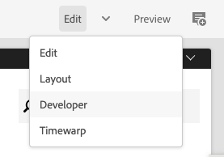

# 개발자 모드 {#developer-mode}

AEM에서 페이지를 편집할 때 몇 가지 [모드](/help/sites-cloud/authoring/fundamentals/environment-tools.md#page-modes) 개발자 모드를 포함하여 을 사용할 수 있습니다. 개발자 모드에서는 현재 페이지에 대한 기술 정보를 개발자에게 제공하는 몇 가지 탭이 있는 사이드 패널이 열립니다.

다음 두 가지 탭이 있습니다.

* **[구성 요소](#components)** 구조 및 성능 정보를 볼 수 있습니다.
* **[오류](#errors)** 문제가 발생하는 것을 확인합니다.

이렇게 하면 개발자가 다음과 같은 작업을 수행할 수 있습니다.

* **검색** 페이지 작성 방법.
* **디버그:** 언제, 어디서 일어나고 있는 일이 문제 해결에 도움이 됩니다.

>[!NOTE]
>
>개발자 모드:
>
>* 공간 제약으로 인해 데스크톱의 작은 창이나 모바일 장치에서는 사용할 수 없습니다.
>  * 이 문제는 너비가 1024px 미만일 때 발생합니다.
>* 의 멤버인 사용자만 사용할 수 있습니다. `administrators` 그룹입니다.

## 개발자 모드 열기 {#opening-developer-mode}

개발자 모드는 페이지 편집기의 사이드 패널로 구현됩니다. 패널을 열려면 다음을 선택합니다. **개발자** 페이지 편집기의 도구 모음에 있는 모드 선택기에서

패널은 두 개의 탭으로 나뉘어 있습니다.

* **[구성 요소](#components)** - 다음과 유사한 구성 요소 트리를 보여 줍니다 [콘텐츠 트리](/help/sites-cloud/authoring/fundamentals/environment-tools.md#content-tree) 작성자용
* **[오류](#errors)** - 문제가 발생하면 각 구성 요소에 대한 세부 정보가 표시됩니다.

### 구성 요소 탭 {#components}

이 구성 요소 트리는 다음과 같습니다.

* 페이지에 렌더링된 구성 요소 체인 및 템플릿을 간략하게 설명합니다. 트리를 확장하여 계층 내에 컨텍스트를 표시할 수 있습니다.
* 구성 요소를 렌더링하는 데 필요한 서버측 계산 시간을 표시합니다.
* 트리를 확장하고 트리 내에서 특정 구성 요소를 선택할 수 있습니다. 선택 항목을 통해 다음과 같은 구성 요소 세부 정보에 액세스할 수 있습니다.
   * 저장소 경로
   * 스크립트 링크(CRXDE Lite에서 액세스)
   * 에 표시되는 구성 요소 세부 사항 [구성 요소 콘솔](/help/sites-cloud/authoring/features/components-console.md)
* 트리에서 선택한 구성 요소는 편집기에서 파란색 테두리로 표시됩니다.

이 구성 요소 탭은 다음 작업을 수행하는 데 도움이 됩니다.

* 구성 요소당 렌더링 시간을 결정하고 비교합니다.
* 계층 구조를 확인하고 이해합니다.
* 느린 구성 요소를 찾아 페이지 로드 시간을 이해한 다음 개선합니다.

각 구성 요소 항목에는 다음 옵션이 있을 수 있습니다.

* **세부 정보 보기:** 다음을 보여주는 목록에 대한 링크:
   * 구성 요소를 렌더링하는 데 사용되는 모든 구성 요소 스크립트.
   * 특정 구성 요소에 대한 저장소 콘텐츠 경로입니다.

     

* **스크립트 편집:** CRXDE Lite에서 구성 요소 스크립트를 여는 링크입니다.

* **구성 요소 세부 사항 보기:** 내의 구성 요소에 대한 세부 정보를 엽니다. [구성 요소 콘솔](/help/sites-cloud/authoring/features/components-console.md).

V자 버튼을 탭하거나 클릭하여 구성 요소 항목을 확장하면 다음도 표시됩니다.

    * 선택한 구성 요소 내의 계층입니다.
    * 선택한 구성 요소, 그 안에 중첩된 개별 구성 요소 및 결합된 합계에 대한 렌더링 시간.

### 오류 탭 {#errors}

바라건대 **오류** 탭은 항상 비어 있지만(위와 같이) 문제가 발생하면 각 구성 요소에 대해 다음 세부 정보가 표시될 수 있습니다.

* 구성 요소가 오류 로그에 오류의 세부 정보와 함께 항목을 쓰고 CRXDE Lite 내의 적절한 코드로 직접 연결하는 경우의 경고.
* 구성 요소가 관리 세션을 여는 경우 경고 메시지가 표시됩니다.

예를 들어 정의되지 않은 메서드가 호출되면 결과 오류가 **오류** 탭 및 트리 구성 요소 항목 **구성 요소** 오류가 발생하면 탭에도 표시기가 표시됩니다.
