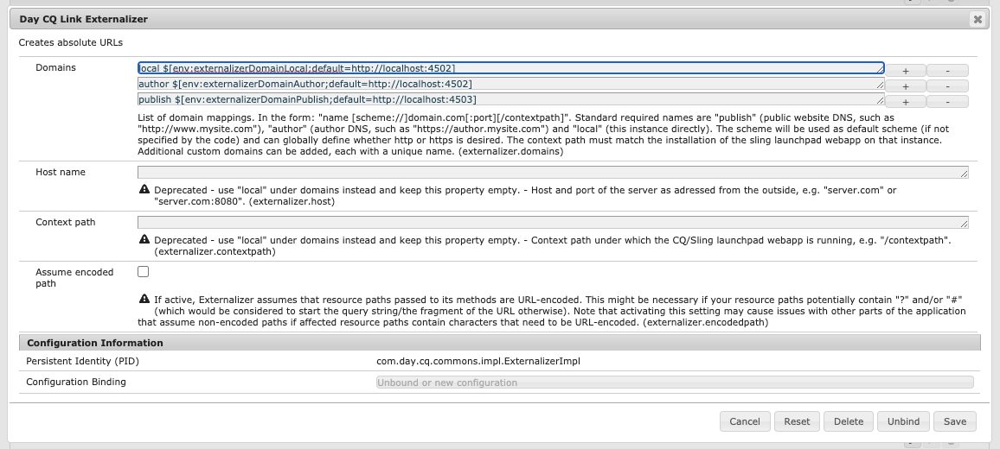

# URL 표면화 {#externalizing-urls}

AEM에서 **Externalizer** 는 리소스 경로를 프로그래밍 방식으로 변환할 수 있는 OSGi 서비스입니다(예: `/path/to/my/page`)을 외부 및 절대 URL(예: `https://www.mycompany.com/path/to/my/page`) 사전 구성된 DNS로 경로를 접두사로 추가합니다.

AEM as a Cloud Service 인스턴스는 외부에 표시되는 URL을 알 수 없으며 경우에 따라 링크는 요청 범위 외부에서 만들어야 하므로 이 서비스는 이러한 외부 URL을 구성하고 빌드할 수 있는 중앙 위치를 제공합니다.

이 문서에서는 외부화 서비스를 구성하는 방법 및 이를 사용하는 방법에 대해 설명합니다. 서비스에 대한 기술적인 세부 정보는 다음을 참조하십시오. [자바독스](https://www.adobe.io/experience-manager/reference-materials/cloud-service/javadoc/com/day/cq/commons/Externalizer.html).

## 외부화의 기본 동작 및 재정의 방법 {#default-behavior}

외부화 서비스는 즉시 사용할 수 있도록 소수의 도메인 식별자를 환경에 대해 생성된 AEM 서비스 URL과 일치하는 절대 URL 접두사에 매핑합니다. 예를 들면 다음과 같습니다 `author https://author-p12345-e6789.adobeaemcloud.com` 및 `publish https://publish-p12345-e6789.adobeaemcloud.com`. 이러한 각 기본 도메인의 기본 URL은 Cloud Manager에서 정의한 환경 변수에서 읽습니다.

참조용으로 의 기본 OSGi 구성 `com.day.cq.commons.impl.ExternalizerImpl.cfg.json` 은(는) 효과적입니다.

```json
{
   "externalizer.domains": [
      "local $[env:AEM_EXTERNALIZER_LOCAL;default=http://localhost:4502]",
      "author $[env:AEM_EXTERNALIZER_AUTHOR;default=http://localhost:4502]",
      "publish $[env:AEM_EXTERNALIZER_PUBLISH;default=http://localhost:4503]",
      "preview $[env:AEM_EXTERNALIZER_PREVIEW;default=http://localhost:4503]"
   ]
}
```

>[!CAUTION]
>
>기본값 `local`, `author`, `preview`, 및 `publish` OSGi 구성의 외부화 도메인 매핑은 원본과 함께 유지되어야 합니다. `$[env:...]` 위에 나열된 값입니다.
>
>사용자 지정 배포 `com.day.cq.commons.impl.ExternalizerImpl.cfg.json` 이러한 기본 도메인 매핑을 생략하면 예기치 않은 애플리케이션 비헤이비어가 발생할 수 있는 AEM에 as a Cloud Service으로 파일을 보냅니다.

재정의하려면 `preview` 및 `publish` 값은 문서에 설명된 대로 Cloud Manager 환경 변수를 사용하십시오 [AEM에 대한 OSGi 구성 as a Cloud Service](/help/implementing/deploying/configuring-osgi.md#cloud-manager-api-format-for-setting-properties) 및 사전 정의된 설정 `AEM_CDN_DOMAIN_PUBLISH` 및 `AEM_CDN_DOMAIN_PREVIEW` 변수를 채우는 방법에 따라 페이지를 순서대로 표시합니다.

## 외부화 서비스 구성 {#configuring-the-externalizer-service}

외부화 서비스를 사용하면 프로그래밍 방식으로 리소스 경로를 접두사로 사용하는 데 사용할 수 있는 도메인을 중앙에서 정의할 수 있습니다. Externalizer 서비스는 단일 도메인을 사용하는 응용 프로그램에만 사용해야 합니다.

>[!NOTE]
>
>적용 시와 같음 [AEM에 대한 OSGi 구성 as a Cloud Service,](/help/implementing/deploying/overview.md#osgi-configuration) 다음 단계는 로컬 개발자 인스턴스에서 수행한 다음 배포를 위해 프로젝트 코드에 커밋해야 합니다.

외부화 서비스에 대한 도메인 매핑을 정의하려면

1. 다음을 통해 구성 관리자로 이동합니다.

   `https://<host>:<port>/system/console/configMgr`

1. 클릭 **일별 CQ 링크 외부화** 구성 대화 상자를 엽니다.

   

   >[!NOTE]
   >
   >구성에 대한 직접 링크는 입니다. `https://<host>:<port>/system/console/configMgr/com.day.cq.commons.impl.ExternalizerImpl`

1. 정의 **도메인** 매핑. 매핑은 코드에서 도메인, 공간 및 도메인을 참조하는 데 사용할 수 있는 고유한 이름으로 구성됩니다.

   `<unique-name> [scheme://]server[:port][/contextpath]`

   위치:

   * **`scheme`** 는 일반적으로 http 또는 https이지만 다른 프로토콜일 수 있습니다.

      * https 링크를 적용하려면 https를 사용하는 것이 좋습니다.
      * URL의 외부화를 요청할 때 클라이언트 코드가 스키마를 재정의하지 않는 경우에 사용됩니다.

   * **`server`** 는 호스트 이름(도메인 이름 또는 ip 주소)입니다.
   * **`port`** (선택 사항) 은 포트 번호입니다.
   * **`contextpath`** (선택 사항) AEM이 다른 컨텍스트 경로 아래에 웹 앱으로 설치된 경우에만 설정됩니다.

   예를 들어`production https://my.production.instance`

   다음 매핑 이름은 사전 정의되어 있으며 AEM이 사용함에 따라 항상 설정해야 합니다.

   * `local` - 로컬 인스턴스
   * `author` - 제작 시스템 DNS
   * `publish` - 공개 웹 사이트 DNS

   >[!NOTE]
   >
   >사용자 지정 구성을 사용하면 다음과 같은 새 카테고리를 추가할 수 있습니다. `production`, `staging` 또는 다음과 같은 외부 비 AEM 시스템도 사용할 수 있습니다. `my-internal-webservice`. 프로젝트의 코드베이스에 있는 서로 다른 위치에 이러한 URL을 하드 코딩하지 않도록 하는 것이 유용합니다.

1. 클릭 **저장** 변경 사항을 저장합니다.

### 외부화 서비스 사용 {#using-the-externalizer-service}

이 섹션에서는 외부화 서비스를 사용하는 방법에 대한 몇 가지 예를 보여줍니다.

>[!NOTE]
>
>절대 링크는 HTML 컨텍스트에서 작성해서는 안 됩니다. 따라서 이러한 경우에는 이 유틸리티를 사용해서는 안 됩니다.

* **&#39;게시&#39; 도메인으로 경로를 외부화하려면:**

  ```java
  String myExternalizedUrl = externalizer.publishLink(resolver, "/my/page") + ".html";
  ```

  도메인 매핑 가정:

   * `publish https://www.website.com`

   * `myExternalizedUrl` 다음 값으로 끝납니다.

   * `https://www.website.com/contextpath/my/page.html`

* **&quot;작성자&quot; 도메인으로 경로를 외부화하려면:**

  ```java
  String myExternalizedUrl = externalizer.authorLink(resolver, "/my/page") + ".html";
  ```

  도메인 매핑 가정:

   * `author https://author.website.com`

   * `myExternalizedUrl` 다음 값으로 끝납니다.

   * `https://author.website.com/contextpath/my/page.html`

* **&#39;로컬&#39; 도메인으로 경로를 외부화하려면:**

  ```java
  String myExternalizedUrl = externalizer.externalLink(resolver, Externalizer.LOCAL, "/my/page") + ".html";
  ```

  도메인 매핑 가정:

   * `local https://publish-3.internal`

   * `myExternalizedUrl` 다음 값으로 끝납니다.

   * `https://publish-3.internal/contextpath/my/page.html`

>[!TIP]
>
>다음에서 더 많은 예를 찾을 수 있습니다. [자바독스](https://www.adobe.io/experience-manager/reference-materials/cloud-service/javadoc/com/day/cq/commons/Externalizer.html).
