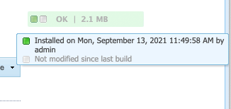
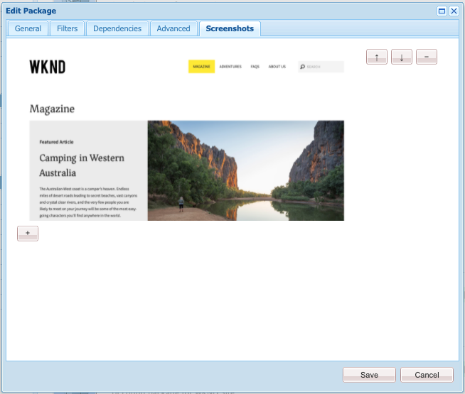

# 패키지 관리자 {#working-with-packages}

패키지를 사용하면 저장소 콘텐츠를 가져오고 내보낼 수 있습니다. 패키지를 사용하여 새 콘텐츠를 설치하고 인스턴스 간에 콘텐츠를 전송하고 저장소 콘텐츠를 백업할 수 있습니다.

패키지 관리자를 사용하면 개발 목적으로 AEM 인스턴스와 로컬 파일 시스템 간에 패키지를 전송할 수 있습니다.

## 패키지란 무엇입니까? {#what-are-packages}

패키지는 파일 시스템 직렬화 형식의 저장소 콘텐츠를 포함하는 zip 파일로, 저장소 직렬화라고 하며, 파일 및 폴더를 사용하기 쉽고 편집하기 쉬운 표현입니다. 패키지에 포함된 콘텐츠는 필터를 사용하여 정의됩니다.

패키지에는 필터 정의 및 가져오기 구성 정보를 포함한 저장소 메타 정보도 포함됩니다. 설명, 시각적 이미지 또는 아이콘과 같이 패키지 추출에 사용되지 않는 추가 콘텐츠 속성을 패키지에 포함할 수 있습니다. 이러한 추가 콘텐츠 속성은 콘텐츠 패키지 소비자를 위한 것이며 정보 제공 목적으로만 사용됩니다.

>[!NOTE]
>
>패키지는 패키지가 빌드되는 시점의 현재 콘텐츠 버전을 나타냅니다. 저장소에 AEM이 보관하는 이전 버전의 컨텐츠는 포함되지 않습니다.

## AEM as a Cloud Service 패키지 {#aemaacs-packages}

AEM as a Cloud Service 애플리케이션용으로 만들어진 콘텐츠 패키지는 변경 불가능한 콘텐츠와 변경 가능한 콘텐츠를 완전히 분리해야 합니다. 따라서 패키지 관리자는 콘텐츠가 포함된 패키지를 관리하는 데만 사용할 수 있습니다. 모든 코드는 Cloud Manager를 통해 배포해야 합니다.

>[!NOTE]
>
>패키지에는 콘텐츠만 포함될 수 있습니다. 모든 기능(예: 아래에 저장된 콘텐츠) `/apps`)은(는) 다음과 같아야 합니다. [Cloud Manager에서 CI/CD 파이프라인을 사용하여 배포됨](/help/implementing/cloud-manager/deploy-code.md).

>[!IMPORTANT]
>
>패키지를 설치하는 데 10분 이상 걸리면 패키지 관리자 UI에서 **정의되지 않은** 오류 메시지를 반환할 수 있습니다.
>
>이는 설치 오류 때문이 아니라 모든 요청에 대한 Cloud Service의 시간 제한 때문입니다.
>
>해당 오류가 표시되면 설치를 재시도하지 마십시오. 설치가 배경에서 제대로 진행되고 있습니다. 설치가 다시 시작되면 여러 개의 동시 가져오기 프로세스로 인해 충돌이 일부 발생할 수 있습니다.

AEMaaCS용 패키지를 관리하는 방법에 대한 자세한 내용은 [AEM에 as a Cloud Service 배포](/help/implementing/deploying/overview.md) 배포 사용 안내서에서 참조하십시오.

## 패키지 크기 {#package-size}

Adobe은 대용량 패키지를 만들지 않는 것을 권장합니다. 패키지를 업로드 및 다운로드할 때 시간 초과 문제가 발생하지 않도록 하기 위한 것입니다.

일반적으로 패키지는 60초 이내에 전체를 전송해야 합니다. 이에 따라 다음 수식이 안내서로 제공됩니다.

```text
MaxPackageSize (in MB) = ConnectionSpeed (in MB/s) * 60 s
```

네트워크 트래픽이 가변적이고 항상 알려진 최대 이론적 값보다 작으므로 온라인 인터넷 연결 속도 테스트 도구를 사용해 보십시오.

인터넷 속도는 업로드와 다운로드의 경우 거의 항상 다릅니다. 패키지를 업로드하고 다운로드해야 한다고 가정할 경우 계산에서 더 낮은 값(일반적으로 업로드 속도)을 사용해야 합니다.

### 예 {#example}

인터넷 속도 테스트 도구를 사용하여 현재 업로드 속도가 약 100Mbps입니다.

```text
100 Mbps = 12.5 MB/s
12.5 MB/s * 60 s = 750 MB
```

따라서 내가 만드는 모든 패키지는 750MB보다 작아야 합니다.

>[!NOTE]
>
>네트워크 속도는 현재 로컬 조건에 따라 다릅니다. 최근 속도 테스트에서도 실제 처리량이 달라질 수 있습니다.
>
>따라서 제공된 공식은 지침만 제공하며 실제 최대 권장 패키지 크기는 다를 수 있습니다.

## 패키지 관리자 {#package-manager}

패키지 관리자는 AEM 설치에서 패키지를 관리합니다. 다음 작업을 수행한 후 [필요한 권한이 할당됨](#permissions-needed-for-using-the-package-manager) 패키지 구성, 빌드, 다운로드 및 설치를 포함한 다양한 작업에 패키지 관리자를 사용할 수 있습니다.

### 필수 권한 {#required-permissions}

패키지를 생성, 수정, 업로드 및 설치하려면 사용자에게 다음 노드에 대한 적절한 권한이 있어야 합니다.

* 에 대한 삭제를 제외한 모든 권한 `/etc/packages`
* 패키지 콘텐츠가 포함된 노드

>[!CAUTION]
>
>패키지에 대한 권한을 부여하면 민감한 정보가 공개되고 데이터가 손실될 수 있습니다.
>
>이러한 위험을 제한하려면 전용 하위 트리에 대해서만 특정 그룹 권한을 부여하는 것이 좋습니다.

### 패키지 관리자 액세스 {#accessing}

다음 세 가지 방법으로 패키지 관리자에 액세스할 수 있습니다.

1. AEM 메인 메뉴에서 -> **도구** -> **배포** -> **패키지**
1. 출처: [CRXDE Lite](crxde.md) 상단 전환기 막대 사용
1. 에 액세스하여 직접 `http://<host>:<port>/crx/packmgr/`

### 패키지 관리자 UI {#ui}

Package Manager 는 네 가지 주요 기능 영역으로 나뉩니다.

* **왼쪽 탐색 패널** - 이 패널을 통해 패키지 목록을 필터링하고 정렬할 수 있습니다.
* **패키지 목록** - 왼쪽 탐색 패널의 선택 항목별로 필터링되고 정렬된 인스턴스의 패키지 목록입니다.
* **활동 로그** - 이 패널은 처음에 최소화되며, 패키지를 빌드하거나 설치할 때와 같은 패키지 관리자의 활동을 자세히 설명하도록 확장됩니다. [작업 로그] 탭에는 다음과 같은 추가 버튼이 있습니다.
   * **로그 지우기**
   * **표시 / 숨기기**
* **도구 모음** - 도구 모음에는 왼쪽 탐색 패널 및 패키지 목록에 대한 새로 고침 버튼과 패키지를 검색, 생성 및 업로드하기 위한 버튼이 포함되어 있습니다.


왼쪽 탐색 패널에서 옵션을 클릭하면 패키지 목록이 즉시 필터링됩니다.

패키지 이름을 클릭하면 패키지 목록의 항목이 확장되어 패키지에 대한 세부 정보가 표시됩니다.


패키지 세부 사항을 확장할 때 사용할 수 있는 도구 모음 버튼을 통해 패키지에서 수행할 수 있는 여러 작업이 있습니다.

* [편집](#edit-package)
* [작성](#building-a-package)
* [다시 설치](#reinstalling-packages)
* [다운로드](#downloading-packages-to-your-file-system)

추가 작업은 아래에서 수행할 수 있습니다 **자세히** 단추를 클릭합니다.

* [삭제](#deleting-packages)
* [범위](#package-coverage)
* [내용](#viewing-package-contents-and-testing-installation)
* [다시 래핑](#rewrapping-a-package)
* [기타 버전](#other-versions)
* [제거](#uninstalling-packages)
* [설치 테스트](#viewing-package-contents-and-testing-installation)
* [유효성 검사](#validating-packages)
* [복제](#replicating-packages)

### 패키지 상태 {#package-status}

패키지 목록의 각 항목에는 패키지의 상태를 한 눈에 알 수 있도록 상태 표시기가 있습니다. 상태를 마우스로 가리키면 상태의 세부 정보와 함께 도구 설명이 표시됩니다.



패키지를 변경했거나 빌드한 적이 없는 경우 상태는 패키지를 다시 빌드하거나 설치하기 위해 빠른 조치를 취하는 링크로 표시됩니다.

## 패키지 설정 {#package-settings}

패키지는 기본적으로 필터 세트이며 이러한 필터를 기반으로 하는 저장소 데이터입니다. 패키지 관리자 UI를 사용하여 패키지를 클릭한 다음 **편집** 단추를 클릭하여 다음 설정을 포함한 패키지의 세부 사항을 확인합니다.

* [일반 설정](#general-settings)
* [패키지 필터](#package-filters)
* [패키지 종속성](#package-dependencies)
* [고급 설정](#advanced-settings)
* [패키지 스크린샷](#package-screenshots)

### 일반 설정 {#general-settings}

다양한 패키지 설정을 편집하여 패키지 설명, 종속성 및 공급자 세부 사항과 같은 정보를 정의할 수 있습니다.

다음 **패키지 설정** 대화 상자는 **편집** 단추 조건 [생성 중](#creating-a-new-package) 또는 [편집](#viewing-and-editing-package-information) 패키지. 변경 사항이 있으면 다음을 클릭하십시오. **저장**.


| 필드 | 설명 |
|---|---|
| 이름 | 패키지 이름 |
| 그룹 | 패키지를 구성하는 경우 새 그룹의 이름을 입력하거나 기존 그룹을 선택할 수 있습니다 |
| 버전 | 버전에 사용할 텍스트 |
| 설명 | HTML 마크업의 서식을 허용하는 패키지에 대한 간단한 설명 |
| 썸네일 | 패키지 목록과 함께 표시되는 아이콘 |

### 패키지 필터 {#package-filters}

필터는 패키지에 포함할 저장소 노드를 식별합니다. A **필터 정의** 다음 정보를 지정합니다.

* 다음 **루트 경로** 포함할 콘텐츠의
* **규칙** 루트 경로 아래에 특정 노드를 포함하거나 제외합니다

를 사용하여 규칙 추가 **+** 단추를 클릭합니다. 를 사용하여 규칙 제거 **-** 단추를 클릭합니다.

규칙은 순서에 따라 적용되므로 을 사용하여 필요에 따라 배치합니다. **위로** 및 **아래로** 화살표 단추.

필터에는 0개 이상의 규칙이 포함될 수 있습니다. 규칙이 정의되지 않으면 패키지에는 루트 경로 아래의 모든 콘텐츠가 포함됩니다.

패키지에 대해 하나 이상의 필터 정의를 정의할 수 있습니다. 여러 루트 경로의 콘텐츠를 포함하려면 두 개 이상의 필터를 사용하십시오.


필터를 만들 때 경로를 정의하거나 정규 표현식을 사용하여 포함 또는 제외할 모든 노드를 지정할 수 있습니다.

| 규칙 유형 | 설명 |
|---|---|
| include | 디렉토리를 포함하면 해당 디렉토리와 해당 디렉토리에 있는 모든 파일 및 폴더(즉, 전체 하위 트리)가 포함되지만 **다음이 아님** 지정된 루트 경로 아래에 있는 다른 파일 또는 폴더를 포함합니다. |
| 제외 | 디렉토리를 제외하면 해당 디렉토리와 해당 디렉토리에 있는 모든 파일 및 폴더(즉, 전체 하위 트리)가 제외됩니다. |

패키지 필터는 처음 정의할 때 가장 자주 정의됩니다 [패키지를 만듭니다.](#creating-a-new-package) 그러나 나중에 편집할 수도 있으며, 이후 새 필터 정의를 기반으로 콘텐츠를 업데이트하기 위해 패키지를 다시 빌드해야 합니다.

>[!TIP]
>
>하나의 패키지에 여러 필터 정의가 포함될 수 있으므로 서로 다른 위치의 노드를 하나의 패키지로 쉽게 결합할 수 있습니다.

### 종속성 {#dependencies}


| 필드 | 설명 | 예/세부 사항 |
|---|---|---|
| 테스트 대상 | 이 패키지가 타겟팅되거나 호환되는 제품 이름 및 버전입니다. | `AEMaaCS` |
| 해결된 문제 | 이 패키지로 수정된 버그의 세부 사항을 나열할 수 있는 텍스트 필드로, 한 줄에 하나의 버그가 있습니다. | - |
| 종속 대상 | 설치 시 현재 패키지가 예상대로 실행되도록 필요한 다른 패키지를 나열합니다. | `groupId:name:version` |
| 바꾸기 | 이 패키지가 대체하는 더 이상 사용되지 않는 패키지 목록 | `groupId:name:version` |

### 고급 설정 {#advanced-settings}


| 필드 | 설명 | 예/세부 사항 |
|---|---|---|
| 이름 | 패키지 공급자의 이름 | `WKND Media Group` |
| URL | 공급자의 URL | `https://wknd.site` |
| 링크 | 공급자 페이지에 대한 패키지별 링크 | `https://wknd.site/package/` |
| 필수 항목 | 패키지 설치 시 제한 사항이 있는지 정의합니다. | **관리자** - 패키지를 관리자 권한으로만 설치해야 합니다.<br>**다시 시작** - 패키지를 설치한 후 AEM을 다시 시작해야 합니다. |
| AC 처리 | 패키지를 가져올 때 패키지에 정의된 액세스 제어 정보가 처리되는 방식을 지정합니다 | **무시** - 저장소에서 ACL 유지&#x200B;<br>**덮어쓰기** - 저장소의 ACL 덮어쓰기&#x200B;<br>**병합** - 두 ACL 집합 병합&#x200B;<br>**MergePreserve** - 콘텐츠에 없는 주체의 액세스 제어 항목을 추가하여 패키지와 함께 제공된 액세스 제어를 콘텐츠에 병합&#x200B;<br>**지우기** - ACL 지우기 |

### 패키지 스크린샷 {#package-screenshots}

패키지에 여러 스크린샷을 연결하여 콘텐츠가 표시되는 방식을 시각적으로 나타낼 수 있습니다.



## 패키지 작업 {#package-actions}

패키지에서 수행할 수 있는 작업은 여러 가지가 있습니다.

### 패키지 만들기 {#creating-a-new-package}

1. [패키지 관리자에 액세스합니다.](#accessing)

1. 클릭 **패키지 만들기**.

   >[!TIP]
   >
   >인스턴스에 많은 패키지가 있는 경우 폴더 구조가 있을 수 있습니다. 이러한 경우 새 패키지를 만들기 전에 필요한 대상 폴더로 이동하는 것이 더 쉽습니다.

1. 다음에서 **새 패키지** 대화 상자에서 다음 필드를 입력합니다.

   

   * **패키지 이름** - 다른 사용자가 패키지의 내용을 쉽게 식별할 수 있도록 설명하는 이름을 선택합니다.

   * **버전** - 버전을 나타내는 텍스트 필드입니다. zip 파일의 이름을 형성하기 위해 패키지 이름에 추가됩니다.

   * **그룹** - 대상 그룹(또는 폴더) 이름입니다. 그룹을 사용하면 패키지를 구성할 수 있습니다. 폴더가 없는 경우 그룹에 대해 폴더가 만들어집니다. 그룹 이름을 비워 두면 기본 패키지 목록에 패키지가 만들어집니다.

1. 클릭 **확인** 패키지를 만듭니다.

1. AEM은 패키지 목록 맨 위에 새 패키지를 나열합니다.

   

1. 클릭 **편집** 을(를) 정의하려면 [패키지 콘텐츠.](#package-contents) 클릭 **저장** 설정 편집을 마치면

1. 이제 다음을 수행할 수 있습니다. [빌드](#building-a-package) 패키지.

패키지를 생성한 후 즉시 패키지를 빌드해야 하는 것은 아닙니다. 빌드되지 않은 패키지는 콘텐츠를 포함하지 않고 패키지의 필터 데이터와 기타 메타데이터로만 구성됩니다.

>[!TIP]
>
>시간 초과를 방지하려면 Adobe이 권장합니다. [대용량 패키지를 만들지 않습니다.](#package-size)

### 패키지 빌드 {#building-a-package}

패키지는 종종 귀하와 동시에 작성됩니다. [패키지 만들기](#creating-a-new-package)나중에 다시 돌아와 패키지를 빌드하거나 다시 빌드할 수 있습니다. 이 기능은 저장소 내의 콘텐츠가 변경되었거나 패키지 필터가 변경된 경우에 유용합니다.

1. [패키지 관리자에 액세스합니다.](#accessing)

1. 패키지 이름을 클릭하여 패키지 목록에서 패키지 세부 정보를 엽니다.

1. 클릭 **빌드**. 대화 상자에 기존 패키지 내용을 덮어쓰게 되므로 패키지를 빌드할 것인지 확인하는 메시지가 표시됩니다.

1. **확인**&#x200B;을 클릭합니다. AEM은 패키지를 빌드하여 활동 목록에서와 같이 패키지에 추가된 모든 컨텐츠를 나열합니다. 완료 시 AEM에 패키지가 작성되었다는 확인이 표시되고 대화 상자를 닫을 때 패키지 목록 정보가 업데이트됩니다.

>[!TIP]
>
>시간 초과를 방지하려면 Adobe이 권장합니다. [대용량 패키지를 만들지 않습니다.](#package-size)

### 패키지 편집 {#edit-package}

패키지가 AEM에 업로드되면 설정을 수정할 수 있습니다.

1. [패키지 관리자에 액세스합니다.](#accessing)

1. 패키지 이름을 클릭하여 패키지 목록에서 패키지 세부 정보를 엽니다.

1. 클릭 **편집** 및 업데이트 **[패키지 설정](#package-settings)** 필요에 따라.

1. 클릭 **저장** 저장.

다음을 수행해야 합니다. [패키지 다시 빌드](#building-a-package) 을 클릭하여 변경 내용을 기반으로 콘텐츠를 업데이트합니다.

### 패키지 다시 래핑 {#rewrapping-a-package}

패키지가 빌드되면 다시 래핑할 수 있습니다. 다시 래핑하면 패키지 내용을 변경하지 않고 썸네일, 설명 등과 같은 패키지 정보를 변경하지 않습니다.

1. [패키지 관리자에 액세스합니다.](#accessing)

1. 패키지 이름을 클릭하여 패키지 목록에서 패키지 세부 정보를 엽니다.

1. 클릭 **편집** 및 업데이트 **[패키지 설정](#package-settings)** 필요에 따라.

1. 클릭 **저장** 저장.

1. 클릭 **자세히** -> **다시 래핑** 확인을 묻는 대화 상자가 나타납니다.

### 다른 패키지 버전 보기 {#other-versions}

패키지의 모든 버전은 다른 패키지와 마찬가지로 목록에 표시되므로 패키지 관리자는 선택한 패키지의 다른 버전을 찾을 수 있습니다.

1. [패키지 관리자에 액세스합니다.](#accessing)

1. 패키지 이름을 클릭하여 패키지 목록에서 패키지 세부 정보를 엽니다.

1. 클릭 **자세히** -> **기타 버전** 그리고 상태 정보가 있는 동일한 패키지의 다른 버전 목록이 있는 대화 상자가 열립니다.

### 패키지 내용 보기 및 설치 테스트 {#viewing-package-contents-and-testing-installation}

패키지가 빌드되면 콘텐츠를 볼 수 있습니다.

1. [패키지 관리자에 액세스합니다.](#accessing)

1. 패키지 이름을 클릭하여 패키지 목록에서 패키지 세부 정보를 엽니다.

1. 내용을 보려면 **자세히** -> **내용**, 패키지 관리자 는 패키지의 전체 컨텐츠를 작업 로그에 나열합니다.

   

1. 설치를 시험 실행하려면 다음을 클릭합니다. **자세히** -> **설치 테스트** 그리고 패키지 관리자 보고서는 활동이 완료된 것처럼 결과를 기록합니다.

   

### 파일 시스템에 패키지 다운로드 {#downloading-packages-to-your-file-system}

1. [패키지 관리자에 액세스합니다.](#accessing)

1. 패키지 이름을 클릭하여 패키지 목록에서 패키지 세부 정보를 엽니다.

1. 다음을 클릭합니다. **다운로드** 패키지 세부 정보 영역에서 패키지의 단추 또는 링크된 파일 이름.

1. AEM은 패키지를 컴퓨터에 다운로드합니다.

>[!TIP]
>
>시간 초과를 방지하려면 Adobe이 권장합니다. [대용량 패키지를 만들지 않습니다.](#package-size)

### 파일 시스템에서 패키지 업로드 {#uploading-packages-from-your-file-system}

1. [패키지 관리자에 액세스합니다.](#accessing)

1. 패키지를 업로드할 그룹 폴더를 선택합니다.

1. 다음을 클릭합니다. **패키지 업로드** 단추를 클릭합니다.

1. 업로드한 패키지에 대해 필요한 정보를 제공합니다.

   

   * **패키지** - 다음을 사용합니다. **찾아보기...** 로컬 파일 시스템에서 필요한 패키지를 선택하는 단추입니다.
   * **강제 업로드** - 이 이름의 패키지가 이미 있는 경우 이 옵션은 업로드를 강제하고 기존 패키지를 덮어씁니다.

1. 클릭 **확인** 그러면 선택한 패키지가 업로드되고 그에 따라 패키지 목록이 업데이트됩니다.

이제 패키지 콘텐츠가 AEM에 존재하지만 콘텐츠를 사용할 수 있도록 하려면 다음을 확인하십시오 [패키지 설치](#installing-packages).

>[!TIP]
>
>시간 초과를 방지하려면 Adobe이 권장합니다. [대용량 패키지를 만들지 않습니다.](#package-size)

### 패키지 확인 {#validating-packages}

패키지는 기존 콘텐츠를 수정할 수 있으므로 설치하기 전에 이러한 변경 사항의 유효성을 검사하는 것이 유용한 경우가 많습니다.

#### 유효성 검사 옵션 {#validation-options}

패키지 관리자는 다음 유효성 검사를 수행할 수 있습니다.

* [OSGi 패키지 가져오기](#osgi-package-imports)
* [오버레이](#overlays)
* [ACL](#acls)

##### OSGi 패키지 가져오기 유효성 검사 {#osgi-package-imports}

>[!NOTE]
>
>패키지를 사용하여 AEMaaCS에서 코드를 배포할 수 없으므로 **OSGi 패키지 가져오기** 유효성 검사가 필요하지 않습니다.

**선택 항목**

이 유효성 검사는 모든 JAR 파일(OSGi 번들)에 대한 패키지를 검사하고 압축을 풉니다. `manifest.xml` (해당 OSGi 번들이 사용하는 버전이 지정된 종속성이 포함됨) 및 AEM 인스턴스가 해당 종속성을 올바른 버전과 내보내는지 확인합니다.

**보고 방법**

AEM 인스턴스가 충족할 수 없는 버전 종속 항목은 패키지 관리자의 작업 로그에 나열됩니다.

**오류 상태**

종속성이 충족되지 않으면 해당 종속성이 있는 패키지의 OSGi 번들이 시작되지 않습니다. 따라서 시작되지 않은 OSGi 번들에 의존하는 모든 것이 결국 제대로 작동하지 않아 애플리케이션 배포가 중단됩니다.

**오류 해결**

충족되지 않은 OSGi 번들로 인한 오류를 해결하려면 충족되지 않은 가져오기가 포함된 번들의 종속성 버전을 조정해야 합니다.

##### 오버레이 유효성 검사 {#overlays}

>[!NOTE]
>
>패키지를 사용하여 AEMaaCS에서 코드를 배포할 수 없으므로 **오버레이** 유효성 검사가 필요하지 않습니다.

**선택 항목**

이 유효성 검사는 설치 중인 패키지에 대상 AEM 인스턴스에 이미 오버레이된 파일이 포함되어 있는지 확인합니다.

예를 들어 의 기존 오버레이가 주어지면 `/apps/sling/servlet/errorhandler/404.jsp`: 다음을 포함하는 패키지 `/libs/sling/servlet/errorhandler/404.jsp`의 기존 파일을 `/libs/sling/servlet/errorhandler/404.jsp`.

**보고 방법**

이러한 모든 오버레이는 패키지 관리자의 작업 로그에 설명되어 있습니다.

**오류 상태**

오류 상태는 패키지가 이미 오버레이된 파일을 배포하려고 시도하고 있음을 의미하므로 패키지의 변경 사항이 오버레이에 의해 재정의되고(따라서 &quot;숨김&quot;) 적용되지 않습니다.

**오류 해결**

이 문제를 해결하기 위해 의 오버레이 파일 유지 관리자 `/apps` 는에서 오버레이된 파일의 변경 사항을 검토해야 합니다. `/libs` 필요에 따라 변경 내용을 오버레이에 통합( `/apps`)를 참조하고 오버레이된 파일을 다시 배포합니다.

>[!NOTE]
>
>유효성 검사 메커니즘은 오버레이된 콘텐츠가 오버레이 파일에 적절하게 통합되었다면 조정할 수 있는 방법이 없다. 따라서 이 유효성 검사는 필요한 변경이 수행된 후에도 충돌을 계속 보고합니다.

##### ACL 유효성 검사 {#acls}

**선택 항목**

이 유효성 검사는 추가되는 권한, 처리 방법(병합/바꾸기) 및 현재 권한이 영향을 받는지 확인합니다.

**보고 방법**

권한은 패키지 관리자의 작업 로그에 설명되어 있습니다.

**오류 상태**

명시적 오류를 제공할 수 없습니다. 유효성 검사는 새 ACL 권한이 추가되었는지 또는 패키지 설치에 의해 영향을 받았는지를 나타냅니다.

**오류 해결**

유효성 검사에서 제공한 정보를 사용하여 영향을 받는 노드를 CRXDE에서 검토하고 필요에 따라 ACL을 패키지에서 조정할 수 있습니다.

>[!CAUTION]
>
>예기치 않은 동작이 발생할 수 있으므로 AEM에서 제공한 ACL에 패키지가 영향을 주지 않는 것이 좋습니다.

#### 유효성 검사 수행 {#performing-validation}

패키지의 유효성 검사는 다음 두 가지 방법으로 수행할 수 있습니다.

* [패키지 관리자 UI 사용](#via-package-manager)
* [cURL과 같은 HTTP POST 요청을 통해](#via-post-request)

패키지를 업로드한 후 설치하기 전에 항상 유효성 검사가 수행되어야 합니다.

##### 패키지 관리자를 통한 패키지 유효성 검사 {#via-package-manager}

1. [패키지 관리자에 액세스합니다.](#accessing)

1. 패키지 이름을 클릭하여 패키지 목록에서 패키지 세부 정보를 엽니다.

1. 패키지의 유효성을 검사하려면 **자세히** -> **유효성 검사**,

1. 모달 대화 상자가 나타나면 확인란을 사용하여 유효성 검사 유형을 선택하고 을 클릭하여 유효성 검사를 시작합니다. **유효성 검사**.

1. 그런 다음 선택한 유효성 검사가 실행되고 결과가 패키지 관리자의 작업 로그에 표시됩니다.

##### HTTP POST 요청을 통한 패키지 유효성 검사 {#via-post-request}

POST 요청은 다음 양식을 사용합니다.

```
https://<host>:<port>/crx/packmgr/service.jsp?cmd=validate&type=osgiPackageImports,overlays,acls
```

다음 `type` 매개 변수는 쉼표로 구분된 다음 항목으로 구성된 무순서 목록일 수 있습니다.

* `osgiPackageImports`
* `overlays`
* `acls`

값: `type` 기본값은 입니다. `osgiPackageImports` 명시적으로 전달되지 않은 경우.

cURL을 사용할 때 다음과 유사한 문을 실행합니다.

```shell
curl -v -X POST --user admin:admin -F file=@/Users/SomeGuy/Desktop/core.wcm.components.all-1.1.0.zip 'http://localhost:4502/crx/packmgr/service.jsp?cmd=validate&type=osgiPackageImports,overlays,acls'
```

POST 요청을 통해 유효성을 검사할 때 응답은 JSON 개체로 다시 전송됩니다.

### 패키지 범위 보기 {#package-coverage}

패키지는 해당 필터에 의해 정의됩니다. 패키지 관리자에서 기존 저장소 콘텐츠에 패키지 필터를 적용하여 패키지의 필터 정의에 포함되는 저장소 콘텐츠를 표시하도록 할 수 있습니다.

1. [패키지 관리자에 액세스합니다.](#accessing)

1. 패키지 이름을 클릭하여 패키지 목록에서 패키지 세부 정보를 엽니다.

1. 클릭 **자세히** -> **적용 범위**.

1. 적용 범위 세부 사항은 작업 로그에 나열됩니다.

### 패키지 설치 {#installing-packages}

패키지를 업로드하면 패키지 콘텐츠가 저장소에만 추가되지만 액세스할 수 없습니다. 패키지의 콘텐츠를 사용하려면 업로드된 패키지를 설치해야 합니다.

>[!CAUTION]
>
>패키지를 설치하면 기존 콘텐츠를 덮어쓰거나 삭제할 수 있습니다. 필요한 콘텐츠를 삭제하거나 덮어쓰지 않는 경우에만 패키지를 업로드하십시오.

패키지를 설치하기 전에 패키지 관리자에서 덮어쓴 콘텐츠가 포함된 스냅샷 패키지를 자동으로 만듭니다. 패키지를 제거하면 이 스냅샷이 다시 설치됩니다.

1. [패키지 관리자에 액세스합니다.](#accessing)

1. 패키지 이름을 클릭하여 패키지 목록에서 설치할 패키지의 패키지 세부 정보를 엽니다.

1. 다음 중 하나를 클릭합니다 **설치** 항목 세부 사항 또는 **설치** 패키지 상태의 링크.

1. 대화 상자에서 확인을 요청하고 추가 옵션을 지정할 수 있습니다.

   * **추출 전용** - 스냅샷이 생성되지 않도록 패키지를 추출하면 제거할 수 없습니다.
   * **저장 임계값** - 자동 저장이 트리거될 때까지의 임시 노드 수(동시 수정 예외가 발생하면 증가)
   * **하위 패키지 추출** - 하위 패키지 자동 추출 활성화
   * **액세스 제어 처리** - 패키지를 설치할 때 패키지에 정의된 액세스 제어 정보가 처리되는 방법을 지정합니다(옵션은 [고급 패키지 설정](#advanced-settings))
   * **종속성 처리** - 설치하는 동안 종속성이 처리되는 방법을 지정하십시오.

1. 클릭 **설치**.

1. 작업 로그에는 설치 진행 상황이 자세히 설명되어 있습니다.

설치가 완료되고 성공하면 패키지 목록이 업데이트되고 **설치됨** 패키지 상태에 나타납니다.

### 패키지 재설치 {#reinstalling-packages}

패키지 재설치는 이미 설치된 패키지에서 다음 경우에 처리되는 동일한 단계를 수행합니다 [패키지를 처음 설치하는 경우](#installing-packages)

### 파일 시스템 기반 업로드 및 설치 {#file-system-based-upload-and-installation}

패키지를 설치할 때 패키지 관리자를 모두 포기할 수 있습니다. AEM은 호스트 시스템의 로컬 파일 시스템에서 특정 위치에 배치된 패키지를 감지하여 자동으로 업로드 및 설치할 수 있습니다.

1. AEM 설치 폴더 아래에 `crx-quicksart` 항아리와 함께 있는 폴더 `license.properties` 파일. 다음 이름의 폴더 만들기 `install` 아래에 `crx-quickstart` 결과 경로 `<aem-home>/crx-quickstart/install`.

1. 이 폴더에서 패키지를 추가합니다. 인스턴스는 자동으로 업로드되고 설치됩니다.

1. 업로드 및 설치가 완료되면 패키지 관리자 UI를 사용하여 패키지를 설치한 것처럼 패키지 관리자에서 패키지를 볼 수 있습니다.

인스턴스가 실행 중인 경우 패키지를 패키지에 추가할 때 업로드 및 설치가 바로 시작됩니다. `install` 폴더

인스턴스가 실행되고 있지 않으면 패키지가 `install` 시작 시 폴더가 알파벳순으로 설치됩니다.

### 패키지 제거 {#uninstalling-packages}

패키지를 제거하면 저장소의 내용이 설치 전에 패키지 관리자에서 자동으로 만든 스냅샷으로 되돌아갑니다.

1. [패키지 관리자에 액세스합니다.](#accessing)

1. 패키지 이름을 클릭하여 패키지 목록에서 제거할 패키지의 패키지 세부 정보를 엽니다.

1. 클릭 **자세히** -> **제거**&#x200B;저장소에서 이 패키지의 콘텐츠를 제거합니다.

1. 대화 상자에서 확인을 요청하고 모든 변경 사항을 나열합니다.

1. 패키지가 제거되고 스냅샷이 적용됩니다. 프로세스 진행 상황이 작업 로그에 표시됩니다.

### 패키지 삭제 {#deleting-packages}

패키지를 삭제하면 패키지 관리자에서 세부 사항만 삭제됩니다. 이 패키지가 이미 설치된 경우 설치된 콘텐츠는 삭제되지 않습니다.

1. [패키지 관리자에 액세스합니다.](#accessing)

1. 패키지 이름을 클릭하여 패키지 목록에서 삭제하려는 패키지의 패키지 세부 정보를 엽니다.

1. AEM에서 패키지를 삭제할 것인지 확인하는 메시지를 표시합니다. 클릭 **확인** 삭제 확인.

1. 패키지 정보가 삭제되고 자세한 내용은 활동 로그에 보고됩니다.

### 패키지 복제 {#replicating-packages}

패키지의 콘텐츠를 복제하여 게시 인스턴스에 설치합니다.

1. [패키지 관리자에 액세스합니다.](#accessing)

1. 패키지 이름을 클릭하여 패키지 목록에서 복제할 패키지의 패키지 세부 정보를 엽니다.

1. 클릭 **자세히** -> **복제**.

1. 패키지가 복제되고 세부 사항이 작업 로그에 보고됩니다.

## 소프트웨어 배포 {#software-distribution}

AEM 패키지를 사용하여 AEMaaCS 환경에서 콘텐츠를 만들고 공유할 수 있습니다.

[소프트웨어 배포](https://downloads.experiencecloud.adobe.com) 로컬 개발 AEM SDK에서 사용할 AEM 패키지를 제공합니다. 소프트웨어 배포에 제공된 AEM 패키지는 Adobe 지원에서 명시적으로 승인하지 않는 한 AEMaaCS 클라우드 환경에 설치하지 않아야 합니다.

자세한 내용은 [소프트웨어 배포 설명서](https://experienceleague.adobe.com/docs/experience-cloud/software-distribution/home.html).
