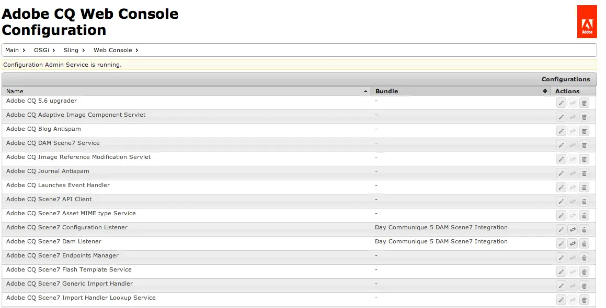
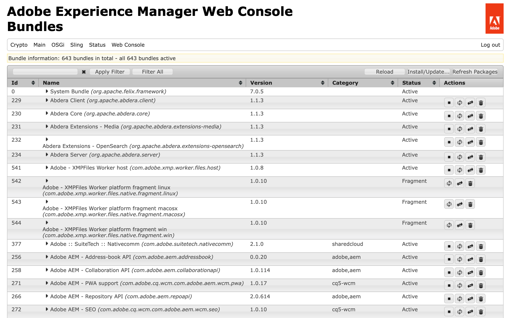
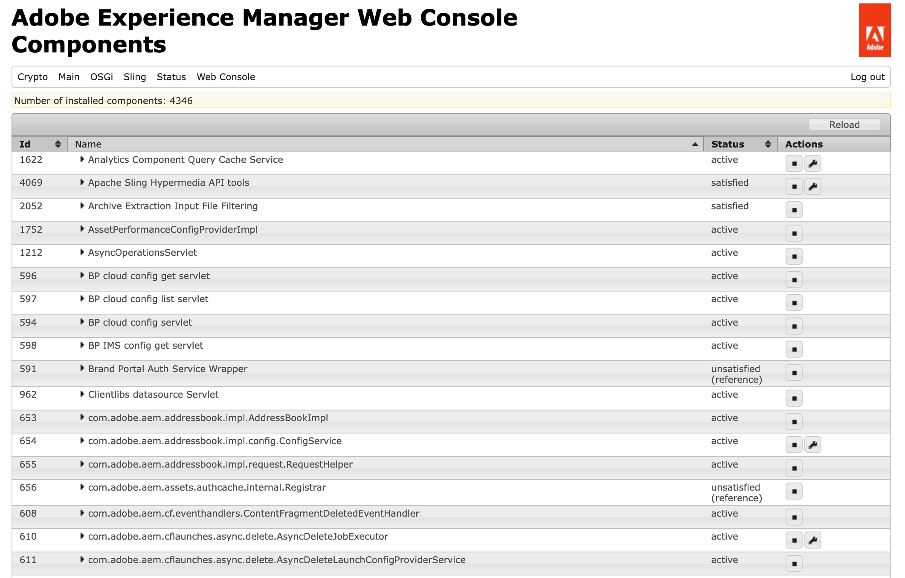

# 웹 콘솔 {#web-console}

Adobe Experience Manager(AEM) 웹 콘솔을 사용하여 로컬 개발을 위한 OSGi 설정 및 번들을 관리하는 방법에 대해 알아봅니다.

## 개요 {#overview}

AEM as a Cloud Service은 [구성 및 코드를 런타임에 변경할 수 없는 것으로 취급합니다.](/help/release-notes/aem-cloud-changes.md#apps-libs-immutable) 즉, 프로덕션 환경에서 코딩할 때처럼 모든 구성을 배포해야 합니다. 프로덕션 인스턴스의 경우 품질 게이트가 전달되고 현재 환경의 안정성과 명확성을 제공합니다.

그러나 개발 목적으로 임시 개발 변경 사항을 테스트하려면 OSGi 구성 업데이트 및 번들 변경 사항이 필요한 경우가 많습니다. AEM as a Cloud Service SDK의 일부로서 웹 콘솔에서 이 기능을 사용할 수 있습니다. AEM as a Cloud Service의 OSGi 구성에 대한 자세한 내용은 [Adobe Experience Manager as a Cloud Service에 대한 OSGi 구성](/help/implementing/deploying/configuring-osgi.md) 문서를 참조하십시오.

콘솔은 `http://<host>:<port>/system/console`에서 액세스할 수 있습니다.

웹 콘솔은 다음을 포함하여 OSGi 번들을 유지 관리하기 위한 다양한 화면을 제공합니다.

* [구성](#configuration): OSGi 번들을 구성하는 데 사용되므로 AEM 시스템 매개 변수를 구성하는 기본 메커니즘입니다.
* [번들](#bundles): 번들 설치에 사용됨
* [구성 요소](#components): AEM에 필요한 구성 요소의 상태를 제어하는 데 사용됨

수행된 모든 변경 사항은 실행 중인 개발 시스템에 즉시 적용됩니다. 다시 시작할 필요가 없습니다.

웹 콘솔에서 기본 설정을 언급하는 모든 설명은 Sling 기본값과 관련되어 있습니다. AEM에는 자체 기본값이 있으므로 설정된 기본값이 콘솔에 기록된 기본값과 다를 수 있습니다.

Adobe Experience Manager(AEM)의 웹 콘솔은 [Apache Felix 웹 관리 콘솔](https://felix.apache.org/documentation/subprojects/apache-felix-web-console.html)을 기반으로 합니다. Apache Felix는 OSGi 프레임워크 및 표준 서비스를 포함하는 OSGi R4 서비스 플랫폼을 구현하기 위한 커뮤니티 작업입니다.

>[!NOTE]
>
>웹 콘솔은 로컬 개발 목적으로 AEM as a Cloud Service SDK에서만 사용할 수 있습니다. 프로덕션 환경에서는 사용할 수 없습니다.

>[!TIP]
>
>프로덕션 환경에서 OSGi 구성, 번들 및 구성 요소의 상태를 확인하려면 [Developer Console.](/help/implementing/developing/introduction/aem-developer-console.md)을(를) 사용하십시오.

## 구성 {#configuration}

**구성** 화면은 OSGi 번들을 구성하는 데 사용되므로 AEM 시스템 매개 변수를 구성하는 기본 메커니즘입니다. **구성** 탭은 다음 방법 중 하나로 액세스할 수 있습니다.

* 드롭다운 메뉴: **OSGi -> 구성**
* URL: `http://<host>:<port>/system/console/configMgr`

구성 목록이 표시됩니다.

이 화면의 드롭다운 목록에서 사용할 수 있는 구성 유형은 다음 두 가지입니다.

* **구성**&#x200B;을 통해 기존 구성을 업데이트할 수 있습니다. 영구 ID(PID)가 있으며 다음 중 하나일 수 있습니다.
   * AEM에 대한 표준 및 정수 - 값을 삭제하면 기본 설정으로 돌아갑니다.
   * 출하 시 구성에서 생성된 인스턴스 - 이러한 인스턴스는 사용자가 생성하고, 삭제하면 인스턴스가 제거됩니다.
* **팩터리 구성**&#x200B;을 사용하면 필요한 기능 개체의 인스턴스를 만들 수 있습니다. 이 ID는 영구 ID에 할당된 다음 구성 드롭다운 목록에 나열됩니다.

목록에서 항목을 선택하면 해당 구성과 관련된 매개 변수가 표시됩니다.

그런 다음 필요에 따라 매개변수를 업데이트할 수 있습니다.

* 변경 내용을 저장하려면 **저장**&#x200B;하세요.
   * 공장 구성의 경우 영구 ID를 사용하는 인스턴스가 생성됩니다.
   * 그러면 구성 아래에 새 인스턴스가 나열됩니다.
* 화면에 표시된 매개 변수를 마지막으로 저장된 매개 변수로 다시 설정하려면 **다시 설정**&#x200B;하십시오.
* 현재 구성을 삭제하려면 **삭제**&#x200B;하십시오.
   * 표준인 경우 매개 변수가 기본 설정으로 반환됩니다.
   * 공장 구성에서 생성된 경우 특정 인스턴스가 삭제됩니다.
* **바인딩 해제**: 번들에서 현재 구성의 바인딩을 해제합니다.
* 현재 변경 내용을 취소하려면 **취소**&#x200B;하십시오.

>[!TIP]
>
>자세한 내용은 [웹 콘솔과 함께 OSGi 구성](/help/implementing/deploying/configuring-osgi.md)을 참조하십시오.

## 번들 {#bundles}

**번들** 화면은 AEM에 필요한 OSGi 번들을 설치하는 데 사용됩니다. 다음 방법 중 하나를 사용하여 화면에 액세스합니다.

* 드롭다운 메뉴: **OSGi -> 번들**
* URL: `http://<host>:<port>/system/console/bundles`

번들 목록이 표시됩니다.

이 화면을 사용하여 다음과 같은 작업을 수행할 수 있습니다.

* 새 번들을 설치하거나 기존 번들을 업데이트하려면 **설치 또는 업데이트**&#x200B;하세요.
   * **찾아보기**&#x200B;를 통해 번들이 포함된 파일을 찾아 **즉시 시작**&#x200B;할지 여부와 **시작 수준**&#x200B;을 지정할 수 있습니다.
* 표시된 목록을 새로 고치려면 **다시 로드**&#x200B;하세요.
* **패키지 새로 고침**&#x200B;을 클릭하여 모든 패키지의 참조를 확인하고 필요에 따라 새로 고칩니다.
   * 예를 들어 업데이트 후 이전 참조로 인해 이전 버전과 새 버전이 모두 실행될 수 있습니다. 이 옵션은 모든 참조를 확인하고 새 버전으로 이동하여 이전 버전을 중지할 수 있도록 합니다.
* 지정된 시작 수준에 따라 번들을 시작하려면 **시작**&#x200B;하세요.
* 번들을 중지하려면 **중지**&#x200B;하세요.
* 시스템에서 번들을 제거하려면 **제거**&#x200B;하십시오.

목록은 번들의 상태를 지정합니다. 추가 정보 표시가 있는 특정 번들의 이름을 클릭합니다.

>[!TIP]
>
>**업데이트** 후에는 **패키지 새로 고침**&#x200B;을 클릭하는 것이 좋습니다.

## 구성 요소 {#components}

**구성 요소** 화면에서 구성 요소를 사용하거나 사용하지 않도록 설정할 수 있습니다. 다음 중 하나를 통해 액세스할 수 있습니다.

* 드롭다운 메뉴: **기본 -> 구성 요소**

* URL: `http://<host>:<port>/system/console/components`

구성 요소 목록이 표시됩니다. 다양한 아이콘을 사용하여 특정 구성 요소에 대한 구성 세부 정보를 활성화, 비활성화 또는 (해당되는 경우) 열 수 있습니다.

특정 구성 요소의 이름을 클릭하면 구성 요소 상태에 대한 추가 정보가 표시됩니다. 여기에서 구성 요소를 활성화, 비활성화 또는 다시 로드할 수도 있습니다.

>[!NOTE]
>
>구성 요소 활성화 또는 비활성화는 SDK이 다시 시작될 때까지 적용됩니다.
>
>시작 상태는 구성 요소 설명자 내에서 정의되며, 구성 요소 설명자는 개발 중에 생성되고 번들 생성 시 번들에 저장됩니다.

## OSGi 구성 생성 {#generating-osgi-configs}

웹 콘솔을 사용하여 OSGi 구성 요소를 구성하고 OSGi 구성을 JSON으로 내보낼 수 있습니다. 이 기능은 개발자가 AEM 프로젝트에서 OSGi 구성을 정의하는 경우 OSGi 속성 및 값 형식을 잘 이해하지 못하는 AEM 제공 OSGi 구성 요소를 구성하는 데 유용합니다.

자세한 내용은 [Adobe Experience Manager as a Cloud Service에 대한 OSGi 구성](/help/implementing/deploying/configuring-osgi.md#generating-osgi-configurations-using-the-web-console) 문서를 참조하십시오.
