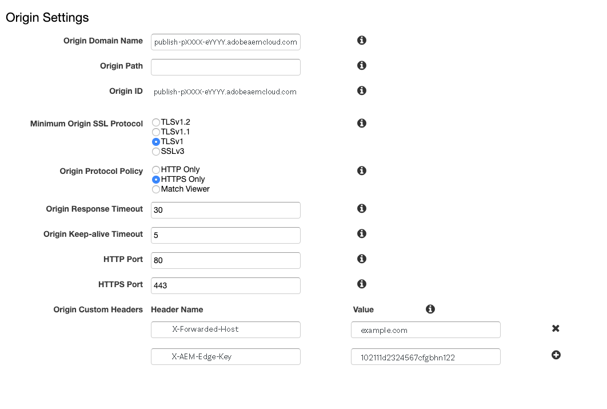

# AEM as a Cloud Service의 CDN {#cdn}

>[!CONTEXTUALHELP]
>id="aemcloud_golive_cdn"
>title="AEM as a Cloud Service의 CDN"
>abstract="AEM as Cloud Service가 내장된 CDN과 함께 제공됩니다. 주요 목적은 브라우저 근처 가장자리에 CDN 노드에서 캐시 가능 콘텐츠를 게재하여 지연 시간을 줄이는 것입니다. AEM 애플리케이션 최적의 성능을 위해 완벽하게 관리 및 구성됩니다."

AEM as Cloud Service가 내장된 CDN과 함께 제공됩니다. 주요 목적은 브라우저 근처 가장자리에 CDN 노드에서 캐시 가능 콘텐츠를 게재하여 지연 시간을 줄이는 것입니다. AEM 애플리케이션 최적의 성능을 위해 완벽하게 관리 및 구성됩니다.

AEM 관리 CDN은 대부분의 고객 성능 및 보안 요구 사항을 충족합니다. 게시 계층의 경우 고객은 관리해야 할 자신의 CDN에서 지정할 수 있습니다(선택 사항). 이 시나리오는 중단할 수 없는 고객과 CDN 공급업체의 기존 통합을 포함하되 이에 국한되지 않고 특정 사전 요구 사항을 충족하는지에 따라 사례별로 지정됩니다.

<!-- ERROR: NEITHER URL IS FOUND (HTTP ERROR 404) Also, see the following videos [Cloud 5 AEM CDN Part 1](https://experienceleague.adobe.com/docs/experience-manager-learn/cloud-service/cloud-5/cloud5-aem-cdn-part1.html) and [Cloud 5 AEM CDN Part 2](https://experienceleague.adobe.com/docs/experience-manager-learn/cloud-service/cloud-5/cloud5-aem-cdn-part2.html) for additional information about CDN in AEM as a Cloud Service. -->

## AEM 관리 CDN  {#aem-managed-cdn}

아래 섹션에 따라 Cloud Manager 셀프서비스 UI를 사용하여 AEM 기본 CDN을 사용하여 컨텐츠 전달을 준비합니다.

1. [SSL 인증서 관리](/help/implementing/cloud-manager/managing-ssl-certifications/introduction.md)
1. [사용자 정의 도메인 이름 관리](/help/implementing/cloud-manager/custom-domain-names/introduction.md)

**트래픽 제한**

기본적으로 AEM 관리 CDN 설정의 경우 모든 공개 트래픽은 프로덕션 및 비프로덕션(개발 및 스테이지) 환경 모두에 대해 게시 서비스로 이동할 수 있습니다. Cloud Manager 사용자 인터페이스를 통해 특정 환경에 대한 게시 서비스로 트래픽을 제한할 수 있습니다(예: IP 주소 범위별로 스테이징 제한).

자세한 내용은 [IP 허용 목록 관리](/help/implementing/cloud-manager/ip-allow-lists/introduction.md)를 참조하십시오.

>[!CAUTION]
>
>허용된 IP의 요청만 AEM 관리 CDN에서 제공됩니다. 자체 CDN을 AEM 허용 목록에 추가하다 관리 CDN으로 지정하는 경우 CDN의 IP가 CDN에 포함되어 있는지 확인합니다.

### CDN에서 트래픽 구성 {#cdn-configuring-cloud}

CDN 트래픽 및 필터를 구성하는 규칙은 구성 파일에서 선언하고 CDN에 배포할 수 있습니다. [Cloud Manager의 구성 파이프라인](/help/implementing/cloud-manager/configuring-pipelines/introduction-ci-cd-pipelines.md#config-deployment-pipeline). 자세한 내용은 [CDN에서 트래픽 구성](/help/implementing/dispatcher/cdn-configuring-traffic.md) 및 [WAF 규칙을 포함한 트래픽 필터 규칙](/help/security/traffic-filter-rules-including-waf.md).

### CDN 오류 페이지 구성 {#cdn-error-pages}

AEM에 도달할 수 없는 드문 이벤트에서 브라우저에 제공되는 기본적이고 브랜드가 지정되지 않은 페이지를 재정의하도록 CDN 오류 페이지를 구성할 수 있습니다. 자세한 내용은 [CDN 오류 페이지 구성](/help/implementing/dispatcher/cdn-error-pages.md).

## 고객 CDN은 AEM 관리 CDN에 지정 {#point-to-point-CDN}

>[!CONTEXTUALHELP]
>id="aemcloud_golive_byocdn"
>title="고객 CDN은 AEM Managed CDN에 지정"
>abstract="AEM as Cloud Service는 고객이 기존 CDN을 사용할 수 있는 옵션을 제공합니다. 게시 계층의 경우 고객은 관리해야 할 자신의 CDN에서 지정할 수 있습니다(선택 사항). 이 시나리오는 중단할 수 없는 고객과 CDN 공급업체의 기존 통합을 포함하되 이에 국한되지 않고 특정 사전 요구 사항을 충족하는지에 따라 사례별로 지정됩니다."

고객이 기존 CDN을 사용해야 하는 경우 이를 관리하고 AEM 관리 CDN을 지정할 수 있으며, 이는 다음 사항이 충족되면 해당됩니다.

* 고객은 교체해야 하는 기존 CDN이 있어야 합니다.
* 고객이 관리해야 합니다.
* 고객은 AEM에서 as a Cloud Service으로 작동하도록 CDN을 구성할 수 있어야 합니다. 아래 표시된 구성 지침을 참조하십시오.
* 고객은 관련 문제가 발생할 경우 언제든지 연락할 수 있는 엔지니어링 CDN 전문가를 보유해야 합니다.
* 고객은 프로덕션으로 이동하기 전에 로드 테스트를 수행하고 성공적으로 통과해야 합니다.

구성 지침:

1. CDN을 Adobe CDN의 인그레스를 원본 도메인으로 지정합니다. 예: `publish-p<PROGRAM_ID>-e<ENV-ID>.adobeaemcloud.com`
1. SNI를 Adobe CDN의 인그레스로 설정합니다.
1. 호스트 헤더를 원본 도메인으로 설정합니다. 예: `Host:publish-p<PROGRAM_ID>-e<ENV-ID>.adobeaemcloud.com`.
1. 설정 `X-Forwarded-Host` AEM에서 호스트 헤더를 확인할 수 있도록 도메인 이름이 포함된 헤더입니다. 예: `X-Forwarded-Host:example.com`.
1. 설정 `X-AEM-Edge-Key`. 값은 Adobe에서 가져와야 합니다.

   * Adobe CDN이 요청 소스의 유효성을 검사하고 를 전달할 수 있게 하는 데 필요합니다. `X-Forwarded-*` headers to the AEM application. 예를 들어,`X-Forwarded-For` 클라이언트 IP를 확인하는 데 사용됩니다. 따라서 의 정확성을 보장하는 것은 신뢰할 수 있는 호출자(즉, 고객 관리 CDN)의 책임입니다 `X-Forwarded-*` 헤더 (아래 참고 사항 참조)
   * 필요한 경우 다음과 같은 경우에 Adobe CDN의 인그레스에 대한 액세스를 차단할 수 있습니다. `X-AEM-Edge-Key` 이(가) 없습니다. Adobe CDN의 인그레스에 직접 액세스해야 하는 경우 Adobe에게 알립니다(차단됨).

다음을 참조하십시오. [샘플 CDN 공급업체 구성](#sample-configurations) 주요 CDN 공급업체의 구성 예제 섹션.

라이브 트래픽을 수락하기 전에 Adobe의 고객 지원 센터를 통해 종단 간 트래픽 라우팅이 올바르게 작동하는지 확인해야 합니다.

를 얻은 후 `X-AEM-Edge-Key`, 다음과 같이 요청이 올바르게 라우팅되는지 테스트할 수 있습니다.

Linux®:

```
curl https://publish-p<PROGRAM_ID>-e<ENV-ID>.adobeaemcloud.com -H "X-Forwarded-Host: example.com" -H "X-AEM-Edge-Key: <PROVIDED_EDGE_KEY>"
```

Windows에서는:

```
curl https://publish-p<PROGRAM_ID>-e<ENV-ID>.adobeaemcloud.com --header "X-Forwarded-Host: example.com" --header "X-AEM-Edge-Key: <PROVIDED_EDGE_KEY>"
```

>[!NOTE]
>
>자체 CDN을 사용하는 경우 Cloud Manager에 도메인 및 인증서를 설치할 필요가 없습니다. Adobe CDN의 라우팅은 기본 도메인을 사용하여 수행됩니다 `publish-p<PROGRAM_ID>-e<ENV-ID>.adobeaemcloud.com` 요청에서 전송되어야 함 `Host` 머리글입니다. 요청 덮어쓰기 `Host` 사용자 정의 도메인 이름이 있는 헤더로 인해 Adobe CDN에 의해 요청이 잘못 라우팅될 수 있습니다.


>[!NOTE]
>
>자체 CDN을 관리하는 고객은 AEM CDN을 통해 전송되는 헤더의 무결성을 보장해야 합니다. 예를 들어 고객은 모든 항목을 지우는 것이 좋습니다 `X-Forwarded-*` 헤더를 지정하고 알려진 값과 제어된 값으로 설정합니다. 예를 들어, `X-Forwarded-For` 은 클라이언트의 IP 주소를 포함해야 하지만 `X-Forwarded-Host` 사이트의 호스트를 포함해야 합니다.

>[!NOTE]
>
>샌드박스 프로그램 환경은 고객 제공 CDN을 지원하지 않습니다.

고객 CDN과 AEM CDN 간의 추가 홉은 캐시 누락이 있는 경우에만 필요합니다. 이 문서에 설명된 캐시 최적화 전략을 사용하면 고객 CDN을 추가하면 무시할 수 있는 지연만 발생합니다.

이 고객 CDN 구성은 게시 계층에 대해 지원되지만 작성자 계층 앞에서는 지원되지 않습니다.

### 샘플 CDN 공급업체 구성 {#sample-configurations}

다음은 여러 주요 CDN 공급업체의 몇 가지 구성 예입니다.

**Akamai**


**Amazon CloudFront**




**Cloudflare**


## 지리적 위치 헤더 {#geo-headers}

AEM 관리 CDN은 다음을 사용하여 각 요청에 헤더를 추가합니다.

* 국가 코드: `x-aem-client-country`
* 대륙 코드: `x-aem-client-continent`

>[!NOTE]
>
>고객 관리 CDN이 있는 경우 이러한 헤더는 실제 클라이언트가 아닌 고객 CDN 프록시 서버의 위치를 반영합니다. 따라서 고객 관리 CDN의 경우 지리적 위치 헤더는 고객 CDN에서 관리해야 합니다.

국가 코드의 값은 설명된 Alpha-2 코드입니다 [여기](https://en.wikipedia.org/wiki/kr/ISO_3166-1).

대륙 코드의 값은 다음과 같습니다.

* 아프리카
* 남극 대륙
* 아시아
* 유럽
* 나 북미
* 오세아니아
* 남아메리카

이 정보는 요청의 원본(국가)을 기반으로 다른 URL로 리디렉션하는 것과 같은 사용 사례에 유용할 수 있습니다. 지역 정보에 따라 응답을 캐시하려면 Vary 헤더를 사용합니다. 예를 들어 특정 국가 랜딩 페이지로의 리디렉션에는 항상 이 포함되어야 합니다 `Vary: x-aem-client-country`. 필요한 경우 다음을 사용할 수 있습니다 `Cache-Control: private` 캐싱을 방지합니다. 참조: [캐싱](/help/implementing/dispatcher/caching.md#html-text).
