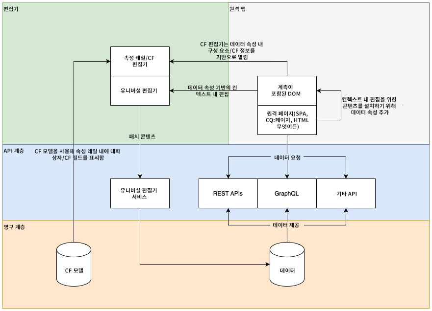
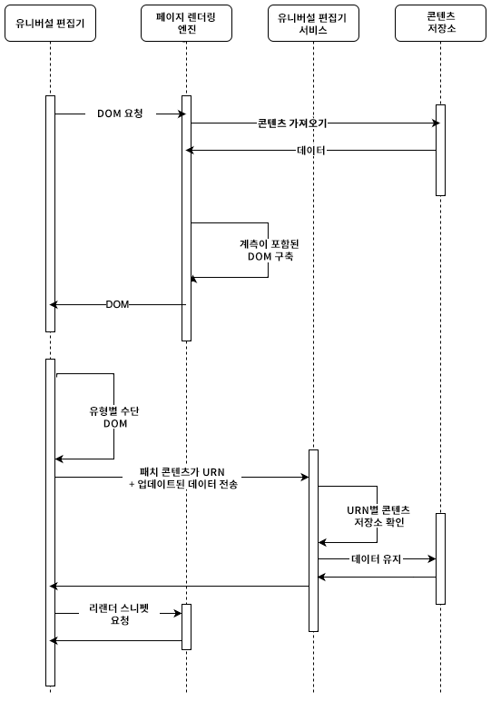
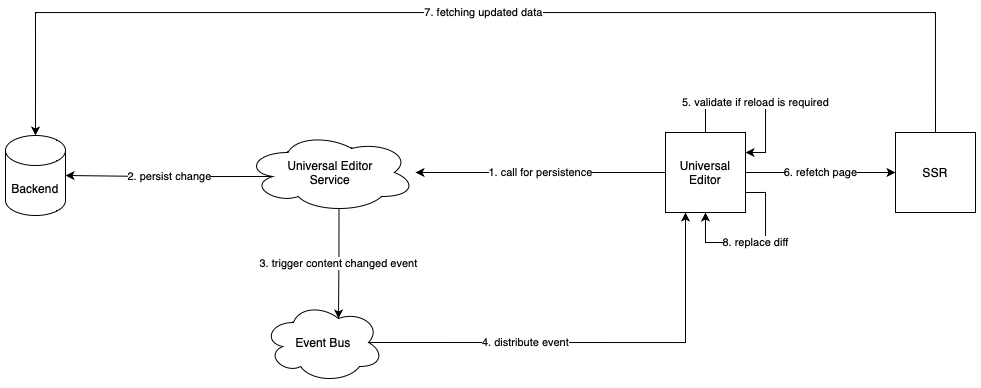
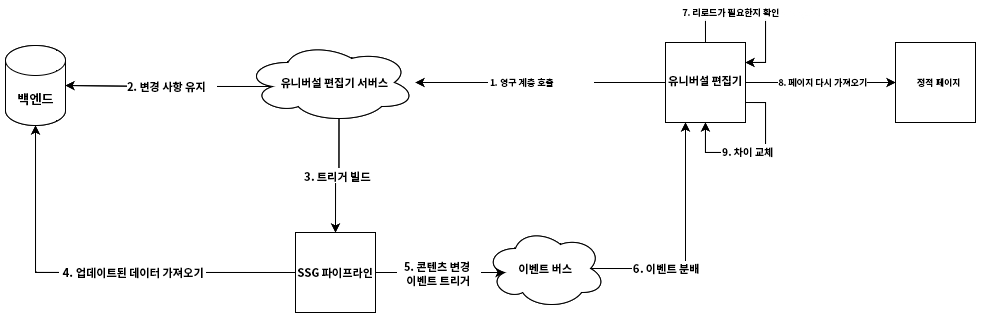
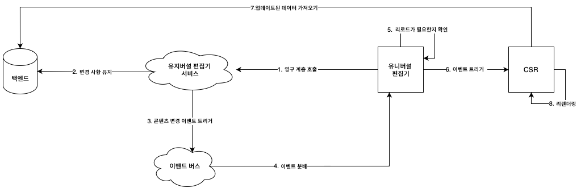

# Universal Editor 아키텍처 {#architecture}

Universal Editor의 아키텍처 및 해당 서비스와 계층 간에 데이터가 흐르는 방식에 대해 알아봅니다.

## 아키텍처 빌딩 블록 {#building-blocks}

콘텐츠 작성자는 Universal Editor를 구성하는 네 가지 필수 빌딩 블록의 상호 작용을 통해 모든 구현에서 콘텐츠의 모든 측면을 편집할 수 있기 때문에 뛰어난 경험을 제공하고, 콘텐츠 속도를 높이고, 최신 개발자 경험을 제공할 수 있습니다.

1. [편집기](#editors)
1. [원격 앱](#remote-app)
1. [API 레이어](#api-layer)
1. [지속성 레이어](#persistence-layer)

이 문서에서는 이러한 각 빌딩 블록과 이들이 데이터를 교환하는 방법에 대해 설명합니다.

>[!TIP]
>
>Universal Editor 및 해당 아키텍처가 작동하는 모습을 확인하려면 [AEM에서 Universal Editor 시작하기](getting-started.md) 문서를 참조하여 Universal Editor에 액세스하는 방법 및 이를 사용하기 위해 첫 번째 AEM 앱 계측을 시작하는 방법을 확인합니다.

### 편집기 {#editors}

* **Universal Editor** - Universal Editor는 계측된 DOM을 사용하여 콘텐츠의 내부 편집을 허용합니다. 필요한 메타데이터에 대한 자세한 내용은 [속성 및 유형](attributes-types.md)을 참조하십시오. AEM의 계측 예시는 [AEM에서 Universal Editor 시작하기](getting-started.md) 문서를 참조하십시오.
* **속성 레일** - 구성 요소의 일부 속성(예: 캐러셀의 회전 시간 또는 항상 열리거나 닫혀 있어야 하는 아코디언 탭 정보)은 컨텍스트 내에서 편집할 수 없습니다. 이러한 구성 요소 정보를 편집할 수 있도록 편집기의 측면 레일에 양식 기반 편집기가 제공됩니다.

### 원격 앱 {#remote-app}

Universal Editor에서 컨텍스트 내에서 앱을 편집할 수 있도록 하려면 DOM을 계측해야 합니다. 원격 앱은 DOM의 특정 속성을 렌더링해야 합니다. 필요한 메타데이터에 대한 자세한 내용은 [속성 및 유형](attributes-types.md)을 참조하십시오. AEM의 계측 예시는 [AEM에서 Universal Editor 시작하기](getting-started.md) 문서를 참조하십시오.

Universal Editor는 최소한의 SDK를 위해 노력하므로 계측은 원격 앱 구현의 책임입니다.

### API 레이어 {#api-layer}

* **콘텐츠 데이터** - Universal Editor의 경우 콘텐츠 데이터의 소스 시스템이나 소비 방식이 중요하지 않습니다. 상황에 맞는 편집 가능한 데이터를 사용하여 필수 속성을 정의하고 제공하는 것이 중요합니다.
* **지속 데이터** - 편집 가능한 각 데이터에는 URN 식별자가 있습니다. 이 URN은 지속성을 올바른 시스템 및 리소스로 라우팅하는 데 사용됩니다.

### 지속성 레이어 {#persistence-layer}

* **콘텐츠 조각 모델** - 콘텐츠 조각 속성 편집을 위한 레일을 지원하려면 콘텐츠 조각 편집기 및 양식 기반 편집기, 구성 요소별 모델 및 콘텐츠 조각이 필요합니다.
* **콘텐츠** - 콘텐츠는 AEM, Magento 등 어디에나 저장할 수 있습니다.

## Universal Editor 서비스 및 백엔드 시스템 디스패치 {#service}

Universal Editor는 모든 콘텐츠 변경 사항을 Universal Editor 서비스라는 중앙 집중식 서비스로 전달합니다. Adobe I/O Runtime에서 실행되는 이 서비스는 제공된 URN을 기반으로 확장 레지스트리에서 사용 가능한 플러그인을 로드합니다. 플러그인은 백엔드와 통신하고 통합 응답을 반환하는 역할을 합니다.

## 파이프라인 렌더링 {#rendering-pipelines}

### 서버측 렌더링 {#server-side}

### 정적 사이트 생성 {#static-generation}

### 클라이언트측 렌더링 {#client-side}

## 추가 리소스 {#additional-resources}

Universal Editor에 대해 자세히 알아보려면 다음 문서를 참조하십시오.

* [Universal Editor 소개](introduction.md) - Universal Editor를 통해 모든 구현에서 콘텐츠의 모든 측면을 편집하여 뛰어난 경험을 제공하고, 콘텐츠 속도를 높이고, 최신 개발자 경험을 제공하는 방법에 대해 알아봅니다.
* [Universal Editor로 콘텐츠 작성](authoring.md) - 콘텐츠 작성자가 Universal Editor를 사용하여 콘텐츠를 만드는 것이 얼마나 쉽고 직관적인지 알아봅니다.
* [Universal Editor로 콘텐츠 게시](publishing.md) - Universal Editor에서 콘텐츠를 게시하는 방법과 앱에서 게시된 콘텐츠를 처리하는 방법에 대해 알아봅니다.
* [AEM에서 Universal Editor 시작하기](getting-started.md) - Universal Editor에 액세스하는 방법과 이를 사용하기 위해 첫 번째 AEM 앱 계측을 시작하는 방법을 알아봅니다.
* [속성 및 유형](attributes-types.md) - Universal Editor에 필요한 데이터 속성 및 유형에 대해 알아봅니다.
* [Universal Editor 인증](authentication.md) - Universal Editor의 인증 방법에 대해 알아봅니다.
