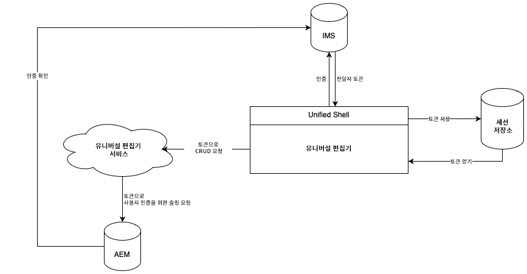

# Universal Editor 인증 {#authentication}

Universal Editor의 인증 방법을 알아봅니다.

{{universal-editor-status}}

## 옵션 {#options}

Universal Editor는 통합 셸을 통해 제공되는 Adobe의 Identity Management System(IMS) 인증을 사용합니다.

모든 애플리케이션/원격 페이지는 필수 백엔드 시스템에 대한 인증을 담당합니다. Universal Editor 서비스는 독립 실행형 서비스이므로 CRUD 작업을 수행하려면 백엔드 시스템에 대한 이 인증이 필요합니다.

## 표준 흐름 {#standard-flow}

AEM as a Cloud Service 및 IMS 사용 AMS에서 Universal Editor를 사용하기 위한 솔루션입니다.

Universal Editor를 사용하려면 사용자가 IMS에 대해 인증하는 통합 셸에 로그인해야 합니다. 제공된 IMS 토큰은 사용자 세션 저장소에 저장됩니다.

사용자가 CRUD 작업을 수행할 때마다 HTTP 헤더의 IMS 전달자 토큰과 함께 Universal Editor 서비스로 호출이 전송됩니다. 그런 다음 Universal Editor 서비스는 전달자 토큰을 사용해 AEM 백엔드 시스템에 대한 요청을 인증하여 사용자 이름으로 작업을 실행합니다.

## 추가 리소스 {#additional-resources}

Universal Editor에 대해 자세히 알아보려면 다음 문서를 참조하십시오.

* [Universal Editor 소개](introduction.md) - Universal Editor를 통해 모든 구현에서 콘텐츠의 모든 측면을 편집하여 뛰어난 경험을 제공하고, 콘텐츠 속도를 높이고, 최신 개발자 경험을 제공하는 방법에 대해 알아봅니다.
* [Universal Editor로 콘텐츠 작성](authoring.md) - 콘텐츠 작성자가 Universal Editor를 사용하여 콘텐츠를 만드는 것이 얼마나 쉽고 직관적인지 알아봅니다.
* [유니버설 편집기로 콘텐츠 게시](publishing.md) - 유니버설 편집기에서 콘텐츠를 게시하는 방법과 앱에서 게시된 콘텐츠를 처리하는 방법에 대해 알아봅니다.
* [AEM에서 Universal Editor 시작하기](getting-started.md) - Universal Editor에 액세스하는 방법과 이를 사용하기 위해 첫 번째 AEM 앱 계측을 시작하는 방법을 알아봅니다.
* [Universal Editor 아키텍처](architecture.md) - Universal Editor의 아키텍처 및 해당 서비스와 계층 간에 데이터가 흐르는 방식에 대해 알아봅니다.
* [속성 및 유형](attributes-types.md) - Universal Editor에 필요한 데이터 속성 및 유형에 대해 알아봅니다.
