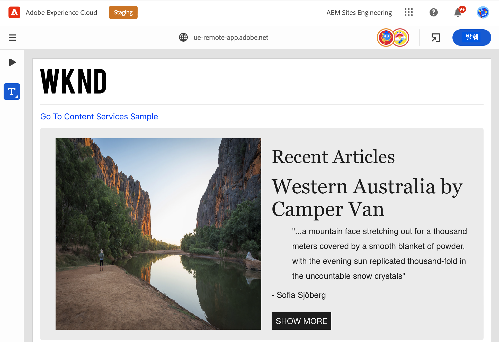
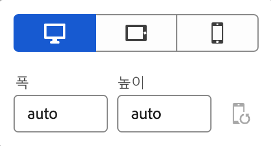
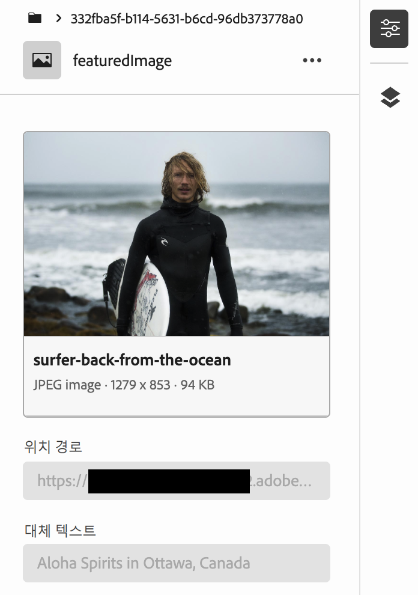
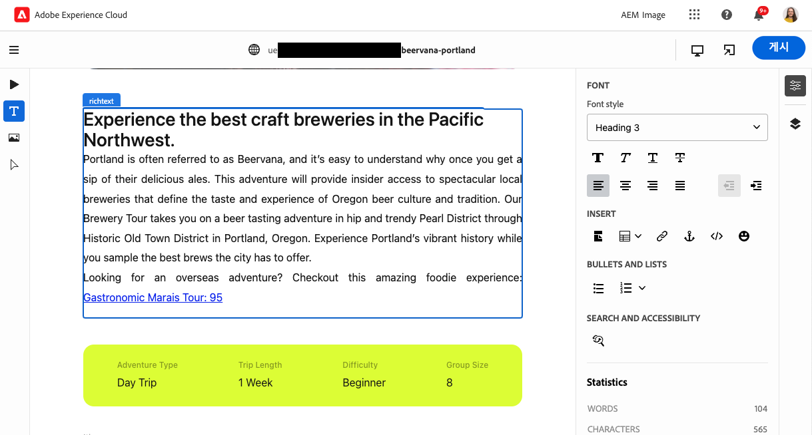

# Universal Editor로 콘텐츠 작성 {#authoring}

콘텐츠 작성자가 Universal Editor를 사용하여 얼마나 쉽고 직관적으로 콘텐츠를 만들 수 있는지 알아봅니다.

## 소개 {#introduction}

Universal Editor를 사용하면 모든 구현에서 콘텐츠의 모든 측면을 편집할 수 있기 때문에 뛰어난 경험을 제공하고, 콘텐츠 속도를 높이고, 최신 개발자 경험을 제공할 수 있습니다.

이를 위해 범용 편집기는 콘텐츠 작성자에게 콘텐츠 편집을 시작하고 바로 시작할 수 있는 최소 교육이 필요한 직관적인 UI를 제공합니다. 이 문서에서는 범용 편집기의 작성 환경에 대해 설명합니다.

>[!TIP]
>
>Universal Editor에 대한 자세한 소개는 [Universal Editor 소개](introduction.md) 문서를 참조하십시오.

>[!NOTE]
>
>유니버설 편집기는 아직 개발 중입니다. 현재 일부 컨텐츠 유형은 편집할 수 없습니다.

## 앱 준비 {#prepare-app}

Universal Editor로 앱의 콘텐츠를 작성하려면 개발자가 앱을 계측하여 편집기를 지원해야 합니다.

>[!TIP]
>
>Universal Editor와 함께 작동하도록 AEM 앱을 구성하는 방법에 대한 예는 [AEM에서 Universal Editor 시작](getting-started.md)을 참조하십시오.

## 로그인 {#sign-in}

Universal Editor와 함께 작동하도록 앱이 구성되었으면 Universal Editor에 로그인해야 합니다. 로그인하고 [Universal Editor에 액세스하려면](getting-started.md#request-access) Adobe ID가 필요합니다.

로그인한 후 편집할 페이지의 URL을 [위치 표시줄.](#location-bar) 따라서 다음과 같은 콘텐츠 편집을 시작할 수 있습니다. [텍스트 컨텐츠](#text-mode) 또는 [미디어 콘텐츠.](#media-mode)

## UI 이해 {#ui}

UI는 5개의 기본 영역으로 나뉩니다.

* [Experience Cloud 헤더](#experience-cloud-header)
* [Universal Editor 헤더](#universal-editor-header)
* [모드 레일](#mode-rail)
* [편집기](#editor)
* [구성 요소 레일](#component-rail)

### Experience Cloud 헤더 {#experience-cloud-header}

Experience Cloud 헤더는 항상 화면 상단에 있습니다. Experience Cloud 내의 위치를 알려 주고 다른 Experience Cloud 앱으로 이동할 수 있도록 도와주는 앵커입니다.

#### Experience Manager {#experience-manager}

헤더 왼쪽에 있는 Adobe Experience Cloud 링크를 선택해 Experience Manager 솔루션의 루트로 이동하여 [Cloud Manager,](/help/onboarding/cloud-manager-introduction.md) [Cloud Acceleration Manager,](/help/journey-migration/cloud-acceleration-manager/introduction/overview-cam.md) [Software Distribution](https://experienceleague.adobe.com/docs/experience-cloud/software-distribution/home.html) 등의 도구에 액세스합니다.

#### 조직 {#organization}

현재 로그인되어 있는 조직이 표시됩니다. Adobe ID가 여러 조직과 연결된 경우 탭하거나 클릭하여 다른 조직으로 전환합니다.

#### 솔루션 {#solutions}

솔루션 전환기를 탭하거나 클릭하면 다른 Experience Cloud 솔루션으로 빠르게 이동할 수 있습니다.

#### 도움말 {#help}

도움말 아이콘은 학습 및 지원 리소스에 대한 바로 가기를 제공합니다.

#### 알림 {#notifications}

이 아이콘에는 현재 할당된 불완전 [알림](/help/implementing/cloud-manager/notifications.md) 수가 배지로 지정됩니다.

#### 사용자 속성 {#user-properties}

사용자를 나타내는 아이콘을 탭하거나 클릭하여 사용자 설정에 액세스합니다. 사용자 사진을 구성하지 않은 경우, 아이콘이 임의로 할당됩니다.

### Universal Editor 헤더 {#universal-editor-header}

Universal Editor 헤더는 항상 화면 상단의 [Experience Cloud 헤더 바로 아래에 있습니다.](#experience-cloud-header) 현재 페이지를 게시하고 편집할 다른 페이지에 바로 갈 수 있습니다.

#### 햄버거 메뉴 {#hamburger-menu}

햄버거 메뉴는 아직 구현되지 않았습니다.

#### 위치 표시줄 {#location-bar}

위치 표시줄에 편집 중인 페이지의 주소가 표시됩니다. 편집할 다른 페이지의 주소를 입력하려면 탭하거나 클릭합니다.

>[!TIP]
>
>단축키 `L`을 사용하여 주소 표시줄을 엽니다.

>[!NOTE]
>
>Universal Editor로 편집하려는 모든 페이지는 [Universal Editor를 지원하도록 구성](getting-started.md)되어야 합니다.

#### 에뮬레이터 설정 {#emulator}

에뮬레이션 아이콘을 탭하거나 클릭하여 유니버설 편집기에서 페이지를 렌더링하는 방법을 정의합니다.

에뮬레이션 아이콘을 탭하거나 클릭하면 옵션이 표시됩니다.

기본적으로 편집기는 브라우저에서 자동으로 높이 및 너비를 정의하는 데스크탑 레이아웃으로 열립니다.

모바일 장치와 범용 편집기 내에서 에뮬레이션하도록 선택할 수도 있습니다.

* 방향 정의
* 폭 및 높이 정의
* 방향 변경

#### 앱 미리보기 열기 {#open-app-preview}

앱 미리보기 열기 아이콘을 탭하거나 클릭하면 현재 편집 중인 페이지가 자체 브라우저에서 열려 편집기 없이 변경 사항을 미리 볼 수 있습니다.

>[!TIP]
>
>단축키 사용 `O` (O자): 앱 미리 보기를 엽니다.

#### 게시 {#publish}

독자가 사용할 수 있도록 콘텐츠 변경 사항을 실시간으로 게시하려면 게시 버튼을 탭하거나 클릭합니다.

>[!TIP]
>
>Universal Editor로 게시하는 방법에 대한 자세한 내용은 [Universal Visual Editor로 콘텐츠 게시](publishing.md) 문서를 참조하십시오.

### 모드 레일 {#rail}

모드 레일은 항상 편집기의 왼쪽에 표시됩니다. 이를 통해 편집기를 다양한 편집 모드 간에 쉽게 전환할 수 있습니다.

#### 미리보기 모드 {#preview-mode}

미리보기 모드의 페이지는 게시된 서비스에 표시되는 것처럼 편집기에서 렌더링된 페이지입니다. 따라서 콘텐츠 작성자가 링크 등을 클릭하여 콘텐츠를 탐색할 수 있습니다.

>[!TIP]
>
>단축키 `P`를 사용하여 미리보기 모드로 전환합니다.

#### 텍스트 모드 {#text-mode}

텍스트 모드에서는 페이지가 편집기에서 렌더링되지만 콘텐츠 작성자는 를 클릭하여 편집할 텍스트 콘텐츠를 선택할 수 있습니다. 페이지가 로드될 때 편집기의 기본 모드입니다.

>[!TIP]
>
>단축키 사용 `T` 텍스트 모드로 전환합니다.

#### 미디어 모드 {#media-mode}

미디어 모드에서 페이지는 편집기에서 렌더링되지만 콘텐츠 작성자는 클릭하여 편집할 미디어 콘텐츠를 선택할 수 있습니다.

>[!TIP]
>
>단축키 사용 `M` 미디어 모드로 전환합니다.

#### 구성 요소 모드 {#component-mode}

구성 요소 모드에서 페이지는 편집기에서 렌더링되지만 콘텐츠 작성자는 를 클릭하여 페이지 구성 요소를 선택할 수 있습니다.

콘텐츠 조각을 선택하면 해당 조각의 세부 사항이 [구성 요소 레일.](#component-rail)

>[!TIP]
>
>단축키 사용 `C` 구성 요소 모드로 전환합니다.

#### 편집 {#edit}

다음 시기 [구성 요소 모드,](#component-mode) 콘텐츠 조각을 선택하면 편집 옵션이 모드 레일에 나타납니다.

편집 버튼을 탭하거나 클릭하면 새 탭에서 콘텐츠 조각 편집기가 열리고, 범용 편집기 내에서 참조된 콘텐츠와 텍스트 및 미디어 콘텐츠를 편집할 수 있습니다.

>[!TIP]
>
>단축키 사용 `E` 을 눌러 선택한 구성 요소를 편집합니다.

### 편집기 {#editor}

편집기는 창의 대부분을 차지하며 페이지가 지정된 위치입니다. [위치 표시줄](#location-bar) 렌더링됩니다.

* 편집기가 다음과 같은 편집 모드에 있는 경우 [텍스트 모드](#text-mode) 또는 [미디어 모드,](#media-mode) 콘텐츠를 편집할 수 있으며 링크를 따라갈 수 없습니다.
* 편집기가 인 경우 [미리 보기 모드,](#preview-mode) 콘텐츠를 탐색할 수 있고 링크를 따라갈 수 있지만 콘텐츠를 편집할 수는 없습니다.

### 구성 요소 레일 {#component-rail}

구성 요소 레일은 항상 편집기의 왼쪽에 표시됩니다. 모드에 따라 콘텐츠 또는 페이지 콘텐츠의 계층에서 선택한 구성 요소에 대한 세부 정보가 표시될 수 있습니다.

#### 속성 모드 {#properties-mode}

속성 모드에서 레일에는 편집기에서 현재 선택한 구성 요소의 속성이 표시됩니다. 페이지가 로드될 때 구성 요소 레일의 기본 모드입니다.

선택한 구성 요소에 대한 세부 정보가 레일에 표시됩니다. 다음을 사용하여 콘텐츠 조각을 선택한 경우 [구성 요소 모드,](#component-mode) 구성 요소 레일에서 설정을 수정할 수 있습니다. 변경 사항은 범용 편집기에 의해 자동으로 저장됩니다.

일부 구성 요소에 표시할 수 있는 세부 정보가 있는 것은 아닙니다.

>[!TIP]
>
>단축키 사용 `D` 속성 모드로 전환합니다.

#### 컨텐츠 트리 모드 {#Content-tree-mode}

콘텐츠 트리 모드에서 레일은 페이지 콘텐츠의 계층 구조를 보여 줍니다.

콘텐츠 트리에서 항목을 선택하면 편집기가 해당 콘텐츠로 스크롤하여 선택합니다.

>[!TIP]
>
>단축키 사용 `F` 컨텐츠 트리 모드로 전환합니다.

## 콘텐츠 편집 {#editing-content}

콘텐츠 편집은 간단하고 직관적입니다. 편집 모드([텍스트 모드](#text-mode), [미디어 모드](#media-mode), 및 [구성 요소 모드](#component-mode)) 편집기의 콘텐츠 위로 마우스를 가져가면 편집 가능한 콘텐츠가 파란색 상자로 강조 표시됩니다.

파란색 상자에 있는 콘텐츠를 탭하거나 클릭하면 바로 편집기를 시작하여 변경할 수 있습니다. 변경 사항은 자동으로 저장됩니다.

편집 모드에서 콘텐츠를 탭하거나 클릭하면 편집할 콘텐츠가 선택됩니다. 링크를 이용하여 콘텐츠를 탐색하려면 [미리보기 모드](#preview-mode)로 전환합니다.

에 따라 [모드](#mode-rail) 을(를) 진행 중이고 선택한 컨텐츠를 선택한 경우 즉석 편집 옵션이 다를 수 있습니다.

또한 를 사용하여 콘텐츠에 대한 추가 속성을 검토할 수 있습니다. [구성 요소 레일.](#component-rail) 예를 들어 서식 있는 텍스트 구성 요소를 선택하는 경우 구성 요소 레일에서 서식 옵션을 편집할 수 있습니다.

## 콘텐츠 미리보기 {#previewing-content}

콘텐츠 편집을 마치면 콘텐츠를 탐색하여 다른 페이지의 콘텐츠에서 어떻게 보이는지 확인하고 싶은 경우가 많습니다. [미리보기 모드](#preview-mode)에서 링크를 클릭하여 독자처럼 콘텐츠를 탐색할 수 있습니다. 콘텐츠는 게시될 때 편집기에서 렌더링됩니다.

미리보기 모드에서 콘텐츠를 탭하거나 클릭하면 콘텐츠 독자에게 반응하는 것처럼 반응합니다. 편집할 컨텐츠를 선택하려면 와 같은 편집 모드로 전환합니다. [텍스트 모드](#text-mode) 또는 [미디어 모드입니다.](#media-mode)

## 추가 리소스 {#additional-resources}

Universal Editor에 대해 자세히 알아보려면 다음 문서를 참조하십시오.

* [Universal Editor 소개](introduction.md) - Universal Editor를 통해 모든 구현에서 콘텐츠의 모든 측면을 편집하여 뛰어난 경험을 제공하고, 콘텐츠 속도를 높이고, 최신 개발자 경험을 제공하는 방법에 대해 알아봅니다.
* [Universal Editor로 콘텐츠 게시](publishing.md) - Universal Visual Editor에서 콘텐츠를 게시하는 방법과 앱에서 게시된 콘텐츠를 처리하는 방법에 대해 알아봅니다.
* [AEM에서 Universal Editor 시작하기](getting-started.md) - Universal Editor에 액세스하는 방법과 이를 사용하기 위해 첫 번째 AEM 앱 계측을 시작하는 방법을 알아봅니다.
* [Universal Editor 아키텍처](architecture.md) - Universal Editor의 아키텍처 및 해당 서비스와 계층 간에 데이터가 흐르는 방식에 대해 알아봅니다.
* [속성 및 유형](attributes-types.md) - Universal Editor에 필요한 데이터 속성 및 유형에 대해 알아봅니다.
* [Universal Editor 인증](authentication.md) - Universal Editor의 인증 방법에 대해 알아봅니다.
