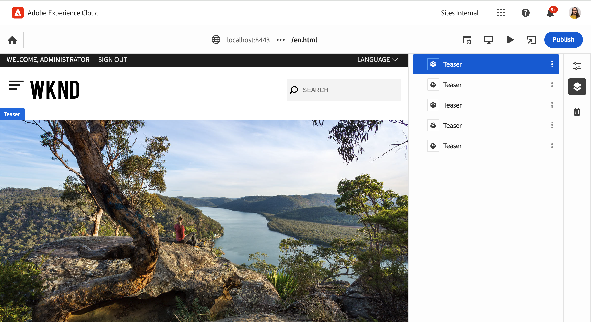
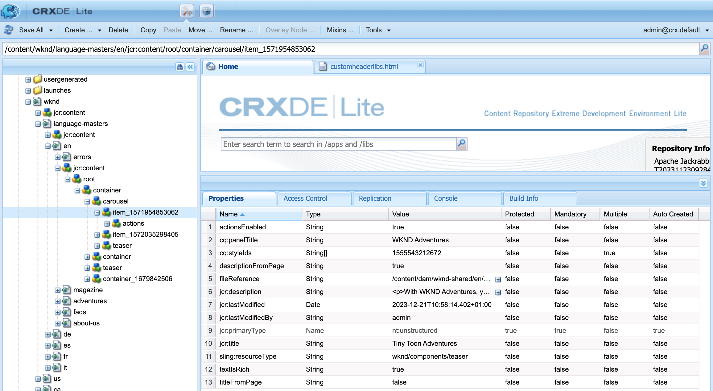

# AEM 개발자를 위한 범용 편집기 개요 {#developer-overview}

범용 편집기의 작동 방식과 프로젝트에서의 사용 방법에 관심이 있는 AEM 개발자를 위해, 이 문서는 WKND 프로젝트를 범용 편집기에서 작동하도록 계측하는 과정을 안내하여 포괄적인 소개를 제공합니다.

## 용도 {#purpose}

이 문서는 개발자에게 범용 편집기의 기능과 애플리케이션을 범용 편집기와 함께 작동하도록 계측하는 방법을 소개합니다.

대부분의 AEM 개발자에게 익숙한 표준 예시인 핵심 구성 요소와 WKND 사이트를 사용하여 범용 편집기를 사용하여 편집할 수 있도록 몇 가지 예시 구성 요소를 계측합니다.

>[!TIP]
>
>이 문서는 범용 편집기의 작동 방식을 설명하기 위해 추가 단계를 거치며, 개발자의 편집기에 대한 이해를 심화하는 것을 목표로 합니다. 따라서 앱을 계측하는 가장 직접적인 방법 대신, 범용 편집기와 그 작동 방식을 가장 잘 보여주는 방법을 제시합니다.
>
>가능한 한 빨리 시작하려면 [AEM에서 범용 편집기 시작하기](/help/implementing/universal-editor/getting-started.md) 문서를 참조하십시오.

## 사전 요구 사항 {#prerequisites}

이 개요를 따라가려면 다음 사항을 사용할 수 있어야 합니다.

* [AEM as a Cloud Service의 로컬 개발 인스턴스](https://experienceleague.adobe.com/docs/experience-cloud/software-distribution/home.html)
   * 로컬 개발 인스턴스는 [`localhost`에서 개발 목적으로 HTTPS로 구성](https://experienceleague.adobe.com/docs/experience-manager-learn/foundation/security/use-the-ssl-wizard.html)되어야 합니다.
   * [WKND 데모 사이트가 설치되어 있어야 합니다](https://github.com/adobe/aem-guides-wknd).
* [범용 편집기에 대한 액세스 권한](/help/implementing/universal-editor/getting-started.md#onboarding)
* 개발 목적으로 실행되는 [로컬 범용 편집기 서비스](/help/implementing/universal-editor/local-dev.md)
   * 브라우저가 [로컬 서비스의 자체 서명된 인증서를 수락](/help/implementing/universal-editor/local-dev.md#editing)하도록 설정해야 합니다.

이 문서는 웹 개발에 대한 일반적인 이해를 넘어 AEM 개발에 대한 기본적인 이해를 전제로 합니다. AEM 개발 경험이 부족하다면 [계속 진행하기 전에 WKND 튜토리얼](/help/implementing/developing/introduction/develop-wknd-tutorial.md)을 검토하는 것이 좋습니다.

## AEM 시작 및 범용 편집기에 로그인 {#sign-in}

아직 AEM 인스턴스를 시작하지 않았다면 [사전 요구 사항에 자세히 설명된 대로](#prerequisites) WKND가 설치되고 HTTPS가 활성화된 상태에서 로컬 AEM 개발 인스턴스를 실행해야 합니다. 이 개요에서는 인스턴스가 `https://localhost:8443`에서 실행 중이라고 가정합니다.

1. AEM 편집기에서 기본 WKND 영어 언어 마스터 페이지를 엽니다.

   ```text
   https://localhost:8443/editor.html/content/wknd/language-masters/en.html
   ```

1. 편집기의 **페이지 정보** 메뉴에서 **게시됨으로 보기**&#x200B;를 선택합니다. 이렇게 하면 AEM 편집기가 비활성화된 상태에서 새 탭에서 동일한 페이지가 열립니다.

   ```text
   https://localhost:8443/content/wknd/language-masters/en.html?wcmmode=disabled
   ```

1. 이 링크를 복사합니다.

1. 이제 범용 편집기에 로그인합니다.

   ```text
   https://experience.adobe.com/#/aem/editor
   ```

1. 이전에 복사한 WKND 콘텐츠의 링크를 범용 편집기의 **사이트 URL** 필드에 붙여넣고 **열기**&#x200B;를 클릭합니다.

   

## 범용 편집기가 콘텐츠 로드를 시도합니다. {#sameorigin}

범용 편집기는 편집할 콘텐츠를 프레임으로 로드합니다. AEM의 기본 X-프레임 옵션 설정은 이를 방지하므로, 로컬 WKND 사본을 로드하려고 할 때 브라우저에 오류가 명확하게 표시되고 콘솔 출력에 자세히 표시됩니다.


X-프레임 옵션 `sameorigin`은 AEM 페이지가 프레임 내에서 렌더링되지 않도록 합니다. 페이지를 범용 편집기에 로드하려면 이 헤더를 제거해야 합니다.

1. 구성 관리자를 엽니다.

   ```text
   https://localhost:8443/system/console/configMgr
   ```

1. OSGi 구성 `org.apache.sling.engine.impl.SlingMainServlet`을 편집합니다.

   

1. **추가 응답 헤더 속성**&#x200B;에서 `X-Frame-Options=SAMEORIGIN` 속성을 삭제합니다.

1. 변경 사항을 저장합니다.

이제 범용 편집기를 다시 로드하면 AEM 페이지가 로드되는 것을 볼 수 있습니다.

>[!TIP]
>
>* 이 OSGi 구성에 대한 자세한 내용은 [AEM에서 범용 편집기 시작하기](/help/implementing/universal-editor/getting-started.md#sameorigin) 문서를 참조하십시오.
>* AEM의 OSGi에 대한 자세한 내용은 [Adobe Experience Manager as a Cloud Service용 OSGi 구성](/help/implementing/deploying/configuring-osgi.md) 문서를 참조하십시오.

## Same Site 쿠키 처리 {#samesite-cookies}

범용 편집기가 페이지를 로드하면 변경 사항을 적용할 수 있는 권한이 있는지 확인하기 위해 AEM 로그인 페이지로 이동됩니다.

그러나 로그인할 수 없습니다. 브라우저 콘솔을 표시하면 브라우저가 프레임에 대한 입력을 차단했음을 확인할 수 있습니다.


로그인 토큰 쿠키는 서드파티 도메인으로 AEM에 전송됩니다. 따라서 AEM에서 동일 사이트 쿠키를 허용해야 합니다.

1. 구성 관리자를 엽니다.

   ```text
   https://localhost:8443/system/console/configMgr
   ```

1. OSGi 구성 `com.day.crx.security.token.impl.impl.TokenAuthenticationHandler`을 편집합니다.

   

1. **로그인 토큰 쿠키의 SameSite 속성**&#x200B;을 `None`으로 변경합니다.

1. 변경 사항을 저장합니다.

이제 범용 편집기를 다시 로드하면 AEM에 성공적으로 로그인할 수 있으며 대상 페이지가 로드됩니다.

>[!TIP]
>
>* 이 OSGi 구성에 대한 자세한 내용은 [AEM에서 범용 편집기 시작하기](/help/implementing/universal-editor/getting-started.md#samesite-cookies) 문서를 참조하십시오.
>* AEM의 OSGi에 대한 자세한 내용은 [Adobe Experience Manager as a Cloud Service용 OSGi 구성](/help/implementing/deploying/configuring-osgi.md) 문서를 참조하십시오.

## 범용 편집기가 원격 프레임에 연결됩니다. {#ue-connect-remote-frame}

페이지가 범용 편집기에서 로드되고 AEM에 로그인하면 범용 편집기가 원격 프레임에 연결을 시도합니다. 이는 원격 프레임에 로드되어야 하는 JavaScript 라이브러리를 통해 수행됩니다. JavaScript 라이브러리가 없으면 결국 페이지가 콘솔에 타임아웃 오류를 발생시킵니다.


WKND 앱의 페이지 구성 요소에 필요한 JavaScript 라이브러리를 추가해야 합니다.

1. CRXDE Lite를 엽니다.

   ```text
   https://localhost:8443/crx/de
   ```

1. `/apps/wknd/components/page` 아래에 있는 `customheaderlibs.html` 파일을 편집합니다.

   

1. JavaScript 라이브러리를 파일 끝에 추가합니다.

   ```html
   <script src="https://universal-editor-service.adobe.io/cors.js" async></script>
   ```

1. **모두 저장**&#x200B;을 클릭한 다음 범용 편집기를 다시 로드합니다.

이제 페이지가 적절한 JavaScript 라이브러리와 함께 로드되어 범용 편집기가 페이지에 연결할 수 있게 되고 콘솔에 더 이상 시간 초과 오류가 나타나지 않습니다.

>[!TIP]
>
>* 라이브러리는 헤더 또는 푸터에 로드될 수 있습니다.

>[!NOTE]
>
>이전에 권장되었던 JavaScript 라이브러리 포함 방법인 `<script src="https://universal-editor-service.experiencecloud.live/corslib/LATEST"></script>` 또는 npmjs.com을 통한 방법은 패키지가 더 이상 사용되지 않으므로 더 이상 권장되지 않습니다.
>
>앱에서 더 이상 사용되지 않는 패키지를 계속 사용하는 경우 범용 편집기는 UI에 오래된 패키지가 감지되었다는 경고를 표시합니다.

## 변경 사항을 유지하기 위한 연결 정의 {#connection}

이제 WKND 페이지가 범용 편집기에서 성공적으로 로드되고 JavaScript 라이브러리가 로드되어 편집기를 앱에 연결합니다.

그러나 범용 편집기에서 페이지와 상호 작용할 수 없습니다. 범용 편집기는 실제로 페이지를 편집할 수 없습니다. 범용 편집기가 콘텐츠를 편집할 수 있으려면 콘텐츠를 어디에 작성해야 하는지 알 수 있도록 연결을 정의해야 합니다. 로컬 개발의 경우 `https://localhost:8443`에 있는 로컬 AEM 개발 인스턴스에 다시 작성해야 합니다.

1. CRXDE Lite를 엽니다.

   ```text
   https://localhost:8443/crx/de
   ```

1. `/apps/wknd/components/page` 아래에 있는 `customheaderlibs.html` 파일을 편집합니다.

   

1. 로컬 AEM 인스턴스에 대한 연결에 필요한 메타데이터를 파일 끝에 추가합니다.

   ```html
   <meta name="urn:adobe:aue:system:aem" content="aem:https://localhost:8443">
   ```

   * 항상 최신 버전의 라이브러리를 사용하는 것이 좋습니다. 이전 버전이 필요한 경우 [AEM에서 범용 편집기 시작하기](/help/implementing/universal-editor/getting-started.md#alternative) 문서를 참조하십시오.

1. 로컬 범용 편집기 서비스에 대한 연결에 필요한 메타데이터를 파일 끝에 추가합니다.

   ```html
   <meta name="urn:adobe:aue:config:service" content="https://localhost:8000">
   ```

1. **모두 저장**&#x200B;을 클릭한 다음 범용 편집기를 다시 로드합니다.

이제 범용 편집기는 로컬 AEM 개발 인스턴스에서 콘텐츠를 성공적으로 로드할 수 있을 뿐만 아니라 로컬 범용 편집기 서비스를 사용하여 변경한 모든 내용을 유지해야 하는 위치도 알게 됩니다. 이는 범용 편집기로 편집할 수 있도록 앱을 계측하는 첫 번째 단계입니다.

>[!TIP]
>
>* 연결 메타데이터에 대한 자세한 내용은 [AEM에서 범용 편집기 시작하기](/help/implementing/universal-editor/getting-started.md#connection) 문서를 참조하십시오.
>* 범용 편집기의 구조에 대한 자세한 내용은 [범용 편집기 아키텍처](/help/implementing/universal-editor/architecture.md#service) 문서를 참조하십시오.
>* 자체 호스팅되는 범용 편집기 버전에 연결하는 방법에 대한 자세한 내용은[ 범용 편집기를 사용하는 로컬 AEM 개발](/help/implementing/universal-editor/local-dev.md) 문서를 참조하십시오.

## 구성 요소 계측 {#instrumenting-components}

그러나 범용 편집기로 할 수 있는 작업은 여전히 거의 없습니다. 범용 편집기에서 WKND 페이지 상단의 티저(또는 페이지의 다른 항목)를 클릭하려고 하면 실제로 선택할 수 없습니다.

구성 요소도 범용 편집기로 편집할 수 있도록 계측해야 합니다. 이렇게 하려면 티저 구성 요소를 편집해야 합니다. 따라서 핵심 구성 요소가 변경 불가능한 `/libs`에 있으므로 핵심 구성 요소를 오버레이해야 합니다.

1. CRXDE Lite를 엽니다.

   ```text
   https://localhost:8443/crx/de
   ```

1. `/libs/core/wcm/components` 노드를 선택하고 툴바에서 **노드 오버레이**&#x200B;를 클릭합니다.

1. `/apps/`를 **오버레이 위치**&#x200B;로 선택하고 **확인**&#x200B;을 클릭합니다.

   

1. 도구 모음에서 `/libs/core/wcm/components` 아래의 `teaser` 노드를 선택하고 **복사**&#x200B;를 클릭합니다.

1. `/apps/core/wcm/components`에 있는 오버레이된 노드를 선택하고 도구 모음에서 **붙여넣기**&#x200B;를 클릭합니다.

1. `/apps/core/wcm/components/teaser/v2/teaser/teaser.html` 파일을 더블 클릭하여 편집합니다.

   

1. 대략 26행에 있는 첫 번째 `div` 끝에 구성 요소에 대한 계측 세부 사항을 추가합니다.

   ```text
   data-aue-resource="urn:aem:${resource.path}"
   data-aue-type="component"
   data-aue-label="Teaser"
   ```

1. 도구 모음에서 **모두 저장**&#x200B;을 클릭하고 범용 편집기를 다시 로드합니다.

1. 범용 편집기에서 페이지 상단의 티저 구성 요소를 클릭하고 이제 해당 구성 요소를 선택할 수 있는지 확인합니다.

1. 범용 편집기의 속성 패널에서 **콘텐츠 트리** 아이콘을 클릭하면 이제 계측했으므로 편집기가 페이지에 있는 모든 티저를 인식했음을 확인할 수 있습니다. 선택한 티저가 강조 표시됩니다.

   

>[!TIP]
>
>노드 오버레이에 대한 자세한 내용은 [Adobe Experience Manager as a Cloud Service에서 Sling 리소스 병합 사용](/help/implementing/developing/introduction/sling-resource-merger.md) 문서를 참조하십시오.

## 티저의 하위 구성 요소 계측 {#subcomponents}

이제 티저를 선택할 수 있지만 아직 편집할 수는 없습니다. 이는 티저가 이미지 및 제목 등과 같은 여러 구성 요소로 구성되어 있기 때문입니다. 편집하려면 이러한 하위 구성 요소를 계측해야 합니다.

1. CRXDE Lite를 엽니다.

   ```text
   https://localhost:8443/crx/de
   ```

1. `/apps/core/wcm/components/teaser/v2/teaser/` 노드를 선택하고 `title.html` 파일을 더블 클릭합니다.

   

1. `h2` 태그 끝(17행 근처)에 다음 속성을 삽입합니다.

   ```text
   data-aue-prop="jcr:title"
   data-aue-type="text"
   data-aue-label="Title"
   ```

1. 도구 모음에서 **모두 저장**&#x200B;을 클릭하고 범용 편집기를 다시 로드합니다.

1. 페이지 상단에 있는 동일한 티저 구성 요소의 제목을 클릭하고 이제 선택할 수 있는지 확인합니다. 콘텐츠 트리는 선택한 티저 구성 요소의 일부로 제목을 표시합니다.

   

이제 티저 구성 요소의 제목을 편집할 수 있습니다.

## 이 모든 것이 어떤 의미일까요? {#what-does-it-mean}

이제 티저의 제목을 편집할 수 있으므로 잠시 시간을 내어 어떤 작업을 수행했으며 어떻게 수행했는지 검토해 보십시오.

티저 구성 요소를 계측하여 범용 편집기에 식별했습니다.

* `data-aue-resource`는 편집 중인 AEM의 리소스를 식별합니다.
* `data-aue-type`는 항목을 페이지 구성 요소(컨테이너와 반대)로 처리해야 함을 정의합니다.
* `data-aue-label`은 선택한 티저에 대한 사용자 친화적인 레이블을 UI에 표시합니다.

또한 티저 구성 요소 내에서 제목 구성 요소를 계측했습니다.

* `data-aue-prop`은 작성된 JCR 속성입니다.
* `data-aue-type`는 속성을 편집해야 하는 방법입니다. 이 경우 제목이므로 텍스트 편집기(리치 텍스트 편집기와 반대)를 사용합니다.

## 인증 헤더 정의 {#auth-header}

이제 인라인에서 티저의 제목을 편집할 수 있으며 변경 사항이 브라우저에 유지됩니다.


그러나 브라우저를 다시 로드하면 이전 제목이 다시 로드됩니다. 이는 범용 편집기가 AEM 인스턴스에 연결하는 방법을 알더라도 JCR에 변경 내용을 다시 작성하기 위해 AEM 인스턴스에 인증할 수 없기 때문입니다.

브라우저 개발자 도구의 네트워크 탭을 표시하고 `update`를 검색하면 제목을 편집하려고 할 때 401 오류가 발생하는 것을 볼 수 있습니다.


범용 편집기를 사용하여 프로덕션 AEM 콘텐츠를 편집할 때 범용 편집기는 편집기에 로그인하는 데 사용한 것과 동일한 IMS 토큰을 사용하여 AEM에 인증하여 JCR에 다시 작성할 수 있도록 합니다.

로컬에서 개발할 때는 IMS 토큰이 Adobe 소유 도메인으로만 전달되므로 AEM ID 제공자를 사용할 수 없습니다. 인증 헤더를 명시적으로 설정하여 수동으로 인증 방법을 제공해야 합니다.

1. 범용 편집기 인터페이스에서 도구 모음의 **인증 헤더** 아이콘을 클릭합니다.

1. 로컬 AEM 인스턴스에 인증하는 데 필요한 인증 헤더를 복사하고 **저장**&#x200B;을 클릭합니다.

   

1. 범용 편집기를 다시 로드하고 이제 티저의 제목을 편집합니다.

브라우저 콘솔에 더 이상 오류가 보고되지 않으며 변경 사항이 로컬 AEM 개발 인스턴스에 다시 유지됩니다.

브라우저 개발자 도구에서 트래픽을 조사하고 `update` 이벤트를 찾아 업데이트에 대한 세부 사항을 볼 수 있습니다.


```json
{
  "connections": [
    {
      "name": "aem",
      "protocol": "aem",
      "uri": "https://localhost:8443"
    }
  ],
  "target": {
    "resource": "urn:aem:/content/wknd/language-masters/en/jcr:content/root/container/carousel/item_1571954853062",
    "type": "text",
    "prop": "jcr:title"
  },
  "value": "Tiny Toon Adventures"
}
```

* `connections`는 로컬 AEM 인스턴스에 대한 연결입니다.
* `target`은 JCR에서 업데이트되는 정확한 노드와 속성입니다.
* `value`는 사용자가 업데이트한 내용입니다.

JCR에서도 유지되는 변경 사항을 볼 수 있습니다.



>[!TIP]
>
>테스트 및 개발 목적에 필요한 인증 헤더를 생성하는 데 사용할 수 있는 많은 온라인 도구가 있습니다.
>
>기본 인증 헤더 예시인 `Basic YWRtaW46YWRtaW4=`는 로컬 AEM 개발에 일반적인 `admin:admin` 사용자/암호 조합을 위한 것입니다.

## 속성 패널용 앱 계측 {#properties-rail}

이제 범용 편집기를 사용하여 편집할 수 있도록 계측된 앱이 있습니다.

현재 편집은 티저 제목의 인라인 편집으로 제한됩니다. 그러나 즉각적인 편집만으로는 충분하지 않은 경우도 있습니다. 티저의 제목과 같은 텍스트는 키보드 입력을 통해 원하는 위치에서 편집할 수 있습니다. 그러나 더 복잡한 항목은 브라우저에서 렌더링되는 방식과 별도로 구조화된 데이터를 표시하고 편집할 수 있어야 합니다. 이것이 속성 패널의 용도입니다.

편집에 속성 패널을 사용하도록 앱을 업데이트하려면 앱의 페이지 구성 요소의 헤더 파일로 돌아갑니다. 이곳은 이미 로컬 AEM 개발 인스턴스와 로컬 범용 편집기 서비스에 대한 연결이 설정된 곳입니다. 여기에서 앱에서 편집 가능한 구성 요소와 해당 데이터 모델을 정의해야 합니다.

1. CRXDE Lite를 엽니다.

   ```text
   https://localhost:8443/crx/de
   ```

1. `/apps/wknd/components/page` 아래에 있는 `customheaderlibs.html` 파일을 편집합니다.

   

1. 파일 끝에 구성 요소를 정의하는 데 필요한 스크립트를 추가합니다.

   ```html
   <script type="application/vnd.adobe.aue.component+json">
   {
     "groups": [
       {
         "title": "General Components",
         "id": "general",
         "components": [
           {
             "title": "Teaser",
             "id": "teaser",
             "plugins": {
               "aem": {
                 "page": {
                   "resourceType": "wknd/components/teaser"
                 }
               }
             }
           },
           {
             "title": "Title",
             "id": "title",
             "plugins": {
               "aem": {
                 "page": {
                   "resourceType": "wknd/components/title"
                 }
               }
             }
           }
         ]
       }
     ]
   }
   </script>
   ```

1. 그 아래에 파일 끝에 모델을 정의하는 데 필요한 스크립트를 추가합니다.

   ```html
   <script type="application/vnd.adobe.aue.model+json">
   [
     {
       "id": "teaser",
       "fields": [
         {
           "component": "text-input",
           "name": "jcr:title",
           "label": "Title",
           "valueType": "string"
         },
         {
           "component": "text-area",
           "name": "jcr:description",
           "label": "Description",
           "valueType": "string"
         }
       ]
     },
     {
       "id": "title",
       "fields": [
         {
           "component": "select",
           "name": "type",
           "value": "h1",
           "label": "Type",
           "valueType": "string",
           "options": [
             { "name": "h1", "value": "h1" },
             { "name": "h2", "value": "h2" },
             { "name": "h3", "value": "h3" },
             { "name": "h4", "value": "h4" },
             { "name": "h5", "value": "h5" },
             { "name": "h6", "value": "h6" }
           ]
         }
       ]
     }
   ]
   </script>
   ```

1. 도구 모음에서 **모두 저장**&#x200B;을 클릭합니다.

## 이 모든 것이 어떤 의미일까요? {#what-does-it-mean-2}

속성 패널을 사용하여 편집할 수 있으려면 구성 요소를 `groups`에 할당해야 하므로 각 정의는 구성 요소를 포함하는 그룹 목록으로 시작됩니다.

* `title`은 그룹의 이름입니다.
* `id`는 그룹의 고유 식별자입니다. 이 경우 페이지 레이아웃을 위한 고급 구성 요소와 달리 페이지 콘텐츠를 구성하는 일반 구성 요소입니다.

각 그룹에는 `components` 배열이 있습니다.

* `title`은 구성 요소의 이름입니다.
* `id`는 구성 요소의 고유 식별자입니다. 이 경우 티저입니다.

각 구성 요소에는 구성 요소가 AEM에 매핑되는 방식을 정의하는 플러그인 정의가 있습니다.

* `aem`은 편집을 처리하는 플러그인입니다. 이는 구성 요소를 처리하는 서비스로 생각할 수 있습니다.
* `page`는 구성 요소의 종류를 정의합니다. 이 경우 표준 페이지 구성 요소의 종류를 정의합니다.
* `resourceType`는 실제 AEM 구성 요소에 대한 매핑입니다.

개별 편집 가능 필드를 정의하기 위해 각 구성 요소를 `model`에 매핑해야 합니다.

* `id`는 모델의 고유 식별자이며 구성 요소의 ID와 일치해야 합니다.
* `fields`는 개별 필드의 배열입니다.
* `component`는 텍스트 또는 텍스트 영역과 같은 입력 유형입니다.
* `name`은 필드가 매핑되는 JCR의 필드 이름입니다.
* `label`은 편집기 UI에 표시되는 필드에 대한 설명입니다.
* `valueType`는 데이터 유형입니다.

## 속성 패널용 구성 요소 계측 {#properties-rail-component}

또한 구성 요소 수준에서 구성 요소가 사용해야 하는 모델을 정의해야 합니다.

1. CRXDE Lite를 엽니다.

   ```text
   https://localhost:8443/crx/de
   ```

1. `/apps/core/wcm/components/teaser/v2/teaser/teaser.html` 파일을 더블 클릭하여 편집합니다.

   

1. 이전에 추가한 속성 뒤에 있는 대략 32행의 첫 번째 `div` 끝에 티저 구성 요소가 사용할 모델에 대한 계측 세부 사항을 추가합니다.

   ```text
   data-aue-model="teaser"
   ```

1. 도구 모음에서 **모두 저장**&#x200B;을 클릭하고 범용 편집기를 다시 로드합니다.

이제 구성 요소를 위해 계측된 속성 패널을 테스트할 준비가 되었습니다.

1. 범용 편집기에서 티저의 제목을 클릭하여 다시 편집할 수 있습니다.

1. 속성 패널을 클릭하여 속성 탭을 표시하고 방금 계측한 필드를 확인합니다.

   

이제 이전과 같이 인라인으로 또는 속성 패널에서 티저의 제목을 편집할 수 있습니다. 두 경우 모두 변경 사항이 로컬 AEM 개발 인스턴스에 영구적으로 저장됩니다.

## 속성 패널에 추가 필드 추가 {#add-fields}

이미 구현한 구성 요소의 데이터 모델 기본 구조를 사용하여 동일한 모델을 따라 추가 필드를 추가할 수 있습니다.

예를 들어 구성 요소의 스타일을 조정하는 필드를 추가할 수 있습니다.

1. CRXDE Lite를 엽니다.

   ```text
   https://localhost:8443/crx/de
   ```

1. `/apps/wknd/components/page` 아래에 있는 `customheaderlibs.html` 파일을 편집합니다.

   

1. 모델 정의 스크립트에서 스타일 필드에 대한 추가 항목을 `fields` 배열에 추가합니다. 새 항목을 삽입하기 전에 마지막 필드 뒤에 쉼표를 추가해야 합니다.

   ```json
   {
      "component": "select",
      "name": "cq:styleIds",
      "label": "Style",
      "valueType": "string",
        "multi": true,
      "options": [
        {"name": "hero", "value":"1555543212672"},
        {"name": "card", "value":"1605057868937"}
      ]
   }
   ```

1. 도구 모음에서 **모두 저장**&#x200B;을 클릭하고 범용 편집기를 다시 로드합니다.

1. 티저의 제목을 클릭하여 다시 편집할 수 있습니다.

1. 속성 패널을 클릭하고 구성 요소의 스타일을 조정하는 새 필드가 있는지 확인합니다.

   

구성 요소의 JCR에 있는 모든 필드는 이 방식으로 범용 편집기에 노출될 수 있습니다.

## 요약 {#summary}

축하합니다! 이제 범용 편집기와 함께 작동하도록 자체 AEM 앱을 계측할 수 있습니다.

자체 앱 계측을 시작할 때 이 예시에서 수행한 기본 단계를 염두에 두십시오.

1. [개발 환경을 설정했습니다](#prerequisites).
   * HTTPS에서 로컬로 실행되고 WKND가 설치된 AEM
   * HTTPS에서 로컬로 실행되는 범용 편집기 서비스
1. 콘텐츠를 원격으로 로드할 수 있도록 AEM의 OSGi 설정을 업데이트했습니다.
   * [`org.apache.sling.engine.impl.SlingMainServlet`](#sameorigin)
   * [`com.day.crx.security.token.impl.impl.TokenAuthenticationHandler`](#samesite-cookies)
1. [앱의 페이지 구성 요소에 있는 `customheaderlibs.html` 파일에 `universal-editor-embedded.js` 라이브러리를 추가했습니다](#ue-connect-remote-frame).
1. [앱의 페이지 구성 요소에 있는 `customheaderlibs.html` 파일에 변경 사항을 유지할 연결을 정의했습니다.](#connection)
   * 로컬 AEM 개발 인스턴스에 대한 연결을 정의했습니다.
   * 로컬 범용 편집기 서비스에 대한 연결도 정의했습니다.
1. [티저 구성 요소를 계측했습니다.](#instrumenting-components)
1. [티저의 하위 구성 요소를 계측했습니다.](#subcomponents)
1. [로컬 범용 편집기 서비스를 사용하여 변경 사항을 저장할 수 있도록 사용자 정의 인증 헤더를 정의했습니다.](#auth-header)
1. [속성 패널을 사용하도록 앱을 계측했습니다.](#properties-rail)
1. [속성 패널을 사용하도록 티저 구성 요소를 계측했습니다.](#properties-rail-component)

이와 동일한 단계를 수행하여 범용 편집기에서 사용하도록 자체 앱을 계측할 수 있습니다. JCR의 모든 속성을 범용 편집기에 노출할 수 있습니다.

## 추가 리소스 {#additional-resources}

범용 편집기 기능에 대한 자세한 내용은 다음 문서를 참조하십시오.

* 가능한 한 빨리 시작하려면 [AEM에서 범용 편집기 시작하기](/help/implementing/universal-editor/getting-started.md) 문서를 참조하십시오.
* 필요한 OSGi 구성에 대한 자세한 내용은 [AEM에서 범용 편집기 시작하기](/help/implementing/universal-editor/getting-started.md#sameorigin) 문서를 참조하십시오.
* 연결 메타데이터에 대한 자세한 내용은 [AEM에서 범용 편집기 시작하기](/help/implementing/universal-editor/getting-started.md#connection) 문서를 참조하십시오.
* 범용 편집기의 구조에 대한 자세한 내용은 [범용 편집기 아키텍처](/help/implementing/universal-editor/architecture.md#service) 문서를 참조하십시오.
* 자체 호스팅되는 범용 편집기 버전에 연결하는 방법에 대한 자세한 내용은[ 범용 편집기를 사용하는 로컬 AEM 개발](/help/implementing/universal-editor/local-dev.md) 문서를 참조하십시오.
* 노드 오버레이에 대한 자세한 내용은 [Adobe Experience Manager as a Cloud Service에서 Sling 리소스 병합 사용](/help/implementing/developing/introduction/sling-resource-merger.md) 문서를 참조하십시오.

