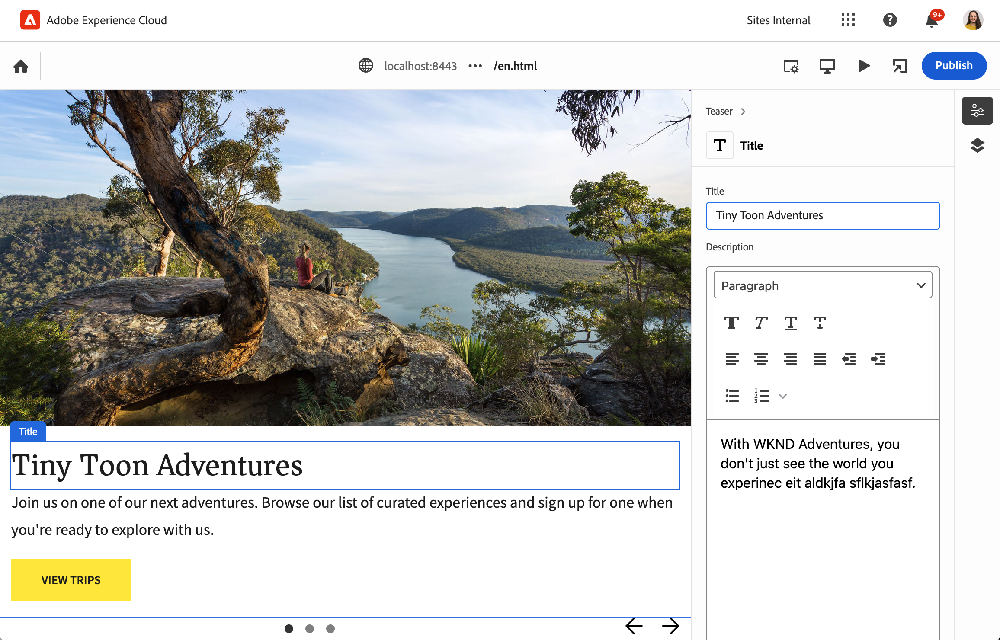

# AEM 개발자를 위한 유니버설 편집기 개요 {#developer-overview}

범용 편집기의 작동 방식과 프로젝트에서 사용하는 방법에 관심이 있는 AEM 개발자인 경우, 이 문서는 범용 편집기에서 작동하도록 WKND 프로젝트를 계측하여 전체적인 소개를 제공합니다.

{{universal-editor-status}}

## 용도 {#purpose}

이 문서는 유니버설 편집기의 작동 방식과 응용 프로그램을 사용하여 작업하는 방법을 모두 소개하는 개발자의 역할을 합니다.

대부분의 AEM 개발자가 익숙한 표준 예인 핵심 구성 요소와 WKND 사이트를 통해 이 작업을 수행할 수 있으며, 범용 편집기를 사용하여 편집할 수 있는 몇 가지 예제 구성 요소를 제공합니다.

>[!TIP]
>
>이 문서는 유니버설 편집기의 작동 방식을 보여 주는 추가 단계를 수행하며, 개발자의 편집기에 대한 이해를 강화하기 위한 것입니다. 따라서 앱을 계측하는 데 가장 직접적인 경로를 사용하지 않지만, 범용 편집기와 작동 방식에 대한 가장 실례가 되는 정보를 제공합니다.
>
>가능한 한 빨리 시작하고 실행하려면 다음을 참조하십시오. [AEM에서 유니버설 편집기 시작하기](/help/implementing/universal-editor/getting-started.md) 문서.

## 사전 요구 사항 {#prerequisites}

이 개요를 따라 진행하려면 다음을 사용할 수 있어야 합니다.

* [AEM as a Cloud Service의 로컬 개발 인스턴스](https://experienceleague.adobe.com/docs/experience-cloud/software-distribution/home.html)
   * 로컬 개발 인스턴스는 [에서 개발 목적으로 HTTPS로 구성됨 `localhost`.](https://experienceleague.adobe.com/docs/experience-manager-learn/foundation/security/use-the-ssl-wizard.html)
   * [WKND 데모 사이트를 설치해야 합니다.](https://github.com/adobe/aem-guides-wknd)
* [유니버설 편집기에 액세스](/help/implementing/universal-editor/getting-started.md#onboarding)
* [로컬 유니버설 편집기 서비스](/help/implementing/universal-editor/local-dev.md) 개발 목적으로 실행

웹 개발에 대한 일반적인 익숙함을 넘어, 이 문서는 AEM 개발에 대한 기본적인 익숙함을 전제로 합니다. AEM 개발에 경험이 없는 경우 검토를 고려하십시오 [계속하기 전에 WKND 튜토리얼을 참조하십시오.](/help/implementing/developing/introduction/develop-wknd-tutorial.md)

## AEM을 시작하고 유니버설 편집기에 로그인 {#sign-in}

아직 실행하지 않았다면 로컬 AEM 개발 인스턴스를 WKND로 설치하고 HTTPS를 (으)로 활성화해야 합니다 [사전 요구 사항에 자세히 설명되어 있습니다.](#prerequisites) 이 개요는에서 인스턴스가 실행 중이라고 가정합니다. `https://localhost:8443`.

1. AEM 편집기에서 기본 WKND 영어 언어 마스터 페이지를 엽니다.

   ```text
   https://localhost:8443/editor.html/content/wknd/language-masters/en.html
   ```

1. 다음에서 **페이지 정보** 편집기의 메뉴, 선택 **게시됨으로 보기**. 그러면 AEM 편집기가 비활성화된 새 탭에서 동일한 페이지가 열립니다.

   ```text
   https://localhost:8443/content/wknd/language-masters/en.html?wcmmode=disabled
   ```

1. 이 링크를 복사합니다.

1. 이제 범용 편집기에 로그인합니다.

   ```text
   https://experience.adobe.com/#/aem/editor
   ```

1. 이전에 WKND 컨텐츠를 복사한 링크를 **사이트 URL** 유니버설 편집기의 필드 및 클릭 **열기**.

   

## 유니버설 편집기가 콘텐츠 로드를 시도합니다. {#sameorigin}

범용 편집기는 프레임에서 편집할 콘텐츠를 로드합니다. X-Frame 옵션에 대한 AEM 기본 설정으로 인해 이러한 문제가 발생하지 않습니다. WKND의 로컬 복사본을 로드하려고 하면 브라우저에서 오류로 명확하게 표시되고 콘솔 출력에 자세히 표시됩니다.


X-Frame 옵션 `sameorigin` 프레임 내에서 AEM 페이지를 렌더링하지 않습니다. 페이지가 유니버설 편집기에서 로드되도록 하려면 이 헤더를 제거해야 합니다.

1. 구성 관리자를 엽니다.

   ```text
   https://localhost:8443/system/console/configMgr
   ```

1. OSGi 구성 편집 `org.apache.sling.engine.impl.SlingMainServlet`

   

1. 속성 삭제 `X-Frame-Options=SAMEORIGIN` 속성 중 **추가 응답 헤더**.

1. 변경 사항을 저장합니다.

이제 범용 편집기를 다시 로드하면 AEM 페이지가 로드됩니다.

>[!TIP]
>
>* 문서 보기 [AEM에서 유니버설 편집기 시작하기](/help/implementing/universal-editor/getting-started.md#sameorigin) 이 OSGi 구성에 대한 자세한 내용은 을 참조하십시오.
>* 문서 보기 [Adobe Experience Manager as a Cloud Service에 대한 OSGi 구성](/help/implementing/deploying/configuring-osgi.md) AEM의 OSGi에 대한 자세한 내용.

## 동일한 사이트 쿠키 처리 {#samesite-cookies}

범용 편집기가 페이지를 로드하면 AEM 로그인 페이지에 로드되어 사용자가 변경 작업을 수행하도록 인증되었는지 확인합니다.

그러나 로그인할 수 없습니다. 브라우저 콘솔을 표시하면 브라우저에서 프레임에 대한 입력을 차단한 것을 볼 수 있습니다


로그인 토큰 쿠키는 타사 도메인으로 AEM에 전송됩니다. 따라서 AEM에서 동일한 사이트 쿠키를 허용해야 합니다.

1. 구성 관리자를 엽니다.

   ```text
   https://localhost:8443/system/console/configMgr
   ```

1. OSGi 구성 편집 `com.day.crx.security.token.impl.impl.TokenAuthenticationHandler`

   

1. 속성 변경 **로그인 토큰 쿠키에 대한 SameSite 속성** 끝 `None`.

1. 변경 사항을 저장합니다.

이제 범용 편집기를 다시 로드하면 AEM에 성공적으로 로그인하고 대상 페이지가 로드됩니다.

>[!TIP]
>
>* 문서 보기 [AEM에서 유니버설 편집기 시작하기](/help/implementing/universal-editor/getting-started.md#samesite-cookies) 이 OSGi 구성에 대한 자세한 내용은 을 참조하십시오.
>* 문서 보기 [Adobe Experience Manager as a Cloud Service에 대한 OSGi 구성](/help/implementing/deploying/configuring-osgi.md) AEM의 OSGi에 대한 자세한 내용.

## 범용 편집기가 원격 프레임에 연결 {#ue-connect-remote-frame}

범용 편집기에 페이지가 로드되고 사용자가 AEM에 로그인한 경우 범용 편집기는 원격 프레임에 연결을 시도합니다. 이 작업은 원격 프레임에 로드해야 하는 JavaScript 라이브러리를 통해 수행됩니다. JavaScript 라이브러리가 없으면 페이지는 궁극적으로 콘솔에 시간 초과 오류를 만듭니다.


WKND 앱의 페이지 구성 요소에 필요한 JavaScript 라이브러리를 추가해야 합니다.

1. CRXDE Lite를 엽니다.

   ```text
   https://localhost:8443/crx/de
   ```

1. 아래 `/apps/wknd/components/page`, 파일 편집 `customheaderlibs.html`.

   

1. 파일 끝에 JavaScript 라이브러리를 추가합니다.

   ```html
   <script src="https://cdn.jsdelivr.net/gh/adobe/universal-editor-cors/dist/universal-editor-embedded.js"></script>
   ```

1. 클릭 **모두 저장** 그런 다음 유니버설 편집기를 다시 로드합니다.

이제 페이지가 적절한 JavaScript 라이브러리와 함께 로드되어 유니버설 편집기가 페이지에 연결할 수 있고 시간 초과 오류가 콘솔에 더 이상 표시되지 않습니다.

>[!TIP]
>
>* 라이브러리는 머리글 또는 바닥글에 로드할 수 있습니다.
>* 다음 `universal-editor-embedded.js` 라이브러리 [NPM에서 사용 가능](https://www.npmjs.com/package/@adobe/universal-editor-cors) 필요한 경우 직접 호스팅하거나 애플리케이션에 직접 배치할 수 있습니다.

## 연결을 정의하여 변경 사항 유지 {#connection}

이제 WKND 페이지가 유니버설 편집기에 성공적으로 로드되고 JavaScript 라이브러리가 로드되어 편집기를 앱에 연결합니다.

그러나 범용 편집기에서 페이지와 상호 작용할 수 없다는 것을 빠르게 알아차렸을 수 있습니다. 범용 편집기에서 페이지를 실제로 편집할 수 없습니다. 범용 편집기에서 콘텐츠를 편집하려면 콘텐츠를 작성할 위치를 알 수 있도록 연결을 정의해야 합니다. 로컬 개발의 경우 다음 위치에서 로컬 AEM 개발 인스턴스에 다시 작성해야 합니다. `https://localhost:8443`.

1. CRXDE Lite를 엽니다.

   ```text
   https://localhost:8443/crx/de
   ```

1. 아래 `/apps/wknd/components/page`, 파일 편집 `customheaderlibs.html`.

   

1. 로컬 AEM 인스턴스에 연결하는 데 필요한 메타데이터를 파일 끝에 추가합니다.

   ```html
   <meta name="urn:adobe:aue:system:aem" content="aem:https://localhost:8443">
   ```

1. 로컬 유니버설 편집기 서비스에 연결하는 데 필요한 메타데이터를 파일 끝에 추가합니다.

   ```html
   <meta name="urn:adobe:aue:config:service" content="https://localhost:8000">
   ```

1. 클릭 **모두 저장** 그런 다음 유니버설 편집기를 다시 로드합니다.

이제 유니버설 편집기는 로컬 AEM 개발 인스턴스에서 콘텐츠를 성공적으로 로드할 수 있을 뿐만 아니라 로컬 유니버설 편집기 서비스를 사용하여 변경한 사항을 유지할 위치도 알고 있습니다. 범용 편집기를 사용하여 편집할 수 있도록 앱을 측정하는 첫 번째 단계입니다.

>[!TIP]
>
>* 문서 보기 [AEM에서 유니버설 편집기 시작하기](/help/implementing/universal-editor/getting-started.md#connection) 연결 메타데이터에 대한 자세한 내용을 참조하십시오.
>* 문서 보기 [유니버설 편집기 아키텍처](/help/implementing/universal-editor/architecture.md#service) 유니버설 편집기 구조에 대한 자세한 내용을 보려면 여기를 클릭하십시오.
>* 문서 보기 [범용 편집기를 사용한 로컬 AEM 개발](/help/implementing/universal-editor/local-dev.md) 자체 호스팅되는 유니버설 편집기에 연결하는 방법에 대한 자세한 내용은

## 구성 요소 계측 {#instrumenting-components}

그러나 여전히 범용 편집기로 할 수 있는 작업이 거의 없다는 것을 알 수 있습니다. 범용 편집기에서 WKND 페이지 맨 위에 있는 티저를 클릭하려고 하면 실제로 선택할 수 없습니다(또는 페이지에 있는 다른 어떤 것도).

유니버설 편집기를 사용하여 편집할 수 있도록 구성 요소도 계측되어야 합니다. 이렇게 하려면 티저 구성 요소를 편집해야 합니다. 핵심 구성 요소는 아래에 있으므로 핵심 구성 요소를 오버레이해야 합니다. `/libs`: 변경할 수 없습니다.

1. CRXDE Lite를 엽니다.

   ```text
   https://localhost:8443/crx/de
   ```

1. 노드 선택 `/libs/core/wcm/components` 및 클릭 **오버레이 노드** 을 클릭합니다.

1. 포함 `/apps/` 다음으로 선택됨: **오버레이 위치**, 클릭 **확인**.

   

1. 다음 항목 선택 `teaser` 노드 `/libs/core/wcm/components` 및 클릭 **복사** 을 클릭합니다.

1. 다음에 오버레이된 노드 선택 `/apps/core/wcm/components` 및 클릭 **붙여넣기** 을 클릭합니다.

1. 파일을 두 번 클릭합니다 `/apps/core/wcm/components/teaser/v2/teaser/teaser.html` 을 클릭하여 편집합니다.

   

1. 첫 번째 끝에서 `div` 약 26행에서 구성 요소에 대한 계기 세부 사항을 추가합니다.

   ```text
   itemscope
   itemid="urn:aem:${resource.path}"
   itemtype="component"
   data-editor-itemlabel="Teaser"
   ```

1. 클릭 **모두 저장** 도구 모음에서 를 클릭하고 범용 편집기를 다시 로드합니다.

1. 유니버설 편집기에서 페이지 상단에 있는 티저 구성 요소를 클릭하여 이제 선택할 수 있는지 확인합니다.

1. 다음을 클릭하면 **컨텐츠 트리** 아이콘 범용 편집기의 속성 레일에서 계측한 모든 티저를 편집기가 인식했음을 알 수 있습니다. 선택한 티저가 강조 표시된 티저입니다.

   

>[!TIP]
>
>문서 보기 [Adobe Experience Manager as a Cloud Service에서 Sling 리소스 병합 사용](/help/implementing/developing/introduction/sling-resource-merger.md) 노드 오버레이에 대한 자세한 내용을 보려면 를 클릭하십시오.

## 티저의 계기 하위 구성 요소 {#subcomponents}

이제 티저를 선택할 수 있지만 편집할 수는 없습니다. 이는 티저가 이미지 및 제목 구성 요소와 같은 다양한 구성 요소로 구성된 복합물이기 때문입니다. 이러한 하위 구성 요소를 편집하려면 해당 하위 구성 요소를 계측해야 합니다.

1. CRXDE Lite를 엽니다.

   ```text
   https://localhost:8443/crx/de
   ```

1. 노드 선택 `/apps/core/wcm/components/teaser/v2/teaser/` 을(를) 두 번 클릭합니다. `title.html` 파일.

   

1. 의 끝에 다음 속성을 삽입합니다. `h2` 태그(17행 근처)

   ```text
   itemprop="jcr:title"
   itemtype="text"
   data-editor-itemlabel="Title"
   ```

1. 클릭 **모두 저장** 도구 모음에서 를 클릭하고 범용 편집기를 다시 로드합니다.

1. 페이지 상단에 있는 동일한 티저 구성 요소의 제목을 클릭하여 이제 선택할 수 있는지 확인합니다. 콘텐츠 트리에는 선택한 티저 구성 요소의 일부로 제목이 표시됩니다.

   

이제 티저 구성 요소의 제목을 편집할 수 있습니다!

## 이 모든 것이 무엇을 의미합니까? {#what-does-it-mean}

이제 티저의 제목을 편집할 수 있으므로 지금까지 수행한 작업과 방법을 살펴보겠습니다.

티저 구성 요소를 계측하여 유니버설 편집기로 식별했습니다.

* `itemscope` 는 이 항목을 유니버설 편집기의 항목으로 식별합니다.
* `itemid` 는 편집 중인 AEM의 리소스를 식별합니다.
* `itemtype` 는 항목을 페이지 구성 요소(컨테이너 대신)로 취급해야 함을 정의합니다.
* `data-editor-itemlabel` 선택한 티저의 UI에 사용자에게 친숙한 레이블을 표시합니다.

티저 구성 요소 내에 제목 구성 요소를 계측했습니다.

* `itemprop` 는 작성된 JCR 속성입니다.
* `itemtype` 은 속성을 편집하는 방법입니다. 이 경우 텍스트 편집기는 제목이므로 리치 텍스트 편집기를 사용합니다.

## 인증 헤더 정의 {#auth-header}

이제 티저의 제목을 인라인으로 편집할 수 있으며 변경 사항이 브라우저에서 유지됩니다.


그러나 브라우저를 다시 로드하면 이전 제목이 다시 로드됩니다. 이는 범용 편집기가 AEM 인스턴스에 연결하는 방법을 알고 있지만 JCR에 변경 사항을 다시 작성하기 위해 AEM 인스턴스를 인증할 수 없기 때문입니다.

브라우저 개발자 도구의 네트워크 탭을 표시하고 다음을 검색하십시오. `update`을 클릭하여 제목을 편집하려고 하면 500 오류가 발생합니다.


범용 편집기를 사용하여 프로덕션 AEM 콘텐츠를 편집할 때 범용 편집기는 JCR에 다시 쓸 수 있도록 AEM에 인증하기 위해 편집기에 로그온할 때 사용한 것과 동일한 IMS 토큰을 사용합니다.

로컬로 개발하는 경우 AEM ID 공급자를 사용할 수 없으므로 인증 헤더를 명시적으로 설정하여 인증하는 방법을 수동으로 제공해야 합니다.

1. 범용 편집기 인터페이스에서 **인증 헤더** 아이콘을 클릭합니다.

1. 필요한 인증 헤더에 를 복사하여 로컬 AEM 인스턴스에 인증하고 **저장**.

   

1. 유니버설 편집기를 다시 로드하고 이제 티저의 제목을 편집합니다.

브라우저 콘솔에 더 이상 오류가 보고되지 않으며 변경 사항이 로컬 AEM 개발 인스턴스로 다시 유지됩니다.

브라우저 개발자 도구에서 트래픽을 조사한 경우 `update` 이벤트, 업데이트의 세부 사항을 볼 수 있습니다.


```json
{
  "op": "patch",
  "connections": {
    "aem": "aem:https://localhost:8443"
  },
  "path": {
    "itemid": "urn:aem:/content/wknd/language-masters/en/jcr:content/root/container/carousel/item_1571954853062",
    "itemtype": "text",
    "itemprop": "jcr:title"
  },
  "value": "Tiny Toon Adventures"
}
```

* `op` 은 작업이며, 이 경우 편집된 필드의 기존 컨텐츠의 패치입니다.
* `connections` 로컬 AEM 인스턴스에 대한 연결입니다.
* `path` 는 JCR에서 업데이트되는 정확한 노드 및 속성입니다
* `value` 은(는) 귀하가 업데이트한 것입니다.

변경 사항이 JCR에서 지속됨을 확인할 수 있습니다.


>[!TIP]
>
>테스트 및 개발 목적으로 필요한 인증 헤더를 생성하는 데 사용할 수 있는 다양한 도구가 온라인에 있습니다.
>
>기본 인증 헤더 예 `Basic YWRtaW46YWRtaW4=` 의 사용자/암호 조합용 `admin:admin` 로컬 AEM 개발에 일반적으로 사용됩니다.

## 속성 레일에 대한 앱 계측 {#properties-rail}

이제 범용 편집기를 사용하여 편집할 수 있도록 계측된 앱이 있습니다!

편집은 현재 티저 제목의 인라인 편집으로 제한됩니다. 그러나 그 자리에 있는 편집이 충분하지 않은 경우가 있습니다. 키보드 입력을 통해 티저의 제목과 같은 텍스트를 편집할 수 있습니다. 그러나 보다 복잡한 항목은 브라우저에서 렌더링되는 방식과 별도로 구조화된 데이터를 표시하고 편집할 수 있어야 합니다. 속성 레일은 다음과 같습니다.

이제 앱을 업데이트하여 속성 레일을 사용하여 편집합니다. 이를 위해 앱의 페이지 구성 요소에 대한 헤더 파일로 돌아가며, 여기에서 로컬 AEM 개발 인스턴스 및 로컬 범용 편집기 서비스에 대한 연결을 이미 설정했습니다. 여기에서 앱에서 편집할 수 있는 구성 요소와 해당 데이터 모델을 정의해야 합니다.

1. CRXDE Lite를 엽니다.

   ```text
   https://localhost:8443/crx/de
   ```

1. 아래 `/apps/wknd/components/page`, 파일 편집 `customheaderlibs.html`.

   

1. 필드를 파일 끝에 매핑하는 데 필요한 스크립트를 추가합니다.

   ```html
   <script type="application/vnd.adobe.aem.editor.component-definition+json">
   {
     "groups": [
       {
         "title": "General Components",
         "id": "general",
         "components": [
           {
             "title": "Teaser",
             "id": "teaser",
             "plugins": {
               "aem": {
                 "page": {
                   "resourceType": "wknd/components/teaser"
                 }
               }
             },
             "model": {
               "id": "teaser",
               "fields": [
                 {
                   "component": "text-input",
                   "name": "jcr:title",
                   "label": "Title",
                   "valueType": "string"
                 },
                 {
                   "component": "text-area",
                   "name": "jcr:description",
                   "label": "Description",
                   "valueType": "string"
                 }
               ]
             }
           }
         ]
       }
     ]
   }
   </script>
   ```

1. 클릭 **모두 저장** 을 클릭합니다.

## 이 모든 것이 무엇을 의미합니까? {#what-does-it-mean-2}

속성 레일을 사용하여 편집할 수 있으려면 구성 요소를에 할당해야 합니다. `groups`, 이렇게 하면 각 정의가 구성 요소를 포함하는 그룹 목록으로 시작됩니다.

* `title` 는 그룹의 이름입니다.
* `id` 는 그룹의 고유 식별자입니다. 이 경우 페이지 레이아웃을 위한 고급 구성 요소가 아니라 페이지 컨텐츠를 구성하는 일반 구성 요소입니다.

그런 다음 각 그룹에는 `components`.

* `title` 는 구성 요소의 이름입니다.
* `id` 는 구성 요소의 고유 식별자입니다(이 경우 티저).

그런 다음 각 구성 요소에는 구성 요소가 AEM에 매핑되는 방법을 정의하는 플러그인 정의가 있습니다.

* `aem` 는 편집을 처리하는 플러그인입니다. 이는 구성요소를 처리하는 서비스라고 생각할 수 있다.
* `page` 는 구성 요소의 종류(이 경우 표준 페이지 구성 요소)를 정의합니다.
* `resourceType` 는 실제 AEM 구성 요소에 대한 매핑입니다.

그런 다음 각 구성 요소를 `model` 편집 가능한 개별 필드를 정의할 수 있습니다.

* `id` 는 구성 요소의 ID와 일치해야 하는 모델의 고유 식별자입니다.
* `fields` 는 개별 필드의 배열입니다.
* `component` 는 텍스트 또는 텍스트 영역과 같은 입력 유형입니다.
* `name` 는 필드가 매핑되는 JCR의 필드 이름입니다.
* `label` 는 편집기 UI에 표시되는 필드에 대한 설명입니다.
* `valueType` 는 데이터 유형입니다.

## 속성 레일에 대한 구성 요소 계측 {#properties-rail-component}

또한 컴포넌트 수준에서 컴포넌트가 사용할 모델을 정의해야 합니다.

1. CRXDE Lite를 엽니다.

   ```text
   https://localhost:8443/crx/de
   ```

1. 파일을 두 번 클릭합니다 `/apps/core/wcm/components/teaser/v2/teaser/teaser.html` 을 클릭하여 편집합니다.

   

1. 첫 번째 끝에서 `div` 약 32행, 다음 `itemscope` 이전에 추가한 속성에서 티저 구성 요소가 사용할 모델에 대한 계기 세부 정보를 추가합니다.

   ```text
   data-editor-itemmodel="teaser"
   ```

1. 클릭 **모두 저장** 도구 모음에서 를 클릭하고 범용 편집기를 다시 로드합니다.

1. 티저의 제목을 클릭하여 한 번 더 편집합니다.

1. 속성 레일을 클릭하여 속성 탭을 표시하고 방금 계측한 필드를 확인합니다.

   

이제 이전과 같이 인라인으로 또는 속성 레일에서 티저의 제목을 편집할 수 있습니다. 두 경우 모두 변경 사항이 로컬 AEM 개발 인스턴스로 유지됩니다.

## 속성 레일에 추가 필드 추가 {#add-fields}

이미 구현한 구성 요소에 대한 데이터 모델의 기본 구조를 사용하여 동일한 모델에 따라 필드를 추가할 수 있습니다.

예를 들어 필드를 추가하여 구성 요소의 스타일을 조정할 수 있습니다.

1. CRXDE Lite를 엽니다.

   ```text
   https://localhost:8443/crx/de
   ```

1. 아래 `/apps/wknd/components/page`, 파일 편집 `customheaderlibs.html`.

   

1. 에 추가 항목 추가 `fields` 스타일 필드에 대한 배열입니다. 새 필드를 삽입하기 전에 마지막 필드 뒤에 쉼표를 추가해야 합니다.

   ```json
   {
      "component": "select",
      "name": "cq:styleIds",
      "label": "Style",
      "valueType": "string",
        "multi": true,
      "options": [
        {"name": "hero", "value":"1555543212672"},
        {"name": "card", "value":"1605057868937"}
      ]
   }
   ```

1. 클릭 **모두 저장** 도구 모음에서 를 클릭하고 범용 편집기를 다시 로드합니다.

1. 티저의 제목을 클릭하여 한 번 더 편집합니다.

1. 속성 레일을 클릭하고 구성 요소의 스타일을 조정할 새 필드가 있는지 확인합니다.

   

이러한 방식으로 구성 요소에 대한 JCR의 모든 필드를 유니버설 편집기에서 노출할 수 있습니다.

## 요약 {#summary}

축하합니다! 이제 범용 편집기에서 사용할 AEM 앱을 계측할 수 있습니다.

나만의 앱 측정을 시작할 때 이 예에서 수행한 기본 단계를 염두에 두십시오.

1. [개발 환경을 설정합니다.](#prerequisites)
   * WKND가 설치된 HTTPS에서 로컬로 실행되는 AEM
   * HTTPS에서 로컬로 실행되는 유니버설 편집기 서비스
1. 콘텐츠를 원격으로 로드할 수 있도록 AEM OSGi 설정을 업데이트했습니다.
   * [&#39;org.apache.sling.engine.impl.SlingMainServlet&#39;](#sameorigin)
   * [&#39;com.day.crx.security.token.impl.impl.TokenAuthenticationHandler&#39;](#samesite-cookies)
1. [을(를) 추가했습니다. ](#ue-connect-remote-frame)
1. [의 변경 사항을 지속하기 위해 연결을 정의했습니다. ](#connection)
   * 로컬 AEM 개발 인스턴스에 대한 연결을 정의했습니다.
   * 또한 로컬 유니버설 편집기 서비스에 대한 연결을 정의했습니다.
1. [티저 구성 요소를 계측했습니다.](#instrumenting-components)
1. [티저의 하위 구성 요소를 계측했습니다.](#subcomponents)
1. [로컬 범용 편집기 서비스를 사용하여 변경 사항을 저장할 수 있도록 사용자 지정 인증 헤더를 정의했습니다.](#auth-header)
1. [속성 레일을 사용하도록 앱을 계측했습니다.](#properties-rail)
1. [속성 레일을 사용하도록 티저 구성 요소를 계측했습니다.](#properties-rail-component)

동일한 단계에 따라 유니버설 편집기에서 사용할 나만의 앱을 계측할 수 있습니다. JCR의 모든 속성은 범용 편집기에 노출될 수 있습니다.

## 추가 리소스 {#additional-resources}

범용 편집기 기능에 대한 자세한 내용과 내용은 다음 문서를 참조하십시오.

* 가능한 한 빨리 시작하고 실행하려면 다음을 참조하십시오. [AEM에서 유니버설 편집기 시작하기](/help/implementing/universal-editor/getting-started.md) 문서.
* 문서 보기 [AEM에서 유니버설 편집기 시작하기](/help/implementing/universal-editor/getting-started.md#sameorigin) 필요한 OSGi 구성에 대한 자세한 내용은 을 참조하십시오.
* 문서 보기 [AEM에서 유니버설 편집기 시작하기](/help/implementing/universal-editor/getting-started.md#connection) 연결 메타데이터에 대한 자세한 내용을 참조하십시오.
* 문서 보기 [유니버설 편집기 아키텍처](/help/implementing/universal-editor/architecture.md#service) 유니버설 편집기 구조에 대한 자세한 내용을 보려면 여기를 클릭하십시오.
* 문서 보기 [범용 편집기를 사용한 로컬 AEM 개발](/help/implementing/universal-editor/local-dev.md) 자체 호스팅되는 유니버설 편집기에 연결하는 방법에 대한 자세한 내용은
* 문서 보기 [Adobe Experience Manager as a Cloud Service에서 Sling 리소스 병합 사용](/help/implementing/developing/introduction/sling-resource-merger.md) 노드 오버레이에 대한 자세한 내용을 보려면 를 클릭하십시오.
