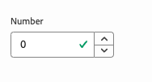
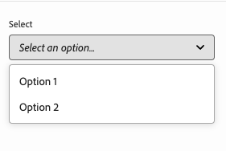

# 모델 정의, 필드 및 구성 요소 유형 {#field-types}

예가 포함된 속성 레일에서 유니버설 편집기가 편집할 수 있는 필드 및 구성 요소 유형에 대해 알아봅니다. 모델 정의를 만들고 구성 요소에 연결하여 나만의 앱을 계측하는 방법을 이해합니다.

## 개요 {#overview}

범용 편집기에서 사용할 앱을 조정할 때 구성 요소를 계측하고 편집기의 속성 레일에서 조작할 수 있는 필드와 구성 요소 유형을 정의해야 합니다. 모델을 만든 다음 구성 요소에서 해당 모델에 연결하면 됩니다.

이 문서에서는 예제 구성과 함께 사용 가능한 모델 정의 및 필드와 구성 요소 유형에 대한 개요를 제공합니다.

>[!TIP]
>
>범용 편집기에 사용할 앱을 계측하는 방법에 익숙하지 않은 경우 문서 [AEM 개발자를 위한 범용 편집기 개요](/help/implementing/universal-editor/developer-overview.md)를 참조하십시오.

## 모델 정의 구조 {#model-structure}

범용 편집기의 속성 레일을 통해 구성 요소를 구성하려면 모델 정의가 존재하고 구성 요소에 연결되어 있어야 합니다.

모델 정의는 모델 배열로 시작하는 JSON 구조입니다.

```json
[
  {
    "id": "model-id",        // must be unique
    "fields": []             // array of fields which shall be rendered in the properties rail
  }
]
```

`fields` 배열을 정의하는 방법에 대한 자세한 내용은 이 문서의 **[필드](#fields)** 섹션을 참조하십시오.

구성 요소에 모델 정의를 사용하려면 `data-aue-model` 특성을 사용할 수 있습니다.

```html
<div data-aue-resource="urn:datasource:/content/path" data-aue-type="component"  data-aue-model="model-id">Click me</div>
```

## 모델 정의 로드 {#loading-model}

모델이 만들어지면 외부 파일로 참조할 수 있습니다.

```html
<script type="application/vnd.adobe.aue.model+json" src="<url-of-model-definition>"></script>
```

또는 모델을 인라인으로 정의할 수도 있습니다.

```html
<script type="application/vnd.adobe.aue.model+json">
  { ... model definition ... }
</script>
```

## 필드 {#fields}

필드 개체에는 다음과 같은 형식 정의가 있습니다.

| 구성 | 값 유형 | 설명 | 필수 |
|---|---|---|---|
| `component` | `ComponentType` | 구성 요소의 렌더러 | 예 |
| `name` | `string` | 데이터가 지속되어야 하는 속성 | 예 |
| `label` | `FieldLabel` | 필드 레이블 | 예 |
| `description` | `FieldDescription` | 필드 설명 | 아니요 |
| `placeholder` | `string` | 필드에 대한 자리 표시자 | 아니요 |
| `value` | `FieldValue` | 기본값 | 아니요 |
| `valueType` | `ValueType` | 표준 유효성 검사에는 `string`, `string[]`, `number`, `date`, `boolean`이(가) 포함될 수 있습니다. | 아니요 |
| `required` | `boolean` | 필수 필드임 | 아니요 |
| `readOnly` | `boolean` | 필드가 읽기 전용임 | 아니요 |
| `hidden` | `boolean` | 기본적으로 필드가 숨겨져 있음 | 아니요 |
| `condition` | `RulesLogic` | [조건](/help/implementing/universal-editor/customizing.md#conditionally-hide)을(를) 기반으로 필드를 표시하거나 숨기는 규칙 | 아니요 |
| `multi` | `boolean` | 필드가 다중 필드입니까 | 아니요 |
| `validation` | `ValidationType` | 필드에 대한 유효성 검사 규칙 | 아니요 |
| `raw` | `unknown` | 구성 요소에서 사용할 수 있는 원시 데이터 | 아니요 |

### 구성 요소 유형 {#component-types}

다음은 필드를 렌더링하는 데 사용할 수 있는 구성 요소 유형입니다.

| 설명 | 구성 요소 유형 |
|---|---|
| [AEM 태그](#aem-tag) | `aem-tag` |
| [AEM 콘텐츠](#aem-content) | `aem-content` |
| [부울](#boolean) | `boolean` |
| [확인란 그룹](#checkbox-group) | `checkbox-group` |
| [컨테이너](#container) | `container` |
| [콘텐츠 조각](#content-fragment) | `aem-content-fragment` |
| [날짜 시간](#date-time) | `date-time` |
| [경험 조각](#experience-fragment) | `aem-experience-fragment` |
| [다중 선택](#multiselect) | `multiselect` |
| [숫자](#number) | `number` |
| [라디오 그룹](#radio-group) | `radio-group` |
| [참조](#reference) | `reference` |
| [리치 텍스트](#rich-text) | `richtext` |
| [선택](#select) | `select` |
| [탭](#tab) | `tab` |
| [텍스트](#text) | `text` |

#### AEM 태그 {#aem-tag}

AEM 태그 구성 요소 유형을 사용하면 구성 요소에 태그를 첨부하는 데 사용할 수 있는 AEM 태그 선택기를 사용할 수 있습니다.

>[!BEGINTABS]

>[!TAB 샘플]

```json
{
  "id": "aem-tag-picker",
  "fields": [
    {
      "component": "aem-tag",
      "label": "AEM Tag Picker",
      "name": "cq:tags",
      "valueType": "string"
    }
  ]
}
```

>[!TAB 스크린샷]


>[!ENDTABS]

#### AEM 컨텐츠 {#aem-content}

AEM 콘텐츠 구성 요소 유형 은 콘텐츠 참조를 설정하는 데 사용할 수 있는 AEM 콘텐츠 선택기를 활성화합니다.

>[!BEGINTABS]

>[!TAB 샘플]

```json
{
  "id": "aem-content-picker",
  "fields": [
    {
      "component": "aem-content",
      "name": "reference",
      "value": "",
      "label": "AEM Content Picker",
      "valueType": "string"
    }
  ]
}
```

>[!TAB 스크린샷]


>[!ENDTABS]

#### 부울 {#boolean}

부울 구성 요소 유형은 토글로 렌더링된 간단한 true/false 값을 저장합니다. 추가 유효성 검사 유형을 제공합니다.

| 유효성 검사 유형 | 값 유형 | 설명 | 필수 |
|---|---|---|---|
| `customErrorMsg` | `string` | 입력한 값이 부울 값이 아닌 경우 표시되는 메시지 | 아니요 |

>[!BEGINTABS]

>[!TAB 샘플 1]

```json
{
  "id": "boolean",
  "fields": [
    {
      "component": "boolean",
      "label": "Boolean",
      "name": "boolean",
      "valueType": "boolean"
    }
  ]
}
```

>[!TAB 샘플 2]

```json
{
  "id": "another-boolean",
  "fields": [
    {
      "component": "boolean",
      "label": "Boolean",
      "name": "boolean",
      "valueType": "boolean",
      "validation": {
        "customErrorMsg": "Think, McFly. Think!"
      }
    }
  ]
}
```

>[!TAB 스크린샷]


>[!ENDTABS]

#### 확인란 그룹 {#checkbox-group}

부울과 유사하게 확인란 그룹 구성 요소 유형을 사용하면 여러 개의 확인란으로 렌더링된 참/거짓 항목을 선택할 수 있습니다.

>[!BEGINTABS]

>[!TAB 샘플]

```json
{
  "id": "checkbox-group",
  "fields": [
    {
      "component": "checkbox-group",
      "label": "Checkbox Group",
      "name": "checkbox",
      "valueType": "string[]",
      "options": [
        { "name": "Option 1", "value": "option1" },
        { "name": "Option 2", "value": "option2" }
      ]
    }
  ]
}
```

>[!TAB 스크린샷]


>[!ENDTABS]

#### 컨테이너 {#container}

컨테이너 구성 요소 유형은 구성 요소를 그룹화할 수 있습니다. 추가 구성을 제공합니다.

| 구성 | 값 유형 | 설명 | 필수 |
|---|---|---|---|
| `collapsible` | `boolean` | 컨테이너를 접을 수 있습니까 | 아니요 |

>[!BEGINTABS]

>[!TAB 샘플]

```json
 {
  "id": "container",
  "fields": [
    {
      "component": "container",
      "label": "Container",
      "name": "container",
      "valueType": "string",
      "collapsible": true,
      "fields": [
        {
          "component": "text-input",
          "label": "Simple Text 1",
          "name": "text",
          "valueType": "string"
        },
        {
          "component": "text-input",
          "label": "Simple Text 2",
          "name": "text2",
          "valueType": "string"
        }
      ]
    }
  ]
}
```

>[!TAB 스크린샷]

컨테이너 구성 요소 형식의 

>[!ENDTABS]

#### 콘텐츠 조각 {#content-fragment}

콘텐츠 조각 선택기를 사용하여 [콘텐츠 조각](/help/sites-cloud/authoring/fragments/content-fragments.md) 및 해당 변형을 선택할 수 있습니다(필요한 경우). 추가 구성을 제공합니다.

| 구성 | 값 유형 | 설명 | 필수 |
|---|---|---|---|
| `variationName` | `string` | 선택한 변형을 저장할 변수 이름입니다. 정의되지 않은 경우 변형 선택기가 표시되지 않습니다 | 아니요 |

>[!NOTE]
>
>유니버설 편집기 [모델에 따라 콘텐츠 조각 필드의 유효성을 검사합니다](/help/assets/content-fragments/content-fragments-models.md#validation). 정규식 패턴 및 고유성 제약 조건과 같은 데이터 무결성 규칙을 적용할 수 있습니다.
>
>이렇게 하면 콘텐츠가 게시되기 전에 특정 비즈니스 요구 사항을 충족하게 됩니다.

>[!BEGINTABS]

>[!TAB 샘플 1]

```json
[
  {
    "id": "aem-content-fragment",
    "fields": [
      {
        "component": "aem-content-fragment",
        "name": "picker",
        "label": "Content Fragment Picker",
        "valueType": "string",
        "variationName": "contentFragmentVariation"
      }
    ]
  }
]
```

>[!TAB 스크린샷]


>[!ENDTABS]

#### 날짜/시간 {#date-time}

날짜 시간 구성 요소 유형을 사용하면 날짜, 시간 또는 이들의 조합을 지정할 수 있습니다. 추가 구성을 제공합니다.

| 구성 | 값 유형 | 설명 | 필수 |
|---|---|---|---|
| `displayFormat` | `string` | 날짜 문자열을 표시할 형식 | 예 |
| `valueFormat` | `string` | 날짜 문자열을 저장할 형식 | 예 |

또한 추가 유효성 검사 유형을 제공합니다.

| 유효성 검사 유형 | 값 유형 | 설명 | 필수 |
|---|---|---|---|
| `customErrorMsg` | `string` | `valueFormat`이(가) 충족되지 않으면 표시할 메시지 | 아니요 |

>[!BEGINTABS]

>[!TAB 샘플 1]

```json
{
  "id": "date-time",
  "fields": [
    {
      "component": "date-time",
      "label": "Date & Time",
      "name": "date",
      "valueType": "date"
    }
  ]
}
```

>[!TAB 샘플 2]

```json
{
  "id": "another-date-time",
  "fields": [
    {
      "component": "date-time",
       "valueType": "date-time",
      "name": "field1",
      "label": "Date Time",
      "description": "This is a date time field that stores both date and time.",
      "required": true,
      "placeholder": "YYYY-MM-DD HH:mm:ss",
      "displayFormat": null,
      "valueFormat": null,
      "validation": {
        "customErrorMsg": "Marty! You have to come back with me!"
      }
    },
    {
      "component": "date-time",
      "valueType": "date",
      "name": "field2",
      "label": "Another Date Time",
      "description": "This is another date time field that only stores the date.",
      "required": true,
      "placeholder": "YYYY-MM-DD",
      "displayFormat": null,
      "valueFormat": null,
      "validation": {
        "customErrorMsg": "Back to the future!"
      }
    },
    {
      "component": "date-time",
      "valueType": "time",
      "name": "field3",
      "label": "Yet Another Date Time",
      "description": "This is another date time field that only stores the time.",
      "required": true,
      "placeholder": "HH:mm:ss",
      "displayFormat": null,
      "valueFormat": null,
      "validation": {
        "customErrorMsg": "Great Scott!"
      }
    }
  ]
}
```

>[!TAB 스크린샷]


>[!ENDTABS]

#### 경험 조각 {#experience-fragment}

경험 조각 선택기를 사용하여 [경험 조각](/help/sites-cloud/authoring/fragments/experience-fragments.md) 및 해당 변형을 선택할 수 있습니다(필요한 경우). 추가 구성을 제공합니다.

| 구성 | 값 유형 | 설명 | 필수 |
|---|---|---|---|
| `variationName` | `string` | 선택한 변형을 저장할 변수 이름입니다. 정의되지 않은 경우 변형 선택기가 표시되지 않습니다 | 아니요 |

>[!BEGINTABS]

>[!TAB 샘플 1]

```json
[
  {
    "id": "aem-experience-fragment",
    "fields": [
      {
        "component": "aem-experience-fragment",
        "name": "picker",
        "label": "Experience Fragment Picker",
        "valueType": "string",
        "variationName": "experienceFragmentVariation"
      }
    ]
  }
]
```

>[!TAB 스크린샷]


>[!ENDTABS]


#### 다중 선택 {#multiselect}

다중 선택 구성 요소 유형은 선택 가능한 요소를 그룹화하는 기능을 포함하여 드롭다운에서 선택할 여러 항목을 제공합니다.

>[!BEGINTABS]

>[!TAB 샘플 1]

```json
{
  "id": "multiselect",
  "fields": [
    {
      "component": "multiselect",
      "name": "multiselect",
      "label": "Multi Select",
      "valueType": "string",
      "options": [
        { "name": "Option 1", "value": "option1" },
        { "name": "Option 2", "value": "option2" }
      ]
    }
  ]
}
```

>[!TAB 샘플 2]

```json
{
  "id": "multiselect-grouped",
  "fields": [
    {
      "component": "multiselect",
      "name": "property",
      "label": "Multiselect field",
      "valueType": "string",
      "required": true,
      "maxSize": 2,
      "options": [
        {
          "name": "Theme",
          "children": [
            { "name": "Light", "value": "light" },
            { "name": "Dark",  "value": "dark" }
          ]
        },
        {
          "name": "Type",
          "children": [
            { "name": "Alpha", "value": "alpha" },
            { "name": "Beta", "value": "beta" },
            { "name": "Gamma", "value": "gamma" }
          ]
        }
      ]
    }
  ]
}
```

>[!TAB 스크린샷]


>[!ENDTABS]

#### 숫자 {#number}

숫자 구성 요소 유형을 사용하여 숫자를 입력할 수 있습니다. 추가 유효성 검사 유형을 제공합니다.

| 유효성 검사 유형 | 값 유형 | 설명 | 필수 |
|---|---|---|---|
| `numberMin` | `number` | 허용되는 최소 수 | 아니요 |
| `numberMax` | `number` | 허용되는 최대 수 | 아니요 |
| `customErrorMsg` | `string` | `numberMin` 또는 `numberMax`이(가) 충족되지 않을 경우 표시되는 메시지 | 아니요 |

>[!BEGINTABS]

>[!TAB 샘플 1]

```json
{
  "id": "number",
  "fields": [
    {
      "component": "number",
      "name": "number",
      "label": "Number",
      "valueType": "number",
      "value": 0
    }
  ]
}
```

>[!TAB 샘플 2]

```json
{
  "id": "another-number",
  "fields": [
   {
      "component": "number",
      "valueType": "number",
      "name": "field1",
      "label": "Number Field",
      "description": "This is a number field.",
      "required": true,
      "placeholder": null,
      "validation": {
        "numberMin": 0,
        "numberMax": 88,
        "customErrorMsg": "You also need 1.21 gigawatts."
      }
    }
  ]
}
```

>[!TAB 스크린샷]



>[!ENDTABS]

#### 라디오 그룹 {#radio-group}

라디오 그룹 구성 요소 유형을 사용하면 확인란 그룹과 유사한 그룹으로 렌더링된 여러 옵션에서 상호 배타적으로 선택할 수 있습니다.

>[!BEGINTABS]

>[!TAB 샘플]

```json
{
  "id": "radio-group",
  "fields": [
    {
      "component": "radio-group",
      "label": "Radio Group",
      "name": "radio",
      "valueType": "string",
      "options": [
        { "name": "Option 1", "value": "option1" },
        { "name": "Option 2", "value": "option2" }
      ]
    }
  ]
}
```

>[!TAB 스크린샷]

라디오 그룹 구성 요소 형식의 

>[!ENDTABS]

#### 참조 {#reference}

참조 구성 요소 유형을 사용하면 현재 개체에서 다른 데이터 개체를 참조할 수 있습니다.

>[!BEGINTABS]

>[!TAB 샘플]

```json
{
  "id": "reference",
  "fields": [
    {
      "component": "reference",
      "label": "Reference",
      "name": "reference",
      "valueType": "string"
    }
  ]
}
```

>[!TAB 스크린샷]

참조 구성 요소 형식의 

>[!ENDTABS]

#### 리치 텍스트 {#rich-text}

서식 있는 텍스트를 사용하면 여러 줄의 서식 있는 텍스트를 입력할 수 있습니다. 추가 유효성 검사 유형을 제공합니다.

| 유효성 검사 유형 | 값 유형 | 설명 | 필수 |
|---|---|---|---|
| `maxSize` | `number` | 허용되는 최대 문자 수 | 아니요 |
| `customErrorMsg` | `string` | `maxSize`을(를) 초과할 경우 표시되는 메시지 | 아니요 |

>[!BEGINTABS]

>[!TAB 샘플 1]

```json
{
  "id": "richtext",
  "fields": [
    {
      "component": "richtext",
      "name": "rte",
      "label": "Rich Text",
      "valueType": "string"
    }
  ]
}
```

>[!TAB 샘플 2]

```json
{
  "id": "another-richtext",
  "fields": [
    {
      "component": "richtext",
      "name": "rte",
      "label": "Rich Text",
      "valueType": "string",
      "validation": {
        "maxSize": 1000,
        "customErrorMsg": "That's about as funny as a screen door on a battleship."
      }
    }
  ]
}
```

>[!TAB 스크린샷]


>[!ENDTABS]

#### 선택 {#select}

구성 요소 유형 선택을 사용하면 드롭다운 메뉴의 사전 정의된 옵션 목록에서 단일 옵션을 선택할 수 있습니다.

>[!BEGINTABS]

>[!TAB 샘플]

```json
{
  "id": "select",
  "fields": [
    {
      "component": "select",
      "label": "Select",
      "name": "select",
      "valueType": "string",
      "options": [
        { "name": "Option 1", "value": "option1" },
        { "name": "Option 2", "value": "option2" }
      ]
    }
  ]
}
```

>[!TAB 스크린샷]



>[!ENDTABS]

#### 탭 {#tab}

탭 구성 요소 유형을 사용하면 여러 탭에서 다른 입력 필드를 함께 그룹화하여 작성자의 레이아웃 구성을 향상시킬 수 있습니다.

`tab` 정의는 `fields` 배열에서 구분 기호로 간주할 수 있습니다. `tab` 다음에 오는 모든 항목은 새 `tab`이(가) 발견될 때까지 해당 탭에 배치되며, 그 후에는 다음 항목이 새 탭에 배치됩니다.

모든 탭 위에 표시되는 항목을 포함하려면 탭 앞에 항목을 정의해야 합니다.

>[!BEGINTABS]

>[!TAB 샘플]

```json
{
  "id": "tab",
  "fields": [
    {
      "component": "tab",
      "label": "Tab 1",
      "name": "tab1"
    },
    {
      "component": "text-input",
      "label": "Text 1",
      "name": "text1",
      "valueType": "string"
    },
    {
      "component": "tab",
      "label": "Tab 2",
      "name": "tab2"
    },
    {
      "component": "text-input",
      "label": "Text 2",
      "name": "text2",
      "valueType": "string"
    }
  ]
}
```

>[!TAB 스크린샷]

탭 구성 요소 유형의 

>[!ENDTABS]

#### 텍스트 {#text}

텍스트를 사용하면 한 줄의 텍스트를 입력할 수 있습니다.  여기에는 추가 유효성 검사 유형이 포함됩니다.

| 유효성 검사 유형 | 값 유형 | 설명 | 필수 |
|---|---|---|---|
| `minLength` | `number` | 허용되는 최소 문자 수 | 아니요 |
| `maxLength` | `number` | 허용되는 최대 문자 수 | 아니요 |
| `regExp` | `string` | 입력 텍스트가 일치해야 하는 정규 표현식 | 아니요 |
| `customErrorMsg` | `string` | `minLength`, `maxLength` 및/또는 `regExp`을(를) 위반할 경우 표시되는 메시지 | 아니요 |

>[!BEGINTABS]

>[!TAB 샘플 1]

```json
{
  "id": "simpletext",
  "fields": [
    {
      "component": "text",
      "name": "text",
      "label": "Simple Text",
      "valueType": "string"
    }
  ]
}
```

>[!TAB 샘플 2]

```json
{
  "id": "another simpletext",
  "fields": [
    {
      "component": "text",
      "name": "text",
      "label": "Simple Text",
      "valueType": "string",
      "description": "This is a text input with validation.",
      "required": true,
      "validation": {
        "minLength": 1955,
        "maxLength": 1985,
        "regExp": "^foo:.*",
        "customErrorMsg": "Why don't you make like a tree and get outta here?"
      }
    }
  ]
}
```

>[!TAB 스크린샷]


>[!ENDTABS]
