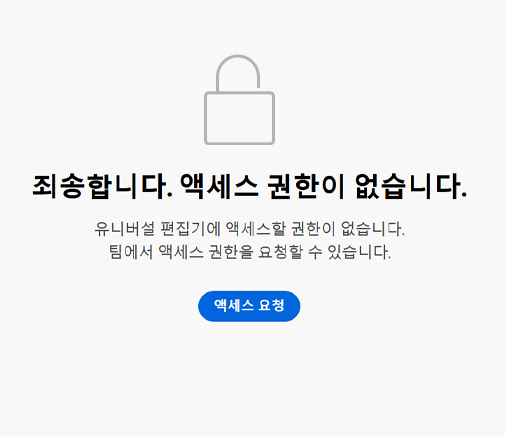

# AEM에서 Universal Editor 시작하기 {#getting-started}

Universal Editor에 액세스하는 방법과 이를 사용하기 위해 첫 번째 AEM 앱 계측을 시작하는 방법을 알아봅니다.

>[!TIP]
>
>예를 바로 살펴보고 싶다면 [GitHub의 Universal Editor 샘플 앱](https://github.com/adobe/universal-editor-sample-editable-app)을 검토할 수 있습니다.

## 온보딩 단계 {#onboarding}

Universal Editor는 모든 소스의 콘텐츠를 편집할 수 있지만 이 문서에서는 AEM 앱을 예로 사용합니다.

AEM 앱을 온보딩하고 Universal Editor를 사용하도록 계측하는 데는 여러 단계가 있습니다.

1. [Universal Editor에 대한 액세스 권한을 요청합니다.](#request-access)
1. [Universal Editor 핵심 라이브러리를 포함합니다.](#core-library)
1. [필요한 OSGi 구성을 추가합니다.](#osgi-configurations)
1. [페이지를 계측합니다.](#instrument-page)

이 문서에서는 이러한 단계를 안내합니다.

## Universal Editor에 대한 액세스 권한 요청 {#request-access}

먼저 Universal Editor에 대한 액세스 권한을 요청해야 합니다. [https://experience.adobe.com/#/aem/editor,](https://experience.adobe.com/#/aem/editor) 로그인으로 이동하여 Universal Editor에 대한 액세스 권한이 있는지 확인하십시오.

액세스 권한이 없는 경우 같은 페이지에 링크된 양식을 통해 요청할 수 있습니다.



**액세스 권한 요청**&#x200B;을 클릭하고 액세스 권한 요청에 대한 지침에 따라 양식을 작성합니다. Adobe 담당자가 귀하의 요청을 검토하고 사용 사례에 대해 논의하기 위해 연락을 드리게 됩니다.

## Universal Editor 핵심 라이브러리 포함 {#core-library}

Universal Editor에서 사용하기 위해 앱을 계측하려면 먼저 다음 종속성을 포함해야 합니다.

```javascript
@adobe/universal-editor-cors
```

계측을 활성화하려면 `index.js`에 다음 가져오기를 추가해야 합니다.

```javascript
import "@adobe/universal-editor-cors";
```

### 비 React 앱의 대안 {#alternative}

React 앱을 구현하지 않거나 서버측 렌더링이 필요한 경우 다음을 문서 본문에 포함하는 방법이 있습니다.

```html
<script src="https://cdn.jsdelivr.net/gh/adobe/universal-editor-cors/dist/universal-editor-embedded.js" async></script>
```

## 필요한 OSGi 구성 추가 {#osgi-configurations}

Universal Editor를 사용하여 앱에서 AEM 콘텐츠를 편집할 수 있으려면 AEM 내에서 CORS 및 쿠키 설정을 수행해야 합니다.

다음 [OSGi 구성을 AEM 작성 인스턴스에서 설정해야 합니다.](/help/implementing/deploying/configuring-osgi.md)

* `SameSite Cookies = None`-`com.day.crx.security.token.impl.impl.TokenAuthenticationHandler`
* X-FRAME-OPTIONS 제거: `org.apache.sling.engine.impl.SlingMainServlet`의 SAMEORIGIN 헤더

### com.day.crx.security.token.impl.impl.TokenAuthenticationHandler {#samesite-cookies}

로그인 토큰 쿠키는 서드파티 도메인으로 AEM에 전송되어야 합니다. 따라서 동일 사이트 쿠키는 명시적으로 `None`으로 설정되어야 합니다.

이 속성은 `com.day.crx.security.token.impl.impl.TokenAuthenticationHandler` OSGi 구성에서 설정해야 합니다.

```xml
<?xml version="1.0" encoding="UTF-8"?>
<jcr:root xmlns:sling="http://sling.apache.org/jcr/sling/1.0"
          xmlns:jcr="http://www.jcp.org/jcr/1.0" jcr:primaryType="sling:OsgiConfig"
          token.samesite.cookie.attr="None" />
```

### org.apache.sling.engine.impl.SlingMainServlet {#sameorigin}

X-Frame-Options: SAMEORIGIN은 iframe 내에서 AEM 페이지 렌더링을 방지합니다. 헤더를 제거하면 페이지를 로드할 수 있습니다.

이 속성은 `org.apache.sling.engine.impl.SlingMainServlet` OSGi 구성에서 설정해야 합니다.

```xml
<?xml version="1.0" encoding="UTF-8"?>
<jcr:root xmlns:sling="http://sling.apache.org/jcr/sling/1.0"
          xmlns:jcr="http://www.jcp.org/jcr/1.0"
          jcr:primaryType="sling:OsgiConfig"
          sling.additional.response.headers="[X-Content-Type-Options=nosniff]"/>
```

## 페이지 계측 {#instrument-page}

Universal Editor 서비스에는 편집 중인 앱의 콘텐츠에 대한 올바른 백엔드 시스템을 식별하고 활용하기 위해 [균일 리소스 이름(URN)](https://ko.wikipedia.org/wiki/Uniform_Resource_Name)이 필요합니다. 따라서 콘텐츠를 다시 콘텐츠 리소스에 매핑하려면 URN 스키마가 필요합니다.

페이지에 추가된 계측 속성은 대부분 [HTML 마이크로데이터](https://developer.mozilla.org/en-US/docs/Web/HTML/Microdata)로 구성되는데, 이는 HTML을 더 의미 있게 만들고 HTML 문서를 색인화하는 등의 작업에 사용할 수 있는 업계 표준입니다.

### 연결 만들기 {#connections}

앱에서 사용되는 연결은 페이지의 `<head>`에 `<meta>` 태그로 저장됩니다.

```html
<meta name="urn:adobe:aem:editor:<referenceName>" content="<protocol>:<url>">
```

* `<referenceName>` - 연결을 식별하기 위해 문서에서 재사용되는 짧은 이름입니다. 예: `aemconnection`
* `<protocol>` - Universal Editor 지속성 서비스의 어떤 지속성 플러그인을 사용할 것인지 나타냅니다. 예: `aem`
* `<url>` - 변경 사항이 지속되어야 하는 시스템의 URL입니다. 예: `http://localhost:4502`

식별자 `adobe:aem:editor` Adobe 유니버설 편집기에 대한 연결을 나타냅니다.

`itemid`는 `urn` 접두사를 사용하여 식별자를 줄입니다.

```html
itemid="urn:<referenceName>:<resource>"
```

* `<referenceName>` - `<meta>` 태그에 언급되는 명명된 참조입니다. 예: `aemconnection`
* `<resource>` - 대상 시스템의 리소스에 대한 포인터입니다. 예: `/content/page/jcr:content`와 같은 AEM 콘텐츠 경로

>[!TIP]
>
>Universal Editor에 필요한 데이터 속성 및 유형에 대한 자세한 내용은 [속성 및 유형](attributes-types.md) 문서를 참조하십시오.

### 예시 연결 {#example}

```html
<html>
<head>
    <meta name="urn:adobe:aem:editor:aemconnection" content="aem:https://localhost:4502">
    <meta name="urn:adobe:aem:editor:fcsconnection" content="fcs:https://example.franklin.adobe.com/345fcdd">
</head>
<body>
        <aside>
          <ul itemscope itemid="urn:aemconnection:/content/example/list" itemtype="container">
            <li itemscope itemid="urn:aemconnection/content/example/listitem" itemtype="component">
              <p itemprop="name" itemtype="text">Jane Doe</p>
              <p itemprop="title" itemtype="text">Journalist</p>
              
            </li>
 
...
 
            <li itemscope itemid="urn:fcsconnection:/documents/mytext" itemtype="component">
              <p itemprop="name" itemtype="text">John Smith</p>
              <p itemid="urn:aemconnection/content/example/another-source" itemprop="title" itemtype="text">Photographer</p>
              
            </li>
          </ul>
        </aside>
</body>
</html>
```

## Universal Editor를 사용할 준비 완료 {#youre-ready}

이제 앱이 Universal Editor를 사용하도록 구성되었습니다.

콘텐츠 작성자가 Universal Editor를 사용하여 콘텐츠를 만드는 것이 얼마나 쉽고 직관적인지 알아보려면 [Universal Editor로 콘텐츠 작성](authoring.md) 문서를 참조하십시오.

## 추가 리소스 {#additional-resources}

Universal Editor에 대해 자세히 알아보려면 다음 문서를 참조하십시오.

* [Universal Editor 소개](introduction.md) - Universal Editor를 사용하면 모든 구현에서 콘텐츠의 모든 측면을 편집할 수 있기 때문에 뛰어난 경험을 제공하고, 콘텐츠 속도를 높이고, 최신 개발자 경험을 제공할 수 있다는 점에 대해 알아봅니다.
* [Universal Editor로 콘텐츠 작성](authoring.md) - 콘텐츠 작성자가 Universal Editor를 사용하여 콘텐츠를 만드는 것이 얼마나 쉽고 직관적인지 알아봅니다.
* [Universal Editor로 콘텐츠 게시](publishing.md) - Universal Visual Editor에서 콘텐츠를 게시하는 방법과 앱에서 게시된 콘텐츠를 처리하는 방법에 대해 알아봅니다.
* [Universal Editor 아키텍처](architecture.md) - Universal Editor의 아키텍처 및 해당 서비스와 계층 간에 데이터가 흐르는 방식에 대해 알아봅니다.
* [속성 및 유형](attributes-types.md) - Universal Editor에 필요한 데이터 속성 및 유형에 대해 알아봅니다.
* [Universal Editor 인증](authentication.md) - Universal Editor의 인증 방법에 대해 알아봅니다.
