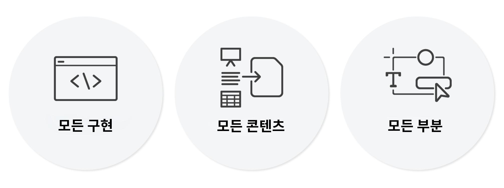

# Universal Visual Editor 소개 {#introduction}

Universal Visual Editor(Universal Editor)가 헤드리스 및 헤드풀 환경의 WYSIWYG(what-you-see-is-what-you-get) 편집을 가능하게 하는 방법에 대해 알아봅니다. 콘텐츠 작성자가 탁월한 경험을 제공하고 콘텐츠 속도를 높이며 최신 개발자 경험을 제공하는 데 도움이 되는 방식에 대해 살펴보십시오.

## 배경 {#background}

그간 AEM 콘텐츠 작성자에게 가장 강력한 도구는 페이지 편집기였습니다. 페이지 편집기는 직관적이고 시각적이며 상황에 맞는 WYSIWYG 작성 환경을 제공하므로 필요한 교육이 최소 수준이며, 작성자에게 콘텐츠가 표시되는 방식을 정확하게 보여 줍니다.

단, 페이지 편집기는 AEM 페이지 콘텐츠, 구조 및 여기에 포함된 구성 요소만 편집할 수 있습니다. 하지만 오늘날 콘텐츠는 한 위치에서 제공되는 경우가 거의 없습니다. Universal Editor는 페이지 편집기와 동일한 내부 편집 환경을 제공하되 모든 구현의 모든 콘텐츠 측면에 대해 제공합니다.

## 진정한 범용성 {#universal}

Universal Editor는 모든 구현, 콘텐츠 및 콘텐츠의 모든 측면에 대해 계측할 수 있습니다.

### 모든 구현 {#any-implementation}

다양한 방식으로 경험을 구축할 수 있으므로 모든 구현에서 Universal Editor를 활용하여 작성자가 상황에 맞는 편집을 수행할 수 있습니다.

사용자는 흔히 Headless 구현 시에 작성자가 양식 기반 UI에서 모든 콘텐츠를 편집해야 한다는 제약이 있다고 생각하지만 Universal Editor에서는 그렇지 않습니다

Universal Editor를 활용하기 위한 구현 요구 사항은 매우 간단하며 다음을 지원합니다.

* **모든 아키텍처** - 서버측 렌더링, 에지측 렌더링, 클라이언트측 렌더링 등
* **모든 프레임워크** - Vanilla AEM 또는 React, Next.js, Angular 등과 같은 서드파티 프레임워크
* **모든 호스팅** - AEM 또는 원격 도메인에서 로컬로 호스팅 가능

### 모든 콘텐츠 {#any-content}

콘텐츠 작성자는 이전에 AEM 페이지 편집기에서 제공한 것과 동일하게 강력한 편집 환경을 이용할 수 있어야 합니다. Universal Editor를 사용하면 콘텐츠 작성자가 **모든** 콘텐츠를 시각적으로 상황에 맞게 편집할 수 있으며 다음이 지원됩니다.

* **AEM 페이지 구조** - 경험 조각을 포함하여 `cq:Pages`의 중첩된 `cq:Components`
* **AEM 콘텐츠 조각** - 경험의 맥락에서 표시되는 콘텐츠 조각에서 콘텐츠 편집.
* **문서** - 개념 증명에 따르면 Word, Excel, Google Docs 또는 Markdown 문서도 같은 방식으로 편집할 수 있습니다(WIP).

### 모든 측면 {#any-aspect}

콘텐츠 작성자에게는 콘텐츠에 포함된 정보도 중요하지만 콘텐츠가 렌더링되고 수신되는 방법도 중요합니다. 콘텐츠에는 추가 메타 데이터 및 계측 규칙이 들어 있는데, Universal Editor에서는 다음과 같이 이를 이해하고 편집할 수 있습니다.

* **레이아웃 및 스타일 적용** - 스타일 시스템을 사용하여 마케팅 실무자와 콘텐츠 작성자는 콘텐츠에 다양한 스타일을 적용하고 열, 캐러셀, 탭, 아코디언 등과 같은 콘텐츠에 대한 다양한 레이아웃을 만들 수 있습니다.

## 값 {#value}

특정 콘텐츠 게재 시스템에서 콘텐츠 편집 경험을 분리함으로써 진정으로 유연한 편집기로 거듭나 콘텐츠 작성자가 탁월한 경험을 제공하고, 콘텐츠 속도를 높이고, 최신 개발자 경험을 제공할 수 있습니다.

* **탁월한 경험 제공** - 실무자는 방문자에게 매력적인 경험을 제공할 수 있도록 Universal Editor를 통해 미리보기 컨텍스트에서 콘텐츠를 만들고 편집할 수 있습니다. 덕분에 경험 디자인에 맞고 방문자에게 의미 있는 여정을 구성하는 콘텐츠를 만들 수 있습니다.
* **콘텐츠 속도 증가** - 실무자의 관리 워크플로를 간소화해 주는 Universal Editor를 사용하면 미리보기 내에서 콘텐츠를 편집할 수 있습니다. 이때 해당 컨텍스트와 관련된 옵션만 표시하고 워크플로와 콘텐츠 소스를 분리하므로 실무자에게 도움이 됩니다.
* **첨단 개발자 경험** - 실질적인 이기종 애플리케이션 환경을 지원하는 Universal Editor는 완전히 분리되고 기술에 구애받지 않으므로 개발자가 선호하는 기술 스택을 사용하여 경험을 구현할 수 있습니다.

## Universal Visual Editor 및 콘텐츠 조각 편집기 {#universal-editor-content-fragment-editor}

Universal Visual Editor와 콘텐츠 조각 모델 편집기는 유사한 편집 기능을 제공하는 것처럼 보일 수 있습니다. 그러나 두 편집기는 서로 매우 다른 기능을 제공하며 마케팅 실무자의 다른 작업을 담당합니다.

### 콘텐츠 조각 편집기 {#content-fragment-editor}

마케팅 실무자가 레이아웃에 신경 쓰지 않고 콘텐츠를 만들어 다양한 경험 컨텍스트에서 재사용할 수 있기를 원합니다.

* 수행해야 할 기본 작업은 콘텐츠 전략을 확장하는 것입니다.

### Universal Visual Editor {#universal-editor}

마케팅 실무자가 뛰어난 경험을 제공하기 위해 주어진 컨텍스트의 레이아웃에 맞는 콘텐츠를 만들고자 합니다.

* 수행해야 할 기본 작업은 독자와 설득력 있게 소통하는 것입니다.

## 로드맵 {#road-map}

Universal Editor는 개발이 진행 중이므로 이 문서에 설명된 일부 기능은 최종 편집기에 대한 것이며 현재 기능을 나타내지 않을 수 있습니다.

Universal Editor에 예정된 향후 기능에 대한 자세한 내용은 Adobe 담당자에게 문의하십시오.

## 추가 리소스 {#additional-resources}

Universal Editor에 대해 자세히 알아보려면 다음 문서를 참조하십시오.

* [Universal Editor로 콘텐츠 작성](authoring.md) - 콘텐츠 작성자가 Universal Editor를 사용하여 콘텐츠를 만드는 것이 얼마나 쉽고 직관적인지 알아봅니다.
* [Universal Editor로 콘텐츠 게시](publishing.md) - Universal Visual Editor에서 콘텐츠를 게시하는 방법과 앱에서 게시된 콘텐츠를 처리하는 방법에 대해 알아봅니다.
* [AEM에서 Universal Editor 시작하기](getting-started.md) - Universal Editor에 액세스하는 방법과 이를 사용하기 위해 첫 번째 AEM 앱 계측을 시작하는 방법을 알아봅니다.
* [Universal Editor 아키텍처](architecture.md) - Universal Editor의 아키텍처 및 해당 서비스와 계층 간에 데이터가 흐르는 방식에 대해 알아봅니다.
* [속성 및 유형](attributes-types.md) - Universal Editor에 필요한 데이터 속성 및 유형에 대해 알아봅니다.
* [Universal Editor 인증](authentication.md) - Universal Editor의 인증 방법에 대해 알아봅니다.
