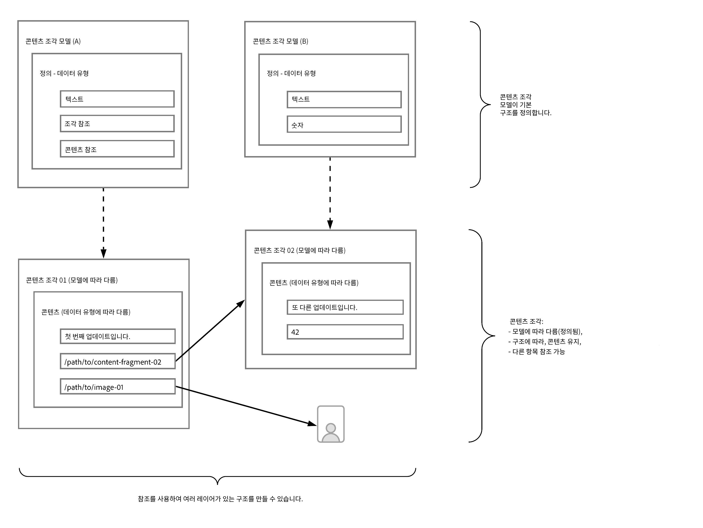

# AEM을 통한 Headless용 콘텐츠 모델링 기본 사항 알아보기 {#content-modeling-headless-basics}

## 지금까지의 스토리 {#story-so-far}

[AEM Headless 콘텐츠 설계자 여정](overview.md) 시작 부분의 [소개](introduction.md)에서는 Headless 모델링과 관련된 기본 개념 및 용어를 다룹니다.

이 문서는 해당 사항을 기본으로 하며, 이를 통해 자체 AEM Headless 프로젝트의 콘텐츠를 모델링하는 방법을 이해할 수 있습니다.

## 목표 {#objective}

* **대상자**: 초급
* **목표**: Headless CMS용 콘텐츠 모델링 개념을 소개합니다.

## 콘텐츠 조각 모델을 통해 콘텐츠 모델링 {#architect-content-fragment-models}

콘텐츠(데이터) 모델링은 관계 데이터베이스 개발 시 자주 사용되는 설정된 기술 세트이므로 콘텐츠 모델링은 AEM Headless에 어떤 의미입니까?

### 왜일까요? {#why}

애플리케이션이 AEM에서 필요한 콘텐츠를 일관되고 효율적으로 요청 및 수신하도록 하려면 이 콘텐츠를 구조화해야 합니다.

즉, 애플리케이션이 응답 형식을 미리 알고 있으므로 처리 방법을 알고 있습니다. 포함된 내용과 사용 방법을 결정하는 데 구문 분석할 수 있는 자유 형식 콘텐츠를 수신하는 것보다 훨씬 더 쉽습니다.

### 방법 소개 {#how}

AEM은 콘텐츠 조각을 사용하여 콘텐츠를 Headless 방식으로 애플리케이션에 게재하는 데 필요한 구조를 제공합니다.

콘텐츠 모델 구조는

* 콘텐츠 조각 모델 정의로 실현되고,
* 콘텐츠 생성에 사용되는 콘텐츠 조각의 기반으로 사용됩니다.

>[!NOTE]
>
>콘텐츠 조각 모델은 콘텐츠 검색에 사용되는 AEM GraphQL 스키마의 기반으로도 사용됩니다. 자세한 내용은 개발자 여정을 참조하십시오.

콘텐츠에 대한 요청은 표준 GraphQL API 구현을 사용자 정의하는 AEM GraphQL API를 사용하여 처리합니다. AEM GraphQL API를 사용하면 애플리케이션은 콘텐츠 조각에서 (복잡한) 쿼리를 수행할 수 있습니다(각 쿼리는 특정 모델 유형에 따라 다름).

그런 다음 반환된 콘텐츠를 애플리케이션에서 사용할 수 있습니다.

## 콘텐츠 조각 모델을 사용하여 구조 만들기 {#create-structure-content-fragment-models}

콘텐츠 조각 모델은 콘텐츠 구조를 정의할 수 있는 다양한 메커니즘을 제공합니다.

콘텐츠 조각 모델은 엔티티에 대해 설명합니다.

>[!NOTE]
>새 모델을 만들 수 있도록 구성 브라우저의 콘텐츠 조각 기능을 활성화해야 합니다.

>[!TIP]
>
>콘텐츠 작성자가 콘텐츠 조각을 만들 때 선택할 모델을 파악할 수 있도록 모델의 이름을 지정해야 합니다.

모델 내부:

1. **데이터 유형**을 통해 개별 속성을 정의할 수 있습니다.
예를 들어 교사 이름이 포함된 필드를 **텍스트**&#x200B;로 정의하고 교사의 근무 기간을 **숫자**&#x200B;로 정의합니다.
1. 데이터 유형 **콘텐츠 참조** 및 **조각 참조**&#x200B;를 사용하여 AEM 내에서 다른 콘텐츠에 대한 관계를 만들 수 있습니다.
1. **조각 참조** 데이터 유형을 사용하여 (모델 유형에 따라) 콘텐츠 조각을 중첩하여 여러 수준의 구조를 실현할 수 있습니다. 이는 콘텐츠 모델링에 필수적입니다.

예:

## 데이터 유형 {#data-types}

AEM은 콘텐츠를 모델링할 수 있도록 다음 데이터 유형을 제공합니다.

* 한 줄 텍스트
* 여러 줄 텍스트
* 숫자
* 부울
* 날짜 및 시간
* 열거
* 태그
* 콘텐츠 참조
* 조각 참조
* JSON 오브젝트

>[!NOTE]
>
>자세한 내용은 콘텐츠 조각 모델 - 데이터 유형에서 확인할 수 있습니다.

## 참조 및 중첩된 콘텐츠 {#references-nested-content}

두 가지 데이터 유형은 특정 조각 외부 콘텐츠에 대한 참조를 제공합니다.

* **콘텐츠 참조**
이는 모든 유형의 다른 콘텐츠에 대한 간단한 참조를 제공합니다.
예를 들어 지정된 위치에서 이미지를 참조할 수 있습니다.

* **조각 참조**
이는 다른 콘텐츠 조각에 대한 참조를 제공합니다.
이러한 유형의 참조는 콘텐츠 모델링에 필요한 관계를 도입하여 중첩된 콘텐츠를 만드는 데 사용됩니다.
조각 작성자가 다음과 같은 작업을 수행할 수 있도록 데이터 유형을 구성할 수 있습니다.
   * 참조된 조각 직접 편집
   * 적절한 모델을 기반으로 새 콘텐츠 조각 생성

>[!NOTE]
>
>텍스트 블록 내 링크를 사용하여 임시 참조를 만들 수도 있습니다.

## 구조 수준(중첩된 조각) {#levels-of-structure-nested-fragments}

콘텐츠 모델링의 경우 **조각 참조** 데이터 유형을 사용하여 여러 수준의 구조와 관계를 만들 수 있습니다.

이 참조를 통해 다양한 콘텐츠 조각 모델을 *연결*&#x200B;하여 상호 관계를 나타낼 수 있습니다. 이를 통해 Headless 애플리케이션은 필요에 따라 연결을 수행하고 콘텐츠에 액세스할 수 있습니다.

>[!NOTE]
>
>사용 시 주의해야 하고 *중첩은 필요한 만큼, 하지만 가능한 적도록* 모범 사례를 정의할 수 있습니다.

조각 참조는 이 작업을 수행하고 이를 통해 다른 조각을 참조할 수 있습니다.

예를 들어 다음 콘텐츠 조각 모델을 정의할 수도 있습니다.

* 도시
* 회사
* 개인
* 상

매우 간단한 것처럼 보이지만 회사에는 CEO와 직원이 있습니다.이 모두 사람이고 각각은 개인으로 정의됩니다.

개인에게 상 한 개(또는 두 개)가 제공될 수 있습니다.

* 내 회사 - 회사
   * CEO - 개인
   * 직원 - 개인
      * 개인 상 - 상

시작에만 적용되는 과정입니다. 복잡도에 따라 상은 회사별로 지정되거나 회사의 본사는 특정 도시에 있을 수 있습니다.

사용자(설계자), 작성자와 Headless 애플리케이션이 이해하므로 조각 참조를 사용하여 해당 상호 관계를 나타낼 수 있습니다.

## 다음 단계 {#whats-next}

이제 기본 사항을 배웠으므로 다음 단계는 [AEM에서의 콘텐츠 조각 모델 만들기에 대해 알아보기](model-structure.md)입니다. 이 단계에서 Headless 모델링의 핵심 부분이라 할 수 있는 다양한 참조와 조각 참조를 사용하여 구조 수준을 만드는 방법을 소개하고 자세히 설명합니다.

## 추가 리소스 {#additional-resources}

* [콘텐츠 조각 모델](/help/sites-cloud/administering/content-fragments/content-fragment-models.md)

   * [콘텐츠 조각 모델 - 데이터 형식](/help/sites-cloud/administering/content-fragments/content-fragment-models.md#data-types)

* [작성 개념](/help/sites-cloud/authoring/author-publish.md)

* [기본 처리](/help/sites-cloud/authoring/basic-handling.md) - 이 페이지는 주로 **Sites** 콘솔을 기반으로 하지만 여러/대부분의 기능은 **자산** 콘솔에서의 **콘텐츠 조각** 작성과 관련성이 있기도 합니다.

* [콘텐츠 조각을 사용하여 작업](/help/sites-cloud/administering/content-fragments/overview.md)
